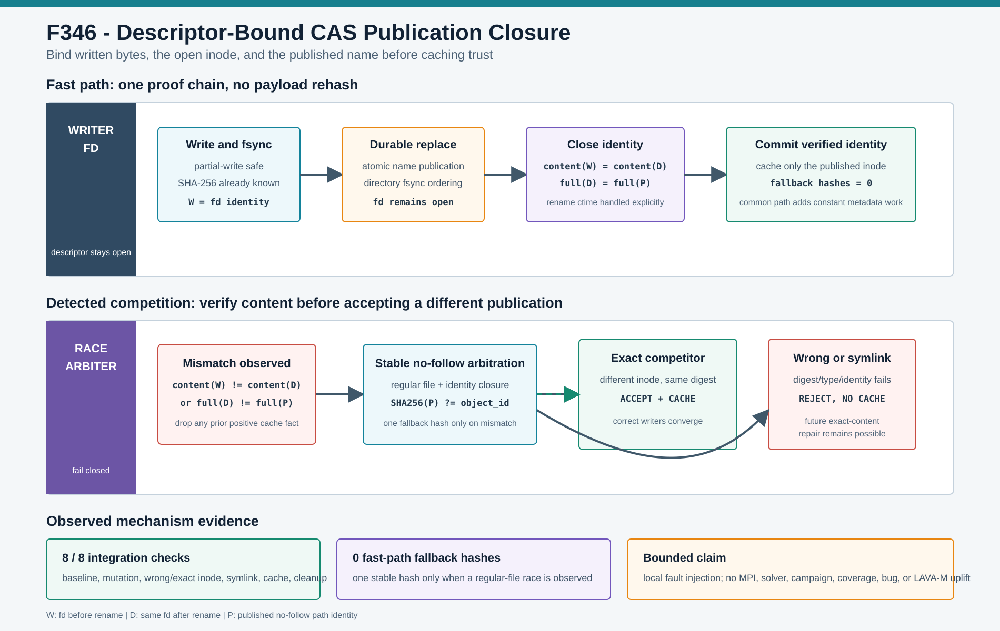

# F346：Descriptor-Bound CAS Publication Closure

> 功能编号：`F346`  
> 日期：`2026-08-10`  
> 状态：已实现，故障注入与回归验证完成



## 1. 背景与审查结论

F345 为 hybrid 输入引入稳定 snapshot、自校验 CAS 和确认式 worker 驻留，但后续竞态审查发现
`ContentAddressedInputStore.put()` 的首次发布仍存在一个狭窄而重要的正确性窗口：

1. 临时文件已按 partial-write 语义写完并 `fsync`；
2. `durable_replace(tmp, object_path)` 原子公开名称并同步目录；
3. 旧实现关闭写入 fd 后，只对公开路径执行一次 `stat`；
4. 若另一个 writer 在步骤 2 与步骤 3 之间替换或修改该名称，旧实现会把竞争者的 identity 直接登记到
   `_verified_identities[object_id]`，而没有证明竞争者内容仍等于名称中的 SHA-256。

这不是哈希碰撞问题，而是“已验证字节”和“最终公开名称”之间缺少 descriptor-bound commit closure。
一旦错误 identity 被记为正向缓存，后续同 identity 访问会走 fast path，直到元数据变化才重新哈希。

## 2. 设计目标与不变量

令：

- `W` 为写入完成并 `fsync` 后、rename 前的 fd identity；
- `D` 为 `durable_replace` 返回后同一 fd 的 identity；
- `P` 为公开路径的 no-follow identity；
- `H(x)` 为内容 SHA-256；对象名称为 `h`。

F346 的无竞争提交条件为：

```text
content_fields(W) = content_fields(D)
full_identity(D)  = full_identity(P)
H(bytes written through fd) = h
```

其中 `content_fields = (dev, ino, size, mtime_ns)`，`full_identity` 还包含 `ctime_ns`。`ctime` 不能用于
rename 前后相等判断，因为 POSIX rename 会合法更新 inode change time；若直接比较完整 `W == D`，正常
fast path 会每次误判为竞争并退化为二次哈希。rename 后的 `D == P` 仍要求完整 identity 相等。

若上述 fast-path 条件失败，不能立即把竞争者视为损坏：多个正确 writer 可能同时发布同一内容对象。
因此执行一次现有 `_verified_object(P, h)`：

```text
regular(P) and stable_no_follow_sha256(P) = h  -> 接受竞争者并缓存其 identity
otherwise                                      -> 失败关闭，不建立正向缓存
```

## 3. 执行流程

### 3.1 无竞争 fast path

1. 计算内存 payload 的 SHA-256，并校验调用方给出的 `object_id`；
2. 以 exclusive temporary 名称打开文件，循环处理 partial write；
3. `flush + fsync(fd)`，记录 rename 前 `W`；
4. 保持 fd 打开，执行 durable replace；
5. 再次 `fstat(fd)` 得到 `D`，并对公开路径执行 no-follow `stat` 得到 `P`；
6. 验证 `W/D` 的内容字段和 `D/P` 的完整身份；
7. 缓存 `D` 并返回。该路径不会重新读取 payload，也不会调用稳定摘要 helper。

### 3.2 竞争收敛 path

1. 若 fd 内容字段变化、公开路径不是 regular file，或 `D != P`，先删除可能存在的旧 identity cache；
2. 对当前公开路径调用稳定 no-follow snapshot；
3. 摘要等于对象 ID 时接受，允许两个正确 writer 幂等收敛；
4. 摘要不等、symlink、消失、超限或读取期间变化时抛出 `ESTALE/EIO` 类错误；
5. `finally` 清理本次 temporary 名称。失败对象保留在路径上供下一次精确 content repair，但不被缓存为已验证。

## 4. 实现位置

核心修改位于 `util/distributed_state.py::ContentAddressedInputStore.put`：

- 写入 stream 的生命周期跨越 `durable_replace`；
- 新增 rename 前后 fd identity 采样；
- 显式区分 content-stability fields 与 rename-sensitive `ctime`；
- 公开路径与 fd 不同一时复用 `_verified_object` 做摘要仲裁；
- 错误竞争者失败关闭，正确竞争者幂等成功；
- identity cache 仍受 300,000 项 clear-on-overflow 上限约束。

该修复不改变对象 ID、目录布局、传输消息、worker ACK 或外部配置接口。

## 5. 故障模型与验证矩阵

本地生产原语集成在真实 regular files 上对 `durable_replace` 返回点做确定性故障注入：

| 场景 | 预期 | 实际 |
| --- | --- | --- |
| 无竞争发布 | exact bytes，0 次 fallback hash | 通过 |
| rename 后同 inode 被写成错误内容 | fallback hash 后拒绝 | 通过 |
| rename 后路径被错误内容的新 inode 替换 | fallback hash 后拒绝 | 通过 |
| rename 后路径被同摘要的新 inode 替换 | 1 次 fallback hash 后接受 | 通过 |
| rename 后路径被 symlink 替换 | no-follow 拒绝且不读取目标 | 通过 |
| 失败发布 identity cache | 保持空 | 通过 |
| temporary 名称 | 全部清理 | 通过 |

集成结果为 **8/8 checks true**。对象 ID 为
`1589759a7aaffb44bed4c4f0389fcb8d7ffa1ad44cab4b8647cb4f77e49be3cd`；无竞争路径
`baseline_fallback_hashes=0`，三类需摘要仲裁的错误/正确 regular-file 竞争均为一次，symlink 在元数据层
直接拒绝而不调用摘要 helper。

单元测试 `test_put_closes_publication_race_and_accepts_exact_competitor` 进一步固定：

- common path 不得退化为隐式二次哈希；
- 同 inode 错误修改必须触发一次回退并失败；
- 同摘要竞争者必须触发一次回退并成功；
- 失败状态不能进入 `_verified_identities`。

串行回归结果：定向 distributed-state + MPI-lifecycle 为 **206 passed + 58 subtests**
（warnings as errors，16.91 s）；六个相关模块为 **350 passed + 74 subtests**（18.33 s）；完整
`test/test_*.py` 为 **743 passed + 94 subtests**（103.65 s）。

## 6. 复杂度与性能边界

F346 的 common path 相比 F345 增加一次 `fstat(fd)`，保留已有公开路径 `stat`，额外空间为一个 identity
record，均为 `O(1)`。由于 fd 已经存在且无 payload 重读，common path 的 I/O 字节复杂度不变。

只有观察到竞争或异常元数据时才运行一次稳定摘要，成本为 `O(object_bytes)`。这是有意选择：并发正确
writer 应该幂等收敛，不能仅因 inode 不同就丢弃合法工作；错误 writer 则必须在建立 cache 之前被发现。
本阶段没有单独声称吞吐提升，也没有用微秒级元数据基准外推 campaign 表现。

## 7. 先进性、创新性与挑战性

该工作把 CAS 的“内容寻址”从静态文件命名规则提升为一次可验证的发布事务：

- **descriptor-bound commit**：已写字节、打开 inode 与最终名称处于同一证明链；
- **optimistic convergence**：无竞争时常数开销，检测到竞争时才支付摘要仲裁成本；
- **correct-writer tolerance**：不同 inode 不是自动错误，同摘要 writer 可以收敛；
- **negative knowledge discipline**：失败不建立正向 identity cache，后续 exact content 仍可修复；
- **POSIX 时间语义建模**：显式处理 rename 导致的合法 `ctime` 变化，避免安全检查造成永久性能退化。

工程难点不在增加一次哈希，而在同时满足发布完整性、并发幂等、common-path 零重哈希和现有 durable
directory ordering。仅比较 rename 前后完整 identity 会误伤正常路径；仅比较 inode 又无法发现同 inode
内容修改；对每次发布无条件重哈希则正确但代价随输入大小增长。

## 8. 局限与有效性威胁

1. 证明边界仍是非 Byzantine 的本地或共享 POSIX 文件系统；父目录路径解析不是
   `openat2(RESOLVE_BENEATH)`。
2. `mtime_ns` 用于检测 fd 内容字段变化；恶意实体若能任意修改内容并伪造全部受信元数据，不在模型内。
3. 调用返回后到消费者再次打开对象之间仍存在名称竞态；项目通过每次复用时的 identity check 与变化后
   重哈希降低风险，但没有把路径 fd 直接传递给 target。
4. 故障注入是本机确定性机制测试，不是多进程真实时间窗口概率测量。
5. 没有运行真实 MPI、target、afl-showmap、solver 或 fuzzing campaign；没有 throughput、coverage、
   bug-discovery 或 LAVA-M 提升结论。

## 9. 后续方向

1. 将 CAS consumer 改为 descriptor-relative materialization，使验证后的 fd 直接进入执行边界；
2. 评估 Linux `openat2` 与目录 fd 对父路径解析的收紧；
3. 在多进程共享 CAS 压力测试中测量正确 writer 竞争率与 fallback hash 比例；
4. 为 identity cache 增加命中、失效、竞争收敛和失败原因遥测。

## 10. 证据索引

- 生产实现：`util/distributed_state.py`
- 单元测试：`test/test_distributed_state.py`
- 原语集成：`../evidence/f346-descriptor-bound-cas-publication-2026-08-10/cas-publication-integration.json`
- 复现脚本：`../evidence/f346-descriptor-bound-cas-publication-2026-08-10/run_cas_publication_integration.py`
- 校验与边界：`../evidence/f346-descriptor-bound-cas-publication-2026-08-10/checks.txt`
- 完整性清单：`../evidence/f346-descriptor-bound-cas-publication-2026-08-10/SHA256SUMS.txt`
