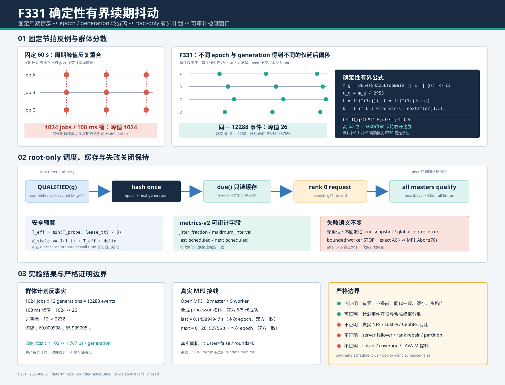

# F331：确定性有界续期抖动与跨作业反惊群调度

> 功能编号：`F331`
> 日期：`2026-08-07`
> 状态：已实现、已测试、已有真实 MPI 接线证据；尚无真实多客户端存储负载证据
> 前置能力：F329 跨主机锁资格、F330 运行期资格续期

## 1. 研究问题与本轮结论

F330 解决了“启动时成立的跨 client 锁语义会不会在长作业运行期间变陈旧”，但所有作业默认都按固定
60 秒周期从上一次成功完成时刻开始计时。一个作业内只有 rank 0 发起，因此不会发生同一 communicator
内部的多 timer 竞争；然而多个 MPI 作业若在批处理队列中同时启动，会在每个周期同时访问共享锁 inode、
MPI 控制面和存储 lock manager。这是经典的周期任务 thundering herd，固定周期之间还可能形成长期
Moiré load pattern。

F331 实现的不是失败重试，也不是无界随机 sleep，而是适合语义租约的**确定性、有界、仅延后抖动**：

1. rank 0 以工作 epoch 和下一代 generation 为输入，使用域分离 SHA-256 产生一个`[0,1)`分数；
2. 每代延迟严格位于`[interval, interval * (1 + jitter))`；
3. 默认`jitter=0.1`，最大允许`0.5`，`0`恢复F330固定节拍；
4. peer master不读取本地timer，只接受带epoch/generation/token的root请求；
5. 下一代计划值在初始化或上一代完成时计算一次并缓存，完成时将其直接提升为上一代实用值，
   主循环`due()`和指标`snapshot()`均不重复做哈希；
6. 指标升级为`v2`，显式记录抖动比例、最大间隔及相邻两代计划值。

1024个同步作业、12代、100 ms桶的合成计划反事实中，两种策略都保存12288次续期；固定节拍峰值为
1024请求/桶，10%抖动峰值为26请求/桶，下降97.4609375%。这只证明计划到达分散，不是存储吞吐或
DSE加速。真实Open MPI合成拓扑完成双方5代续期并得到完全相同的相邻计划值；真实同机作业即使配置
50%抖动也不启用runtime renewal，保持F329/F330资格门。



## 2. 为什么固定续期会成为规模化问题

### 2.1 单作业正确不等于多作业平滑

F330的root-only发起已经消除了一个作业内的代次分裂，但独立作业没有共享调度器。假设`N`个作业在
相近时刻启动，资格耗时也相近，固定周期`I`会使第`g`代近似集中在：

```text
t(job, g) ~= startup(job) + g * (I + qualification_cost)
```

当`startup(job)`集中、资格成本稳定时，每代都会重新形成请求峰值。更复杂的是两个周期略有不同的作业
群可能周期性重合，产生Moiré负载。语义探针本身包含多轮打开、加锁、竞争、释放、重取和MPI证据交换，
所以它不是一个可以无限并发而没有后果的空心timer。

### 2.2 相关工作给出的约束

- Google SRE在[Managing Data Processing Pipelines](https://sre.google/sre-book/data-processing-pipelines/)
  中把大规模周期任务同时启动称为thundering herd，并讨论多个周期负载相互叠加的Moiré pattern；
- Amazon Builders' Library的
  [Timeouts, retries, and backoff with jitter](https://aws.amazon.com/builders-library/timeouts-retries-and-backoff-with-jitter/)
  说明固定周期和同步重试会形成突发流量，jitter用于把到达时间摊开；
- AWS的[Exponential Backoff and Jitter](https://aws.amazon.com/blogs/architecture/exponential-backoff-and-jitter/)
  给出无抖动客户端反复聚集、加入jitter后总竞争工作下降的对照；
- [RFC 8881（NFSv4.1）](https://www.rfc-editor.org/rfc/rfc8881.html)讨论lease长短、续期负载、
  传播延迟和到期前预算，说明租约调度不能只追求分散，还必须保留可证明的到期边界；
- Gray与Cheriton的
  [Leases](https://web.stanford.edu/class/cs240/readings/leases.pdf)给出lease期限与通信/恢复之间的
  基本权衡。F331沿用“明确期限、无时钟同步依赖”的原则，但续期对象是锁语义资格证据，而不是缓存数据。

这些资料支持“周期请求需要抖动”，却不直接规定符号执行框架应如何组合epoch fencing、MPI单发起者、
共享文件系统litmus与work lease TTL。本项目的工作在于把这些约束组合成可验证状态机。

## 3. 调度算法

### 3.1 域分离的确定性分数

令：

- `E`：rank 0选择并广播的256-bit工作epoch；
- `g`：下一次严格递增的资格代次，`g >= 1`；
- `I`：配置的基础续期间隔；
- `j`：抖动比例，`0 <= j <= 0.5`。

计算：

```text
H_g = SHA256("symcc-cluster-lock-renewal-jitter-v1\0" || E || uint64_be(g))
m_g = uint64_be(H_g[0:8]) >> 11
u_g = m_g / 2^53
U_g = fl(I * (1 + j))
C_g = fl(I * (1 + j * u_g))
D_g = I                                      if U_g == I
      min(C_g, nextafter(U_g, I))             otherwise
```

因此：

```text
0 <= u_g < 1
I <= D_g < I * (1 + j)
```

SHA-256在这里不承担秘密性或对抗性随机数职责；它提供稳定、均匀的epoch/generation映射和显式域分离。
实现处理两个独立的binary64边界。第一，直接用64位整数除以`2^64`时，最大的若干整数可能舍入为精确
`1.0`；保留高53位后，`(2^53-1)/2^53`可精确表示且严格小于1。第二，即使`u_g<1`，最终乘加仍可能
把候选值舍入为`U_g`；实现只在该端点用`nextafter(U_g,I)`回退一个ULP。若正抖动小到`U_g==I`、不存在
可表示的内部浮点值，则退化为`D_g=I`。定向测试把摘要强制为全`0xff`，同时覆盖常规间隔、`1e300`
大间隔和小于一个ULP的抖动。同一作业所有master可复算同一结果，默认随机epoch使独立作业获得不同
序列，且不依赖进程全局RNG状态、fork继承或调用顺序。

### 3.2 为什么采用“仅延后”而不是对称抖动

对称抖动`I * (1 +/- x)`能保持平均周期，但会让部分探针早于管理员配置的`I`，从而提高最大探针频率。
F331把`I`定义为严格最小间隔，只向后增加最多`jI`：

- 不会比F330配置更频繁地打共享存储；
- 容量规划仍可把`1/I`当作每作业的频率上界；
- 代价是最大检测窗口增加`jI`，该变化必须在配置和指标中公开。

若有效协议超时为：

```text
T_eff = min(cluster_probe_timeout, work_lease_ttl / 3)
```

则所有master持续得到调度时，保守的语义陈旧窗口为：

```text
W_stale <= I * (1 + j) + T_eff + delta_schedule
```

其中`delta_schedule`包含Python事件循环、操作系统调度及quiescence/wall-time安全门造成的延期。F331没有
把这个上界隐藏成“仍为I”。

### 3.3 root-only决定与代次一致性

抖动只决定root何时开始下一代：

```text
rank 0: completed_at + cached D_(g+1) -> due -> authenticated request
peers : no local due timer -> poll request -> validate exact epoch/generation/token
all   : heartbeat work leases -> execute the same F330 bounded litmus
```

peer上的`interval/jitter`不构成启动权威。即使局部timer或调度存在偏差，只有root发出的严格下一代请求才能
推进状态机；旧代、跳代、token冲突仍被隔离。F331因而不会重新引入F330已经消除的“每个master独立
timer进入collective”问题。

## 4. 执行流程

### 4.1 初始化

1. F327/F328在真实状态路径执行本地文件系统能力探针；
2. F329收集真实`MPI.Get_processor_name()`membership并执行跨processor锁litmus；
3. 只有`cluster_lock_verified=true`且master数大于1才保留master communicator；
4. 读取基础间隔与F331抖动配置；
5. controller用`E, g=1, I, j`计算`D_1`并缓存；
6. same-host、single-master、probe disabled和hybrid跨job拓扑均不建立runtime controller。

### 4.2 每轮主循环

1. 回收已有非阻塞control sends；
2. 更新master status与work lease heartbeat；
3. 判断是否存在quiescence probe/commit prepared状态；
4. root调用`due(now)`，只读取缓存的`D_(g+1)`；
5. 同时满足计划时间、安全门与wall-time预算后发送代次请求；
6. peer只在收到root请求时进入资格协议；
7. 每个master先`heartbeat_all()`保护在途work lease；
8. 重跑F330的OPEN/HELD/EXCLUDED/RELEASED/REACQUIRED跨client语义证明；
9. 成功时推进generation、替换最新capability，把缓存的`D_(g+1)`提升为`last`，并计算缓存`D_(g+2)`；
10. 任一失败仍设置global control error、执行有界worker shutdown并`MPI_Abort(70)`，不做重试。

### 4.3 为什么缓存是正确性与性能共同要求

master主循环大约每50 ms轮询一次。如果`due()`每次都做SHA-256，默认60秒等待期会对同一代重复约
1200次无意义计算，而且不同调用点若未来修改输入还可能产生难以观察的调度漂移。F331把实际使用过的
延迟与下一代延迟都存入controller私有字段：

```text
construct controller -> hash once for g=1
many due() polls      -> read cached float
complete generation  -> last = cached next; hash once for new next
many snapshots        -> read cached last and next
```

定向测试用mock计数确认初始化后、完成一代后，多次`due()`和`snapshot()`都不会再次调用调度哈希。

## 5. 实现映射

| 模块 | 实现 |
|---|---|
| `util/mpi_filesystem_qualification.py` | `_scheduled_renewal_interval`、有界校验、controller缓存、v2指标 |
| `util/mpi_concolic_execution.py` | production配置读取、master-loop参数传递和controller接线 |
| `test/test_mpi_filesystem_qualification.py` | 边界、可复现、跨代/跨epoch、非法值、缓存及1024-epoch分散测试 |
| `docs/Configuration.txt` | 默认值、范围、算法、最坏窗口与关闭语义 |
| `benchmark_cohort_schedule.py` | 固定/抖动事件守恒反事实和每代调度成本 |
| `run_synthetic_jitter_mpi.py` | 真实MPI生产主循环配置与v2指标接线 |
| `run_same_host_no_activation.py` | 真实MPI同机资格门反误报 |

新增配置：

```text
SYMCC_SHARED_STATE_CLUSTER_REQUALIFY_JITTER=FRACTION
default=0.1, range=0..0.5
```

指标从`v1`升级为`v2`，新增：

```text
jitter_fraction
maximum_interval
last_scheduled_interval
next_scheduled_interval
```

版本升级是有意的：依赖严格schema的dashboard应显式适配，而不是把新增字段误判成旧格式。

## 6. 正确性不变量与测试

### 6.1 关键不变量

1. **不提前**：任何`D_g`都不小于基础间隔`I`；
2. **有界**：`j <= 0.5`且`D_g < 1.5I`；
3. **同代一致**：同一`E,g,I,j`得到相同bit-level Python float；
4. **跨域分散**：默认不同epoch和相邻generation使用不同哈希输入；
5. **单发起者**：只有master communicator rank 0读取计划并发送请求；
6. **代次防重放**：抖动不改变F330的严格`generation+1`和token验证；
7. **失败不重试**：资格失败直接失败关闭，不因jitter引入重试风暴；
8. **缓存稳定**：一代等待期间不重新哈希；
9. **资格门保持**：没有真实跨processor启动证据就没有runtime jitter；
10. **事件守恒**：抖动只改变计划时间，不删除或复制正常续期。

### 6.2 测试结果

| 范围 | 结果 |
|---|---:|
| F331/F330定向测试 | 17 passed + 5 subtests，1.28 s |
| MPI/distributed/hybrid相关回归 | 296 passed + 26 subtests，15.91 s |
| 完整warnings-as-errors Python回归 | 692 passed + 46 subtests，96.73 s |
| Ruff | touched production/test/evidence Python通过 |
| AST与diff检查 | 通过 |

测试不是只检查“值发生变化”，而是直接验证范围、精确due边界、同epoch可复现、跨代/跨epoch不同、非法
NaN/Inf/越界拒绝、全`0xff`摘要下最终乘加端点、极大间隔、小于一个ULP的抖动、缓存调用次数、
1024 epoch时间桶分散，以及原有请求防重放和语义漂移失败关闭。

## 7. 实验设计与结果

### 7.1 1024作业群体计划反事实

配置：

| 项目 | 值 |
|---|---:|
| 独立epoch | 1024 |
| 每作业generation | 12 |
| 总计划事件 | 12288 |
| 基础间隔 | 60 s |
| 抖动比例 | 0.1 |
| 时间桶 | 100 ms |
| 启动时刻 | 全部`t=0` |

固定组使用`j=0`，实验组使用相同epoch集合和完全相同的12代，只改变计划函数。结果：

| 指标 | 固定节拍 | F331抖动 |
|---|---:|---:|
| 总事件 | 12288 | 12288 |
| 峰值事件/100 ms | 1024 | 26 |
| 非空时间桶 | 12 | 2232 |
| 单次间隔范围 | 60 s | 60.000908..65.999095 s |
| 峰值变化 | 基线 | -97.4609375% |

F331逐代峰值为：

```text
26, 26, 20, 22, 18, 18, 15, 13, 13, 14, 14, 15
```

这说明改善不是通过少做续期得到的：两组事件数严格相等，且每一代都分散。非空桶增加186倍是计划
到达时间展开的另一种表述，不意味着存储完成吞吐提高186倍。

### 7.2 调度计算成本

对每个样本计算1024×12个计划，2次warm-up后进行20次fixed/jitter交错测量：

| 模式 | 中位成本 |
|---|---:|
| 固定调度函数 | 1.102851 us/decision |
| SHA-256抖动调度函数 | 1.766609 us/decision |
| 中位增量 | 0.663758 us/decision |

生产controller每代只支付一次该成本，并把结果缓存约60秒；该数量级远小于一次13--24 ms的合成资格
状态机，更不能与真实符号执行秒级任务成本直接相加。这里报告的是Python计划函数成本，不是DSE吞吐。

### 7.3 真实MPI传输、合成processor拓扑

配置：Open MPI 4.1.6，7 ranks，2 master + 5 worker，`interval=0.12s`，`j=0.5`，测试包装器
把两个master映射为不同processor名称。结果：

- 启动资格进入`cross-host-mpi-lock-v1`合成scope；
- 两个master均完成5代，`attempts=successes=5`、`failures=0`；
- 本次随机epoch下，两侧`last_scheduled_interval=0.145894947s`；
- 本次随机epoch下，两侧`next_scheduled_interval=0.126152756s`；
- 两个值都严格位于配置的`[0.12,0.18)`，跨运行具体值随新epoch变化；
- 5/5 worker ACK，退出码0；
- 输出schema均为`metrics-v2`。

它证明生产环境变量、controller、root request、MPI主循环和worker关闭接线成立。processor名称被注入，
因此不证明远端文件系统。

### 7.4 真实同机反误报

第二个真实Open MPI作业不注入processor名称，并故意配置更激进的`interval=0.05s, jitter=0.5`：

- 两个master实际都报告processor `cuda-ke`；
- `cluster_lock_verified=false`、`cluster_lock_rounds=0`；
- 没有输出任何runtime renewal指标；
- 5/5 worker ACK、退出码0、epoch临时状态清理完成。

因此F331参数不能单独开启runtime协议，仍受F329真实membership门控。

## 8. 先进性、创新性与挑战

### 8.1 技术先进性

F331把大规模分布式系统中的jitter原则移植到并行符号执行的运行期存储语义资格，而不是仅用于HTTP
重试。它同时考虑了周期负载、epoch fencing、MPI单发起者、work lease TTL、quiescence和wall-time
预算，属于跨层组合。

### 8.2 项目创新点

1. **语义租约的delay-only jitter**：以最小探针间隔为硬约束，不用对称随机缩短间隔；
2. **epoch/generation确定性PRF**：跨作业分散、同作业可复算、无需共享RNG状态；
3. **调度与协议身份分离**：抖动决定“何时请求”，F330 token决定“请求是否属于精确下一代”；
4. **缓存化事件循环接线**：把SHA成本从每轮轮询降为每代一次；
5. **可审计窗口**：v2指标同时暴露基础、最大、上一代和下一代计划值；
6. **事件守恒实验**：比较相同数量的续期，避免用删减工作伪造峰值改善；
7. **反误报证据**：真实同机运行证明配置本身不能伪造跨主机资格。

### 8.3 实现挑战

- 直接调用`random.random()`会让复现实验依赖调用顺序、fork状态和seed管理；
- 让每个master自行抖动会重新造成collective进入时间分裂；
- full jitter可能把续期提前到接近0，破坏管理员的频率预算；
- 只报告平均间隔会隐藏最坏陈旧窗口；
- 在`due()`里即时哈希会把每代成本错误放大到每事件循环成本；
- 指标增加字段而不升级schema会让严格消费者静默误解析。

F331逐项选择了确定性、root-only、delay-only、显式上界、缓存和schema v2。

## 9. 局限与有效性威胁

1. 97.46%来自合成计划时间桶，不包含MPI、网络、文件系统、锁管理器或队列服务时间；
2. 真实MPI实验只有一台物理机，processor拓扑为测试注入；
3. 没有测NFSv4、SMB3、Lustre或CephFS上的真实IOPS与尾延迟；
4. 独立作业若被人工配置为相同epoch，会得到相同抖动序列；默认随机epoch避免这一点，但不是强制；
5. jitter增加最大检测窗口，默认10%意味着60秒基础间隔最多增加约6秒；
6. quiescence、wall-time或调度暂停还会在计划值之外继续延期；
7. F331不重试失败资格，不提高job availability；
8. SHA-256映射用于负载分散，不提供对抗恶意调度者的随机性保证；
9. 没有server restart、network partition、rank failure或ULFM恢复实验；
10. 没有真实target、solver、coverage、LAVA-M或长时fuzzing campaign，不能声称覆盖率提升。

## 10. 后续研究

1. 在至少两台真实client上同时运行数十个job，记录NFS/Lustre/CephFS lock-manager IOPS、p95/p99
   续期延迟和计划/实际启动偏差；
2. 把`scheduled_interval`与实际request start time差值加入指标，区分jitter、quiescence延期和OS调度；
3. 研究容量感知的server-advertised jitter window，但必须把控制配置纳入epoch/generation认证；
4. 对超大master数研究分层representative与分阶段holder轮转，减少单次litmus本身的`H*(M-1)`成本；
5. 在真实server restart/remount实验中测量检测延迟分布，验证理论最坏窗口；
6. 将计划峰值、实际存储请求、DSE吞吐和coverage分别接入长期dashboard，避免混合指标。

## 11. 证据索引

- 代码：[`mpi_filesystem_qualification.py`](../../../util/mpi_filesystem_qualification.py)、
  [`mpi_concolic_execution.py`](../../../util/mpi_concolic_execution.py)
- 测试：[`test_mpi_filesystem_qualification.py`](../../../test/test_mpi_filesystem_qualification.py)
- 配置：[`Configuration.txt`](../../Configuration.txt)
- 原始证据：[`f331-deterministic-renewal-jitter-2026-08-07/`](../evidence/f331-deterministic-renewal-jitter-2026-08-07/)
- 图：[`deterministic-renewal-jitter-2026-08-07.svg`](../diagrams/deterministic-renewal-jitter-2026-08-07.svg)

## 12. 结论

F331修复了F330固定周期在多作业规模下可能形成同步突发的工程缺口。它以epoch/generation域分离哈希
产生仅延后、有界、可复现的root计划，保持严格代次、防重放、TTL预算、quiescence安全门和失败关闭；
缓存使事件循环只读取计划值，v2指标使理论窗口和实际配置可审计。

当前证据支持：“在相同12288个计划事件下，1024-job合成峰值从1024降至26；生产MPI接线完成5代且
同代计划一致；同机资格门不被绕过。”当前证据不支持：“真实共享存储吞吐提升97.46%、DSE加速、
coverage提升或多机容错已经实现。”
