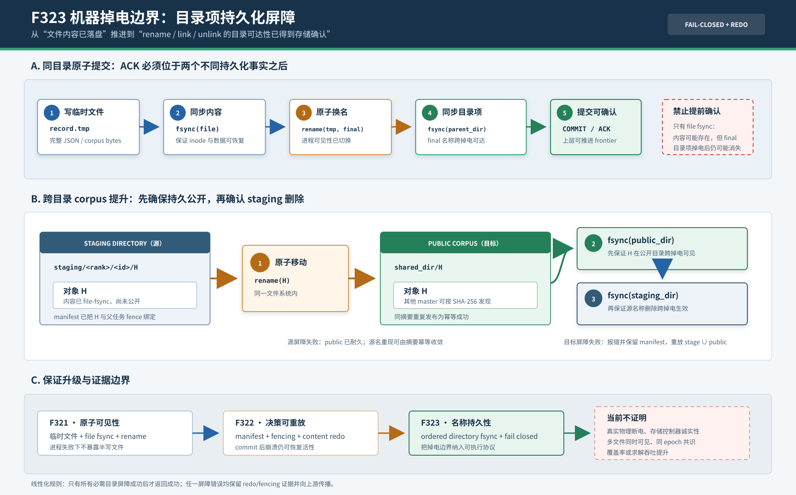

# F323：目录项持久化屏障与掉电边界失败关闭

- 日期：2026-08-07
- 功能编号：F323
- 成熟度：I/T/E-mechanism
- 代码范围：分布式状态持久化原语、standalone MPI result publication及恢复测试
- 证据范围：627项完整Python回归、7项定向故障注入、Linux syscall trace、真实Open MPI
  单/双master健康路径和本机同步成本微基准

## 1. 研究问题

F322已经实现“先持久化canonical result manifest，再发布child，崩溃后按manifest幂等redo”。
当时报告刻意把保证限定为进程失败恢复，因为原子文件写的实际序列是：

```text
write(temp) -> fsync(temp) -> rename(temp, final) -> return success
```

这保证`final`不会被其他进程观察为半写文件，却没有证明`final`这个**目录项**已经进入稳定存储。
Linux `fsync(2)`手册明确指出：同步文件不一定同步其所在目录中的entry；若要保证entry落盘，
还需对目录文件描述符显式执行`fsync()`。
[Linux fsync(2)](https://man7.org/linux/man-pages/man2/fsync.2.html)

因此存在与F322 redo协议直接冲突的掉电窗口：

1. record文件内容已经落盘，`rename`在当前内核缓存中可见；
2. master据此继续公开child或返回commit成功；
3. 主机掉电后record的final目录项消失；
4. corpus副作用仍可能存在，但恢复端失去授权它的manifest/fencing decision。

对跨目录`stage/H -> public/H`移动还存在第二个窗口。一次rename同时增加目标entry并删除源entry，
但目标目录和源目录的持久化进度可以不同。只同步其中一侧无法区分“已安全公开”“源名称可能
重现”和“公开名称可能消失”。F323的目标不是实现通用数据库，而是把这些目录元数据事实纳入
现有content-addressed redo协议：

1. 所有关键final name只有在父目录同步成功后才返回成功；
2. 跨目录移动先同步public目录，再同步staging目录；
3. hard link、unlink和新建目录也具有明确的持久化屏障；
4. 任何屏障错误均向上层传播或返回失败，不静默声称commit完成；
5. 保持F322的manifest、摘要校验和幂等redo，使“系统调用已发生但屏障报错”的不确定状态可收敛。

## 2. 学术与工程定位

### 2.1 原始依据

- [Linux `fsync(2)`](https://man7.org/linux/man-pages/man2/fsync.2.html)区分文件内容/inode同步与
  containing-directory entry同步，这是F323最直接的系统语义依据；
- [SQLite Atomic Commit](https://www.sqlite.org/atomiccommit.html)说明事务系统必须在关键点执行
  flush，并在Unix上同步包含super-journal的目录，使文件在掉电后仍会出现在目录中；
- F322采用的[ARIES](https://research.ibm.com/publications/aries-a-transaction-recovery-method-supporting-fine-granularity-locking-and-partial-rollbacks-using-write-ahead-logging)
  启发负责“有决定即可redo”，F323补的是redo record自身和被发布对象的名称持久性。

### 2.2 项目中的组合创新

目录`fsync`本身不是新算法。研究价值来自它与并行DSE frontier协议的组合：

```text
content-addressed child
        + hidden worker staging
        + current-token fencing
        + canonical result manifest
        + ordered directory barriers
        + digest-verified idempotent redo
```

传统原子写常把`rename()`误当作掉电持久化终点；F323则把“进程观察到原子切换”和“重启后名称
仍可达”分成两个不同状态。跨目录发布又进一步把目标侧durability放在源侧cleanup之前，使第二个
屏障失败时最多产生“public和stage都出现同摘要对象”的保守状态，而不是产生“授权对象从两侧都
不可达”的危险状态。

## 3. 故障模型与保证

### 3.1 覆盖的故障

- Python进程、MPI rank或整组进程在任一持久化步骤后退出；
- `open/fsync/rename/link/unlink`返回I/O、空间或不支持错误；
- rename已经改变当前命名空间，但随后的directory fsync失败；
- 跨目录rename的public目录同步成功、staging目录同步失败；
- 多个恢复helper重复验证和提升相同SHA-256对象。

### 3.2 不覆盖的故障

- 文件系统或存储控制器在成功返回flush后仍丢数据；
- 网络分区、共享存储脑裂、同epoch并发作业membership冲突；
- 不支持directory fsync的平台上的静默兼容降级；
- 批量child的同时可见、全局exactly-once execution或完整数据库事务；
- 本轮没有执行真实物理断电，因此不声称已完成power-cut benchmark。

## 4. 持久化原语

实现集中在[`util/distributed_state.py`](../../../util/distributed_state.py)，避免每个状态类各写一套
不一致的屏障。

| 原语 | 系统调用顺序 | 成功语义 |
| --- | --- | --- |
| `fsync_directory(path)` | `open(O_DIRECTORY|O_CLOEXEC)`，`fsync(fd)`，`close(fd)` | 目录当前metadata更新已被底层接受为持久 |
| `durable_makedirs(path)` | 自上而下`mkdir`，同步新目录，再同步其父目录 | 每个新路径component及其父entry均完成屏障 |
| `durable_replace(src,dst)`同目录 | `rename`，`fsync(dst_parent)` | final entry可跨掉电恢复 |
| `durable_replace(src,dst)`跨目录 | `rename`，`fsync(dst_parent)`，`fsync(src_parent)` | 先持久公开，再持久删除staging名称 |
| `durable_link(src,dst)` | `link`，`fsync(dst_parent)` | 新hard-link entry已完成屏障 |
| `durable_unlink(path)` | `unlink`，`fsync(parent)` | 删除决定已完成屏障 |

原语不吞掉directory fsync错误。注意`durable_replace`要求调用者已经同步源文件内容：普通原子写
在rename前执行file fsync；stage promotion移动的是此前已经file-fsync并通过SHA-256回验的inode，
不需要重复同步相同内容。

### 4.1 新目录

只同步新文件所在目录仍不充分：如果lazy shard或stage目录也是刚创建的，它在父目录中的entry
本身也可能没有落盘。`durable_makedirs()`先收集缺失component，再自上而下创建，每创建一级都
同步新目录和父目录。`exist_ok=False`被保留，worker staging ID碰撞仍会失败，不能悄悄复用旧
inventory。

### 4.2 同目录record提交

```text
write tmp
   |
   v
fsync(tmp file)       -- 内容事实
   |
   v
rename(tmp, final)    -- 当前进程的原子可见性切换
   |
   v
fsync(parent dir)     -- 重启后的名称可达性事实
   |
   v
return success / permit next protocol step
```

directory fsync若失败，rename可能已经可见。函数仍抛错；上层不会把不确定状态记为成功。重启扫描
若看见final record，会按schema、record ID、payload、token和timestamp重新验证；若看不见，则按
旧持久状态恢复。两种结果都比“提前ACK后丢失授权decision”安全。

### 4.3 跨目录stage promotion



对`staging/H -> public/H`：

1. `rename`原子移动同一inode；
2. `fsync(public_dir)`先确保持久公开；
3. `fsync(staging_dir)`再确认源entry删除；
4. 两个屏障都成功后promotion才返回成功。

故障状态按顺序具有单调安全性：

| 故障点 | 可能的重启状态 | 恢复动作 |
| --- | --- | --- |
| rename前 | 仅stage有H | manifest联合校验后重新promotion |
| rename后、public屏障失败 | stage或public之一可见，持久性未知 | 报错并保留committing record；重启验证`stage ∪ public` |
| public屏障成功、stage屏障失败 | public必然可见；stage名称可能重现 | 同摘要双位置是安全重复；promotion/cleanup幂等收敛 |
| 两屏障成功 | 仅public持久可见 | 完成父record并唯一记账 |

这里不提供多child同时可见；manifest授权集合，child仍按摘要逐个发布。已有调度只能消费真实存在
且摘要正确的对象，所以部分但已授权的public集合是协议允许状态。

### 4.4 Hard link与删除

epoch的不可变`state.json`采用hard link竞争创建。临时文件先file-fsync，`durable_link()`再同步
epoch根目录；若link后屏障报错，重试会读取并逐字段验证已可见metadata，不会创建第二种布局。

lease `abandon`和target-group release改用`durable_unlink()`。若unlink后屏障失败，调用者得到失败；
重启时record可能重现为保守lease，也可能保持删除。前者受TTL/fencing约束，后者允许重新claim，
都不会授权旧token提交新owner状态。

## 5. 接入范围

### 5.1 严格恢复状态

- `ContentAddressedInputStore`：对象prefix目录和final digest name；
- `CoverageOwnerShardGossip`：coordinator heartbeat与coverage shard snapshot发布；
- `WorkLeaseJournal`：append后flush/file fsync，首次创建同步父目录；compaction文件先file fsync再
  durable replace；
- `FencedWorkLeaseTable` / `FencedTargetLeaseTable`：lazy shard、record replace和lease删除；
- `LiveStateStore`：continuation、solver frame、symbolic store和COW memory对象的digest name；
- standalone MPI：corpus `_atomic_write`、epoch metadata hard link、worker stage目录、
  `stage -> public` promotion和shared output根目录。

### 5.2 刻意保持易失或best-effort的路径

- 短时`.lock`目录不执行持久化屏障；它是活进程互斥，不是恢复事实。把它强制落盘会增加重启
  假锁，本项目仍通过“不按墙钟偷取短锁”和有界获取超时处理；
- per-run SymCC输出目录和最终`rmtree`属于临时资源清理，不决定已提交corpus/record语义；
- `PersistentShardLedger`是可丢失的去重提示，追加现在尝试file/directory同步，但仍保留原有
  best-effort错误处理，不能作为exact-work授权依据；
- `WorkLeaseJournal.compact()`是优化操作，失败时旧append log仍是权威恢复来源。

这种分类避免为了“所有文件都fsync”而把临时锁、缓存和正确性decision混成一种耐久等级。

## 6. 错误传播与恢复不变量

| 编号 | 不变量 | 实现约束 |
| --- | --- | --- |
| D1 | final name之前先同步完整内容 | 所有原子写均在rename前file fsync |
| D2 | 成功返回意味着final目录项完成屏障 | same-directory replace同步parent |
| D3 | public durability先于staging deletion durability | cross-directory replace固定dst→src顺序 |
| D4 | 屏障失败不能被解释为未执行rename | 测试同时检查异常和已可见destination |
| D5 | 不确定record仍能恢复 | final record重新进行结构、身份和token校验 |
| D6 | 不确定corpus移动仍能恢复 | manifest验证`stage ∪ public`并按SHA-256幂等redo |
| D7 | 新建目录自身不能成为隐藏掉电窗口 | 每级mkdir同步目录及其父目录 |
| D8 | 不支持的directory fsync不静默降级 | `open/fsync`错误原样传播到协议控制路径 |

## 7. 测试与实验

原始文件和哈希清单位于
[`F323 evidence`](../evidence/f323-directory-durability-2026-08-07/)。

### 7.1 自动化

| 门禁 | 结果 |
| --- | --- |
| `py_compile` | 通过 |
| Ruff | 通过 |
| `git diff --check`（实现与测试） | 通过 |
| 新增故障路径定向 | 7 passed，0.46秒 |
| distributed-state + MPI lifecycle | 116 passed + 10 subtests，13.63秒 |
| 完整`pytest -q test` | 627 passed + 38 subtests，92.05秒 |

故障注入覆盖：嵌套目录逐级屏障、staging/public同步顺序、rename后目录屏障错误、hard-link/unlink、
fenced record屏障失败后重启枚举、corpus原子发布错误和epoch metadata link后不确定状态重试。

### 7.2 Linux syscall证据

`strace`观察到的最小跨目录发布序列为：

```text
openat(.../staging/object, O_EXCL) = 3
fsync(3)                           = 0
rename(.../staging/object, .../public/object) = 0
openat(.../public, O_DIRECTORY)    = 3
fsync(3)                           = 0
openat(.../staging, O_DIRECTORY)   = 3
fsync(3)                           = 0
```

这证明Python实现实际到达Linux目录fd，而不是只在测试中mock了一个同名helper。

### 7.3 真实Open MPI

| 场景 | 观测 |
| --- | --- |
| 1 master + 2 workers | exit 0；2 seeds + 1 unique child；3 observations；2/2 ACK；epoch state=0 |
| 2 masters + 6 workers | exit 0；12 seeds + 1 unique child；13 observations；master 0/1=5/8；6/6 ACK；epoch state=0 |

两次都由真实Open MPI 4.1.6运行，证明严格目录屏障没有破坏单/双master健康提交和有界关闭。该运行
不是coverage benchmark，也不用于比较F322/F323吞吐。

### 7.4 同步成本微基准

环境为本机overlayfs，4 KiB内容预先file-fsync；5轮、每轮100次，共500个样本：

| 指标 | 数值 |
| --- | ---: |
| 仅rename中位数 | 17.236 us |
| `rename + fsync(parent)`中位数 | 2897.566 us |
| 耐久replace P95 | 2991.771 us |
| 中位新增成本 | 2880.331 us |

目录屏障约增加2.88 ms是可靠性成本，不是性能收益。真实符号执行任务通常远长于毫秒级，但大量
短任务或高频heartbeat下该固定成本会累积；不能用本轮小规模MPI吞吐波动推导生产开销。

## 8. 正确性与性能权衡

直接关闭directory fsync可恢复F322的进程级性能，却重新打开“corpus存在而授权manifest消失”的
掉电错误，因此F323默认严格且不提供静默fallback。下一步性能优化必须保持D1-D8，例如：

1. 按lease shard收集多个record replace后执行一次directory group commit；
2. 区分必须立即持久化的`leased -> committing`与可延迟的heartbeat更新时间；
3. 用批次sequence/commit marker证明一组rename受一个目录屏障覆盖；
4. 报告batch size、sync latency、恢复重复工作和tail latency，不只报告平均吞吐。

在没有批次证明之前简单减少fsync次数属于削弱保证，而不是优化。

## 9. 已知边界

1. **未执行物理断电。** fault injection证明错误处理，strace证明syscall顺序；只有真实power-cut/
   reboot campaign才能验证具体文件系统、内核、控制器和挂载配置的端到端行为。
2. **Linux语义。** `O_DIRECTORY`和目录fd同步是Linux部署假设；不支持时严格报错。跨目录promotion
   还要求stage和public位于同一文件系统，否则rename会以`EXDEV`失败。
3. **不是原子多文件事务。** 多个child逐个变为durable public，manifest提供授权和redo，不提供
   同时可见。
4. **不是共识。** 同epoch活跃作业、网络分区和共享存储脑裂仍可能破坏单owner假设。
5. **cleanup不全耐久。** 成功campaign后的整棵epoch `rmtree`没有逐目录屏障；目录重现最多导致
   done record被再次扫描/清理，不应授权重复commit，但尚无真实重启实验。
6. **共享文件系统差异。** NFS、Lustre、FUSE和对象网关对fsync/rename的实现与成本不同，本机
   overlayfs数字不能外推。
7. **无覆盖收益声明。** F323提高恢复可信度，但没有直接改变路径搜索、约束求解或目标覆盖率。

## 10. 结论

F323关闭了F322明确记录的目录持久化缺口。关键record、content-addressed对象、epoch metadata和
corpus promotion不再把`rename/link/unlink`的进程可见性当作掉电持久性；协议在成功确认前同步
所有必需目录，跨目录移动采用public-first/staging-second顺序，并在任何屏障错误时失败关闭。
F322的manifest联合验证和SHA-256幂等redo使系统调用已发生但持久性未知的中间态仍可安全收敛。

验证同时覆盖了代码级故障注入、真实Linux syscall、627项全量回归和Open MPI单/双master健康
运行。微基准也诚实量化约2.88 ms的本机固定成本。当前成果应表述为“建立了可执行的掉电一致性
屏障协议并形成机制证据”，而不是“已经通过真实断电实验”或“提高了fuzzing覆盖率”。
