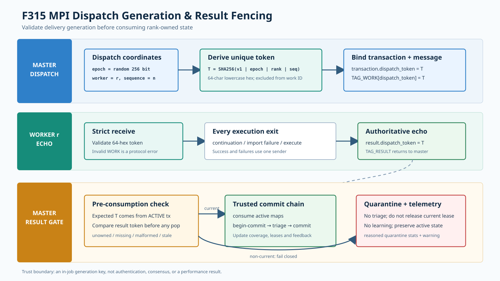

# F315：MPI 派发代次身份与结果提交 Fencing

- 日期：2026-08-07
- 范围：MPI `TAG_WORK/TAG_RESULT` 协议、派发事务、异常结果隔离与可观测性
- 成熟度：I/T；尚无真实多 rank 延迟、重复投递或混合版本 campaign

## 1. 审查发现

F313 已把一次 MPI 派发组织为 PREPARING、ACTIVE、COMMITTING 三阶段资源事务，F314 又把
work/state completion 绑定到 source rank。然而 rank 只标识长期 worker，不标识这个 worker
上的某一次任务代次。master 收到 `TAG_RESULT` 后原先会立即按 rank 从 `active_workers`、
work/state lease、target lease、策略和调度上下文中弹出状态；只有启用 multi-master shared
work lease 时，才会在随后调用 `begin_commit()` 检查 exact-work fence。

因此存在两个协议缺口：

1. shared lease 默认关闭时，idle worker 的未受托结果仍会进入 triage；
2. worker rank 被复用后，旧代次的迟到或重复结果会消费新代次的 master-side 状态，并把旧输入
   的候选、成本和策略反馈错误归因到新任务。

MPI 正常点对点传输通常不会自行复制消息，但应用恢复、未来的异步 pipeline、测试替身、混合
版本进程或上层重试都可能产生这类输入。正确性不能依赖“当前实现碰巧一次只发一条消息”。

## 2. 协议不变量



| 编号 | 不变量 |
| --- | --- |
| D1 | 每次派发拥有独立于 worker rank、work ID 和 state ID 的不可复用 transport token |
| D2 | token 由 master 生成并保存于该次 `_DispatchReservationTransaction`，worker 只能原样回显 |
| D3 | continuation、输入导入失败、正常执行和异常执行的所有结果路径都必须携带同一 token |
| D4 | master 必须在弹出任何 rank-owned 状态、开始 work commit 或更新统计之前校验 token |
| D5 | unowned、missing、malformed 和 stale 结果均 fail closed，不进入 triage、coverage 或学习反馈 |
| D6 | 被隔离结果不得释放当前代次的 work/state/target lease 或提交当前事务 |
| D7 | transport token 不进入 work payload 哈希；任务重试仍保持相同语义 work ID |
| D8 | 每类隔离原因必须有守恒计数并进入运行统计，不能只依赖瞬时日志 |

## 3. 身份设计

master 启动时从系统随机源生成 256-bit `dispatch_epoch`，并维护进程内严格递增的
`dispatch_sequence`。派发 token 定义为：

```text
T = SHA256("symcc-dispatch-v1\0" || epoch || worker_rank || sequence)
```

输出是 64 字符小写十六进制字符串。epoch 防止 coordinator 重启后序号重用；sequence 防止同一
进程内 worker rank 重用；worker rank 使身份坐标可审计。该 token 是不透明的关联 ID，不是
身份认证、MAC、共识序号或跨 coordinator 的全局 fencing number。跨 master exact-work 竞争仍由
F311-F313 的 current-token shared lease 仲裁。

transport token 故意不写入 `WorkLeaseJournal.work_id()` 的 payload。否则相同语义任务每次重试
都会得到不同 work ID，破坏恢复去重。work/state/target 标识回答“执行什么”，dispatch token
回答“这是哪一次交付”；两类身份不能合并。

## 4. 实现流程

### 4.1 Master 派发

[`util/mpi_fuzzing_helper.py`](../../../util/mpi_fuzzing_helper.py) 中的
`_DispatchReservationTransaction` 现在强制要求合法 token，不能构造无身份事务。每次
`_dispatch_to()` 先推进序号并派生 token，再把它同时放入事务对象和 `TAG_WORK` 消息。send
失败仍由 F313 的逆序补偿路径处理；序号出现空洞无语义影响，也不会重用失败派发的身份。

### 4.2 Worker 统一回显

worker 收到 `TAG_WORK` 后严格校验 token。`_send_dispatch_result()` 是唯一结果发送入口：它复制
结果 mapping，覆盖任何已有 `dispatch_token` 字段，再发送 `TAG_RESULT`。三个实际出口全部经过
该函数：

1. live continuation resume 成功或失败；
2. CAS/input materialization 失败的快速返回；
3. 普通符号执行成功或 worker 弹性异常返回。

集中封装避免以后新增错误分支时遗漏身份字段，也防止执行代码误写 token。

### 4.3 Master 先验证、后消费

master 使用 source rank 查找 ACTIVE transaction，但在读取并删除其他 active map 之前调用
`_dispatch_result_status(expected, result)`：

| 状态 | 条件 | 动作 |
| --- | --- | --- |
| `current` | 活动事务存在，结果是 mapping，合法 token 与事务相等 | 进入既有 begin-commit、triage 和资源提交链 |
| `unowned` | source rank 没有活动事务或事务身份无效 | 隔离，不修改该 rank 的任何当前状态 |
| `missing` | 活动事务存在但结果没有 token | 隔离，保留活动事务 |
| `malformed` | 结果不是 mapping，或 token 不是 64 位小写十六进制 | 隔离，保留活动事务 |
| `stale` | token 合法但属于其他派发代次 | 隔离，保留当前代次 |

只有 `current` 路径可以执行 `pop(active_*)`、`begin_commit()`、累计 generated、验证 proposal、
观察 agent/solver feedback 或进入 `_batch_triage()`。这将结果身份校验从 shared-lease 的可选
附加门提升为所有运行模式下的强制前置门。

### 4.4 隔离可观测性

`Stats.quarantine_result()` 维护总数和按原因计数。周期 stats 文件新增
`Quarantined worker results` 行，最终控制台摘要也报告隔离总数。正常 campaign 应为零；非零值
是协议版本不一致、迟到消息或编排故障的直接诊断信号，而不是 coverage 指标。

## 5. 自动化证据

[`test/test_afl_profile_orchestration.py`](../../../test/test_afl_profile_orchestration.py) 新增 4 项：

1. 同 epoch/worker 的不同 sequence、同 epoch/sequence 的不同 worker 生成不同 token，旧 token
   相对新事务被分类为 `stale`；
2. unowned、非 mapping、缺失、非十六进制和列表型 token 全部 fail closed，非法坐标和无 token
   transaction 被拒绝；
3. worker 统一 sender 覆盖结果内伪造/陈旧 token，并拒绝无合法 master token 的发送；
4. 隔离总数、按原因计数和稳定排序的 stats 文本保持一致。

验证结果：

| 门禁 | 结果 |
| --- | --- |
| MPI/AFL profile 编排定向 | 42 passed + 8 subtests（0.52 秒） |
| 分布式状态、策略、反馈、proposal 与 MPI 组合 | 223 passed + 12 subtests（6.03 秒） |
| 完整 Python unittest | 584/584（81.618 秒） |
| Ruff 与 `py_compile` | 通过 |

这些测试证明 token 构造、分类、强制回显、隔离计数以及相关模块的回归兼容，不证明真实网络下
的覆盖率、吞吐、恢复时间或消息重复概率。本轮没有修改 LLVM pass/runtime，因此没有重复运行
LLVM lit；最近一次 LLVM 全量证据仍是 F307 的 LLVM 18 `221 passed + 1 unsupported` 和 LLVM
17 `220 passed + 2 unsupported`。

## 6. 影响、限制与后续实验

F315 消除了“rank 等于任务身份”的隐含假设，使 F313 的事务提交和 F314 的 owner fencing 真正
延伸到单次消息代次。它预计避免错误 triage、错误策略学习、错误 lease completion 和 coverage
污染，但当前没有将这种机制预期表述为性能提升。

当前限制如下：

- token 关联可信的同一 MPI 作业内进程，不抵御恶意 worker；
- 协议损坏的 current result 会被保守隔离，当前实现没有独立的 per-dispatch timeout/requeue；
- 没有运行真实多 rank 的延迟、重复、worker kill、master restart 或混合版本 campaign；
- MPI worker 当前仍是一 rank 一活动事务，尚未实现同 rank pipeline。

后续故障实验应注入旧 token、重复结果、missing/malformed payload、结果与 READY 重排、worker
终止和 coordinator restart，测量 quarantine 分类、当前状态守恒、任务恢复延迟和重复 solver
CPU。若引入 rank pipeline，应保持 token 作为基本提交键，并增加按 token 索引的 in-flight map，
不能退回按 rank 弹出状态。
