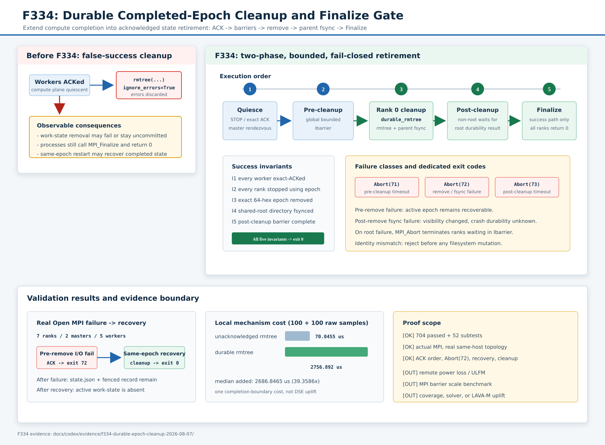

# F334：完成 Epoch 的持久清理与 MPI Finalize 门控

> 功能编号：`F334`

> 当前实现说明：本报告保留 F334 形成时的 durable-rmtree 机制与证据。当前工作树的 F335 对
> persistent output 保留同一 pre/post-cleanup 门控，但已把中间动作升级为 active→retired 持久
> rename 和后续启动 GC；程序自有 temporary root 仍使用本报告的完整删除路径。参见
> [`F335 报告`](Atomic_Completed_Epoch_Retirement_F335_2026-08-07.md)。
> 日期：`2026-08-07`
> 状态：已实现、已完成单元/关联/完整回归与真实 Open MPI 故障注入
> 证据性质：可靠性机制证据，不是符号执行吞吐或覆盖率提升证据

## 1. 研究问题

并行符号执行的“完成”不是单一事件。worker 停止执行、master 汇总统计、共享 work-state 被删除、
目录项跨崩溃持久化、所有 MPI rank 共同退出，分别属于不同的状态边界。F333 之前，正常退出末尾为：

```python
shutil.rmtree(work_state_dir, ignore_errors=True)
MPI.Finalize()
```

这段代码存在两个可观察的正确性缺口：

1. 删除失败被 `ignore_errors=True` 静默吞掉，进程仍可能返回 0；
2. 即使 `rmtree` 在当前内核视图中成功，也没有对 shared-root 目录执行 `fsync`，不能把 active
   epoch 根目录的消失当作已确认的持久事实。

对于配置了固定 `SYMCC_STANDALONE_WORK_EPOCH` 的恢复任务，残留目录并非普通临时文件。下一次启动会
把它解释为 WAL-like 中断状态，恢复 committing record、抢回 pre-commit lease，并受 F333 durable
renewal configuration manifest 约束。因此，错误的成功退出会把“完成任务”重新暴露为“待恢复任务”。

F334 的研究目标是建立以下成功条件：

\[
exit\_0 \Rightarrow ACK_{all} \land quiescent_{all} \land
removed(epoch) \land fsync(parent) \land postBarrier_{all}
\]

## 2. 方案概览



协议把原有的单次 final barrier 拆解为有明确语义的两阶段门控：

1. worker 完成 generation-fenced `STOP -> ACK`；
2. masters 完成 stats exchange 与 master-only cleanup rendezvous；
3. 所有 rank 完成 bounded pre-cleanup `Ibarrier`，证明不再访问 work-state；
4. rank 0 调用 `durable_rmtree(work_state_dir)`；
5. `durable_rmtree` 递归删除后对 shared root 执行 `fsync_directory`；
6. 非 root rank 已在 bounded post-cleanup `Ibarrier` 中等待，root 清理成功后加入；
7. 只有 post-cleanup barrier 完成，所有 rank 才能进入 `MPI_Finalize`。

该协议不是分布式事务日志。它解决的是“成功返回是否已经跨越持久清理边界”，而不是保证递归删除在
所有远端文件系统、断电模型和 server failover 下具有相同实现语义。

## 3. 执行次序与线性化点

### 3.1 Pre-cleanup barrier

原有全局 bounded barrier 被明确命名为 pre-cleanup barrier。它发生在 `group_comm.Free()` 之后，
但仍使用 `MPI_COMM_WORLD`：

- worker 已完成本地目录清理与 exact shutdown ACK；
- master 已停止派发、完成结果 drain、lease heartbeat 和统计交换；
- barrier 成功后，rank 0 可以独占“删除 active epoch 名称”的职责；
- barrier 超时以 `Abort(71)` 结束，不进入清理或成功 finalize。

### 3.2 持久删除

新增 `util.distributed_state.durable_rmtree(path)`：

```text
absolute = abspath(path)
reject filesystem root
shutil.rmtree(absolute)       # errors propagate
fsync_directory(parent)      # acknowledge root-name disappearance
```

对恢复协议而言，语义线性化点是 shared-root 的 directory fsync 成功返回。内部文件删除是递归实现细节；
恢复入口只由 `.standalone-work-<epoch>` 这一根目录名决定。

`_cleanup_completed_work_state` 还验证 work-state 必须是 shared root 的直接子目录，且 basename 必须
精确匹配 `.standalone-work-<64 位小写十六进制 epoch>`。普通直属目录、短 epoch 和大小写异常均在
删除前失败关闭，避免调用者参数错误把 corpus 或其他共享输出误当成完成态。未显式指定 output
directory 时，程序拥有临时 shared root，先持久删除 epoch，再删除整个临时 root。

### 3.3 Post-cleanup barrier

rank 0 执行文件系统操作时，其他 rank 进入第二个 bounded `Ibarrier`。这一步同时解决两个问题：

- 非 root 不能在 root 尚未确认目录持久性时提前 `MPI_Finalize`；
- root 清理失败调用 `MPI_Abort` 时，其他 rank 仍处于可被统一终止的 communicator 操作中。

清理成功后 root 加入 barrier；全部完成才进入 Finalize。post-cleanup 超时以 `Abort(73)` 结束。

## 4. 故障语义

| 故障位置 | 可见状态 | 处理 | 后续语义 |
| --- | --- | --- | --- |
| worker/master 静止不完整 | epoch 未清理 | `Abort(70)` | 保留恢复状态 |
| pre-cleanup barrier 超时 | epoch 未清理 | `Abort(71)` | 保留恢复状态 |
| rmtree 删除前 I/O 失败 | epoch 通常保留 | `Abort(72)` | 相同 epoch 可恢复 |
| rmtree 中途失败 | 可能部分删除 | `Abort(72)` | 不声称完整可恢复；需依据剩余 canonical state 失败关闭 |
| rmtree 可见成功、父目录 fsync 失败 | active 名称当前不可见，但持久性未知 | `Abort(72)` | 不能报告成功；崩溃后可能重现或保持删除 |
| post-cleanup barrier 超时 | rank 0 已确认清理 | `Abort(73)` | 状态完成但 MPI 生命周期不完整 |
| 全部步骤成功 | active epoch 不存在且父目录已 fsync | `Finalize` / 0 | 完成事实成立 |

删除后 fsync 失败是一种 unavoidable uncertain publication：调用者不能回滚已经发生的删除，也不能把
当前可见状态等同于断电后状态。F334 的原则是“不确定即不成功”，而不是虚构原子回滚。

## 5. 实现范围

| 模块 | 实现 |
| --- | --- |
| `util/distributed_state.py` | 新增 `durable_rmtree`，拒绝 filesystem root，传播递归删除与父目录 fsync 异常 |
| `util/mpi_concolic_execution.py` | 新增 `_cleanup_completed_work_state`；精确 epoch 路径身份校验；pre/post cleanup bounded barrier；`Abort(71/72/73)` 分类 |
| `test/test_distributed_state.py` | 正常删除、唯一父目录 fsync、删除后 fsync 不确定性传播 |
| `test/test_mpi_lifecycle.py` | shared-root 范围约束、精确 epoch 命名反例、仅删除 epoch、程序拥有 root 时双层删除 |
| `docs/Configuration.txt` | 执行顺序、退出码、故障语义和能力边界 |

没有增加新的 `SYMCC_*` 配置项。两个 barrier 继续复用
`SYMCC_FINALIZE_GRACE_SEC` 的有限超时，避免引入另一套生命周期时钟。

## 6. 正确性不变量

### I1：错误不可静默

`durable_rmtree` 不使用 `ignore_errors`。`OSError`、类型错误、越界路径和目录 fsync 失败均传播到 root
退出控制面，最终触发 `Abort(72)`。

### I2：清理前无并发使用者

pre-cleanup barrier 位于 worker ACK、master stats exchange 和 communicator group teardown 之后。root
不会在另一个正常 rank 仍读取 work-state 时删除目录。

### I3：Finalize 依赖持久清理

post-cleanup barrier 位于 `durable_rmtree` 之后。非 root rank 即使更快，也不能越过该门控。

### I4：清理范围和身份受限

work-state 的绝对路径必须以 shared root 为直接父目录，basename 必须是
`.standalone-work-<64 位小写十六进制 epoch>`；`durable_rmtree` 另外拒绝删除 filesystem root。

### I5：不确定性不升级为成功

父目录 fsync 失败时，即使 `shutil.rmtree` 已返回且路径当前不存在，异常仍向上传播。测试明确验证此
状态，报告不把它误写为“回滚成功”或“状态必然保留”。

## 7. 测试结果

| 层级 | 当前结果 |
| --- | ---: |
| distributed/lifecycle/filesystem 定向 | 191 passed + 24 subtests，16.40 s |
| MPI/distributed/hybrid 六模块关联 | 308 passed + 32 subtests，16.57 s |
| 完整 warnings-as-errors Python | 704 passed + 52 subtests，94.73 s |

定向测试覆盖：

- nested tree 正常删除及父目录 fsync 调用次数；
- rmtree 已完成后 directory fsync 注入失败，异常不被吞掉；
- work-state 保留 shared root、临时 shared root 一并删除；
- 非直接子目录路径拒绝；
- 普通直属目录、63 位短 epoch 和 64 位大写 epoch 均拒绝且 marker 内容保持不变；
- F333 symlink/no-follow、create-once、并发单赢家等相邻不变量未回归。

## 8. 真实 Open MPI 故障注入

实验使用真实 `mpirun`/mpi4py transport，7 ranks、2 masters、5 workers，固定 epoch 为 `f334` 重复
16 次。同一物理主机运行，未覆盖 `MPI.Get_processor_name`，因此
`synthetic_topology=false`、`actual_multi_host=false`。

### 8.1 删除前 I/O 失败

测试 wrapper 仅在 rank 0 将 work-state `durable_rmtree` 替换为抛出 `OSError`；其他生产流程不变。

| 观察项 | 结果 |
| --- | ---: |
| worker ACK | 3/3 + 2/2，均早于 cleanup failure marker |
| return code | 72 |
| elapsed | 3.613172 s |
| `state.json` | 保留 |
| fenced record 与 lock | 保留 |

这证明删除失败不会再被升级为 exit 0，且其他 rank 不会独立成功 finalize。

### 8.2 相同 epoch 恢复

取消注入后使用相同 output/epoch 重启：

| 观察项 | 结果 |
| --- | ---: |
| worker ACK | 3/3 + 2/2 |
| return code | 0 |
| elapsed | 3.670549 s |
| active work-state after exit | 不存在 |

恢复日志记录 `recovered=1`，表明失败后保留的 fenced work state 被实际接管，而不是只做空启动。

## 9. 机制成本

在本机 overlayfs 上构造包含 `state.json` 与一个 shard record 的两文件 epoch。10 次 warm-up 后，对
旧式 `shutil.rmtree` 与 `durable_rmtree` 各执行 100 次交错、交替次序测量；JSON 保存全部逐次样本。

| 机制 | 中位 | p95 |
| --- | ---: | ---: |
| 未确认 `shutil.rmtree` | 70.0455 us | 89.755 us |
| `rmtree + fsync(parent)` | 2756.892 us | 3079.947 us |
| 增量 | 2686.8465 us | - |

中位比率为 `39.358588346146426x`。这个比率不能解释为“系统慢 39 倍”：清理只发生在作业完成边界，
而不是每个输入、分支、约束或 lease 的热路径。它也未包含第二个 MPI barrier 的规模成本。

## 10. 先进性、创新性与挑战

1. **完成语义跨层化**：把 DSE 计算面静止、共享文件系统持久性和 MPI collective 生命周期组成一个
   可验证成功条件，而不是分别处理。
2. **错误码表达故障阶段**：70/71/72/73 分别对应控制生命周期、清理前 rendezvous、持久删除和清理后
   rendezvous，便于自动化运维区分重试策略。
3. **不确定发布的诚实处理**：删除后 fsync 失败不可能可靠回滚；实现选择失败关闭并在文档中保留
   ambiguous-state 边界。
4. **无新配置面的组合**：复用现有 bounded barrier 和 finalize grace，减少运行时配置漂移。
5. **恢复闭环证据**：故障实验不仅观察错误码，还在同一状态上执行下一次恢复并证明清理收敛。

挑战主要来自退出阶段的非对称性：只有 rank 0 操作文件系统，但成功是全 rank 的共同事实；同时 MPI
communicator 失效、文件系统 I/O 失败和进程退出可能交错，不能使用普通 blocking barrier 假设无限等待。

## 11. 局限与后续方向

- 当前没有真实多主机共享存储、断电、server failover 或网络分区实验；
- `shutil.rmtree` 是递归操作，不是单个原子事务；中途失败可能留下部分树；
- post-cleanup barrier 的成本尚未在 64/128/256 ranks 上独立测量；
- 没有 ULFM revoke/shrink，rank failure 仍依赖 bounded timeout + `MPI_Abort`；
- 未测量 DSE throughput、solver time、coverage 或 LAVA-M，不能从可靠性机制推断这些指标提升。

下一阶段可研究“rename-to-retired namespace + durable tombstone + background reclamation”：先用同目录原子
rename 快速解除 active epoch，再异步回收大树。这可能缩短 post-cleanup barrier 的关键路径，但必须先
解决 tombstone 唯一性、重启垃圾回收、磁盘配额和跨文件系统 rename 约束。

## 12. 证据索引

- 生产代码：`util/distributed_state.py`、`util/mpi_concolic_execution.py`
- 测试：`test/test_distributed_state.py`、`test/test_mpi_lifecycle.py`
- 原始数据：`docs/codex/evidence/f334-durable-epoch-cleanup-2026-08-07/`
- 机制图：`docs/codex/diagrams/durable-completed-epoch-cleanup-2026-08-07.svg`
- 配置语义：`docs/Configuration.txt`
