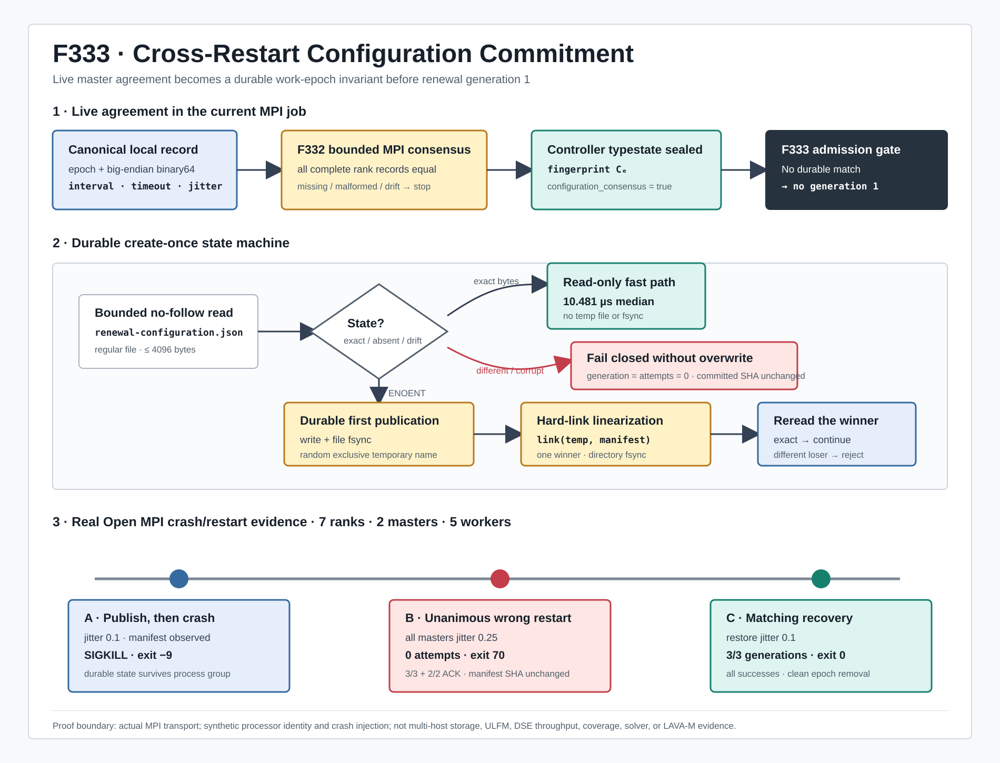

# F333：跨重启的续期配置持久承诺

- 日期：2026-08-07
- 状态：已实现，完成单元/并发/完整回归与真实 Open MPI 崩溃恢复机制验证

> 当前实现说明：本报告中的“干净结束删除状态”描述的是 F333 形成时的行为。F335 已将 persistent
> output 的 work-state（含本 manifest）先持久改名到 retired namespace，再由后续启动的有界 GC
> 删除；temporary output 仍直接清理。manifest 仍不是永久 provenance 数据库。
- 成熟度：I/T/E-mechanism
- 前置能力：F322 durable epoch state、F323 directory durability、F326 stable inode lock、
  F329-F330 cross-host qualification/renewal、F331 deterministic jitter、F332 live configuration consensus

## 1. 研究问题

F332 解决了同一次 MPI 启动中各 master 的续期间隔、有效资格超时和 jitter 漂移：所有 live master
必须在 generation 0 比较完整 canonical 记录，并把同一 SHA-256 指纹封印到 controller typestate。
但该证明只覆盖“当前 communicator 的参与者”，没有把共识结果写入 work epoch 的 durable state。

当用户通过 `SYMCC_STANDALONE_WORK_EPOCH` 恢复未完成作业时，旧实现存在如下时间断层：

```text
run A / epoch E                     run B / the same epoch E
live consensus C_A                  live consensus C_B
interval=60, timeout=5, jitter=.1   interval=60, timeout=5, jitter=.25
          |                                   |
          +---- both are locally valid -------+
                    no durable comparison
```

`C_A` 与 `C_B` 都可能在各自运行中达成完整 live 共识。锁资格本身仍会重新执行，因此这不等价于直接
伪造 filesystem capability；但同一 epoch 已不再代表唯一的续期策略，带来三类问题：

1. **恢复语义不稳定**：崩溃前后的陈旧资格窗口和探测节奏改变，却仍复用同一个 WAL-like work state；
2. **实验归因歧义**：按 epoch 聚合日志时会混入不同配置，无法严格复算一次实验采用的控制策略；
3. **错误定位困难**：运行内配置一致并不能说明它与被恢复状态的产生条件一致。

F333 的研究目标是建立如下不变量：

> 对启用了运行期跨 host 锁资格续期的 work epoch，第一次已完成 live MPI 共识的 canonical 配置成为
> durable create-once 承诺；此后同 epoch 的任何恢复必须逐字节匹配该承诺，才能进入 generation 1。



## 2. 威胁与故障模型

### 2.1 覆盖的故障

- 多个 master 在新 epoch 上并发首次发布同一配置；
- 两个不同配置的进程或重启作业竞争同一 epoch；
- manifest 建链可见但 directory fsync 报错的 uncertain publication；
- manifest 截断、追加、超限、非普通文件或 final-component symlink；
- manifest 落盘后整个 MPI 进程组崩溃；
- 崩溃恢复时所有 live master 一致采用错误的新配置；
- 漂移恢复失败后以正确配置再次恢复。

### 2.2 不覆盖的故障

- 已失效 rank 的 communicator repair、ULFM revoke/shrink；
- 恶意进程具有共享目录写权限并主动 rename 已承诺文件；
- 存储后端违反 F327/F329 已验证的 hard-link、directory-fsync 或 advisory-lock 语义；
- 网络分区下继续提供服务的共识协议；
- 已干净结束且主动删除 work epoch 状态后的长期实验数据库。

F333 是 crash-stop + shared durable state 模型中的恢复 fence，不是 Byzantine 共识，也不是分布式日志复制。

## 3. 设计

### 3.1 两级承诺链

F333 把 F332 的 live commitment 延长为跨重启 commitment：

```text
canonical binary64 fields
        |
        v
F332 live bounded MPI agreement
        |
        | seal exact fingerprint C_E
        v
F333 canonical JSON bytes
        |
        | fsync(temp) -> hard-link create-if-absent -> dir fsync
        v
work-state/renewal-configuration.json
        |
        +-- exact match  -> generation 1 allowed
        +-- absent       -> one publisher may create
        +-- mismatch     -> fail closed, generation/attempts remain 0
        +-- malformed    -> fail closed as unreadable state
```

第一层证明当前 live masters 对配置一致；第二层证明该配置与当前恢复 epoch 的历史承诺一致。任一层
不能替代另一层：仅有 durable 文件无法证明当前 communicator 内没有漂移，仅有 live 共识也无法证明
跨重启一致。

### 3.2 Manifest schema

文件名固定为 `renewal-configuration.json`，位于
`.standalone-work-<epoch>/`。内容是 sort-key、无多余空白、末尾单换行的 ASCII canonical JSON：

```text
{
  schema: symcc-runtime-lock-configuration-manifest-v1,
  epoch: <64 lowercase hex>,
  fingerprint: <F332 SHA-256>,
  configuration: {
    schema: symcc-cluster-lock-renewal-config-v1,
    epoch, interval, timeout, jitter_fraction,
    maximum_interval, fingerprint
  }
}
```

顶层重复 epoch 与 fingerprint 是有意设计：离线工具不必解析嵌套结构即可索引；完整 exact-byte 比较
同时约束重复字段，不会接受内部/外部身份不一致。

### 3.3 Create-once 线性化点

首次发布不使用 replace，因为两个不同配置若都能覆盖同一路径，后到者会把恢复 fence 退化为
last-writer-wins。实现采用：

1. 在目标目录创建随机、独占 `xb` 临时文件；
2. 写入 canonical bytes，执行 file `fsync`；
3. 通过 `link(temp, manifest)` 原子 create-if-absent；
4. 对 manifest 所在目录执行 `fsync`；
5. 删除临时名字；
6. 重新以 `O_NOFOLLOW` 打开 winner，验证 regular file、4 KiB 上界和 exact bytes。

成功 hard-link 是并发首次发布的线性化点。相同配置 loser 读取 winner 后成功；不同配置 loser exact
compare 失败，不能覆盖 winner。20 次双线程不同配置竞争均得到恰好一个 publisher 和一个 rejection。

### 3.4 只读恢复快路径

深度 review 发现初版每次 exact-match 恢复都会先写/fsync 临时文件，再由 `EEXIST` 发现 manifest 已有。
这对正确性无害，但在恢复热启动中制造不必要的同步 I/O。最终实现先执行 bounded regular-file read：

```text
exists + exact     -> return without temp write/link/fsync
ENOENT             -> enter create-once path
exists + different -> reject without any publication attempt
malformed/oversize -> reject as unreadable
```

不同合法配置的 JSON 长度可能不同。初版 reader 按“本地期望长度”检查文件大小，导致某些 drift 被误报为
unreadable。并发重复试验暴露该问题后，reader 改为固定 4096-byte 上界，再执行 exact compare；因此合法
长度差异稳定归类为 configuration mismatch，非普通文件和超限状态仍归类为损坏。

## 4. 执行次序

生产 standalone MPI master 的顺序现在是：

1. 完成 F327/F329 shared filesystem 与跨 processor advisory lock 资格；
2. 创建 F330/F331 renewal controller，但尚未允许 `due()`；
3. 执行 F332 generation-0 bounded live configuration consensus；
4. F332 在每个 master 上封印 `configuration_consensus_established=true`；
5. F333 生成 canonical manifest bytes；
6. 已有文件走 exact-read 快路径，缺失文件走 create-once durable publication；
7. 任一 master mismatch/unreadable/I/O failure 设置 global control error；
8. 只有 1-6 全部成功，master loop 才能开始 F330 generation 1；
9. 失败路径先完成本地 worker ACK，再进行 master-only bounded rendezvous，最后 `Abort(70)`；
10. 匹配恢复可以继续续期；干净结束按既有策略删除已完成的 work epoch 状态。

该次序保证 manifest 不会由未经 live 共识的单 rank 私自建立，也不会在第一次续期之后才发现恢复配置
不一致。

## 5. 实现

| 模块 | 实现 |
| --- | --- |
| `util/mpi_concolic_execution.py` | bounded no-follow reader、manifest exact validator、durable create-once、恢复快路径、生产接线与错误传播 |
| `test/test_mpi_lifecycle.py` | 未封印拒绝、幂等恢复、漂移拒绝、uncertain fsync retry、损坏/非普通文件、并发单赢家 |
| `run_durable_configuration_manifest_mpi.py` | 真实 MPI 崩溃/错误恢复/正确恢复三阶段实验 |
| `benchmark_manifest_reuse.py` | 交错 exact-read 与删除前 I/O 序列成本测量 |

没有新增用户配置项。manifest 只在真实 multi-master cross-host qualification 已验证且运行期 renewal 启用时
产生；未启用 F330 的作业不会建立一个没有实际消费方的空承诺。

## 6. 正确性不变量

### I1：Live consensus prerequisite

`configuration_consensus_established` 为 false 或配置已突变时，manifest helper 在任何文件写入前抛出；
测试同时验证目标文件不存在。

### I2：Epoch uniqueness

同一路径一旦存在 canonical manifest，不同 bytes 只能被拒绝，不能 replace 或 truncate。并发不同配置
竞争恰好一个成功。

### I3：Failure atomicity

临时文件先 file-fsync，目标名字由 hard link 一次发布。directory fsync 报错时调用方不确认成功；若 link
已经可见，下一次同配置重试 exact-read 并收敛。

### I4：No renewal before durable validation

生产接线位于 controller setup 内、主循环之前。真实 changed restart 的两个 master 都保持
generation/attempts 为 0/0。

### I5：Failed drift cannot rewrite history

错误恢复前后 manifest file SHA-256 都是
`8d27f0a74d20883b35cbc3a2f6a732fd8a10d8d9af2f98462504b9bbcc244c9e`。

### I6：Correct retry remains live

错误恢复保留 work state；恢复原配置后双方完成 3 个 generation，退出 0，并按干净关闭语义删除 epoch
状态。

## 7. 验证结果

### 7.1 自动化测试

| 范围 | 结果 |
| --- | --- |
| lifecycle/filesystem qualification 定向 | 53 passed + 14 subtests，1.57 s |
| MPI/distributed/hybrid 六模块关联回归 | 306 passed + 29 subtests，18.14 s |
| 完整 warnings-as-errors Python | 702 passed + 49 subtests，99.71 s |
| 不同配置并发竞争重复 | 20/20 pass |

静态门禁包括 Ruff、Python bytecode compilation、`git diff --check`、证据 SHA-256 和交付验证器。

### 7.2 真实 Open MPI 三阶段

环境为 Open MPI 4.1.6、mpi4py 4.1.1、7 ranks、2 masters、5 workers、固定 epoch。为在单机上执行
生产跨 processor 路径，wrapper 仅替换 `MPI.Get_processor_name()`；崩溃通过独立进程组 `SIGKILL`
注入，manifest 与生产 I/O 代码不替换。

| 阶段 | 配置 | 退出 | generation/attempts | 状态结果 |
| --- | --- | ---: | --- | --- |
| 首次运行 | jitter 0.1 | -9 | 崩溃点不作为完成指标 | root 报告 manifest 后 kill，状态保留 |
| 错误恢复 | 所有 rank jitter 0.25 | 70 | 两方 0/0 | exact mismatch；ACK 3/3 + 2/2；原 SHA 不变 |
| 正确恢复 | jitter 0.1 | 0 | 两方 3/3 | 3 successes、0 failures；ACK 完整；状态清理 |

错误恢复耗时 `0.864409 s`，正确恢复 `3.980271 s`。这些值受本机调度和 3 秒 wall timeout 影响，主要
用于证明有界结束，不作为跨主机延迟结论。

### 7.3 机制成本

在本机 overlayfs 上执行 10 次 warm-up、100 次交错复用样本和 30 次首次发布：

| 路径 | median | p95 |
| --- | ---: | ---: |
| 最终 exact-read 快路径 | 10.481 us | 22.774 us |
| 删除前 temp write + file fsync + failed link + unlink 反事实 | 2698.4085 us | 2749.05 us |
| 首次 durable publication | 7372.645 us | 7469.837 us |

快路径相对反事实中位节省 `2687.9275 us`，反事实/快路径比率 `257.457x`。这是每 master、每次恢复启动
的一次性控制面成本，不是执行每条路径的热路径，也不能换算为 fuzzing 或 symbolic execution speedup。

## 8. 先进性、创新性与挑战

### 8.1 先进性

F333 把配置管理从“启动参数相同的工程假设”提升为可执行协议：live bounded agreement 与 durable
create-once record 共同决定能否消费恢复状态。该思路与系统研究中的 crash consistency、write-ahead
state identity 和 compare-before-use 原则一致，但针对并行符号执行中长时间 job epoch、MPI 控制面和
shared filesystem capability 进行了专门组合。

### 8.2 项目创新

1. **时空两级配置共识**：F332 约束同一时刻的 live masters，F333 约束同一 epoch 的跨重启历史；
2. **配置身份进入 typestate**：不是“写一份日志”，而是 durable exact match 成为 generation 1 前置条件；
3. **同一原语兼顾竞争与恢复**：hard-link create-once 解决并发 winner，exact-read 解决恢复快路径；
4. **证据驱动诊断修复**：并发重复测试发现长度相关错误分类，并推动固定上界 reader；
5. **失败后仍可恢复**：错误配置只读拒绝、不污染原承诺，正确配置可以继续 WAL-like work state。

### 8.3 工程挑战

- 不能用 atomic replace，否则不同配置会变成 last-writer-wins；
- 不能在 F332 live consensus 之前落盘，否则单 rank 可以抢先建立错误历史；
- `EEXIST` 既可能是同配置并发 publisher，也可能是跨重启漂移，必须读取完整 winner 后分类；
- link 可见但 directory fsync 失败属于 uncertain commit，重试必须能幂等收敛；
- manifest 读取必须同时限制 symlink、非普通文件、超限、截断和追加；
- 真实 MPI 崩溃证据必须在 manifest 确认输出后 kill，并确保后续错误/正确恢复使用同一路径和 epoch。

## 9. 局限与有效性威胁

1. 当前真实 MPI 证据在一台物理机上使用合成 processor identity，不证明真实 NFS/Lustre/CephFS 行为；
2. 首次在旧版本遗留、尚无 F333 manifest 的 epoch 上运行时会建立第一份承诺，无法追溯更早历史配置；
3. 干净结束会删除 work epoch 状态，因此该 manifest 是恢复 fence，不是永久实验数据库；
4. 同时启动两个不同配置的新作业时只有 winner 可继续，loser 失败关闭；当前不自动选择“管理员期望值”；
5. 4 KiB 上界为当前固定 schema 预留，未来扩展字段时必须版本化并重新评估；
6. 没有真实 rank crash 后 communicator repair、partition、server failover 或多 client mount evidence；
7. 未执行 LAVA-M、覆盖率或 solver 性能实验，因为 F333 改变的是控制面正确性而非求解算法。

## 10. 后续研究

1. 在至少两台真实 client 和共享存储上复跑 crash/change/match 三阶段；
2. 将完成作业的 manifest 摘要提升到不会随 work state 清理的实验 provenance ledger；
3. 把 shard count、lease policy、target executable digest 等真正影响恢复语义的字段纳入版本化 job contract；
4. 设计 schema migration，使 pre-F333 epoch 的首次采用具有显式、可审计的管理员决策；
5. 在 MPI Sessions/ULFM 可用环境中研究 `agree/revoke/shrink` 与 durable config fence 的组合；
6. 增加 power-cut 或存储故障模拟，验证 file/directory barrier 在目标后端的 crash consistency。

## 11. 证据索引

- 代码：`util/mpi_concolic_execution.py`
- 测试：`test/test_mpi_lifecycle.py`、`test/test_mpi_filesystem_qualification.py`
- 原始证据：`docs/codex/evidence/f333-durable-renewal-configuration-manifest-2026-08-07/`
- 真实 MPI：`durable-configuration-mpi.json/.log`
- 机制成本：`manifest-reuse-cost.json/.log`
- 复现脚本：`run_durable_configuration_manifest_mpi.py`、`benchmark_manifest_reuse.py`
- 图示：`docs/codex/diagrams/durable-renewal-configuration-manifest-2026-08-07.svg`
