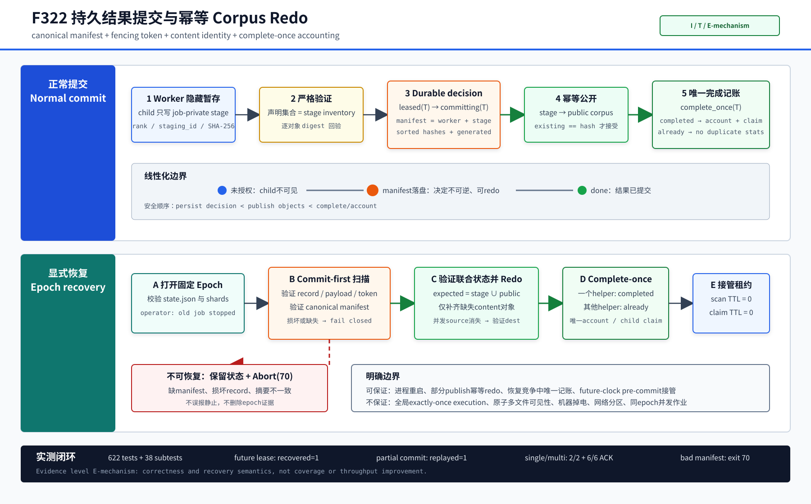

# F322：持久结果 Manifest、幂等 Corpus Redo 与显式 Epoch 恢复

- 日期：2026-08-07
- 功能编号：F322
- 成熟度：I/T/E-mechanism
- 代码范围：standalone MPI concolic前端、共享fenced lease table及其测试
- 证据范围：静态门禁、622项完整Python回归、真实Open MPI单/双master及故障恢复

## 1. 研究问题

F321已经把worker输出先写入隐藏stage，并规定master只有在父任务进入不可逆`committing`状态后
才能把child提升到公开corpus。这解决了“失信worker结果提前扩张frontier”的问题，但深度审查
仍发现一个关键崩溃窗口：

```text
begin_commit(parent, token)
        |
        | process exits here
        v
promote(child_1, ..., child_n)
complete(parent)
account / schedule children
```

F321故意禁止按TTL偷取`committing`记录，因为旧holder可能已经发布部分child；但record中又没有
保存“应该发布哪些child、它们位于哪个stage、应该记多少generated”的redo信息。结果是安全性和
活性二选一：偷取会产生双提交风险，不偷取则任务永久停在`committing`。

第二个问题出现在显式重启。普通lease默认120秒，旧进程退出后新进程若仍等待TTL，会让明确的
人工恢复无谓停顿；跨节点时钟漂移还可能让旧`updated`看起来位于未来。单纯把扫描TTL设为0也
不够，如果随后的`claim()`仍使用默认TTL，扫描和接管之间会自相矛盾。

F322的目标是建立一个受界、可验证的redo协议：

1. 在任何公开child之前持久记录canonical commit decision；
2. 允许任意恢复master幂等补齐部分公开的content-addressed对象；
3. 让唯一状态转换胜者执行本次恢复竞争中的结果记账；
4. 显式epoch恢复时立即重新fencing所有pre-commit lease；
5. 缺少redo信息或日志损坏时保留状态并fail closed；
6. 不把这一机制夸大为全局exactly-once、完整ARIES或机器掉电恢复。

## 2. 学术定位

F322采用的是WAL/redo思想，不是数据库事务系统的直接移植。
[ARIES](https://research.ibm.com/publications/aries-a-transaction-recovery-method-supporting-fine-granularity-locking-and-partial-rollbacks-using-write-ahead-logging)
的核心启发是：先持久化足以重放的决策，再允许外部状态发生变化；恢复时根据日志redo已决定但
未完成的动作。F322把“页面更新”替换为“content-addressed corpus对象发布”，把事务ID替换为
`(epoch, work_hash, fencing_token)`。

[ExoFlow（OSDI 2023）](https://www.usenix.org/system/files/osdi23-zhuang.pdf)等持久数据流工作强调
通过可重放状态与确定性数据身份恢复长链路执行。F322借鉴这一方向，但只覆盖SymCC standalone
前端的一次父结果发布，不实现通用workflow lineage、分布式快照或透明函数级恢复。

本项目中具有研究价值的组合不是“发明WAL”，而是把以下原本分离的机制联结成一个DSE frontier
提交协议：

- SHA-256内容身份：相同child天然幂等；
- worker隐藏stage：未授权结果不可被其他master发现；
- current-token fencing：stale执行不能提交当前父任务；
- canonical result manifest：崩溃后仍知道完整child集合与原stage位置；
- `complete_once()`：并发恢复helper中只有状态转换胜者记账；
- quiescence-frontier刷新：静止投票前先处理所有durable commit decision。

## 3. 协议不变量

| 编号 | 不变量 | 代码约束 |
| --- | --- | --- |
| R1 | 公开child之前必须存在父任务的durable commit decision | `begin_commit(..., commit=manifest)`先于`_promote_staged_outputs()` |
| R2 | `committing`不可通过lease TTL被偷取 | `claim()`只允许接管`leased`，拒绝`committing` |
| R3 | manifest与父record、payload和token共同绑定 | record路径给出权威hash；payload hash必须一致；完成需同token |
| R4 | manifest必须canonical | schema、worker rank、32位stage ID、排序去重hash、非负generated严格重建后逐字段相等 |
| R5 | redo接受且只接受`stage ∪ public`中的完整声明集合 | staged对象不得多、少、重名或摘要错误；公开对象也逐一回验SHA-256 |
| R6 | publication可重复执行 | 已存在公开对象只有摘要相等才接受；并发rename丢失source时重新验证destination |
| R7 | 一次恢复竞争只有一个记账者 | `complete_once()`区分`completed / already / stale`，仅`completed`调用account |
| R8 | 显式epoch只强制接管pre-commit lease | 启动时先redo commit，再以TTL 0扫描并以同一TTL 0 claim |
| R9 | 日志损坏不能被当成“没有工作” | 原子record路径仍存在但无效、或committing缺manifest时抛完整性错误并Abort(70) |
| R10 | 静止不能越过未处理commit | 每次PREPARE边界先执行`recover_committing_work()`，错误后停止其他frontier修改 |

## 4. 执行流程



### 4.1 正常结果提交

1. master持有父任务`leased(token=T)`，worker只读取`shared_dir/<parent_hash>`；
2. worker执行目标，把每个child写入
   `.standalone-work-<epoch>/staging/<global_rank>/<staging_id>/<child_hash>`；
3. worker发送父hash、stage ID、child hash集合和`num_generated`，不发送文件内容；
4. master验证RESULT属于当前worker assignment和当前lease token；
5. master要求stage inventory与声明集合严格相等，并逐文件重算SHA-256；
6. master构造`result-commit-v1` manifest，其中hash排序去重，stage/rank和generated固定；
7. `FencedWorkLeaseTable.begin_commit()`以临时文件、file fsync和atomic replace持久化manifest，
   record由`leased`进入不可偷取的`committing`；
8. master按hash顺序把stage对象移动到公开corpus，已存在同摘要对象视为幂等成功；
9. `complete_once(parent,T)`把record改为`done`；只有返回`completed`的master累计generated、
   analysis observation并为child申请新lease；
10. 删除该result的stage目录。最终全体MPI rank成功final barrier后，rank 0清理整个epoch目录。

### 4.2 重启恢复

rank 0选择epoch并广播给所有rank。未设置`SYMCC_STANDALONE_WORK_EPOCH`时生成新的256-bit随机
epoch；设置时必须是64位小写hex，表示operator确认旧MPI作业已经终止并要求打开该状态。

每个epoch根目录包含不可变的`state.json`：

```json
{"epoch":"<64 lowercase hex>","schema":"symcc-standalone-work-state-v1","shard_count":64}
```

重复打开必须逐字段一致，特别是shard数不匹配时拒绝恢复，防止同一record被映射到不同目录。
显式恢复的启动顺序为：

1. 扫描所有`committing`记录并校验record、payload、token和manifest；
2. 对每个manifest验证`stage ∪ public`；
3. 幂等补齐公开对象并执行`complete_once()`；
4. 唯一`completed`胜者恢复本次结果的generated/analysis记账并claim children；
5. 对所有剩余`leased`记录执行一次`lease_ttl=0`扫描；
6. 二次claim也显式使用`lease_ttl=0`，即使旧时间戳在未来也生成新fencing token；
7. 验证被接管任务的corpus摘要后入队；
8. 最后才导入本次外部输入，避免zero-TTL sweep误接管刚创建的新lease。

### 4.3 并发恢复

多个master可能同时看到同一`committing`记录。每个helper都可以验证并尝试redo：

- helper A移动对象后，helper B发现source消失，只在destination摘要精确匹配时继续；
- 两者都可能调用`complete_once()`，但只有一个得到`completed`，另一个得到`already`；
- `already`不重复累计generated、不增加analysis observation，也不重复claim child；
- token改变或record不一致返回`stale`并升级为控制错误。

因此F322提供“同一活跃恢复竞争中的exact-once accounting”，不是exactly-once execution。父任务在
`begin_commit`之前崩溃会在新token下重新执行，这是为了活性而允许的at-least-once execution；
fencing保证旧执行不能提交新owner状态。

## 5. 崩溃点分析

| 崩溃点 | 持久状态 | 恢复行为 | 允许的副作用 |
| --- | --- | --- | --- |
| worker stage过程中 | 父仍`leased`；stage不完整 | lease接管后重新执行；不完整stage不可公开 | 重复执行一次 |
| stage验证后、begin commit前 | 父仍`leased`；完整stage存在 | 新owner重新执行；旧RESULT因token stale不能提交 | 旧stage最终随epoch清理 |
| begin commit后、首个publish前 | manifest完整；父`committing` | 验证全部stage并redo所有child | 无重复公开对象 |
| 部分child已publish | manifest完整；对象分布在stage/public | 验证集合并补齐缺失对象 | 逐对象可见，不是原子批次可见 |
| 全部publish后、complete前 | public完整；父`committing` | publication成为no-op；完成并唯一记账 | 无重复对象或记账 |
| complete后、stage cleanup前 | 父`done`；可能有残留stage | 不重放done；成功campaign或后续epoch清理残留 | 跨重启历史统计不回建 |

## 6. 实现改动

### 6.1 共享状态层

[`util/distributed_state.py`](../../../util/distributed_state.py)中的`FencedWorkLeaseTable`新增或收紧：

- `begin_commit(..., commit=...)`把manifest与不可逆状态转换一次原子持久化；
- 对同token重复`begin_commit`只接受完全相同manifest；
- `complete_once()`显式返回`completed / already / stale`；
- `snapshot_records()`在筛选redo decision前结构化审计全epoch记录，standalone层再校验所有payload；
- `recover_committing_records()`按更新时间和work ID稳定枚举redo decision；
- 枚举时对现存但无效的record、缺失manifest的committing record fail closed；
- `claim()`和`recover_expired_records()`共享可选TTL覆盖，并拒绝NaN/Infinity/负值；
- TTL为0表示明确的无条件pre-commit接管，即使`now - updated < 0`也生效。

### 6.2 Standalone MPI前端

[`util/mpi_concolic_execution.py`](../../../util/mpi_concolic_execution.py)新增：

- `_standalone_commit_manifest()`和严格canonical反序列化；
- `_verify_replayable_outputs()`验证stage/public联合状态；
- `_promote_staged_outputs()`的并发helper幂等路径；
- `_ensure_work_state_metadata()`固定epoch和shard布局；
- `_select_work_epoch()`及`SYMCC_STANDALONE_WORK_EPOCH`广播；
- 单master也统一启用durable coordinator，不再只有多master持久化；
- `recover_committing_work()`、`replayed_commits`诊断和唯一完成记账；
- 配置恢复启动时的commit-first、zero-TTL takeover、input-last次序；
- 周期扫描和PREPARE刷新均为commit-first；一旦日志审计失败，同轮其余frontier修改短路。

### 6.3 测试

[`test/test_distributed_state.py`](../../../test/test_distributed_state.py)覆盖：

- manifest持久枚举与不同manifest拒绝；
- completion的唯一状态转换分类；
- 未来时间戳下TTL 0扫描与TTL 0重新claim；
- 旧token完成失败；
- 缺manifest和损坏record的fail-closed恢复。

[`test/test_mpi_lifecycle.py`](../../../test/test_mpi_lifecycle.py)覆盖：

- 部分child已publish时的联合验证与重复promotion；
- canonical manifest、非法额外字段、epoch格式和layout匹配；
- 两coordinator并发恢复同一commit时的completed/already分类；
- future-clock lease只有显式TTL 0才能接管；
- payload hash重定向拒绝。

## 7. 验证结果

原始数据与哈希清单位于
[`F322 evidence`](../evidence/f322-durable-result-replay-2026-08-07/)。

### 7.1 自动化门禁

| 门禁 | 结果 |
| --- | --- |
| `py_compile` | 通过 |
| Ruff | 通过 |
| 定向distributed-state + MPI lifecycle | 111 passed + 10 subtests，5.45秒 |
| 完整`pytest -q test` | 622 passed + 38 subtests，84.16秒 |

### 7.2 真实Open MPI

| 场景 | 关键观测 |
| --- | --- |
| 单master健康提交 | exit 0；2 seeds + 1去重child；3 observations；2/2 ACK；state=0 |
| 双master健康提交 | exit 0；12 seeds + 1去重child；13 observations；master 0/1=8/5；6/6 ACK；state=0 |
| future-clock租约恢复 | 120秒TTL下立即恢复；`recovered=1`；1 observation；2/2 ACK；state=0 |
| 双master部分commit redo | child A已公开、B仍stage；`replayed_commits=1`；2 generated；3 observations；0/1=2/1；6/6 ACK；state=0 |
| 缺失manifest | exit 70；明确完整性错误；0 observation；2/2 ACK；state=1保留 |

future-clock运行从启动到完成包含1.001秒idle窗口，没有等待配置的120秒lease TTL；这直接验证了
启动恢复的扫描与claim使用同一个zero-TTL语义。部分commit运行最终三个公开文件名与父/两个child
内容摘要逐一匹配，证明不是只更新record而遗漏实际corpus对象。

## 8. 已知边界

1. **不是完整ARIES。** 没有page LSN、analysis/undo phase、compensation log record、steal/no-force
   buffer管理或数据库checkpoint。当前原子record写包含file fsync和rename，但没有建立机器掉电级
   目录fsync/存储屏障证明；结论限于共享文件系统可用时的进程失败恢复。
2. **不是原子多文件事务。** durable manifest先授权整个集合，但child逐个进入公开corpus；其他master
   可能在父record完成前看到已授权的部分集合。content identity保证安全，不保证批次同时可见。
3. **不是全局exactly-once execution。** pre-commit失败可重跑父任务；仅commit completion winner的
   当次记账是唯一的。
4. **历史统计不完全恢复。** 若旧进程已把record改为done但在汇总前崩溃，新进程不会重建旧进程内
   generated/analysis计数；最终corpus内容仍是权威事实。
5. **只覆盖standalone corpus提交。** AFL helper的通用triage commit未接入该manifest schema，不能
   用F322证据替代AFL路径的恢复证明。
6. **显式epoch是operator contract。** 只能在确认旧作业终止后重用；两个活跃MPI作业同时使用同一
   epoch没有membership/consensus保护，属于不支持配置。
7. **共享文件系统是前提。** staging、record和public corpus必须位于支持所需原子rename/硬链接语义
   的同一可见存储；F322没有处理网络分区、脑裂或ULFM communicator修复。
8. **没有性能收益声明。** 当前实验是E-mechanism，证明恢复和去重语义；未做等CPU、多轮crash-rate、
   coverage、solver throughput或恢复开销置信区间。

## 9. 后续研究

按风险和科研价值排序：

1. 增加可注入的每个commit crash point，执行真实SIGKILL/节点重启矩阵，并以最终corpus和record状态
   做线性化历史检查；
2. 为record rename、stage create和跨目录promotion补齐可移植的directory fsync策略，开展真实
   power-cut/filesystem campaign；
3. 增加epoch ownership/membership记录，检测并拒绝同epoch并发作业，同时设计失主接管协议；
4. 把generated、analysis和重要调度统计纳入独立可重放journal，区分corpus exactness与metric
   exactness；
5. 将manifest协议推广到AFL native triage，同时保持AFL queue/crashes/hangs各自的发布契约；
6. 用分层索引、增量目录游标或LSM式状态压缩替代全shard扫描，测量10^5--10^7 corpus规模下的
   recovery latency与steady-state元数据开销；
7. 在LAVA-M和真实FuzzBench/OSS-Fuzz目标上做密封的有/无F322故障注入对照，报告恢复时间、重复
   solver work、最终edge集合和资源开销，而不是只报告健康路径吞吐。

## 10. 结论

F322把F321的“commit后不可偷取”从安全但可能永久停滞的终点，推进为可重放的持久提交协议。
父结果在公开任何child前记录完整canonical manifest；任意恢复master可验证部分发布状态并幂等
redo；`complete_once()`把并发helper竞争收敛到唯一记账者；显式epoch又能在时钟漂移下立即接管
所有pre-commit工作。真实MPI实验同时证明了正常执行、future-clock lease接管、部分publish恢复和
损坏日志保留四条路径。其创新性在于为并行DSE的content-addressed frontier建立了可执行的
WAL-inspired协议，其挑战在于跨越worker stage、共享corpus、fencing record、统计和全局静止边界，
而不把局部保证误写成数据库级exactly-once。
