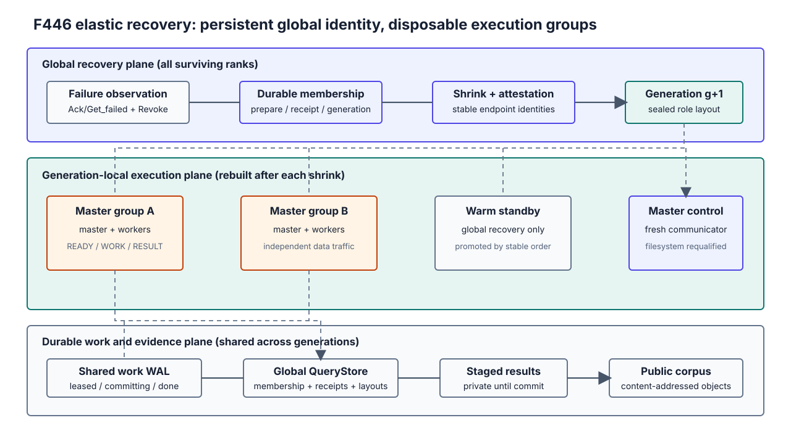

# F446：弹性 Multi-master ULFM、Warm Spare 与连续失效恢复

**日期**：2026-08-25  
**状态**：同机与受控双节点真实物理失效门禁通过；8/32/128-worker 确认性实验进行中  
**前置**：F322 共享工作 WAL、F327 共享文件系统资格、F441/F443 generation-fenced ULFM  
**默认行为**：关闭；必须显式设置 `SYMCC_ULFM_HOT_PATH=1`

## 1. 研究问题

F443 已经能够在单 master 拓扑中删除一个失败进程并缩容继续，但仍有三个影响长期运行的缺口：

1. worker 数超过单 master 有效供给能力后，多个 master 的 communicator 无法统一修复；
2. `Shrink` 只删除失败进程，连续失效会不断降低并行度；
3. 每一代只保留内存统计，最终一代可能覆盖前几代已经完成的工作量。

F446 将 communicator 生命周期、稳定进程身份和持久工作状态分离。全局 communicator 只负责
成员恢复；master/worker group 是可丢弃、可重建的代次视图；共享 WAL 与 QueryStore 跨代保留。
因此原始 root、任意 worker 或非 root master 退出后，存活进程都从同一持久事实重建调度拓扑。



## 2. 核心设计

### 2.1 两层 communicator

| 层 | 成员 | 生命周期 | 承担的消息 |
| --- | --- | --- | --- |
| global recovery communicator | 所有 active 与 standby survivor | `Shrink` 后替换 | 失效探测、成员证明、代次切换、standby 停止 |
| generation group communicator | 一名 master 与它的 workers | 每代重新 `Split` | `READY/WORK/RESULT/STOP/ACK` 数据面 |
| generation master communicator | 本代全部 masters | 每代重新 `Split` | 文件系统资格和 master 控制面 |

旧 group 不会带入新一代。修复后先交换 `stable_rank`，再按当前 transport 顺序计算角色，并创建新的
group/master communicator。这样既避免在已撤销 communicator 上等待，也避免把 shrink 后变化的
transport rank 当作永久身份。

### 2.2 全局稳定身份与持久 membership

启动时的 rank 是 stable endpoint identity，transport rank 仅表示它在当前 communicator 的位置。
`global-membership/index.sqlite3` 记录唯一 controller、连续 `state_ordinal`、generation、成员、shard、
pending plan 和 recovery receipt。恢复顺序为：

```text
observe failure -> Revoke/Shrink -> stable-rank survivor discovery
                -> prepare(g) -> fresh-context attestation/Agree
                -> commit receipt(g+1) -> recompute roles -> resume WAL
```

`prepare` 冻结全部在途 lease。多个 survivor 同时进入恢复时只允许复用完全相同的 pending plan；同一
ordinal 上的不同摘要被视为状态分叉并失败关闭。receipt 提交后，旧 generation/shard/lease token
立即失效。

### 2.3 预启动 warm spare

`SYMCC_ULFM_WARM_SPARES=N` 把初始高 rank 进程保留为 standby。active budget 在启动时固定；一次
`Shrink` 后按 surviving stable identity 的确定顺序选取前 `active_budget` 个进程，其余仍为 standby。
因此最低 stable rank 的备用进程自动晋升，不需要故障后调用 `MPI_Comm_spawn`。

采用预启动而不是动态 spawn 的原因是：Open MPI 5 的 ULFM 文档明确把容错能力限定在 communicator
操作，spawn/connect 故障检测并不具备同等保证；预启动进程从 generation 0 起就在全局成员证明内，
也能继承同一共享 WAL 和恢复策略摘要。代价是备用 CPU/内存会在无故障期间闲置。

每一代生成内容寻址的 `generation-<g>-layout.json`，封存 active budget、active/standby stable
identities、master transport/stable identity 和 worker 列表。相同 generation 若出现不同内容会被拒绝。

### 2.4 连续故障与跨代统计

测试门禁支持 `SYMCC_ULFM_TEST_FAILURE_SCHEDULE=0:2,1:3`，含义是 generation 0 杀死 stable rank 2，
generation 1 再杀死 stable rank 3。该接口严格限制唯一的非负 generation/rank，最多 64 项，只能用于
测试。

最终统计不再累加最后一个 Python loop 的局部计数，而是扫描共享 WAL 的 `done` records，重新验证
`symcc-standalone-result-commit-v1` manifest，得到跨 generation 的 `analyzed/generated/by_master`。
公共 corpus 仍独立按 SHA-256 文件名和内容复核。这样“执行量”和“保留的唯一对象”保持不同口径，
重复候选不会造成大于 100% 的接纳率。

## 3. 完整执行次序

1. 所有 rank 在 `COMM_SELF` 上实际执行 ULFM 能力探测，并 allgather policy SHA；不一致则
   `Abort(74)`，不降级到普通 MPI。
2. rank 0 解析 admission budget、warm-spare 数和 work epoch，并广播唯一配置结果。
3. rank 0 初始化全局 membership；所有 rank 交换 stable endpoint 与 host inventory。
4. 当前 transport 顺序的前 `active_budget` 个进程进入 active 集，剩余进程进入 standby。
5. active 集计算 master/worker groups，写入 sealed generation layout，再创建本代 group/master comm。
6. master 重新资格验证共享文件系统；随后恢复 WAL，先重做 `committing`，再回收 `leased`。
7. worker 发送 `READY`；master 先持久化 WAL/ULFM lease，再发送带 generation/shard/lease fence 的工作。
8. worker 只把结果写入私有 staging，并回显完整 fence；master 交叉验证 transport owner、work identity
   和 fence。
9. master 写 WAL commit manifest，完成 ULFM lease，发布内容寻址对象，最后把 WAL 置为 `done`。
10. 任一进程失效时，数据面 MPI 错误、failure sentinel 或本地 failed-group 观察触发全局
    `Revoke/Shrink`。`Shrink` 后 survivor 交换 stable identity，并以集合差形成共同 missing set；本地
    `Get_failed` 不作为持久成员真相。步骤 4-9 在 generation `g+1` 重新执行，总 wall deadline 不重置。
11. active 工作正常结束后，root 向仍未晋升的 standby 发送精确 generation stop；所有进程进入有界
    shutdown/finalize，完成 epoch 只退休一次。

## 4. 故障守恒边界

| 失效位置 | 可观察状态 | 新一代行为 |
| --- | --- | --- |
| group dispatch 前 | WAL 可领取，无活动 fence | 正常重新领取 |
| lease 持久化后、发送前 | WAL/QueryStore 有活动 lease | recovery plan 保守重排 |
| worker 执行或回传中 | staging 可能存在 | 旧 fence 拒绝，父任务重放 |
| WAL committing 后 | manifest 已决定结果集合 | 幂等重做发布，再置 done |
| master/root 失效 | global membership 仍包含 stable identity | shrink 后 transport rank 0 接管 root 职责 |
| warm spare 晋升中再失效 | 每代 layout 和 receipt 均已封存 | 下一次 shrink 从剩余 stable identity 重算 |

系统保证的是 work identity、lease、发布和成员代次守恒，不保证 exactly-once 计算。故障窗口中的任务
允许重复执行，但同一内容只形成一个公共对象；这比尝试证明远端计算是否已经发生更稳健。

## 5. 同机物理失效实验

固定环境为 Open MPI 5.0.10 ULFM，`pml=ob1`、`btl=tcp,self`。每个场景都真实调用 `os._exit(86)`，
launcher 的 86 仅在独立 oracle 全部通过后才作为预期退出。oracle 检查 receipt/layout/WAL/public
corpus/final log 的交叉一致性；`SHA256SUMS.txt` 共包含 3,770 个文件，完整复算零错误。

| 场景 | 初始 rank | 故障序列 | 最终 generation | 晋升序列 | WAL analyzed | WAL generated | 公共对象 |
| --- | ---: | --- | ---: | --- | ---: | ---: | ---: |
| multi-worker failure | 8 | `rank-2` | 1 | 无 | 63 | 315 | 317 |
| original-root failure | 8 | `rank-0` | 1 | 无 | 65 | 325 | 327 |
| warm-spare promotion | 10（8 active + 2 spare） | `rank-2` | 1 | `rank-8` | 64 | 320 | 321 |
| continuous failure | 10（8 active + 2 spare） | `rank-2 -> rank-3` | 2 | `rank-8 -> rank-9` | 51 | 255 | 257 |

**结论**：四种本机物理失效均完成同一 epoch，global recovery count 与故障数严格相等，最终
recovery queue 和 active work 均为零。连续场景经过两次 communicator replacement 后仍维持 8 个
active endpoint，证明备用进程确实进入生产调度，而不只是被启动。

这些 6 秒 simulation 场景用于协议正确性，不声明覆盖率、solver speedup 或 MTTR。性能结论由单独
的 R 级实验给出，不能从本表推导。

## 6. 多节点资格结果

双节点环境由 Ubuntu 24.04 本地计算节点和 Ubuntu 26.04 远端节点组成。第一轮使用各发行版 external
hwloc/libevent 的构建在 topology 解包阶段失败，证明“版本号相同”不足以保证 wire 兼容。最终门禁固定
同一 Open MPI 5.0.10 portable build，并在 10 ranks（8 active + 2 spare）上连续终止 stable rank 2、3。

survivor 完成两次 communicator replacement，依次晋升 rank 8、9，最终 generation 2 保持 8 active、
2 masters、6 workers 和两个 surviving hosts。WAL 复核 164 次分析/820 个候选，公共 corpus 有 820 个
SHA-256 命名对象；2,491 个证据文件全量摘要通过。该结果使用 SSH/NAT shim、SMB 与测试 flock broker，
证明的是受控双节点恢复机制，不等价于原生生产网络或分布式文件系统资格。完整修订和证据边界见 F447。

## 7. 与相关工作的关系

| 工作 | 可借鉴思想 | F446 的使用边界 |
| --- | --- | --- |
| Open MPI ULFM 5 | revoke、shrink、agree、failed group | 作为 transport recovery primitive，不替代持久 work protocol |
| Shrink or Substitute | shrink 与进程替代的策略权衡 | 当前采用预启动 substitute，未声称实现动态 spawn |
| PartRePer-MPI | 部分复制降低恢复成本 | F446 复制控制状态和待处理工作身份，不复制目标进程内存 |
| FTHP-MPI | 分层恢复与持续运行 | 当前层次是 global membership / group data plane / durable work plane |

F446 的创新点不在重新发明 ULFM，而在把它与已有的 generation-fenced lease、WAL commit manifest、
共享文件系统资格和内容寻址 corpus 组合成一个可审计的混合符号执行恢复协议。

## 8. 复验与证据

```bash
bash benchmark/install_openmpi_ulfm_5_0_10.sh
F446_OUTPUT_DIR=/tmp/f446 benchmark/run_f446_elastic_ulfm_tests.sh
```

- 实现：`util/mpi_concolic_execution.py`
- 协议底座：`util/mpi_ulfm_recovery.py`、`util/query_store.py`
- 单元测试：`test/test_mpi_lifecycle.py`、`test/test_mpi_ulfm_recovery.py`
- 独立 oracle：`benchmark/check_f446_elastic_ulfm_oracles.py`
- 一键物理失效门禁：`benchmark/run_f446_elastic_ulfm_tests.sh`
- 当前同机证据：`.symcc-research-evidence/f446-elastic-ulfm-20260825-current-r1/`

参考资料：

- [Open MPI 5 ULFM documentation](https://docs.open-mpi.org/en/v5.0.x/features/ulfm.html)
- [MPIX_Comm_shrink](https://docs.open-mpi.org/en/v5.0.x/man-openmpi/man3/MPIX_Comm_shrink.3.html)
- [Shrink or Substitute: Handling Process Failures in HPC Systems](https://arxiv.org/abs/1801.04523)
- [PartRePer-MPI](https://arxiv.org/abs/2310.16370)
- [FTHP-MPI](https://arxiv.org/abs/2504.09989)

## 9. 结论边界

已证明：multi-master/original-root communicator 修复、确定性 regroup、两级 warm-spare 晋升、连续两次
物理失效恢复、跨代持久统计，以及受控双节点完整 oracle。F447 进一步将恢复真相改为 shrink-first 稳定
身份集合差，并闭合分代 store、并发 replay 与跨用户文件模式。尚未证明：原生生产网络/分布式文件系统
资格、真实目标 MTTR 分布、warm spare 成本收益、8/32/128-worker 覆盖扩展性。不得用机制测试替代性能
结论。
