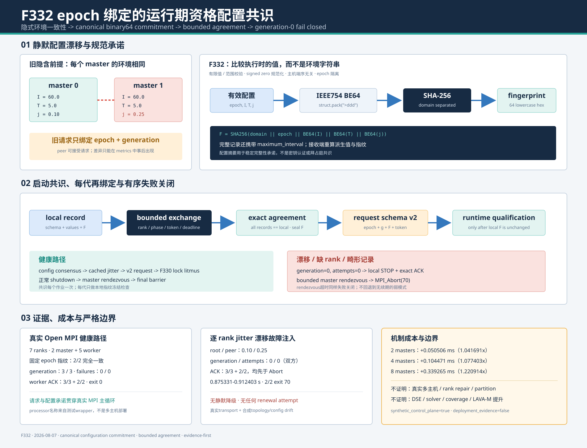

# F332：epoch绑定的运行期资格配置共识

> 功能编号：`F332`
> 日期：`2026-08-07`
> 状态：已实现、已测试、已有真实MPI健康/漂移故障注入证据；尚无真实多主机与rank修复证据
> 前置能力：F329跨主机锁资格、F330运行期续期、F331确定性有界抖动

## 1. 研究问题与结论

F331证明同一`epoch/generation/interval/jitter`能够生成一致计划，但“同一配置”此前只是隐含前提。
`mpirun`通常传播环境变量，却不能作为应用层协议证明：不同节点的启动脚本、容器环境、rank wrapper或
运维覆盖可能让master读取不同的`interval`、`jitter`或有效probe timeout。旧请求只绑定epoch与
generation，因此peer即使持有不同配置也会接受root请求；metrics可能事后显示差异，却不能阻止静默
分歧。

F332把配置从本地参数提升为协议状态：

1. 将epoch、有效interval、有效timeout和jitter规范编码为固定binary64字节；
2. 计算域分离SHA-256配置指纹；
3. 所有qualified master在generation 0通过有界point-to-point exchange比较完整记录；
4. 任一缺失、畸形或不一致都在第一次续期前失败关闭；
5. 请求升级为v2，每代token再次绑定配置指纹；
6. 发请求前重算本地指纹，运行中字段突变也被拒绝；
7. 配置失败时先完成各master本地worker ACK，再经有界master rendezvous调用`MPI_Abort(70)`。

真实Open MPI 7-rank实验中，健康配置形成一致指纹并完成双方3代；只对peer master注入
`jitter 0.1 -> 0.25`后，双方generation/attempts均保持0。固定epoch的两次独立复跑分别在
0.912403/0.875331秒内完成全部本地worker ACK并退出70，健康配置的指纹2/2完全相同。该证据证明
接线、typestate门与失败关闭，不代表真实远端文件系统部署。



## 2. 技术依据与设计选择

### 2.1 MPI collective不是自动的故障共识

MPI-4.1要求同一communicator内的collective由所有成员按相同顺序调用；错误顺序可能死锁。非阻塞
collective同样要求所有成员最终调用匹配操作，而且没有普通tag用于协议隔离：

- [MPI-4.1 Collective Correctness](https://www.mpi-forum.org/docs/mpi-4.1/mpi41-report/node172.htm)
- [MPI-4.1 Nonblocking Collective Operations](https://www.mpi-forum.org/docs/mpi-4.1/mpi41-report/node145.htm)

因此F332没有直接增加一个无期限`allgather()`。它复用F329/F330的有界root-gather/result-broadcast：
每条消息有独立phase、token、comm rank与严格schema；root和peer都在同一monotonic deadline内轮询，
缺rank或send completion失败可返回错误。

ULFM提出`revoke/agree/shrink`等进程故障恢复原语，可构造更强的一致collective；但当前证据环境是
Open MPI 4.1.6 / MPI 3.1接口，项目也尚未实现communicator repair：

- [ULFM Specification](https://fault-tolerance.org/ulfm/ulfm-specification/)

F332的边界因此是“在当前master communicator仍可通信时检测配置漂移并失败关闭”，不是容忍失效rank
后继续执行。

### 2.2 为什么比较完整记录而不只比较字符串

环境字符串不是协议值：`0.1`、`1e-1`表达同一float，locale与格式化精度也可能制造假差异。F332在
controller完成范围与有限性校验后，对Python实际使用的binary64值编码：

```text
I = normalized effective interval
T = normalized effective qualification timeout
j = normalized jitter fraction, -0.0 -> +0.0

F = SHA256(
      "symcc-cluster-lock-renewal-config-v1\0"
      || epoch_bytes
      || IEEE754_BE64(I)
      || IEEE754_BE64(T)
      || IEEE754_BE64(j)
    )
```

大端`struct.pack(">ddd", ...)`消除主机端序差异。NaN、Inf、负interval、非正timeout和越界jitter在
指纹前拒绝；`-0.0`被规范为`+0.0`，避免语义相同但bit pattern不同。完整exchange记录同时携带
`interval/timeout/jitter/maximum_interval/fingerprint`，接收端会重算派生maximum和指纹。因此只篡改
字段或只篡改摘要都不能形成“看似一致”的有效记录。

### 2.3 为什么epoch必须进入指纹

相同数值配置在两个作业中不应共享可重放的配置身份。把work epoch纳入指纹具有三点作用：

1. 配置证据与F320之后的job-private durable state同生命周期；
2. 恢复指定epoch时得到稳定身份，新作业默认随机epoch则自动隔离；
3. 配置记录不能被另一个并发MPI作业误当成本作业证据。

## 3. 双层一致性协议

### 3.1 generation 0启动共识

每个qualified master构造：

```text
{
  schema: symcc-cluster-lock-renewal-config-v1,
  epoch, interval, timeout, jitter_fraction,
  maximum_interval,
  fingerprint
}
```

exchange token只绑定epoch与独立域`config-exchange-v1`，不能绑定本地配置，否则配置不同的master会在
传输层互相视为畸形消息，失去明确的drift诊断。root收齐记录后把有序rank记录返回所有peer；每个master
独立执行相同验证：

1. 记录集合和所有字段类型必须精确；
2. 每个记录的范围、maximum与SHA-256必须可复算；
3. fingerprint集合基数必须为1；
4. 每条完整记录必须等于本地规范记录。

失败消息仅公开`rank:12-hex-prefix`用于定位，不把原始环境或路径拼入控制消息。

### 3.2 每代请求二次绑定

启动共识防止初始漂移，但controller是可变Python对象，未来代码可能在运行中误改字段。F332将请求升级：

```text
R_g = SHA256(
        "symcc-cluster-lock-renewal-v2\0"
        || epoch_bytes
        || uint64_be(g)
        || configuration_fingerprint_bytes
      )

request = {
  schema: symcc-cluster-lock-renewal-v2,
  epoch, generation, configuration, token: R_g
}
```

root在`begin_request()`前重算当前配置指纹；peer在`accept_request()`前也重算，并要求请求配置指纹等于
本地冻结指纹。于是以下情况都不能进入资格litmus：

- root字段在共识后改变；
- peer字段在共识后改变；
- 旧v1请求或缺字段请求；
- 其他epoch/configuration的重放；
- token与配置指纹不匹配。

generation的严格`n+1`防重放仍保留，F332没有降低F330/F331的原有校验。

后续API审查又发现：仅把共识函数接到生产入口仍允许其他调用者直接调用`begin_request()`，从类型状态
上绕过generation-0协议。现在controller默认处于“未封印”状态；只有
`qualify_cluster_lock_renewal_configuration()`完整成功并记录精确本地指纹后，`due()`才可能为true，
root begin、peer accept与complete才允许推进。兼容开关是keyword-only且默认true，生产入口没有关闭；
`False`只在隔离的pre-F332协议单测/机制基准中显式使用，避免把历史基准伪装成当前生产路径。

## 4. 执行次序

### 4.1 健康路径

1. 所有rank获得root广播的work epoch；
2. master-only communicator完成F329跨processor锁资格；
3. 每个master计算相同有效`I,T,j`和配置指纹；
4. F332有界exchange收集、返回并验证完整配置记录；
5. 每个controller记录精确共识指纹，root输出一次完整值；
6. 进入主循环，F331只由root读取缓存计划；
7. 未封印controller保持not-due；封印后到期请求携配置指纹和generation-bound token；
8. peer验证本地配置未变、指纹相同且generation精确；
9. 重演F330锁语义litmus并更新相邻计划缓存；
10. 正常quiescence、worker ACK、master rendezvous与final barrier。

### 4.2 漂移路径

1. 任一master记录与其他rank不同；
2. 所有可通信master从同一个有序record set得到相同mismatch摘要；
3. `fatal_control_error`在任何runtime renewal前设置；
4. `generation=attempts=0`，不发送v2代次请求；
5. 每个master对自己的worker组执行bounded STOP + exact ACK；
6. master-only bounded barrier确认peer也完成本地关闭；
7. 任一失败master执行`MPI_Abort(70)`。

第6步来自本轮真实故障实验。首版F332能够正确检测漂移，但root在`3/3` ACK后可能立即Abort，截断peer的
`2/2` ACK。修复后，两个master都先完成本组关闭，再进入abort路径；若master rendezvous本身超时，仍
标记lifecycle failure并失败关闭，而不是无限等待。

## 5. 实现映射

| 模块 | 实现 |
|---|---|
| [`util/mpi_filesystem_qualification.py`](../../../util/mpi_filesystem_qualification.py) | binary64指纹、config-v1记录、默认共识typestate门、请求v2、发送/结果提交双重字段突变检查、有界共识 |
| [`util/mpi_concolic_execution.py`](../../../util/mpi_concolic_execution.py) | master-loop共识接线、错误传播、shutdown后master rendezvous |
| [`test/test_mpi_filesystem_qualification.py`](../../../test/test_mpi_filesystem_qualification.py) | 一致、漂移、绑定、突变、畸形与超时测试 |
| [`docs/Configuration.txt`](../../../docs/Configuration.txt) | 配置共识、失败语义与ULFM边界 |
| [`F332 evidence`](../evidence/f332-renewal-configuration-consensus-2026-08-07/README.md) | 驱动、JSON、日志、成本、回归和SHA-256清单 |

配置项数量仍为410；F332没有增加新的用户旋钮，而是把现有三个有效值变成可验证协议状态。

## 6. 不变量与测试

### 6.1 核心不变量

1. **规范值一致**：等价的`-0.0/+0.0`不产生假漂移；
2. **精确编码**：指纹输入为固定大端binary64，不依赖文本；
3. **epoch隔离**：配置身份不能跨作业复用；
4. **完整记录**：摘要、原字段和派生maximum三者必须互相一致；
5. **全体精确一致**：任何一个master不同都不允许启动renewal；
6. **有界等待**：缺rank、malformed、send/receive failure不会进入无界collective；
7. **代次再绑定**：每个请求token包含配置指纹；
8. **显式typestate**：未封印controller不得due、begin、accept或complete；
9. **运行时冻结**：共识后字段突变在请求前和结果提交前均拒绝；
10. **零副作用失败**：漂移不能推进generation、attempts、successes或下一计划缓存；
11. **有序关闭**：本地worker ACK先于master rendezvous和Abort。

### 6.2 自动化结果

| 范围 | 结果 |
|---|---:|
| F329-F332定向测试 | 24 passed + 8 subtests，1.34 s |
| MPI/distributed/hybrid相关回归 | 303 passed + 29 subtests，17.81 s |
| 完整warnings-as-errors Python回归 | 699 passed + 49 subtests，101.91 s |
| Ruff、AST、whitespace | 通过 |

新增7个test methods和3个参数漂移subtests，分别覆盖健康共识、signed zero、interval/timeout/jitter
漂移、v2请求绑定、默认typestate门、未资格peer、位置参数兼容、发送前突变、in-flight结果提交前突变
的原子拒绝、派生maximum畸形和缺失peer超时。

## 7. 实验结果

### 7.1 真实MPI健康与漂移

| 指标 | 健康 | 注入peer jitter漂移 |
|---|---:|---:|
| MPI ranks | 7 | 7 |
| master / worker | 2 / 5 | 2 / 5 |
| jitter | 0.1 / 0.1 | 0.1 / 0.25 |
| 共识 | 成功，64-hex指纹 | 拒绝，双方相同差异摘要 |
| generation | 3 / 3 | 0 / 0 |
| attempts | 3 / 3 | 0 / 0 |
| worker ACK | 3/3 + 2/2 | 3/3 + 2/2，均在Abort前 |
| 退出码 | 0 | 70 |
| 固定epoch复跑 | 指纹2/2相同 | 拒绝结果2/2相同 |
| 漂移作业墙钟 | - | 0.912403 / 0.875331 s |

实验显式封印epoch为`f332`重复16次，因此两次健康指纹均为
`776bc9da6db7e0bc761c601280a75eee31c1bc3ee392aa759e2b9b4288ac9a94`。这只证明相同epoch与配置产生
可复现身份；生产作业仍使用各自epoch，不能把该实验指纹当作跨作业常量。

### 7.2 共识验证成本

2次warm-up后，对2/4/8 master执行20次交错、交替顺序样本：

| masters | 裸exchange中位 | F332中位 | 增量 | 比率 |
|---:|---:|---:|---:|---:|
| 2 | 1.211421 ms | 1.261927 ms | +0.050506 ms | 1.041691x |
| 4 | 1.349709 ms | 1.454180 ms | +0.104471 ms | 1.077403x |
| 8 | 1.535734 ms | 1.874998 ms | +0.339265 ms | 1.220914x |

所有120个timed exchange均完成且记录一致。该合成基准包含线程启动，不能解释为真实MPI scaling；它只
说明完整schema/range/派生值/SHA复算在既有exchange之上没有引入秒级启动成本。共识每个作业只执行
一次，不在DSE热路径。

## 8. 先进性、创新性与挑战

### 8.1 先进性

F332把分布式系统中的configuration commitment、domain-separated digest和bounded agreement组合到
并行符号执行的运行期存储资格协议。它不依赖“环境通常相同”的弱假设，也没有用阻塞collective掩盖
缺rank故障；相同配置身份继续贯穿每代请求。

### 8.2 项目创新点

1. **配置与资格证据同epoch**：调度参数、锁语义资格和durable work state共享明确生命周期；
2. **值语义规范化**：比较执行时binary64而不是配置文本；
3. **启动共识 + typestate + 每代承诺**：API无法静默绕过初始共识，同时覆盖运行中突变；
4. **封印实验身份**：固定epoch让指纹和漂移摘要可跨独立复跑比较；
5. **证据驱动关闭修复**：真实MPI故障注入不仅验证检测，还发现并修复跨master ACK次序；
6. **不扩大权限**：一致只表示允许继续验证锁语义，不把配置摘要当作共享存储正确性的替代证明。

### 8.3 工程挑战

- exchange token不能包含本地fingerprint，否则漂移会退化为难诊断的传输token错误；
- float文本规范化不足，而直接bit compare又必须处理signed zero；
- timeout属于要比较的配置，不能同时作为唯一的共识deadline来源，否则漂移本身会制造不对称等待；
- fail-closed不能只看exit code，还必须验证generation 0、attempts 0和所有本地worker ACK；
- 生产默认必须强制typestate，同时让pre-F332隔离基准以显式keyword-only开关保持可复现；
- `MPI_Abort`的进程输出时序不保证，必须在应用层增加master rendezvous后才能声称ACK先完成。

## 9. 局限与有效性威胁

1. processor名称和配置漂移由同机wrapper注入，不是真实两节点部署；
2. 未验证NFS、Lustre、CephFS或远端lock manager；
3. 未杀死MPI rank，当前协议检测缺失/超时后退出，不执行ULFM shrink/repair；
4. 5秒配置exchange deadline是固定内部安全界，不是新的可调性能参数；
5. 合成线程成本受Python调度影响，不可外推网络成本；
6. 没有测量solver、DSE throughput、coverage或LAVA-M；
7. SHA-256用于完整性与稳定身份，不构成密钥认证或拜占庭共识。

## 10. 后续研究

1. 在至少两台真实client和共享存储上验证一致/漂移/缺rank路径；
2. 评估MPI Sessions或ULFM可用时的`agree/revoke/shrink`适配层；
3. 将配置fingerprint纳入结构化job manifest，使离线实验能按配置身份聚合；
4. 对多节点启动时延执行更大master数与网络扰动实验；
5. 继续审查其他master本地环境参数是否也需要同类commitment，而不是无选择地扩大记录。

## 11. 证据索引

- 机制图：[`renewal-configuration-consensus-2026-08-07.svg`](../diagrams/renewal-configuration-consensus-2026-08-07.svg)
- 证据说明：[`README.md`](../evidence/f332-renewal-configuration-consensus-2026-08-07/README.md)
- 真实MPI JSON：[`configuration-consensus-mpi.json`](../evidence/f332-renewal-configuration-consensus-2026-08-07/configuration-consensus-mpi.json)
- 真实MPI复跑JSON：[`configuration-consensus-repeat.json`](../evidence/f332-renewal-configuration-consensus-2026-08-07/configuration-consensus-repeat.json)
- 成本JSON：[`configuration-consensus-cost.json`](../evidence/f332-renewal-configuration-consensus-2026-08-07/configuration-consensus-cost.json)
- 校验记录：[`checks.txt`](../evidence/f332-renewal-configuration-consensus-2026-08-07/checks.txt)
- 完整性清单：[`SHA256SUMS.txt`](../evidence/f332-renewal-configuration-consensus-2026-08-07/SHA256SUMS.txt)

## 12. 结论

F332消除了运行期资格协议中的隐式“所有master配置相同”假设。规范binary64配置记录在generation 0
达成有界精确一致，controller以默认typestate门阻止绕过，每代请求再绑定同一指纹，运行中突变也无法
静默通过。固定epoch双复跑证明身份可重现；真实MPI故障注入证明漂移在
任何续期尝试前被双方拒绝，并推动关闭路径升级为“本地worker ACK -> master rendezvous -> Abort”。
当前可严谨声称的是配置一致性与失败关闭机制成立；真实多节点可用性和DSE性能提升仍待独立实验。
