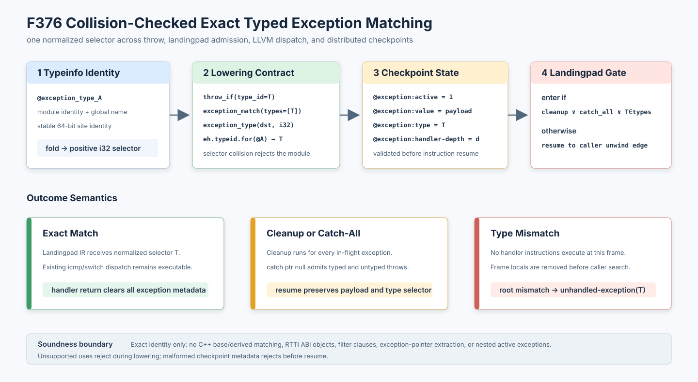

# F376：碰撞检测的精确类型异常匹配与可恢复 selector

- 日期：2026-08-12
- LLVM lowering：`compiler/ContinuationLowering.cpp`
- 执行器：`util/live_continuation.py`
- 产物审计：`util/check_live_continuation_lowering.py`
- 测试：`test/live_continuation_lowering.ll`、`test/test_live_typed_exception_semantics.py`
- 能力：`bounded-typed-exception-matching`
- 成熟度：I/T/E-mechanism；精确 typeinfo identity 子集，不等价于完整 C++ RTTI 匹配

## 1. 从 F375 到 F376

F375 闭合了 cleanup-only 异常的暂停、迁移、恢复和逐帧展开，但所有异常都只有 payload，没有类型；
因此特定 catch clause 不能决定当前 frame 是否有权接管异常，`llvm.eh.typeid.for` 与 landingpad 的 i32
selector 也无法执行。F376 在不引入平台 ABI exception object 的前提下实现“精确 typeinfo identity”
子集，并保证 throw、landingpad 准入、LLVM handler dispatch 和 checkpoint 使用同一个 selector。

LLVM LangRef 将 `resume` 定义为恢复被 landingpad 中断的 in-flight exception，并规定 landingpad 的
catch/filter clause 按顺序应用；cleanup flag 表示该 block 是 cleanup。实现以这些控制流语义为依据，
但主动缩小类型关系：只做同一规范 typeinfo 的精确相等，不推测 C++ 继承、adjusted pointer 或 personality
ABI 行为。参考：[LLVM Language Reference: landingpad](https://llvm.org/docs/LangRef.html#landingpad-instruction)、
[resume](https://llvm.org/docs/LangRef.html#resume-instruction)。



## 2. 统一 selector 的生成

受控异常源使用精确声明：

```llvm
declare void @__symcc_continuation_throw_typed_if(i1, i64, ptr)
```

第三个参数必须经 pointer-cast stripping 后解析为 module 内可稳定命名的 `GlobalValue`。lowering 对
`stableModuleIdentity + global name` 的稳定 64 位 site identity 做高低 32 位折叠，再限制为正 i32；
同一 module 中若两个不同全局折叠到同一 selector，整个 lowering 失败关闭，不能让碰撞变成错误 catch。
该 selector 是 continuation artifact 内部的规范标识，不声称等于本机 personality runtime 返回值。

同一映射用于三个位置：

1. typed summary invoke 降为带 `type_id` 的 `throw_if`；
2. landingpad 的非空 catch typeinfo 降为 `exception_match.types[]`；
3. `llvm.eh.typeid.for(@typeinfo)` 降为同一 i32 常量。

因此原 LLVM 的 `extractvalue ..., 1`、`icmp`、`switch` handler dispatch 可以继续在 continuation IR 中
执行，不需要伪造平台 exception object。summary 的名称、声明/调用返回类型、非 varargs、三参数类型
和 payload 位宽都必须精确匹配；同名 varargs 或错误类型按普通外部 may-unwind 调用拒绝。

## 3. Landingpad 前置准入

每个受支持 landingpad 首先产生：

```text
exception_match(types=[...], cleanup=bool, catch_all=bool)
```

执行顺序不可交换：

1. 读取 checkpoint 中的 active、payload、type 和 handler depth；
2. 若 `cleanup`、`catch_all` 或当前 type 属于 clauses，则推进到 landingpad 后续指令；
3. 若不匹配，当前 frame 的任何 handler 指令都不能执行；执行器清除该 frame 局部状态并继续查找其
   caller invoke 的 unwind edge；
4. 展开到根仍不匹配时产生带 `type_id` 的 `unhandled-exception`；
5. `exception_type(dst, 32)` 只在活动异常内读取 selector，供原 LLVM 比较/分派；
6. handler 正常返回时，仍由 F375 的 handler-depth 门精确清除 active、payload、type 和 depth；
7. `resume` 保留 payload/type，继续向上展开。

catch-all 用 LLVM `catch ptr null` 表示，可接管 typed 或 legacy untyped throw。cleanup 无论类型都进入，
与 LangRef 的 cleanup flag 语义相符。filter clause 当前明确拒绝。landingpad aggregate 只允许直接
`resume` 或 `extractvalue index 1`；exception pointer（index 0）及其 ABI 生命周期尚未建模，不能使用。

## 4. Checkpoint 语义完整性

类型被保存为 `@exception:type` 的 32 位常量 expression digest，与其他 continuation 状态一同进入
CAS。恢复入口新增组合不变量验证，区别“内容摘要正确”和“执行状态语义正确”：

- 没有 active 时，value/type/handler-depth 任一存在均是 orphan metadata；
- active 必须是 i1 常量 1，并同时存在 1–64 bit payload 与 handler depth；
- handler depth 必须是 i64 常量且小于当前 frame 数；
- type 若存在，必须是非零 i32 常量；
- 任一条件失败都在读取下一条 instruction 前拒绝。

该验证覆盖手工构造 checkpoint、旧工具写入不完整状态以及内部故障产生的组合错误；CAS 摘要本身无法
替代这些跨字段不变量。

## 5. 多轮 review 修复

1. **匹配前执行 handler 的风险**：仅暴露 selector 会让不匹配异常先进入 handler block。新增
   `exception_match` 作为 landingpad 第一条 continuation op，错配直接继续展开。
2. **type ID 碰撞**：从 64 位 identity 折叠为 i32 可能碰撞。新增 module 内反向表，不同全局同 ID
   立即拒绝。
3. **capability 单向声明**：typed throw、typed/catch-all match、selector op 均要求
   `bounded-typed-exception-matching`；capability 无对应契约也拒绝。
4. **检查器过强耦合**：cleanup 检查器曾错误要求 exception op 与 unwind call 同时存在。现基础能力
   接受任一有效契约，完整 typed 测试再用精确开关要求 typed throw、typed match 和 selector 全部存在。
5. **checkpoint 只做摘要验证**：新增 active/value/type/depth 组合验证及三个伪造 checkpoint 反例。
6. **summary 同名误识别**：独立 varargs 反例证明同名但不同函数类型不会获得受信语义。

## 6. 测试证据

定向 Python 回归覆盖：精确匹配返回规范 selector、错配传播到根、catch-all、matched landingpad
checkpoint、handler 返回清理、capability 缺失/空声明、空 clause、重复/零/溢出 type ID，以及 orphan、
越界 depth、零 selector checkpoint。LLVM 集成覆盖 exact typed summary、`eh.typeid.for`、selector
extract/compare/branch、typed mismatch、legacy catch-all、cleanup/resume 和 filter 拒绝。

2026-08-12 最终定向门禁：

| 门禁 | 结果 |
| --- | --- |
| `py_compile` | 通过 |
| `ruff`，实现、检查器与异常测试 | 通过，0 diagnostics |
| 异常 + executor + store 定向 pytest | 75 passed + 19 subtests，0 failed，14.78 s |
| `cmake --build build -j2` | 通过，`libsymcc.so` 成功重链 |
| 两个 exception/lowering lit 门禁 | 2 passed，0 failed，178.82 s |
| SVG XML 解析与 PNG 实际渲染检查 | 通过 |

本项验证的是语义机制与失败关闭，不是性能实验。新增 catch 能扩大 continuation lowering 的可接受程序
集合，但对覆盖率、状态数、checkpoint 大小和执行开销的影响仍需独立 benchmark；在取得多重复数据前不
报告性能提升。

## 7. 明确限制与下一步

- 当前只做 typeinfo 全局的精确相等；`catch(Base)` 接管 `Derived` 等 C++ 层级关系尚未实现；
- 不生成或消费 ABI exception pointer，不支持 `__cxa_begin_catch`、`__cxa_end_catch` 和对象析构；
- 不支持 filter、Windows funclet EH、同时活动的嵌套异常；
- selector 对 module identity 敏感，但 program root 与 checkpoint 绑定保证单一 artifact 内一致；
- landingpad clause 的 ordered dispatch 仍由原 LLVM `icmp/switch` IR 执行，前置 gate 只判断“至少一个
  clause 可接管”或 cleanup/catch-all。

下一阶段应先建模 exception object/token 与 catch lifecycle，再实现受证明的 inheritance relation；
随后用 clang 生成的真实 C++ exact-type/catch-all/cleanup 样例做 native-vs-continuation 差分，而不是
直接放宽到无法验证的完整 personality ABI。
