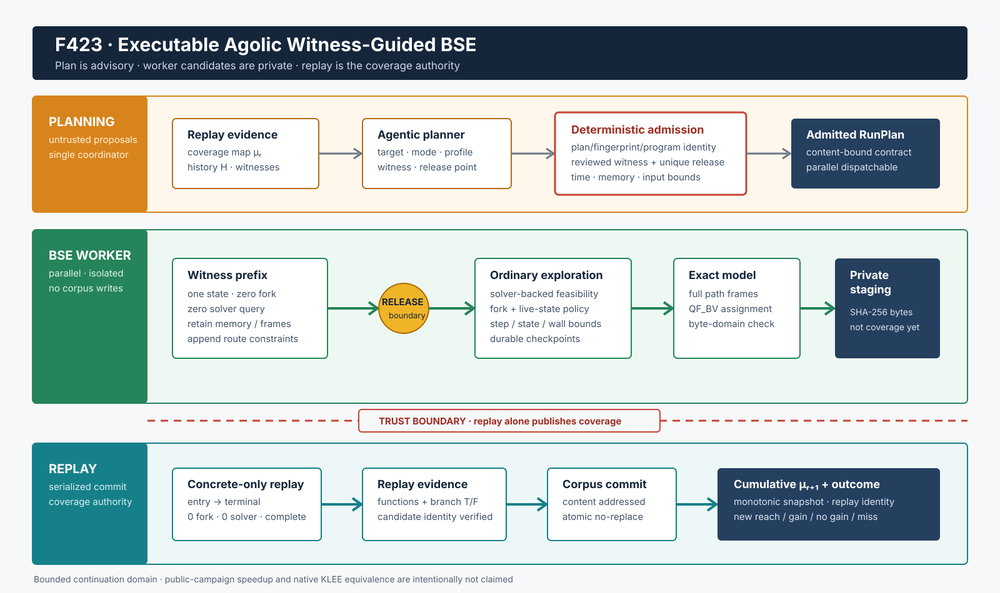

# F423：可执行 Agolic Witness-Guided BSE Runner

- 日期：2026-08-17
- 功能编号：F423
- 实现入口：`util/agolic_bse_runner.py`、`util/live_continuation.py`
- 测试入口：`test/test_agolic_bse_runner.py`
- 独立有限 oracle：`benchmark/check_agolic_bse_runner_oracles.py`
- 成熟度：I/T/E-mechanism；尚不是公开目标 R 级确认性实验
- 研究来源：[Agolic: Agentic Planning for Symbolic Execution](https://arxiv.org/abs/2608.06397)，arXiv v1，2026-07-31

## 1. 本增量关闭的真实缺口

F374 已实现跨 BSE 运行的 target planning、deterministic admission、历史持久化、并行 worker
调度和串行 replay 账本，但它的 `execute_run`、`replay_run` 仍是回调协议。尤其是
`witness-guided` 只存在于 plan schema 中，并没有底层执行语义。因此 F374 不能声称已经复现
Agolic 的 Witness-Guided BSE。

Agolic 原文对该模式给出了三个关键要求：

1. release 前，从 harness 开始沿 witness 建立**单一执行状态**；输入相关分支、地址等受支持操作由
   witness 取值，不为每个选择调用 solver，也不 fork；
2. 到达 release function 后，保留已经形成的内存、调用栈和 route constraints，恢复普通
   solver-backed symbolic exploration；
3. release 前失败不能生成测试；release 后产生的 assignment 仍必须从原 harness concrete replay，
   replay 而不是 worker 自报决定 coverage delta。

F423 首次把这三项接到本项目真实 continuation executor 和 F374 planner/controller 回调界面。它不是
“返回一个看似成功的 JSON”：runner 实际执行 continuation、调用 QF_BV solver 求 terminal checkpoint
模型、写 plan-private candidate、再用 concrete-only executor 从入口重放，最后才发布 content-addressed
corpus artifact。



## 2. 严格执行次序

### 2.1 规划与准入

1. `AgolicRunLevelPlanner` 根据 replay coverage、历史 target outcome 和 reviewed witness 生成
   `symcc-agolic-run-plan-v1`。
2. runner 重新计算 `fingerprint = SHA256(canonical specification)` 与
   `plan_id = SHA256(round, fingerprint)`，防止回调边界上的 plan 被替换。
3. target function 和 target branch 必须在 continuation 中存在；branch site 必须唯一。
4. witness 必须属于 target 的 reviewed witness 集合；文件通过 `O_NOFOLLOW`、regular-file、大小、
   读前/读后 identity 和 SHA-256 校验。
5. witness 必须恰有一个 release boundary：已知 function，或唯一的 `branch/throw_if` site。
6. 非空 `SYMCC_*` profile environment 只允许在独立 CLI worker 中生效；线程内 runner 拒绝它，避免
   多个并行 plan 通过进程全局环境互相污染。

### 2.2 Worker：witness prefix 到普通符号执行

1. worker 用 witness bytes 创建 symbolic-input continuation checkpoint；每个 input expression 同时保留
   witness concrete value。
2. state 写入四个持久标记：`concrete-prefix`、`released`、mode 和 release-config digest。后续从 frontier
   checkpoint 恢复时，mode/config 必须完全相同，否则失败关闭。
3. release 前遇到 symbolic `branch`、`throw_if` 或 indirect call 时，只选择 expression 的 witness
   concrete outcome，并把相应 route assertion 追加到 solver frame；不调用 solver，不创建 sibling。
4. symbolic `assume`、initializedness/domain 检查同样按 witness concrete value裁决：false 立即终止，
   true 记录约束。`_feasible()` 若在 pre-release 状态被调用会直接报错，因此“零 solver”是强制不变量，
   不是仅靠 telemetry 自报。
5. 进入 release function，或执行指定 release decision 前，原子地把 prefix 标记从 1 改为 0 并设置
   released=1。此后沿用原 executor 的 feasibility pruning、fork、CBC/CGS/path-cover 和 checkpoint。
6. step、state 和 monotonic wall deadline 任一耗尽都会保留 frontier 并把 run 标为 bounded/timeout。
   CLI 在独立进程中额外设置 `RLIMIT_AS`，solver 子进程继承该上界。
7. witness 模式只有在 `release_reached=true` 后才允许 terminal checkpoint 进入 materialization；未到
   release 即使正常 return，也产生零 candidate。

### 2.3 精确求模与私有 staging

对每个 `returned`、`halted` 或 `unhandled-exception` checkpoint，runner 恢复完整 solver-frame 链，
将 continuation expression 降为 QF_BV，并调用现有 `symcc-query-solver --generic` 获取 numeric input-byte
model。solver 未赋值的字节保留 checkpoint concrete value，赋值 offset 必须落在连续 input domain 内。

candidate 以 `SHA256(bytes)` 命名，先写入：

```text
workspace/runs/<plan-id>/candidates/<artifact-sha256>
```

该目录属于 worker 私有 staging。worker 无权写累计 corpus，也不能把自己的 branch telemetry 作为
planner coverage。候选发布使用 exclusive temporary、完整 write、file `fsync`、hard-link no-replace 和
directory `fsync`；同 digest 的既有内容不一致时失败关闭。

### 2.4 Coordinator：串行 replay 与 coverage 入账

1. `AgolicRoundController` 可以并行调用 `execute_plan`，但按完成顺序串行调用 `replay_result`。
2. coordinator 对 result schema、plan/program identity、release evidence、resource evidence、candidate
   digest/size/path 再做一次严格校验。
3. 每个 candidate 从 harness 入口以 `concrete_replay=true` 重跑。所有 symbolic choice 均按 candidate
   concrete value单状态推进；必须满足 0 fork、0 feasibility query、0 pre-release fork、非 bounded，且
   到达一个真实 terminal status。
4. 只有通过 replay 的 bytes 才以 SHA-256 发布到 `workspace/corpus/`。发布后重新 replay 当前有限 corpus，
   合并 entered functions 与真实执行的 `(branch site, outcome)`。
5. coverage element 使用 `branch:<stable-site>:T/F`；`replay_identity` 对 elements、branches、functions、
   artifact identities 的规范快照计算 SHA-256。
6. runner 生成与 F374 `record_outcome()` 兼容的累计 outcome。planner 再验证单调 corpus、target element
   子集、generated artifact 子集，并分类为 `new-reach`、`increased-target-coverage`、
   `reached-no-gain` 或 `not-reached`。

这个顺序保证两个并行 worker 即使生成同一个输入，也只有 coordinator 在确定的 prior corpus 上决定
谁贡献了 coverage delta。

## 3. 关键不变量与故障边界

| 不变量 | 实现保证 |
| --- | --- |
| release 前单状态 | 三类 fork point 显式选择 concrete outcome；防御检查发现 pre-release fork 立即失败 |
| release 前零 solver | `_feasible()` 检查持久 prefix marker并拒绝；assume/domain走 concrete路径 |
| 恢复不改变语义 | checkpoint绑定 mode与release-config digest；不同function/branch/concrete模式不能续跑 |
| 未 release 不产物 | materialization gate同时检查 plan mode 与 `release_reached` |
| candidate 不是 coverage | worker只写 plan-private staging；coverage字段来自后续 concrete replay |
| solver model 不越界 | 只接纳numeric byte symbols、0..255 values和checkpoint连续input offsets |
| result 不可信 | coordinator复核schema、identity、resource、release和candidate元数据 |
| corpus内容寻址 | 文件名等于内容SHA-256；symlink/非regular/变化文件/同名异内容全部拒绝 |
| replay是单状态 | concrete replay强制0 fork、0 solver、完成terminal；否则不发布 |
| 并行归因确定 | worker并行，replay/corpus/planner commit串行 |

## 4. 实现映射

### 4.1 `util/live_continuation.py`

- `_OneShotFeasibilitySolver._query/solve`：在原精确 QF_BV 查询上返回经过类型和范围校验的 input model；
- `_agolic_concrete_prefix`：读取并验证持久 prefix marker；
- `resume(... witness_release_function, witness_release_branch, concrete_replay, max_seconds)`：实现两阶段
  执行、配置绑定、deadline和 branch/function trace；
- `_constrain_defined`、`assume`、`branch`、`throw_if`、`indirect_call`：加入 pre-release concrete语义；
- `materialize_input`：从 terminal checkpoint 完整 path condition 生成一个有界 concrete input；
- telemetry：release reach、pre-release decisions/forks/solver、entered functions、branch outcomes和solver wall time。

### 4.2 `util/agolic_bse_runner.py`

- `preflight`：plan、program、target、witness、release、environment和input surface准入；
- `execute_plan`：真实 bounded execution、terminal materialization和private staging；
- `replay_result`：严格result消费、candidate replay、corpus publication和planner-compatible outcome；
- `replay_coverage`：从有限content-addressed corpus重建权威累计快照；
- CLI `execute/replay/coverage`：独立worker进程与`RLIMIT_AS`资源边界。

## 5. 多轮 review 中发现并修复的问题

1. **恢复时只保存 released bool。** 不同 release function 可误用同一 checkpoint。现增加 mode/config digest，
   恢复必须完全匹配。
2. **deadline 在正常结束后跨越会误报 timeout。** 现仅在 deadline耗尽且仍有 queue/frontier 时报告。
3. **profile environment 曾被静默忽略。** 现仅接纳有界 `SYMCC_*`，非空环境要求独立进程并在 executor
   构造前应用；线程内路径失败关闭。
4. **solver time 曾准备写成固定 0。** 现分别计量 feasibility 与 terminal materialization wall time，
   outcome不再伪造零成本。
5. **release branch 曾允许任意带site的指令。** 现只接受唯一 `branch/throw_if` decision site。
6. **result中的release/resource字段可能互相矛盾。** coordinator现交叉验证executor evidence和runner摘要。
7. **step/state耗尽仍可能被标记complete。** 现所有 bounded execution统一成为timeout status。
8. **state预算溢出的child已进入frontier，但`bounded`只检查queue。** 现任何非空frontier都必须
   报告bounded，避免尚有未执行状态却标记complete。
9. **target site唯一不等于它属于target function或真是decision。** 现同时绑定function owner和
   `branch/throw_if` opcode，非分支site与跨function指向均拒绝。
10. **witness预检后会再次按pathname打开。** 现执行时第二次stable read后必须再次匹配plan
    SHA-256，路径在准入/执行间被替换不会改变实际seed。
11. **candidate checkpoint未与execution terminal集合绑定。** 现要求每个candidate的checkpoint是
    `returned/halted/unhandled-exception`的内容身份，并独立重算status与solver-time包含关系。
12. **controller传入的prior coverage曾被忽略。** 现发布前会对当前corpus做一次权威重放，
    规范化后必须与prior snapshot完全一致，阻止串行commit基线漂移。

## 6. 可执行验证结果

### 6.1 定向与关联测试

| 门禁 | 结果 |
| --- | --- |
| `ruff`，runner/executor/test/oracle | PASS，0 diagnostics |
| `py_compile` | PASS |
| `pytest test/test_agolic_bse_runner.py` | 15 passed，0 skipped，0 failed |
| Agolic/live/persistent/exception/CBC/CGS/F422 关联回归 | 108 passed + 36 subtests |
| 完整 capability-closed Python gate | 1,126 passed + 250 subtests；零skip/xfail/xpass/deselection/身份漂移 |
| LLVM 回归 | F423无C/C++变更，本增量未重跑；紧邻F422证据为LLVM17 302+2 unsupported、LLVM18 303+1 unsupported |
| 独立有限 source oracle | 8/8 configurations，6/6 mutations rejected |

十五项定向测试覆盖：harness-entry从入口普通探索、release前单状态、release后solver-backed fork、精确模型得到`AB`、
concrete replay零fork、release未到达、错误release配置、checkpoint同配置恢复/异配置拒绝、
planner到outcome全链路、candidate path篡改，以及真实CLI地址空间限制与串行replay。
审查增量还覆盖target branch的function/op归属、witness准入后替换、非terminal checkpoint伪造、
result status矛盾、controller prior-coverage漂移，以及`max_states`溢出frontier时必须报告bounded。
完整Python门禁与独立oracle原始产物封存于
[`F423 evidence`](../evidence/f423-executable-agolic-bse-runner-2026-08-17/)；oracle双次字节相同，
SHA-256为`76ac6084f9936b91791483ab25cbf65af89037a82274cfde63e20daa14588eb4`。

### 6.2 有限源级 oracle

oracle 不调用 continuation expression evaluator 来决定预期语义，而用普通 Python 源级条件：

```text
route == 'A'  -> enter release
payload == 'B' -> target true; otherwise target false
```

它枚举 2 个 route 值乘 4 个 payload 值，共 8 个 witness configuration：

- 4 个有效 route 全部到达 release，每个生成 2 个 replay-valid candidate，合计 8 个；
- 每个 released candidate set 都同时覆盖 target false/true；
- 4 个无效 route 全部未到 release并生成零 candidate；
- 8/8 planner classification 与源级模型一致；
- 错误program identity、witness、release evidence、candidate path、resource evidence和mode共6类mutation全部拒绝。

## 7. 准确声明边界

F423 可以声明：在当前有界 continuation IR 支持域内，Agolic plan 已有真实 Witness-Guided BSE consumer；
pre-release state保留内存、frames和route constraints，release后恢复普通fork；terminal path可精确求模，candidate
经concrete-only replay后才进入累计coverage/corpus。

F423 **不能**声明：

- 与论文 native KLEE implementation 的任意 C/C++ 程序、外部系统调用或 native-state逐指令等价；
- 论文在 7 个程序上“平均超过3倍branch”的结果已在本项目复现；
- continuation replay等价于公开 benchmark 的独立 native binary replay；
- witness前缀已完整建模所有外部effect、symbolic address或未支持native operation；
- 当前 8-config oracle构成 coverage、wall-time或bug-yield提升证据。

下一闭环是把 runner 接入公开目标的 native invocation/showmap adapter并做等CPU确认性实验；按总体依赖
顺序，功能开发继续进入 FM 2026 Selective Concolic MDP，而 R 级 Agolic比较与其他策略统一在 W10 完成。
