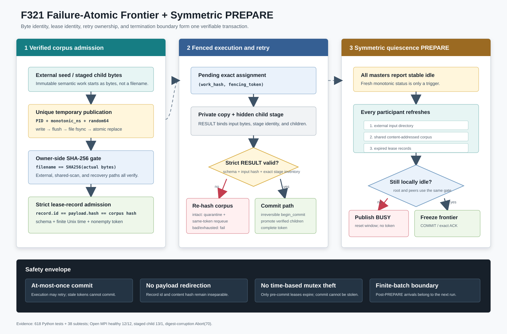

# F321：失败原子 Frontier 准入与对称静止 PREPARE

- 日期：2026-08-07
- 实现范围：`util/mpi_concolic_execution.py`、`util/distributed_state.py`
- 测试范围：`test/test_mpi_lifecycle.py`、`test/test_distributed_state.py`
- 当前证据等级：I/T/E-mechanism

## 1. 研究动机

F320解决了多master重复执行同一content-addressed输入的问题，但对抗式复核发现，拥有唯一
work token并不自动保证完整生命周期正确：

1. root达到stable idle后直接发PREPARE，只有submaster在投票前重扫外部输入、共享corpus和
   过期lease；若边界时刻发布的新输入恰好由root负责，它可能被误留到下一campaign；
2. worker回传畸形结果时，master已经从`active_workers`移除assignment，却继续heartbeat对应
   lease token；任务既不pending也不active，形成无法由普通恢复发现的悬空权利；
3. corpus文件名是SHA-256并不证明文件字节正确。旧实现只由worker复制后校验，错误对象已消耗
   worker且可能重复触发故障；原子写函数还吞掉`rename`错误，使上层可能把未发布对象当成成功；
4. 过期恢复只返回payload，调用者无法证明payload内的hash就是记录文件代表的work id；
5. update-lock按墙钟年龄直接`rmdir`。若旧holder只是暂停而非死亡，它恢复后仍可写旧快照，
   时间阈值不能构成安全的锁fence；
6. worker在master验证RESULT与父任务fence之前就把child直接写入公开corpus，使stale或畸形结果
   也可能提前扩展全局frontier；
7. `committing`仍可按work TTL被另一master偷取，而旧holder可能已经开始发布或triage，形成
   token检查之后的双写窗口。

这些问题共同说明：并行符号执行的正确性边界不是“拥有一个分布式集合”，而是从字节发布、
任务准入、执行失败、提交到全局终止的端到端事务链。



## 2. 设计与实现

### 2.1 可验证的内容发布

`_atomic_write()`现在为每次发布生成包含PID、monotonic序号和64-bit随机量的独占临时文件，
执行完整写入、`flush`、文件`fsync`后再`os.replace`。任何open/write/fsync/replace错误都向上
传播，`finally`只负责清理临时文件，不再吞掉失败。这里使用POSIX
[`rename()`](https://pubs.opengroup.org/onlinepubs/9799919799/functions/rename.html)的原子可见性；
文件fsync保证rename前内容已经提交给文件系统，但本实现没有承诺断电后的目录项持久性。

master在三条准入路径执行分块SHA-256回验：

- 外部seed发布或复用已有corpus对象后；
- rendezvous owner第一次扫描共享corpus时；
- 过期lease准备重新入队时。

worker仍在复制到私有临时目录后再次回验，形成“master准入字节、worker实际执行字节、RESULT
回显摘要”三点闭环。无法读取或摘要不匹配立即设置control failure，不会进入worker队列。
外部目录中暂时不可读的文件名不再提前写入`imported_files`，下一扫描周期仍可重试。

worker生成的child不再直接进入公开corpus，而是写入
`.standalone-work-<epoch>/staging/<global-worker-rank>/<128-bit-result-id>/`。RESULT只携带
`staging_id`和child hashes。master先把group rank映射回权威global rank，再要求目录中的普通
文件集合与RESULT声明的去重hash集合**完全相等**；额外文件、缺失文件、非普通文件、非法名称或
任一内容摘要不一致都会拒绝整个结果并清理该stage。只有父任务通过exact-token commit fence后，
master才用同文件系统`replace`把已验证对象提升到公开corpus。已有同名对象也必须重新回验摘要。
因此stale、无owner或畸形RESULT不能在验证之前扩展其他master可见的frontier。

### 2.2 record id 与恢复payload绑定

`FencedWorkLeaseTable`新增严格record检查：schema、文件对应的`id`、状态、payload、非空token和
有限非负Unix时间戳必须同时成立。已存在但不可解析或字段不一致的记录不会被覆盖，避免把状态
损坏误当成“没有owner”。所有公开时间入口拒绝NaN、Infinity和负数。

新接口`recover_expired_records()`返回`(authoritative_record_id, payload)`；兼容接口
`recover_expired()`仍只返回payload，供旧消费者使用。standalone coordinator要求
`payload.hash == authoritative_record_id`才可reclaim。因此损坏payload只能保守阻塞该记录，
不能把恢复动作重定向到另一个work。该策略牺牲局部可用性换取不重复、不串任务的fail-closed
语义。

### 2.3 不可逆的结果提交 fence

进一步审查发现，原先`committing`仍按work lease TTL过期恢复存在经典fencing缺口。在AFL编排
中，RESULT通过`begin_commit`后已经从active续租集合移除，而批量triage可能执行较久；standalone
也可能在发布大量child时越过TTL。若另一master此时偷取记录，旧holder恢复后仍会继续写coverage、
队列或corpus，token只检查一次并不能约束这些后续写入。

F321最终把`begin_commit`定义为**不可逆提交决定**：

- 只有`leased`记录可按TTL进入`recover_expired_records()`并被重新claim；
- `committing`不再计入expired，也不能由其他owner偷取；
- 同一token可幂等重复`begin_commit`，随后完成为`done`；
- 崩溃在commit前偏向可用性恢复，崩溃在commit后偏向安全性阻塞。

这不是完整事务恢复。要在commit后自动接管，必须先有持久的副作用manifest、逐项重放状态和幂等
验证；仅凭墙钟超时无法判断旧holder已经执行了哪些操作。当前策略明确选择“不可双写”，并把
commit后崩溃恢复留给后续事务日志。

### 2.4 无效结果的exact-assignment保全

收到RESULT后仍先按MPI source弹出唯一active assignment。若payload或`input_hash`不合法：

1. master先清理该worker声明的隐藏stage，再重新计算共享corpus对象摘要；若父对象本身损坏，
   立即control failure；
2. 若corpus完整，隔离产生协议错误的worker；
3. 只有本地仍持有相同lease token时，才把原`(work_hash, token)`插回pending队首；
4. token已经被替换时按stale结果处理，不夺回新owner的任务；
5. 所有worker均被隔离时立即失败，不让不可消费的pending任务无限维持busy状态。

这提供的是**at-most-once commit + fenced retry**，不是exactly-once execution：失败worker可能已经
执行过目标，健康worker还会重新执行，但只有current token的有效结果能够提交。为了保留故障
可观测性，即使其他worker重试成功，本campaign最终仍因`invalid_worker_results > 0`返回失败。

### 2.5 root/submaster 对称 PREPARE

抽出的`_refresh_quiescence_frontier()`按固定顺序执行：

```text
external input rescan -> shared corpus rescan -> expired lease recovery
                     -> recompute local idle
```

submaster沿用该步骤后投YES；root也必须在`should_probe()`成立后执行同一事务。若最后一次刷新发现
work，root不创建probe token，重置stable-idle窗口并立即强制发布BUSY；只有刷新后仍为空，才
生成PREPARE token并冻结后续发现。这把本轮线性化边界从“root上一次周期扫描”推进到“root接受
本地PREPARE之前的最后刷新”。PREPARE之后才发布的外部输入仍按F320定义留给下一campaign。

该设计受经典分布式终止检测问题启发，参见
[Dijkstra--Scholten](https://doi.org/10.1016/0020-0190(80)90021-6)，但它仍是共享目录有限批次协议，
不是对持续变化外部队列的全局快照。

### 2.6 不可偷取的短更新锁

旧实现把`lock_ttl`解释为可以删除锁目录的年龄阈值。时间租约适合限制长期工作权利，但不能证明
持有短互斥区的进程已经停止：暂停holder恢复后仍可能覆盖新holder写入。因此F321取消基于
wall-clock的`rmdir`抢锁；等待使用monotonic deadline，到期报告观测年龄并fail closed。
`FencedWorkLeaseTable`构造器也直接拒绝NaN/Infinity形式的lease TTL、年龄提示与lock acquisition
timeout，避免库调用方绕过环境变量规范化后把“有界”等待重新配置成无限等待。

这与Chubby论文强调的sequencer/fencing思想一致：超时怀疑不能本身撤销旧执行者的写权限，见
[The Chubby lock service](https://research.google/pubs/the-chubby-lock-service-for-loosely-coupled-distributed-systems/)。
`lock_ttl`参数暂时保留作兼容和诊断提示，并进入超时错误文本，不再授予stale-break权限。
MPI job级rank死亡通常仍由runtime终止作业；持久multi-master目录若残留锁，需要显式清理或
后续引入具有进程死亡释放语义
且经共享文件系统验证的锁后端。

## 3. 更新后的执行次序

```text
外部seed bytes
  -> unique temporary file
  -> flush + file fsync + atomic replace
  -> master SHA-256(filename == content)
  -> strict record-id/payload validation
  -> claim exact fencing token
  -> pending -> worker dispatch
  -> worker copy + SHA-256 + RESULT echo
       child bytes -> hidden per-result stage
       valid stage -> exact inventory + per-file SHA-256
                    -> irreversible begin_commit
                    -> promote verified children -> complete
       invalid + corpus intact -> remove stage -> quarantine worker
                               -> same-token requeue
       invalid + corpus corrupt -> bounded control failure
  -> all local queues appear idle
  -> root and peers refresh all three work sources
  -> PREPARE/YES freeze -> COMMIT/exact ACK
  -> acknowledged worker shutdown -> stats ACK -> bounded final barrier
```

## 4. 关键不变量

| 不变量 | 实现约束 | 失败行为 |
| --- | --- | --- |
| corpus身份等于实际字节 | owner、recovery和worker三处SHA-256 | control failure，不派发/不提交 |
| 发布失败不可伪装成功 | 独占临时文件、fsync、replace异常传播 | 临时文件清理，调用方记录失败 |
| 恢复不可重定向 | record filename/id/payload.hash三者相等 | 损坏记录保守跳过 |
| stale/畸形结果不可预发布child | worker隐藏stage；master严格清单与摘要验证 | 清理stage，不扩展公开frontier |
| commit后不可跨TTL双写 | 只有leased可恢复；committing不可偷取 | commit后崩溃保守阻塞 |
| 无效结果不遗失任务 | exact token保持、队首重排、worker隔离 | token stale则不重排；容量耗尽则失败 |
| update lock不可按时间偷取 | 不删除别人的lock目录 | monotonic deadline后失败 |
| root与peer使用同一PREPARE条件 | 三源刷新后重算idle | 新work强制BUSY并重置窗口 |

## 5. 验证结果

### 5.1 自动化

| 门禁 | 结果 |
| --- | --- |
| `py_compile`、Ruff | 通过 |
| lifecycle + distributed-state定向回归 | 107 passed + 10 subtests（5.51秒） |
| 完整`pytest -q test` | 618 passed + 38 subtests（82.66秒） |

新增或强化测试覆盖：exact-token失败重排与容量耗尽、最后时刻work否决PREPARE、原子发布失败
传播与临时文件清理、隐藏stage在父fence前不可见、严格stage inventory和摘要提升、payload hash
重定向拒绝、record identity/NaN/Infinity/record-aware recovery，以及committing跨任意TTL均不可
恢复或偷取；另有库级配置测试拒绝非有限lease/lock时间参数。
原有锁deadline测试升级为把mtime设置到远早于`lock_ttl`，确认超时后目录仍存在而没有被偷取。

### 5.2 真实Open MPI机制实验

环境为Open MPI 4.1.6。健康双master运行使用12个不同seed、2 masters + 6 workers：

- 12 analysis observations、12 corpus files，无丢失或重复；
- master 0 = 6、master 1 = 6；
- 两个worker group均3/3 ACK，global quiescence committed；
- exit 0，结束后`.standalone-work-*`目录数为0。

第二项真实双master运行让12个seed都生成相同child，以直接经过新暂存路径：

- 公开corpus从12个seed增长到13个对象，唯一child严格为1；
- 13 analysis observations、generated 13，master 0/1为7/6；
- 两组均3/3 shutdown ACK，global quiescence committed，exit 0；
- 结束后`.standalone-work-*`目录数为0，证明stage随成功生命周期清理。

单master兼容运行使用2个seed和2个worker，同样生成一个共享child：公开corpus为3、analysis为3、
unique child为1、2/2 shutdown ACK、精确idle为1.000秒，结束后隐藏job-state目录为0。这证明暂存
协议并非依赖multi-master work coordinator才能完成，单master只省略共享lease仲裁。

故障注入预置“合法摘要文件名+错误内容”：期望摘要
`296d2b7c...bad47`，实际摘要`1b5a2d2c...f781f`。master在初始准入阶段报告两者，未产生analysis
observation；随后2/2 worker完成关闭握手，框架显式Abort(70)，外层`--wall-timeout 10`未触发。

原始日志、输入构造、完整摘要及检查结果见
[`F321 evidence`](../evidence/f321-failure-atomic-frontier-2026-08-07/)，目录和顶层均有SHA-256
清单，`verify_delivery.py`会解析关键计数。

## 6. 先进性与创新点

F321的价值不是引入单个新调度启发式，而是把此前分散的安全条件组合成可验证的端到端
frontier transaction：

1. **内容层**：任务身份不再只相信文件名，而由发布者、owner和执行者逐层确认；
2. **持久层**：record身份与恢复payload绑定，损坏状态不能改变被恢复对象；
3. **执行层**：worker失败不丢弃权利，也不跨token重试；
4. **提交层**：将`committing`从普通超时状态提升为不可逆fence，消除triage/发布期间的TTL双写窗；
5. **终止层**：root不再享有比peer更弱的PREPARE前置条件；
6. **互斥层**：明确区分“pre-commit lease可过期接管”和“已提交状态/短临界区不能仅凭时间偷取”。

这种跨层闭环对并行符号执行尤其重要：一次复杂求解可能持续数分钟，路径任务成本高度偏斜，
普通的重复执行、丢任务或提前终止会直接污染coverage/CPU-hour和time-to-target统计。

## 7. 局限与下一步

- 当前故障实验验证corpus准入拒绝、隐藏child暂存提交和健康双master回归，尚未真实注入worker
  畸形RESULT、rank暂停、NFS/Lustre metadata故障或电源丢失；
- 文件`fsync`加原子rename提供进程间完整可见性，未执行父目录fsync，不能宣称掉电后目录项持久；
- 不可偷取的mkdir mutex保证安全，但持久目录中崩溃残留会降低可用性。下一步应在目标共享文件
  系统上对比POSIX/OFD lock、MPI RMA CAS或外部一致性KV，并以故障注入确认自动释放语义；
- `begin_commit`后的跨文件发布不是原子rename：当前token不可再偷取，已提升的对象按内容摘要
  幂等，但master若在多child提升中途崩溃，未提升对象没有自动事务重放，记录也会保守停在
  `committing`。需要append-only result manifest和逐对象完成位才能同时恢复安全性与可用性；
- corpus发现仍为O(N)目录扫描，SHA-256回验增加一次owner侧顺序读取。需要测量metadata、读带宽
  和符号执行成本的相对占比，再决定是否引入带Merkle校验的append-only manifest；
- 尚无等CPU真实SymCC目标的多轮coverage AUC、time-to-target或solver throughput实验。因此本轮
  只授予E-mechanism，不把协议正确性写成覆盖率或速度提升。
