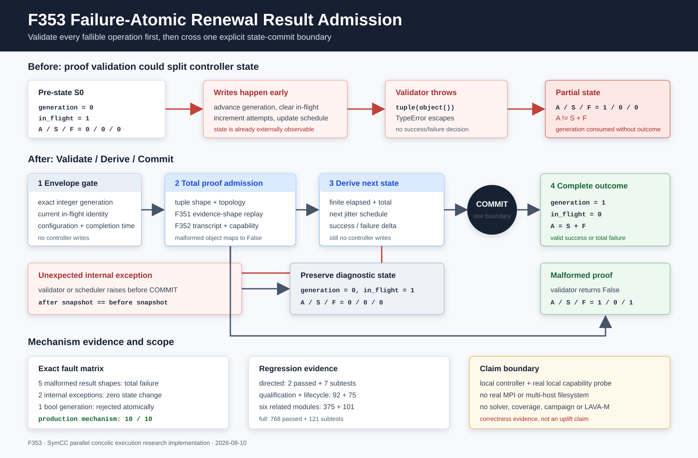

# F353：失败原子的运行期锁续期结果准入

- 功能编号：F353
- 日期：2026-08-10
- 状态：已实现、已进行机制验证
- 范围：MPI运行期共享锁资格续期控制器



## 1. 研究背景与问题

F352把一次跨节点锁资格结果绑定到当前generation、拓扑、capability和规范化证明转录，关闭了旧代重放与
字段拼接问题。继续审查`ClusterLockRenewalController.complete()`时发现，证明内容虽然更严格，但控制器
更新顺序仍不满足失败原子性：旧实现先增加`attempts`、推进`generation`、清除
`in_flight_generation`并更新调度/耗时，再调用结果结构验证器。

这导致一个可执行反例。向冻结dataclass放入不可迭代的`members=object()`后，旧验证器在
`tuple(result.members)`处抛出`TypeError`，而控制器已经从generation 0推进到1。复现快照为：

```text
before: generation=0, in_flight=1, attempts=0, successes=0, failures=0
error:  TypeError: 'object' object is not iterable
after:  generation=1, in_flight=0, attempts=1, successes=0, failures=0
```

`attempts != successes + failures`说明遥测不再守恒；更重要的是，异常路径既不是完整成功，也不是完整失败，
却不可逆地消费了当前generation。生产入口会把异常提升为fatal control error，但退出前输出的状态已经是
半提交状态，削弱诊断、恢复推理和后续形式化验证。

## 2. 技术依据与准确定位

F353采用强异常安全中的commit-or-rollback思想：可能失败的计算必须先完成，随后才越过唯一提交点。
[Abrahams的异常安全模型](https://www.boost.org/doc/libs/1_31_0/more/generic_exception_safety.html)
把strong guarantee描述为成功完成或在异常时保留操作前状态；
[Lamport的状态机规范方法](https://www.microsoft.com/en-us/research/publication/specifying-systems-the-tla-language-and-tools-for-hardware-and-software-engineers/)
强调用状态转换和不变量说明系统安全性。

这里是对这些原则的工程化应用，不是数据库事务、分布式atomic commit或新的共识协议。一次qualification
已经通过F329-F352的MPI协议生成；F353只保证单个master本地消费该结果时不会产生部分控制器状态。

## 3. 语义模型

设提交前控制器状态为：

\[
S_0=(g,\; in\_flight=g+1,\; A,\; S,\; F,\; T,\; J)
\]

其中`A/S/F`分别是attempt/success/failure计数，`T`是累计耗时，`J`是下一代调度状态。F353区分三种
结果：

1. **有效证明**：所有验证与派生计算完成后，原子提交为成功，满足
   `A'=A+1, S'=S+1, F'=F`；
2. **可识别的畸形/失败证明**：准入函数返回False，原子提交为失败，满足
   `A'=A+1, S'=S, F'=F+1`；
3. **验证器、调度器或算术自身抛出异常**：不越过提交点，严格保持`S'=S0`，包括仍保留当前
   in-flight generation。

前两类都满足守恒不变量：

\[
A' = S' + F'
\]

第三类不是一次已完成attempt，所以上式在原快照中继续成立。这个区分很重要：把内部异常简单吞掉并记
failure会掩盖实现错误；让畸形外部结果继续抛异常则会重现半提交缺口。

## 4. 实现方案

### 4.1 总化的结果准入边界

`_qualification_result_matches_request()`现在首先要求`members`和`representatives`是精确tuple，再在受界
异常域内完成拓扑投影、F351 evidence-shape gate、F352 transcript重算以及capability逐字段一致性检查。
畸形tuple元素、错误迭代形态、Unicode编码错误或自定义字段比较异常都归一化为`False`，不会逃逸并切开
控制器状态。

这不是放宽验证：只有全部检查为True才能成为成功；总化只把“验证过程无法解释该对象”稳定映射到拒绝。

### 4.2 精确代次类型

Python中`bool`是`int`的子类，`True == 1`。旧的相等比较可能让布尔值通过generation门。F353改为
`type(generation) is int`和精确值双重检查；类型错误在任何状态写入前抛出generation mismatch。

### 4.3 耗时字段准入

`elapsed`不属于锁语义证明，但会进入累计遥测。F353只接受精确`int/float`且转换后有限、非负的值。
非数值、NaN、Infinity或负值使该证明按失败提交，耗时规范化为0，避免NaN污染全部后续快照。

### 4.4 Validate/Derive/Commit三段式

新执行顺序为：

1. 校验generation、结果对象、配置共识和completion time；
2. 规范化elapsed并完成F351/F352结果准入；
3. 预计算下一代抖动间隔和新的累计耗时，并拒绝浮点溢出；
4. 经过唯一提交点后，再顺序写入attempt、generation、in-flight、schedule、elapsed和success/failure。

提交区只包含普通dataclass字段赋值与整数加一；所有可调用、可迭代、浮点转换、哈希、结构验证和调度计算
都已前移。由此，验证器或调度器异常不会留下部分写入。

## 5. 实现位置

- `util/mpi_filesystem_qualification.py`
  - `_qualification_result_matches_request()`：总化畸形字段；
  - `ClusterLockRenewalController.complete()`：精确代次、耗时准入、预计算和单提交点；
- `test/test_mpi_filesystem_qualification.py`
  - `test_runtime_renewal_totalizes_malformed_completion_fields`；
  - `test_runtime_renewal_completion_is_failure_atomic`；
- `docs/codex/evidence/f353-failure-atomic-renewal-admission-2026-08-10/`
  - 生产控制器机制driver、原始JSON/log、测试输出与SHA-256清单。

该修复不增加环境变量，不改变renewal request/transcript/capability磁盘或MPI schema，成功路径的metrics v2
字段也保持兼容。

## 6. 验证结果

| 验证层次 | 结果 |
|---|---:|
| F353定向 | 2 passed + 7 subtests，31 deselected |
| 资格模块 + MPI生命周期 | 92 passed + 75 subtests |
| 六模块相关回归 | 375 passed + 101 subtests |
| 生产控制器机制集成 | 10/10 checks |
| 完整warnings-as-errors Python | 768 passed + 121 subtests，94.70 s |

机制driver使用真实本地filesystem capability probe和生产capability upgrade/controller，验证：

- 1个有效结果恰好提交一次success；
- 不可迭代members、畸形member tuple、不可迭代representatives、非数值elapsed和NaN elapsed共5类输入均
  无异常返回False，并得到`attempts=1, successes=0, failures=1`；
- validator和scheduler两个注入异常均保留逐字段完全相同的提交前快照；
- `generation=True`在写状态前拒绝；
- 所有已提交结果均满足`attempts == successes + failures`。

JSON和log字节一致，固定epoch为
`e2ef35b243870513cda1ee0b33bdc1e5952ec500b77c776e312601a7eade98c3`，对应F352 transcript为
`ed0411a160ae5807cb7409abdb469b71fa3f07b949d209d5f5d9068edf8962d5`。

## 7. 先进性、创新性与挑战性

1. **从证明完整性推进到消费者状态完整性**：F351/F352证明“结果是什么”，F353进一步证明“消费结果不会
   产生中间态”，补齐端到端准入链的最后一个本地状态边界；
2. **失败类别具有可操作语义**：畸形证明和内部异常采用不同状态转换，既保证attempt守恒，又保留基础设施
   故障的可诊断现场；
3. **无额外I/O和协议轮次**：成功路径只调整计算顺序并增加常数类型/有限性检查，不引入MPI消息、文件系统
   操作或payload复制；
4. **故障注入验证提交点**：测试不只断言返回值，而是逐字段比较异常前后快照，从状态机层面验证零副作用。

本项目的创新在于把强异常安全系统化嵌入generation-fenced、transcript-bound的并行符号执行控制面，而非
声称发明了commit-or-rollback原则。

## 8. 局限与有效性威胁

1. 证据是本地Python控制器和真实本地filesystem capability机制测试，不是实际多机MPI运行；
2. F353不改变F352的unkeyed transcript边界，不提供恶意master或Byzantine认证；
3. 证据只覆盖本地in-memory controller；这不等于跨进程持久恢复，metrics仍未写入durable WAL；
4. Python字段赋值在当前普通dataclass中不会调用用户代码；若未来改成property/setter，提交区需要重新审计；
5. 没有运行target、solver、coverage、fuzzing campaign、漏洞或LAVA-M实验，因此没有性能、覆盖率或漏洞发现
   提升结论；
6. 10/10是机制断言数量，不是10次独立实验样本，也没有统计置信区间。

## 9. 后续研究

1. 将`attempts=successes+failures`、generation单调性和异常零副作用写成小型TLA+/PlusCal模型，系统枚举
   validate/derive/commit故障点；
2. 在真实双主机MPI/NFS或Lustre环境注入进程终止和控制消息延迟，区分本地提交原子性与作业级恢复语义；
3. 审查其余controller的“先改metrics再调用可失败函数”模式，形成共享的transactional state-update helper；
4. 若未来需要跨重启保留renewal metrics，再设计带generation/transcript身份的持久redo记录，而不是把
   当前内存事务直接宣称为durable transaction。

## 10. 结论

F353修复了一个已真实复现的半提交缺陷。续期结果现在先完成类型、结构、证明、调度和算术验证，再越过唯一
提交点；可识别坏结果形成完整failure，内部异常保持原快照。由此，renewal controller同时维持generation
typestate、attempt结果守恒和异常路径可诊断性。当前结论严格限于机制正确性，不外推性能或符号执行效果。
