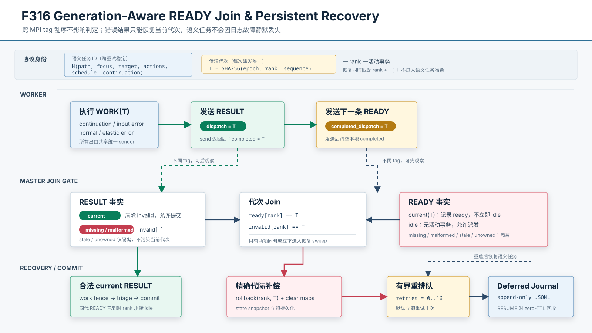

# F316：Generation-Aware READY Join 与持久化协议恢复

- 日期：2026-08-07
- 范围：MPI `TAG_RESULT/TAG_READY` 乱序、派发代次活性、补偿式重试与重启恢复
- 成熟度：I/T；尚无真实多 rank 消息重排、worker kill 或 coordinator restart campaign

## 1. 为什么 F315 仍不完整

F315 已要求每个 `TAG_RESULT` 回显 per-dispatch token，并在 master 消费任何 rank-owned
状态前拒绝 unowned、missing、malformed 和 stale 结果。这个提交门保护了安全性，却没有完全
解决活性：missing/malformed current result 被隔离后，事务、work/state/target lease 和策略
assignment 会一直保持 ACTIVE；worker 实际已经结束并发送下一条 READY，但 F315 的 READY
只携带 rank 和 bitmap/profile version，master 无法证明这条 READY 属于哪个派发代次。

此外，`TAG_RESULT` 与 `TAG_READY` 使用不同 MPI tag。即使 worker 总是先发送 RESULT，再发送
READY，master 的 tag-specific `iprobe` 仍可能先观察 READY。若只按接收顺序处理，就会出现两类
错误选择：过早把 rank 视为空闲并覆盖活动状态，或在合法 RESULT 尚未被排空时误判结果丢失。

F316 的目标不是让畸形结果进入 triage，而是把 F315 的 fail-closed 隔离扩展为一个可恢复、
有界且重启后不丢语义任务的双消息协议。

## 2. 核心协议与不变量



| 编号 | 不变量 |
| --- | --- |
| R1 | worker 每次 RESULT 发送成功后，下一条 READY 必须回显同一个 `completed_dispatch_token` |
| R2 | master 分别记录当前代次的 READY 和 RESULT 观察，不能假设跨 tag 接收顺序 |
| R3 | 只有 current RESULT 可以提交；只有 current READY 与 missing/malformed current RESULT 的 join 可以恢复 |
| R4 | stale RESULT 不能标记当前结果损坏，stale/missing/malformed READY 不能改变 bitmap/profile version 或 idle 状态 |
| R5 | 合法 current RESULT 若后到，必须清除先前的 invalid-result 标记并沿正常提交链完成 |
| R6 | 恢复必须同时匹配 worker rank 与 dispatch token，原子移除事务和全部 rank-owned side table |
| R7 | 回滚使用 F313 的 post-send 补偿语义；任务重试使用不含 transport token 的稳定语义 ID |
| R8 | 内存重试有界；预算耗尽后先持久化，持久化失败则保留内存任务，不能静默丢失 |
| R9 | state-shard 回滚后立即更新 `.state_tasks.json`，避免进程重启恢复已撤销的旧 owner |
| R10 | quarantine、requeue 和 deferred 数量必须进入稳定统计口径，正常运行期望均为零 |

## 3. Worker：把完成代次带到 READY

worker 维护局部变量 `completed_dispatch_token`。初始 READY 携带空值；收到 WORK 后严格校验
master token。continuation、输入物化失败和普通执行三个结果出口仍统一经过 F315 的
`_send_dispatch_result()`。sender 在 `comm.send(TAG_RESULT)` 返回后返回权威 token，worker
把它写入变量，并在下一轮发送：

```text
send RESULT(token=T) -> completed=T -> send READY(completed=T) -> clear local T
```

清空发生在 READY 发送之后，因此一个完成通知只关联一个代次。该 token 不表示 READY 本身受到
认证；它是同一可信 MPI job 内、由 master 原始生成的关联键。

## 4. Master：与接收顺序无关的 generation gate

`_DispatchGenerationGate` 为每个 rank 保存两个独立事实：

- `ready[rank] = T`：已观察到活动代次 T 的 READY；
- `invalid_results[rank] = T`：已观察到活动代次 T 的 missing/malformed RESULT。

master 每轮先排空 READY，再派发，再排空 RESULT，最后才执行 recovery sweep。这个顺序非常
关键：如果 READY 先被观察而合法 RESULT 已在另一个 tag 队列中，RESULT drain 会在 sweep 前
清除 invalid 标记并正常提交；不会因网络/探针顺序产生假恢复。反过来，RESULT 先到也会先记录
invalid，随后 current READY 补全 join。

### 4.1 READY 分类

| 状态 | 活动事务 | `completed_dispatch_token` | 动作 |
| --- | --- | --- | --- |
| `idle` | 无 | 空或合法旧 token | 接纳版本元数据，把 rank 加入 idle |
| `current` | 有 T | T | 记录 generation-ready，但在 RESULT 提交/恢复前不 idle |
| `missing` | 有 T | 缺失/空 | quarantine；不改版本和 idle |
| `malformed` | 任意 | 非 64 位小写 hex 等非法值 | quarantine；不改版本和 idle |
| `stale` | 有 T | 合法但不等于 T | quarantine；不改当前事务 |
| `unowned` | active transaction 与 side table 不一致 | 任意 | quarantine，暴露内部所有权不变量错误 |

READY 中的 `bitmap_version` 转换也改为 fail closed：类型错误、布尔值、负向越界或大于
master 当前代次的“未来版本”均回退为 `-1`，不再让畸形控制消息终止 master，也不会让伪造的
未来版本阻止后续完整 bitmap 同步。

### 4.2 RESULT 与恢复判定

合法 current RESULT 仍走 F315/F313 的 work fence、triage 和事务提交路径；若同代 READY 已先到，
提交后 rank 才进入 idle。missing/malformed RESULT 只记录 invalid，不消费任何状态。stale 结果
只隔离，不写 invalid，因为它不能证明 current generation 已结束。

恢复谓词为：

```text
recover(rank, T) := ready[rank] == T && invalid_results[rank] == T
```

因此单独 READY、单独畸形结果、旧代结果加 current READY、旧代 READY 加 current 畸形结果均
不能触发回滚。该谓词利用当前“一 rank 一活动事务”约束；未来若允许 worker pipeline，gate 和
所有 side table 必须从 rank key 升级为 `(rank, token)` key。

## 5. 代际精确回滚与不丢任务恢复

`_rollback_owned_dispatch()` 在修改任何容器前同时检查 rank、活动事务和 exact token。匹配后：

1. 从 `active_dispatches` 与 `active_work_items` 取出该代任务；
2. 调用事务的 post-send rollback，逆序撤销或丢弃 work/target/state、策略、proposal 等资源；
3. 清除 active worker、strategy、content hash、local/shared lease fence、target lease、state task、
   schedule prefix、agentic task 和 component choice 等 rank-owned map；
4. 立即保存 state coordinator snapshot；
5. 以 path、focus、target、S2F actions、schedule prefix 和 continuation 构造语义恢复 payload。

语义 payload 明确排除 dispatch token，所以相同工作跨代际仍有稳定
`WorkLeaseJournal.work_id()`。`SYMCC_DISPATCH_PROTOCOL_RETRIES` 控制进程内立即重试次数，
默认 1、范围 0--16。预算未耗尽时任务插入当前 `work_idx`，由空闲 worker 重新派发。

预算耗尽后，payload 写入独立 append-only
`.dispatch_protocol_deferred.jsonl`。下一次以 `SYMCC_RESUME=1` 启动时，master 在扫描新 AFL
输入之前用 zero-TTL 回收这些记录并重建完整 work tuple。普通 seed replay 仍要求原路径存在；
带合法 continuation descriptor 的任务是自包含 CAS work，即使 AFL 已移动或删除原 seed 也可
恢复。该准入规则同时用于 local、shared 和 protocol-deferred lease。若 journal 写入抛出 `OSError` 或没有
形成可见 lease，系统宁可把任务重新放回内存，也不把“持久化失败”误当作“任务已保存”。

## 6. 可观测性

`Stats` 新增三组指标：

- `Quarantined worker ready messages`：总数及 `missing/malformed/stale/unowned` 原因；
- `Protocol-requeued dispatches`：因 current 协议损坏而在内存重新派发的次数；
- `Protocol-deferred dispatches`：超过立即重试预算并成功写入恢复日志的次数。

它们与 F315 的 `Quarantined worker results` 一起进入周期 stats 和最终控制台摘要。数值非零
表示协议兼容性、消息损坏或编排异常，不是 coverage 收益，也不能与 generated testcase 数相加。

## 7. 自动化证据

[`test/test_afl_profile_orchestration.py`](../../../test/test_afl_profile_orchestration.py) 在 F315
基础上新增 6 项：

1. READY-first 与 RESULT-first 均形成相同 join，后到合法 current RESULT 能取消恢复；
2. idle/current/missing/malformed/stale READY 分类、列表型非法 token 拒绝，以及 bitmap version
   的类型/上下界/未来代次校验；
3. stale token 回滚无副作用，current token 回滚调用 post-send 补偿并清空所有注册表；
4. recovery payload 往返保持 focus/target/actions/schedule，transport token 不参与 work ID；普通
   丢失 seed 被拒绝，而含合法 continuation 的任务不依赖旧 seed 路径；
5. protocol-deferred JSONL 经重新构造 journal 后可 zero-TTL 回收并还原语义任务；
6. READY quarantine 原因及 requeued/deferred 统计文本保持守恒。

截至代码完成时的验证结果：

| 门禁 | 结果 |
| --- | --- |
| MPI/AFL profile 编排定向 | 48 passed + 8 subtests（0.55 秒） |
| MPI、distributed state、agentic、hybrid feedback 与 proposal 六模块 | 253 passed + 12 subtests（13.00 秒） |
| 完整 Python unittest | 590/590（83.320 秒） |
| Ruff（实现与定向测试） | 通过 |
| `py_compile`（实现与定向测试） | 通过 |

交付文档与哈希门禁在本报告同步后执行并据实补录。F316 没有修改 LLVM pass/runtime，
因此不重复运行 LLVM lit；最近的双 LLVM 完整证据仍为 F307 的 LLVM 18
`221 passed + 1 unsupported`、LLVM 17 `220 passed + 2 unsupported`。

## 8. 正确性边界与后续实验

F316 证明的是状态机和持久恢复机制，而不是性能提升。仍需明确以下边界：

- worker 在 RESULT/READY 之前失联时没有同代 join，事务仍会保守保持 ACTIVE；尚未加入
  communicator failure detector、per-dispatch wall-clock timeout 或 ULFM 恢复；
- 立即重试预算在 coordinator 进程内计数；重启后 deferred work 可再次获得新进程预算；
- append-only journal 依赖本地文件系统的追加和重命名语义，不是复制日志或共识系统；
- 没有真实验证 MPI 实现、不同 tag、Eager/Rendezvous 协议和多节点网络下的重排分布；
- 没有测得 coverage AUC、time-to-target、solver CPU、恢复延迟或重复求解变化。

下一阶段故障 campaign 应注入 RESULT/READY 双向重排、missing/malformed/stale/duplicate payload、
worker 在 send 前后终止、journal EIO、coordinator restart，并报告状态守恒、错误提交数、任务
恢复率、恢复延迟和额外 solver CPU。性能结论必须采用固定 CPU/时间预算、多轮随机化与置信区间，
不能从本轮单元测试数量或运行时间推导。
