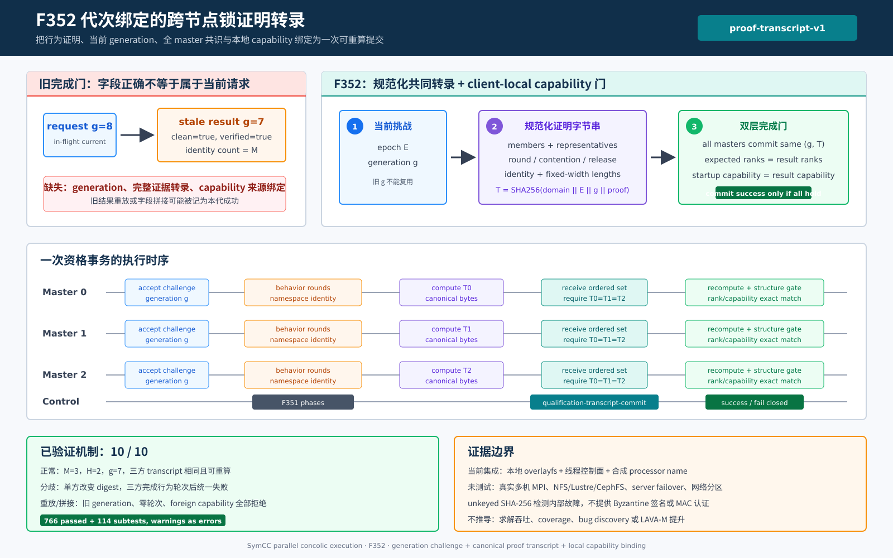

# F352：代次绑定的跨节点锁证明转录

- 日期：2026-08-10
- 功能编号：F352
- 成熟度：I/T/E-mechanism
- 前置能力：F329-F333跨processor锁资格与续期；F351 namespace identity closure
- 代码范围：资格结果、transcript commit、续期完成门、standalone MPI运行时日志



## 1. 研究问题

F351已经保证一次成功资格在提交前闭合state/publication文件系统绑定、root/lock descriptor身份以及全
master的namespace identity。然而代码审查发现，运行期续期的最后一个消费边界仍然过弱：
`ClusterLockRenewalController.complete()`只检查`clean`、`verified`、v2 scope和identity数量，没有把
返回对象绑定到当前请求的generation，也没有逐字段核对result与capability。

这允许两个不应成功的内部故障对象被记为续期成功：

1. generation 7的完整成功结果可以在generation 8再次提交；
2. 旧capability可以与零轮次、不同成员或不同状态根的result拼接，只要表面布尔值与identity数量满足门槛。

生产调用当前是同步的，因此该缺口不等于已经发生了线上错误；但它使完成边界依赖“调用者永远不会缓存、
重排或拼接对象”的隐含假设。后续异步化、RPC化、检查点恢复或故障注入都会放大这一风险。

F352的目标是把一次资格从“若干独立字段”升级为一个可重算、代次绑定、全参与者一致提交的证明转录，
同时保留F351对本地文件系统身份的严格闭合。

## 2. 技术依据与设计定位

TLS 1.3把有类型、有长度的握手消息序列纳入transcript hash，再由Finished校验绑定当前握手上下文；其
关键思想不是“有一个摘要”，而是“摘要必须覆盖当前会话中所有决定语义的消息”。
[RFC 8446, Section 4.4.1](https://www.rfc-editor.org/rfc/rfc8446#section-4.4.1)

NIST SP 800-63B指出，challenge或nonce只有被纳入当前事务验证时才能提供replay resistance。F352把已有
单调`qualification_generation`视为内部challenge，并要求完成结果携带同一代次的规范化转录。
[NIST SP 800-63B, Replay Resistance](https://pages.nist.gov/800-63-4/sp800-63b.html#replay)

这里采用的是工程化类比，不是把锁资格协议宣称为TLS或认证协议。F352使用unkeyed SHA-256检测受信框架
组件之间的陈旧、拼接和分歧；它不提供签名、MAC或恶意master身份认证。

## 3. 故障模型与成功不变量

### 3.1 覆盖的故障

- 旧generation的完整成功对象在新请求中重放；
- result的成员、代表、轮次或证据计数被部分替换；
- result与另一状态根的capability拼接；
- 不同master在相同行为轮次后计算出不同摘要；
- 布尔型或越界rank冒充规范整数；
- result/capability内部证据满足局部检查但彼此不一致。

### 3.2 不变量

对epoch `E`、generation `g`、有序成员`M`、processor代表`R`和计数向量
`C=(rounds, contention, release, identity)`，定义：

```text
T = SHA256(
      "symcc-cluster-lock-proof-transcript-v1\0" ||
      bytes(E) || u64(g) ||
      u64(|M|) || u64(|R|) || u64(C0..C3) ||
      for (rank, processor) in M:
          u64(rank) || u32(len(UTF8(processor))) || UTF8(processor) ||
      for rank in R: u64(rank)
    )
```

成功提交必须同时满足：

1. **G：当前代次**：`result.qualification_generation == controller.in_flight_generation`；
2. **T：转录完整**：controller以自己的epoch和generation重算摘要，必须等于result携带值；
3. **S：结构完整**：复用F351 capability upgrade gate重新验证成员、processor覆盖和四类精确计数；
4. **M：拓扑绑定**：生产controller要求result中的有序rank序列等于配置的`master_ranks`；
5. **C：本地能力绑定**：result capability必须精确等于controller启动时的本地capability；
6. **A：全体一致**：每个master在独立`qualification-transcript-commit` phase提交`(g,T)`，任一不一致
   都使所有参与者`clean=false, verified=false`。

## 4. 执行流程

### 4.1 启动资格与运行期续期

1. root通过已有renewal request发布当前generation challenge；
2. 各master完成membership、holder、contention、release和F351 namespace identity closure；
3. 本地upgrade gate验证`H`轮、`H*(M-1)`次竞争、`H`次释放和`M`次身份闭合；
4. 每个master按固定domain、定长整数和显式字符串长度计算`T`；
5. 独立MPI phase收集所有`(global_rank, generation, transcript)`；
6. 任一记录畸形、代次不同或摘要不同，整次资格失败；
7. controller在完成边界重新运行结构gate、重算`T`、核对expected ranks和startup capability；
8. 只有全部条件成立才增加`successes`并推进clean completion time；否则增加`failures`并触发现有
   fail-closed控制错误路径。

### 4.2 为什么分成分布式转录与本地能力两层

epoch、generation、成员和行为计数可以在所有master上规范化为同一字节串。`st_dev`、`f_fsid`、
canonical mount path等值可能因client mount namespace而不同，强行纳入共同摘要会让合法多节点部署产生
假分歧。F352因此使用两层证明：

- 共同transcript负责跨master协议事实与代次新鲜性；
- controller的`expected_capability`精确等值负责本client的root、publication和文件系统身份。

该分层延续F351的双域设计，同时避免把本地内核标识误当作跨节点全局标识。

## 5. 实现细节

| 模块 | 实现 |
|---|---|
| `util/mpi_filesystem_qualification.py` | result增加generation/transcript；规范化SHA-256编码；严格result admission；controller绑定expected ranks/capability；新增全master transcript commit phase |
| `util/mpi_concolic_execution.py` | production controller注入`master_ranks`与startup capability；启动和成功续期输出可审计transcript |
| `test/test_mpi_filesystem_qualification.py` | 摘要字段敏感性、单方分歧、旧代重放、零轮次/成员/capability/异根拼接测试 |

规范化编码不使用拼接JSON或默认`repr`：整数固定为big-endian u64，字符串先UTF-8编码再写入u32长度，
避免字段边界歧义、字典顺序和运行时格式差异。domain string单独区分本功能与已有exchange/config摘要。

## 6. 正确性分析

### 6.1 旧代重放

generation 7的`T7`在generation 8完成时首先因result generation不等而失败；即使只替换result generation，
controller用`g=8`重算得到`T8 != T7`。因此必须同时产生当前代次的完整规范化证据。

### 6.2 字段拼接

零轮次或错误计数先被F351结构gate拒绝。成员、代表或计数即使仍满足结构公式，也会改变重算摘要；
capability字段还必须与结构gate的规范结果逐项一致。异根capability即使携带相同跨master摘要，也会被
startup capability精确等值门拒绝。

### 6.3 master分歧

transcript commit复用有界、generation-token隔离的MPI exchange。每个master接收相同有序记录集并与
自己的`T`比较；一个参与者的摘要改变会让所有正常参与者观察到不一致，而不是只让故障rank本地失败。

### 6.4 不能证明的性质

SHA-256没有密钥。能任意修改进程内存和协议字段的恶意master也能计算相应摘要，因此F352不提供
Byzantine authenticity。它提供的是受信代码故障模型下的完整性、自一致性与replay/splice检测。

## 7. 验证结果

### 7.1 自动化测试

| 范围 | 结果 |
|---|---|
| F352定向 | 4 passed + 13 subtests，27 deselected |
| 六模块相关回归 | 373 passed + 94 subtests |
| 完整warnings-as-errors Python | 766 passed + 114 subtests，96.95 s |
| 静态检查 | Ruff与`py_compile`通过 |

### 7.2 生产机制集成

保存的driver使用生产capability probe、生产资格函数和真实regular file/`flock`，线程消息总线仅替代MPI
transport。十项检查全部通过（10/10）：

| 场景 | 观测 |
|---|---|
| 正常`M=3,H=2,g=7` | 三方clean/verified，transcript完全相同并可重算 |
| 单方transcript变异 | 三方均在完成2轮和3次identity后报告transcript mismatch |
| generation 7结果用于generation 8 | rejected；attempts=2, successes=1, failures=1 |
| result rounds改为0 | rejected |
| capability root替换为foreign root | rejected |
| 八类字段分别变化 | 产生8个不同摘要，均不同于baseline |

baseline transcript为：

```text
68221f41e69257ddf948a8c53b352ff6cec164978d108341514c4cd66bac2e8d
```

该摘要只对应保存的固定epoch、generation和合成拓扑，不是通用常量。

## 8. 先进性、创新性与挑战

1. **从代次隔离exchange到代次绑定结果**：F330只把控制消息和交换token绑定generation；F352进一步
   关闭“协议执行属于当前代次，但提交对象来自旧代次”的末端缺口。
2. **证明携带数据而非布尔typestate**：完成边界不再信任`verified=true`，而是重算决定性证据摘要并
   重新运行结构gate。
3. **共同事实与client-local身份分层**：避免把不具备跨client可比性的device/fsid错误纳入共识摘要。
4. **故障传播一致性**：摘要分歧通过独立phase变成全参与者一致失败，避免局部成功/局部失败分叉。
5. **兼容现有同步路径并面向异步化**：当前不增加环境开关，却为未来RPC、checkpoint和异步资格结果
   提供显式的新鲜性与完整性边界。

## 9. 局限与有效性威胁

1. 当前集成未使用真实`mpirun`、多物理主机或NFS/Lustre/CephFS；合成processor name不是部署认证；
2. transcript commit增加一个有界control-plane exchange，尚未测量真实多节点延迟或扩展性；
3. 摘要未签名且无MAC，不抵抗Byzantine master、进程内存任意篡改或密钥外部攻击；
4. controller默认参数保留空expected topology/capability以兼容独立工具；生产MPI路径显式启用两者，
   非生产调用若需要同等保证也必须传入；
5. F352不改变`flock`本身的NFS/SMB语义，也不证明server failover或网络分区行为；
6. 本轮没有运行目标程序、solver、coverage campaign或LAVA-M，因此不能推导求解或覆盖率提升。

## 10. 后续研究

1. 在真实两节点共享存储上测量额外commit phase的p50/p95/p99延迟与master数量扩展曲线；
2. 若威胁模型扩展到不可信coordinator，评估job-scoped MAC key、MPI session绑定或外部证明服务；
3. 将transcript写入durable renewal manifest，使跨重启审计能够关联配置承诺与最后成功证明；
4. 为异步qualification future增加request/result correlation ID，并用模型检查验证取消、超时与晚到结果；
5. 把transcript divergence纳入运行时结构化遥测，而不改变现有热路径采样频率。

## 11. 证据与参考资料

- 生产实现：`util/mpi_filesystem_qualification.py`、`util/mpi_concolic_execution.py`
- 测试：`test/test_mpi_filesystem_qualification.py`、`test/test_mpi_lifecycle.py`
- 原始制品：`docs/codex/evidence/f352-generation-bound-lock-proof-transcript-2026-08-10/`
- TLS 1.3 transcript hash：<https://www.rfc-editor.org/rfc/rfc8446#section-4.4.1>
- NIST replay resistance：<https://pages.nist.gov/800-63-4/sp800-63b.html#replay>

结论边界：F352证明当前代码能够在本地生产机制模型中拒绝旧代重放、字段拼接、异根capability和
参与者摘要分歧；它不证明恶意节点认证、真实共享存储部署、性能提升或符号执行覆盖收益。
