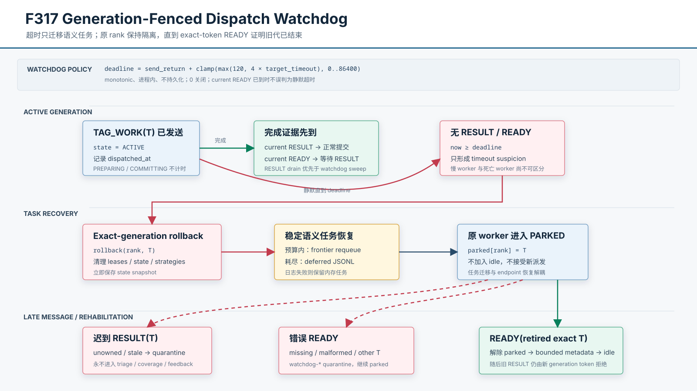

# F317：Generation-Fenced Dispatch Watchdog 与 Worker 隔离恢复

- 日期：2026-08-07
- 范围：MPI worker 静默卡住、per-dispatch deadline、exact-generation 补偿、rank 隔离与恢复
- 成熟度：I/T；尚无真实多 rank hang/kill、网络抖动或 ULFM communicator repair campaign

## 1. 审查发现

F315 用 per-dispatch token 阻止迟到结果消费新任务状态；F316 又用同代 READY 与
missing/malformed RESULT 的 join 恢复“worker 已经结束但结果协议损坏”的任务。然而 worker
如果在发出任何 RESULT/READY 前静默卡住，join 永远不会成立：`active_dispatches`、work/state/
target lease、策略 assignment 和 worker rank 会一直占用，其他 worker 也无法接管这项语义工作。

简单地在超时后把 rank 放回 idle 并不正确。被怀疑的 worker 可能只是慢，并仍在执行旧代 T；
master 若立即向同一 rank 派发 T2，就会让旧结果、旧 READY 和新任务在同一 MPI endpoint 上
交错，甚至让阻塞式 `send` 在 eager/rendezvous 边界表现不同。固定 timeout 只能形成“怀疑”，
不能证明进程已死亡。

因此 F317 把任务恢复与 worker 恢复分开：超时后语义任务可以转移，但原 rank 必须保持 parked，
直到 exact-token READY 证明旧代已经结束。

## 2. 相关技术定位

MPI Forum 的 [MPI 5.0 标准](https://www.mpi-forum.org/docs/mpi-5.0/mpi50-report.pdf) 说明普通 MPI
不保证在进程故障后继续运行，部分错误可能无法检测或无法把控制权返回应用。Open MPI 的
[ULFM 扩展](https://docs.open-mpi.org/en/v5.0.9/features/ulfm.html) 提供 revoke、shrink、agree
和 failed-group 等接口，可在支持的 MPI 构建上修复 communicator。当前环境报告 MPI 3.1、
Open MPI 4.1.6；虽然 mpi4py 类型暴露部分方法名，不能据此假设运行库已经提供可用 ULFM。

经典 failure-detector 工作强调，在异步系统中 timeout 是可能误判的 suspicion，而不是可靠死亡
证明；参见 Aguilera、Chen 与 Toueg 的
[Heartbeat failure detector](https://www.microsoft.com/en-us/research/wp-content/uploads/1997/09/wdag97_hb.pdf)
以及 Aguilera、Chen 与 Toueg 的
[crash-recovery failure detection](https://www.microsoft.com/en-us/research/publication/failure-detection-consensus-crash-recovery-model/)。
F317 没有实现共识、membership 或 eventually-perfect detector，而是利用已有 generation fence
使 timeout 误判只增加重复计算，不产生错误提交。

## 3. 协议图与不变量

| 编号 | 不变量 |
| --- | --- |
| W1 | deadline 只从 `TAG_WORK` send 成功后开始；PREPARING 和 COMMITTING 不参与 watchdog |
| W2 | timer 使用 master 单进程的 monotonic clock，不持久化、不跨 reboot 比较 |
| W3 | RESULT drain 和 F316 recovery 先于 watchdog sweep；已观察到 current READY 时不按墙钟误回滚 |
| W4 | timeout recovery 同时匹配 rank 与 exact dispatch token，并复用 F313 post-send compensation |
| W5 | 超时任务按稳定语义 work ID 重排队/持久 defer；transport token 不进入 retry identity |
| W6 | 超时 rank 从 idle 移除并 parked；任务迁移不等于 endpoint 已恢复 |
| W7 | parked rank 的旧、缺失或畸形 READY 不能解封；只有 retired exact-token READY 可以 |
| W8 | parked rank 的迟到 RESULT 仍由 F315 分类为 unowned/stale，不能 triage 或提交 lease |
| W9 | watchdog 关闭、越界配置、恢复次数和 parked 恢复必须可观测且有测试 |
| W10 | 真正死亡且不再产生 READY 的 rank 永久 parked；没有 ULFM 时不声称 communicator repair |

## 4. 实现细节

### 4.1 事务内 deadline

`_DispatchReservationTransaction.mark_dispatched()` 在 MPI send 返回后记录 `dispatched_at`。
`expired(now, timeout)` 仅对已派发、未关闭且拥有时间戳的事务成立。这样消息构造、资源申请、
send 前异常和 triage 提交都不会被 watchdog 与原有补偿路径重复处理。

`SYMCC_DISPATCH_WATCHDOG_SEC` 默认 `max(120, 4 * SYMCC_TIMEOUT)` 秒，范围 0--86400；0 明确
关闭。NaN、Infinity 和非法文本回到默认值，负数归零，过大值截断。这个默认值是保守工程起点，
不是从 benchmark 拟合的最佳参数。

### 4.2 顺序安全的 sweep

master 每轮依次处理 READY、派发、排空 RESULT、执行 F316 invalid-result join，最后才检查
deadline。若 current RESULT 已经可见，它会在 sweep 前提交；若 current READY 已经可见，说明
worker 已结束且 RESULT 可能仅在另一 tag 队列中稍后出现，watchdog 暂不回滚该代。

`_expired_dispatches()` 返回 `(rank, exact_token)` 的确定性快照。恢复继续调用 F316 的
`_rollback_owned_dispatch()`，清除所有 rank-owned side table并立即保存 state snapshot。
`_enqueue_dispatch_recovery()` 将原来内联的有界恢复抽成统一函数：

1. 默认第一次失败把任务插回当前 frontier；
2. 达到 `SYMCC_DISPATCH_PROTOCOL_RETRIES` 后写 `.dispatch_protocol_deferred.jsonl`；
3. journal 写失败则回到内存，绝不把持久化失败当成成功；
4. 普通 replay 要求 seed 仍存在，自包含 continuation 可脱离旧 seed 路径恢复。

F316 的畸形结果恢复和 F317 的静默超时现在共享同一 retry/defer 实现，避免两条故障路径逐渐
产生不同的任务身份或持久化语义。

### 4.3 Park 与恢复

`_RetiredDispatchGate` 保存 `parked[rank] = retired_token`。timeout recovery 不把 rank 加回
`idle_ranks`，派发入口也显式拒绝 parked rank。后续消息按以下规则处理：

| parked worker 消息 | 动作 |
| --- | --- |
| RESULT(retired T) | active transaction 已撤销，按 unowned/stale 隔离 |
| READY(missing/malformed) | 计入 `watchdog-*` quarantine，继续 parked |
| READY(other valid T) | 计入 `watchdog-stale`，继续 parked |
| READY(retired exact T) | 证明旧执行循环已到 READY；清除 parked，接纳有界版本元数据并 idle |

如果 master 先看到 exact READY、随后才看到旧 RESULT，它可能立即派发新代 T2；旧 RESULT 随后
与 T2 token 不匹配，仍会被 F315 拒绝。因而恢复 rank 不依赖跨 tag 接收顺序。

### 4.4 可观测性

Stats 新增：

- `Dispatch watchdog timeouts`：完成 exact-generation rollback 的超时代次数；
- `Dispatch watchdog worker recoveries`：parked rank 通过 exact READY 恢复的次数。

原有 `Protocol-requeued dispatches` 和 `Protocol-deferred dispatches` 同时统计 invalid-result 与
watchdog 两类任务恢复；原因由结构化 master 日志的 `source=invalid-result/watchdog-timeout`
区分。正常无故障 campaign 的四项值都应为零。

## 5. 自动化证据

[`test/test_afl_profile_orchestration.py`](../../../test/test_afl_profile_orchestration.py) 新增 3 项：

1. PREPARING 不超时、mark-dispatched 后精确边界超时、关闭事务不再超时，以及 watchdog 配置的
   zero-disable、非法/NaN fallback 和上界截断；
2. parked rank 对 missing/stale READY 保持隔离，只有 exact retired token 解封；
3. 同一语义任务第一次重排队、第二次持久 defer，journal EIO 时回退内存且 work ID 稳定。

同时扩展统计测试，验证 timeout/recovery 文本；F317 还修复了运行期 shared-lease stealing 对
self-contained continuation 仍错误要求 seed path 存在的 F316 遗漏。

当前验证结果：

| 门禁 | 结果 |
| --- | --- |
| MPI/AFL profile 编排定向 | 51 passed + 8 subtests（0.56 秒） |
| MPI、distributed state、agentic、hybrid feedback 与 proposal 六模块 | 256 passed + 12 subtests（13.28 秒） |
| 完整 Python unittest | 593/593（82.938 秒） |
| Ruff 与 `py_compile` | 通过 |
| Codex 文档链接、318 个功能 ID、395 个配置名、SVG 与 SHA-256 | 通过 |

F317 未修改 LLVM pass/runtime，不重复运行 LLVM lit；最近证据仍为 F307 的 LLVM 18
`221 passed + 1 unsupported`、LLVM 17 `220 passed + 2 unsupported`。

## 6. 科研边界与下一步

F317 提升的是静默任务的有界恢复能力，不是完整 MPI fault tolerance：

- fixed timeout 可能误判慢任务；fencing 保证结果正确性，但会增加重复 solver CPU；
- worker 真正退出时，默认 MPI runtime 可能直接终止整个 job，应用层 Python watchdog 未必获得
  继续运行机会；
- parked rank 不会自动替换，所有 rank 均永久失联时 master 只能等待或由外部编排终止；
- 没有 communicator revoke/shrink、rank replacement、跨节点 membership 或共识；
- 单元测试没有证明 timeout 最优值、故障检测延迟、coverage AUC 或吞吐提升。

下一阶段应在支持的 MPI 构建上分两组实验：第一组注入可恢复长尾/hang，比较 watchdog on/off
的任务恢复率、false suspicion、重复 CPU、time-to-target；第二组用 ULFM-capable Open MPI 注入
真实 rank kill，评估 revoke/shrink 后重建 worker ownership 的可行性。任何性能主张仍需固定
CPU、固定 campaign 时间、多轮随机种子和置信区间。
