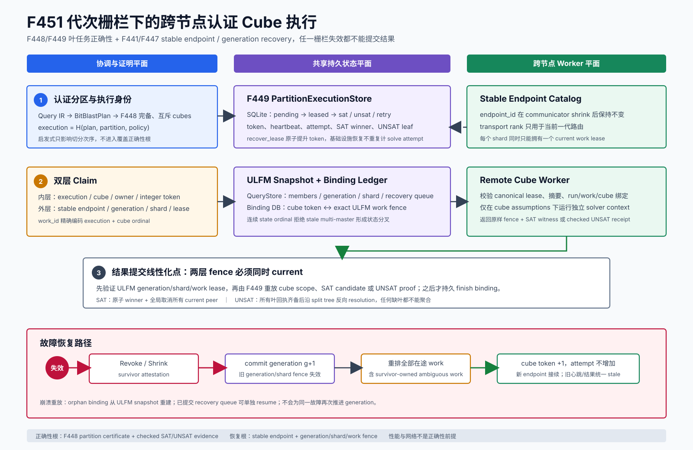

# F451：代次栅栏下的跨节点认证 Cube 执行

## 1. 交付结论

F448 已证明一个 QF_BV 查询可以被切成完备、互斥的 cubes；F449 已能在同一进程的多个 CaDiCaL
context 中执行这些 cubes，并把 SAT winner 或全部 UNSAT leaves 收敛为原查询结果；F441--F447 已
证明 stable endpoint、generation fence、ULFM shrink、warm spare 和跨节点恢复。F451 关闭这些能力
之间的生产连接缺口：**每个 cube 同时持有 F449 task token 和 F447 generation/shard/work fence，只有
两层均为 current 的心跳或结果才能改变查询状态。**

- 功能编号：F451；
- 当前证据：I/T/E-crosshost-adapter；
- 核心协议：`util/qfbv_distributed_partition_execution.py`；
- 无状态进程入口：`util/symcc_qfbv_distributed_partition.py`；
- 远端边界与 oracle：`benchmark/qfbv_distributed_remote_worker.py`、
  `benchmark/check_qfbv_distributed_partition_oracles.py`、
  `benchmark/check_qfbv_distributed_crosshost_oracles.py`；
- 专项测试：`test/test_qfbv_distributed_partition_execution.py`；
- 正式证据：`docs/codex/evidence/f451-generation-fenced-distributed-cubes-2026-08-26/`。



## 2. 为什么不能只共享 F449 SQLite

F449 的 `owner + integer token + expiry` 能阻止同一个 cube 被两个本地线程同时提交，但不能回答跨节点
环境中的三个问题：

1. MPI `Shrink` 后 transport rank 改变，旧 rank 不能继续作为持久 worker 身份；
2. survivor 可能仍在计算旧 communicator 上派发的工作，不能只回收 failed-owner 的 lease；
3. cube result 即使持有最新的 F449 token，也可能来自已经撤销的 communicator generation。

反过来，单独使用 ULFM work fence 也不够：它知道 endpoint、generation、shard 和 work lease，却不知道
F448 cube certificate、assumptions、SAT candidate 或 UNSAT proof 是否属于当前查询。因此 F451 不复制
两套状态机，而是用一个内容绑定的 binding ledger 连接两者。

## 3. 状态模型与正确性根

### 3.1 内层：认证 Cube Lease

F449 ledger 保存：

```text
(execution_sha256, cube ordinal)
  -> partition/cube identity
  -> literals + full assumptions
  -> owner + monotonic integer token + lease_until
  -> attempts + terminal result/proof identity
```

`execution_sha256` 绑定 BitBlastPlan、F448 partition 和 execution policy。SAT 只有在 assignment 满足 cube，
并经 QueryStore 对原 Query IR 重放后才可提交；UNSAT 必须重放 assumption-scoped proof receipt。

### 3.2 外层：Generation-Fenced Work Lease

F447 durable controller 保存：

```text
run_id = qfbv-cubes:<execution_sha256>
generation + generation_token
stable endpoint + current transport rank
shard owner + shard_token
work_id = cube:<execution_sha256>:<ordinal>
work lease_token + recovery_queue
```

stable endpoint 在 communicator replacement 后不变；rank 只负责本代路由。`work_id` 不能由调用方自由
命名，而是精确编码 execution 和 cube ordinal，防止把另一个查询或另一个叶任务拼接到 current shard。

### 3.3 Binding Ledger

`DistributedCubeBindingStore` 把两层 lease 的规范 JSON 与摘要持久化，并记录
`active/completed/retry/exhausted/cancelled/recovered/stale`。初始化采用稳定 no-follow lock，数据库使用
`synchronous=FULL`，相同 cube token 和相同 ULFM lease 具备唯一约束。binding 是审计和恢复连接，不是
新的 SAT/UNSAT 信任根。

## 4. 正常执行次序

1. coordinator 从 Query IR 重建 BitBlastPlan，并独立验证或生成 F448 certificate；
2. 只在 current membership 中选择归属于目标 stable endpoint、没有 active work、没有优先恢复任务的
   shard；
3. F449 ledger 原子 claim 一个 pending cube，得到 inner token；
4. DurableUlfmCoordinator 以固定 work identity dispatch，连续 state ordinal 写入 QueryStore；
5. 两层 lease 形成 `symcc-qfbv-generation-fenced-cube-lease-v1`，写入 binding ledger 后才交给 worker；
6. worker 严格验证 canonical JSON、摘要、schema、run/work/cube 绑定，再在 cube assumptions 下求解；
7. heartbeat 先要求 ULFM fence current，再续期 F449 cube lease；
8. result 先通过 ULFM fence，再由 F449 重放 SAT candidate 或 UNSAT receipt；
9. 内层 durable result 成功后，外层 work 才 `finish`，binding 最后转为 completed；
10. SAT winner 原子取消 F449 peers，并逐个取消所有 current ULFM work；全部 UNSAT 时沿 F448 split tree
    反向 resolution，任何缺叶、错叶或旧代叶都不能聚合。

该顺序有意允许 effectively-once computation：故障窗口内可重复计算，但 generation/token fence 和内容
验证阻止重复或过期副作用。

## 5. 故障恢复次序

1. F447 数据面完成 `Revoke → Shrink → survivor attestation → Agree`；
2. durable prepare 记录 old members、全部 in-flight work 和既有 recovery queue；
3. receipt 提交 `generation g+1`，旧 generation、shard 和 work token 立即失效；
4. **全部**旧代在途 work 进入 recovery queue，包括 survivor-owned work，因为 revoke 窗口无法证明其
   是否已提交；
5. 每个 queued work 在新 owner/shard 上重新 dispatch；
6. F449 `recover_lease` 精确核对旧 cube scope和 token，原子执行 `cube token + 1`，更新 lease owner；
7. infrastructure recovery 不增加 semantic solve attempt，避免连续节点故障把 cube 错误耗尽为
   incomplete；
8. 新 binding 原子 supersede 旧 binding；旧心跳和旧 result 同时被两层 fence 拒绝。

恢复操作具备两个独立的崩溃补偿入口：

- `resume_recovery_queue` 在 generation receipt 已提交后继续排空剩余队列，不再次推进 generation；
- `reconcile` 从 ULFM snapshot 重建“dispatch 已提交、binding 尚未插入”的 orphan，并补做
  “inner result 已提交、outer finish 尚未提交”的 finish/cancel。

## 6. 多 Master 与失败原子性

多个 master 可能从同一旧 snapshot 同时开始 dispatch。F451 不用最后写入覆盖前者：每次
DurableUlfmCoordinator transition 必须使用连续 state ordinal。两个 stale master 同时提交时只有一个
能前进；另一个被 QueryStore 判定为 fork，内存 controller 回滚，已经 claim 的 inner cube 以 error
路径回到 pending。测试固定这一结果：一个 current outer lease、一个失败关闭、F449 无叶丢失。

跨 F449、ULFM snapshot 和 binding DB 不可能形成单个 SQLite 事务，因此实现采用可识别的操作次序、
幂等状态和重启 reconciliation，而不是声称不存在中间状态。

## 7. 无状态 CLI 与部署方式

`symcc_qfbv_distributed_partition.py` 提供 `init/claim/heartbeat/complete/recover/reconcile/finalize/stats`。
每次调用都从 QueryStore、partition CAS、execution ledger、binding ledger 和 ULFM snapshot 重建状态，
不依赖一个 Python coordinator 永久存活。远端进程可通过现有 MPI transport、SSH/RPC adapter 或共享
作业系统传输 lease/result；协议本身不信任 transport。

SAT completion 的 `--input-hex` 必须显式提供，CLI 会把 assignment 应用到 parent input 后调用
`QueryStore.validate_candidate`。因此远端自报的 `backend_model_verified` 不能越过原 Query IR 的确定性
验证。

## 8. 测试与六轮审查

专项 15 项测试覆盖：

- lease 规范化、摘要、run/work/cube 与 endpoint/generation 绑定；
- 三 endpoint 并发 claim、持久 binding 和 heartbeat；
- generation recovery、旧 token 拒绝、attempt 预算守恒；
- 恢复后全部 UNSAT leaves 聚合为 base-query proof；
- 远端 SAT winner 全局取消 current peers；
- inner commit/outer finish、outer dispatch/binding insert 两个崩溃窗口；
- 已提交 recovery queue 的重启续跑；
- stale multi-master state ordinal 分叉拒绝；
- binding DB 篡改、错误 attestation、duplicate/tampered remote request；
- 无状态 CLI 的 init→claim→heartbeat→complete→finalize；
- 可执行同机/双主机逻辑拓扑 oracle。

耦合回归覆盖 F448/F449、incremental SAT、ULFM 和 QueryStore，共 127 passed、38 subtests passed。
完整 capability-closed gate 为 **1443 passed、310 subtests passed，249.08 s**；16/16 外部能力存在，
skip、xfail、xpass、deselect、collection error、missing nodeid 和 unexpected nodeid 均为 0。规范清单从
F450 的 1428 精确增加 15 项，既有 nodeid 删除数为 0。

六轮审查与修复如下：

1. **组合边界**：拒绝修改或复制 F449/F447 状态机，建立双层 current 判定；
2. **持久化与策略**：补 no-follow 初始化锁、timeout policy 核对和 stateless CLI；
3. **崩溃原子性**：补 inner/outer commit reconciliation；
4. **恢复可重入性**：补 orphan binding 重建和 committed queue resume；
5. **并发与语义**：验证 stale multi-master fork 失败关闭，CLI SAT 接入 QueryStore candidate replay；
6. **物理 transport**：远端严格拒绝 duplicate/non-finite/tampered/spliced 请求，response 绑定精确 request
   digest，并以内容固定的 worker 脚本完成双主机 oracle。

## 9. 机制实验

### 9.1 单机逻辑拓扑 Oracle

正式 oracle 使用 8 cubes、5 轮；每轮包含同机单 endpoint 故障、两 host 逻辑拓扑整侧双 endpoint 故障，
以及无故障 SAT 抢先。10 个 recovery case 全部 generation 0→1并恢复4个初始在途 cube；随后执行剩余
叶并聚合 UNSAT。

| 指标 | 结果 |
| --- | ---: |
| recovery cases | 10/10 |
| UNSAT base-query receipts | 10/10 |
| SAT winner cases | 5/5 |
| recovered in-flight cubes | 40/40 |
| lost cubes | 0 |
| 每个 8-cube case 的 attempts | 8 |
| recovery-case 机制中位时间 | 681.082 ms |

时间包含临时目录、SQLite、proof 构造/重放和 Python 调度，只用于固定机制成本，不是 solver speedup。

### 9.2 物理双主机 Transport Oracle

`cuda-ke` 与 `vultr` 之间执行3轮。远端脚本先由 SHA-256 固定；每轮 `remote-failed` 进程读取并验证
完整 lease 后真实 `exit(86)`。coordinator 将 generation 0→1，把3个在途 cube全部重发；同一物理远端
主机上的 `remote-survivor` 再验证新 lease、返回绑定 request digest 的 SAT result。coordinator 对
candidate和双重 fence复验后接受1个 winner并取消2个 peer。

| 指标 | 结果 |
| --- | ---: |
| 物理主机 | 2 (`cuda-ke`, `vultr`) |
| 独立轮次 | 3/3 |
| 预期远端退出 | 3/3 为 86 |
| generation | 每轮 0→1 |
| 在途 cube 重排 | 每轮 3/3 |
| survivor remote SAT | 3/3 |
| peer 全局取消 | 每轮 2/2 |
| 最终 active work / recovery queue | 每轮 0 / 0 |
| 三轮内部 wall time | 9.001 s |

远端 worker SHA-256 为
`ec32fbbebaeb52428b0a9af1e283b0bc5c2afd1b267d6b37ef61d9c4b908dc59`；oracle identity 为
`eb7f674adae0948f4dbb313fc2ee5ef397c70a922784e9b147ea53ec269423c0`。

## 10. 结论边界与下一项

F451 可以声明：认证 cube 已成为 stable-endpoint、generation-fenced、可持久重放的跨进程/跨节点工作；
节点失效后全部不确定叶不丢失，旧代结果不能提交，SAT 形成全局取消，UNSAT 仍由完整 checked leaves
聚合。物理双主机 adapter 实验和 F447 的真实 ULFM communicator 实验分别验证了应用协议和通信恢复
substrate。

F451 不声明：SSH 是生产 transport、此次实验重新测量了 MPI/ULFM latency、SAT 求解更快、fuzzing
coverage 或 defect yield 提升、exactly-once computation，或形成 R 级公开目标性能证据。长时公开目标
仍属于独立 R-track。

下一优先项 F452 是 TACAS 2026 风格 native checker clause compression；它减少 proof checker 内存和
传输/见证字节，不改变 F451 双层正确性协议。

## 11. 主要资料

- Schreiber et al., [*Real-time Proof Checking for Distributed Incremental SAT Solving*](https://publikationen.bibliothek.kit.edu/1000193848), TACAS 2026；
- Schreiber et al., [*Mallob: Scalable Automated Reasoning on Demand*](https://link.springer.com/chapter/10.1007/978-3-032-32526-6_5), CAV 2026；
- Open MPI, [ULFM documentation](https://docs.open-mpi.org/en/v5.0.x/features/ulfm.html)；
- F449：[`Proof_Aware_Certified_Partition_Execution_F449_2026-08-25.md`](Proof_Aware_Certified_Partition_Execution_F449_2026-08-25.md)；
- F447：[`Cross_Node_Continuous_ULFM_and_Scale_Evidence_F447_2026-08-25.md`](Cross_Node_Continuous_ULFM_and_Scale_Evidence_F447_2026-08-25.md)。

论文中的集群规模与开销数字属于原论文；本报告只把本仓库正式 evidence 直接支持的结果归于 F451。
