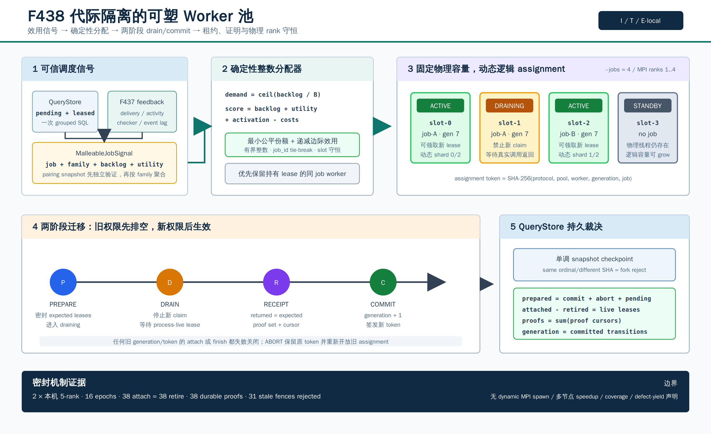

# F438：Generation-Fenced Malleable Worker Pool

- 功能编号：F438
- 日期：2026-08-18
- 研究主题：多作业效用驱动资源分配、grow/drain/migrate/shrink、两阶段迁移、租约与证明守恒、持久恢复、物理 MPI rank 归属证明
- 当前等级：I/T/E-local
- 严格边界：已实现预启动物理槽上的逻辑可塑性和生产 QueryStore 接线；尚未实现运行时创建 MPI rank、节点故障后的 communicator 修复，也没有公开目标、多节点 speedup、coverage 或 defect-yield 结论



## 1. 问题与研究动机

F433--F437 已经把 QF_BV 求解从“孤立 worker”推进到实时、可检查、可反馈的并行 proof stream：

1. F433 在 solve 期间交换并检查 LRUP/RUP clause；
2. F434 建立多 rank 身份、共享文件系统和 ACK 的资格门禁；
3. F435 根据背压、时限和历史反馈做准入；
4. F436 观测导入 clause 是否在接收端成为 unit/conflict；
5. F437 按 `publisher x consumer x formula-family` 学习 pairing 效用。

但 worker 数仍是静态的。当若干公式族的 backlog、proof yield 和 checker 成本随时间变化时，固定配额会让
一部分 worker 空闲，另一部分 job 排队。直接杀死或复用一个进程又会引入三个正确性问题：旧任务是否仍在
写结果、旧 assignment 是否还能领取新任务、已产生 proof 是否已经持久化。F438 的目标不是简单调整线程数，
而是把资源迁移变成一条可检查的状态机。

## 2. 与前沿工作的关系

| 一手工作 | 可吸收思想 | F438 的实现与差异 |
| --- | --- | --- |
| Mallob, 2022 | 多作业并发、运行中增减计算资源、受控 clause sharing | 实现效用/积压驱动的逻辑槽分配；当前物理槽预启动，不声称完整复现 Mallob 通信层 |
| Distributed Incremental SAT with Mallob, 2025 | 增量作业与分布式资源管理协同 | F438 的 job signal 可聚合 F437 formula-family 反馈；没有复现其完整求解器 |
| Streamlining Distributed SAT Solver Design, SAT 2025 | 灵活负载均衡和逐步迁移资源 | 采用确定性分配、滞回和 drain 后提交；不把论文实验结论移植为本项目结果 |
| Painless, SAT 2017 | 并行 solver 实例和 clause-sharing 组件化 | 物理 slot 与逻辑 job assignment 分离；proof checker 仍是授权边界 |

主要来源：

- [Mallob: Scalable SAT Solving in the Cloud](https://arxiv.org/abs/2205.06590)
- [Distributed Incremental SAT Solving with Mallob](https://arxiv.org/abs/2505.18836)
- [Streamlining Distributed SAT Solver Design](https://drops.dagstuhl.de/entities/document/10.4230/LIPIcs.SAT.2025.27)
- [Painless: A Framework for Parallel SAT Solving](https://www.lrde.epita.fr/dload/papers/le-frioux.17.sat.pdf)

F438 是结合现有 SymCC QueryStore、证明制品和 generation fence 的项目内设计，不应表述为上述论文已经
提出了相同协议。

## 3. 系统架构

### 3.1 两层资源模型

- **物理层**：`--jobs=N` 预启动 N 个线程，或 MPI 实验中的固定 `COMM_WORLD` rank；物理成员在一次运行中不变。
- **逻辑层**：每个 slot 处于 `standby`、`active(job)` 或 `draining(job)`，assignment 可以跨代变化。
- **作业层**：生产服务当前把 QueryStore 队列作为一个 job；通用控制器和 MPI oracle 支持多个 job/formula family。

这种分层把“逻辑伸缩是否正确”和“集群运行时能否动态创建进程”分开。前者已进入生产服务，后者仍是后续
工程问题。

### 3.2 输入信号

每个 `MalleableJobSignal` 包含：

```text
(job_id, formula_family_sha256, backlog,
 reward_total, outcomes, delivered, activated,
 checker_total_us, event_lag_total)
```

通用路径通过 `job_signals_from_pairing_snapshots` 独立验证 F437 snapshot，再按 formula family 聚合反馈。
生产 QueryStore 单作业路径用一次分组 SQL 读取 `pending + leased`，不解析完整 result JSON，也不在每轮调度
扫描 proof history。

### 3.3 确定性整数分配

对 job `j`：

```text
demand_j = ceil(backlog_j / backlog_per_slot)

score_j = min(1e6, backlog_j * W_b)
        + floor(reward_total_j / max(1, outcomes_j)) * W_u
        + floor(1000 * delivered_j / max(1, outcomes_j))
        + floor(1000 * activated_j / max(1, delivered_j)) * W_a
        - checker_penalty_j - lag_penalty_j
```

先按确定性次序给 runnable job 分配最小槽数，再以
`score_j / (allocated_j + 1)` 的递减边际效用分配剩余槽。所有计算使用有界整数，tie 按 `job_id`，因此不同
rank 可逐字重算。分配满足：

```text
0 <= allocated_j <= demand_j
sum_j allocated_j <= total_slots
```

worker 映射优先保留同 job 且仍持有 lease 的 slot，减少不必要的 drain；随后优先复用已有非空 assignment，
最后使用 standby slot。verifier 不只检查每个 job 的数量，还重算每个 `worker_id -> job_id` 映射。

## 4. 严格执行流程

### 4.1 稳态领取

1. controller 返回带 `assignment_generation` 和 `assignment_token` 的 permission；
2. 只有 `active` assignment 可以进入 QueryStore claim；`draining/standby` 拒绝新 lease；
3. active slot 按当前 active worker 列表动态重编号 shard，避免 standby slot 形成静态取模空洞；
4. QueryStore 成功 claim 后，controller 在同一进程锁下绑定精确 `query_id:lease_token`；
5. worker 求解、由 QueryStore 原有 token 事务提交结果；
6. worker 返回时 retire controller lease；若处于 drain，额外登记本次 drain 中完成的 proof/certificate/receipt SHA。

### 4.2 两阶段重分配

一次改变 assignment 的迁移按以下顺序进行：

```text
PREPARE
  -> 密封 signals / allocation / desired_jobs / expected_leases
  -> 旧 assignment 进入 draining，立即禁止新 claim
  -> 等待进程内真实 solver 调用返回
  -> 每个旧 lease 恰好 retire 一次，proof cursor 单调前进
  -> 每个 changed worker 提交 drain receipt
COMMIT
  -> 要求 receipts == drain_workers
  -> allocation_generation += 1
  -> changed worker 生成新 assignment token
  -> grow / migrate / shrink 生效
```

如果准备后不能继续，可 `ABORT`，旧 token 和 job 不变并重新开放 admission。只有 commit 才增加 allocation
generation。

### 4.3 为什么同时需要 generation 和 token

generation 表示调度代次，但单独使用 generation 不能绑定 pool、worker 和 job。token 是以下规范对象的
SHA-256：

```text
(protocol, pool_id, worker_id, assignment_generation, job_id)
```

所有 attach/finish/receipt 操作同时验证 generation 与 token。迁移后的旧 worker 即使重放相同 lease，也会被
`stale malleable assignment fence` 拒绝。

## 5. 崩溃、租约与恢复语义

### 5.1 持久 checkpoint

QueryStore 表 `malleable_worker_snapshots` 以 `(pool_id, policy_sha256)` 限定作用域，存储完整 snapshot、
allocation generation、next event ordinal 和摘要。提交规则为：

- 相同 ordinal、相同摘要：idempotent；
- 相同 ordinal、不同摘要：fork，失败关闭；
- 较小 ordinal/generation：stale，不能回滚；
- 更大 ordinal：原子前进。

snapshot verifier 重算 schema、policy、assignment token、pending transition、receipt 及守恒式。它证明最新
checkpoint 的状态闭合；完整历史事件重放由机制 oracle 的 operation trace 提供，生产表当前不是永久审计日志。

### 5.2 在线与重启的区别

QueryStore lease 到期只意味着它可以被重新领取，不证明原 solver 调用已经返回。因此生产适配器维护进程内
`_live_leases`：在线 drain 必须等待真实 worker 从 backend 返回，不能只因数据库时间到期就复用物理 slot。
进程重启后该集合为空，此时以 QueryStore 的 `query_id:token` 是否仍有效决定等待或回收。这一双重判据避免：

1. 长求解超过 lease timeout 时提前迁移物理 worker；
2. 进程已经退出后永久等待只存在于旧 snapshot 的 lease；
3. 重领后旧 token 的迟到结果获得提交权限。

### 5.3 单协调者

同一 `pool_id` 的生产适配器持有生命周期级、nonblocking、`O_NOFOLLOW` 的稳定 inode `flock`。第二个进程
不能同时成为协调者；异常初始化会关闭 descriptor，`--once` 的成功和异常路径都会释放锁。

## 6. 可验证守恒条件

严格 snapshot verifier 检查：

```text
prepared = committed + aborted + pending
allocation_generation = committed
leases_attached - leases_retired = current_live_leases
proofs_durable = sum(worker.proof_cursor)
next_event_ordinal - 1
  = prepared + committed + aborted + drain_receipts
  + leases_attached + leases_retired
```

pending transition 还要求：

- `expected_leases = live_leases union retired_leases`，且两集合不相交；
- receipt 的 `returned_leases` 与 prepare 时精确集合相等；
- receipt 的 proof set 与 worker 当前 drain proof set 相等；
- receipt/transition event ordinal 唯一且顺序有效；
- desired mapping 等于从密封 signal 重新计算的确定性 mapping。

## 7. 生产使用

```bash
python3 util/symcc_query_service.py \
  --store /shared/query-store \
  --jobs 8 \
  --malleable-workers \
  --malleable-pool-id node-a-qfbv \
  --malleable-backlog-per-slot 2 \
  --malleable-hysteresis-slots 1 \
  --portfolio portfolio.json
```

`--jobs` 是固定物理容量；`--malleable-workers` 只改变其中活跃的逻辑槽数。`backlog-per-slot` 控制需求换算，
`hysteresis-slots` 抑制小幅振荡。pool id 必须在同一持久 store 和物理 worker inventory 上稳定；改变 slot 数或
policy 会因作用域不一致失败，而不是静默加载旧状态。

## 8. 测试设计

### 8.1 单元、状态机与故障注入

F438 专项测试覆盖：

- policy/signal 边界、重复身份和不一致反馈；
- 确定性 utility allocation、grow/shrink/migrate、busy-worker retention；
- 精确 lease set、proof set、cursor、stale token、abort；
- snapshot 恢复、重密封 mapping 篡改、MPI rank report 篡改；
- QueryStore 单调 checkpoint/fork detection；
- 生产 pool grow/claim/shrink、单协调者锁、pending restart；
- 在线 QueryStore lease 已过期但 solver 尚未返回时仍禁止 drain commit；
- 80 轮 seeded random state machine 与完整 operation replay。

### 8.2 物理 MPI 机制实验

命令：

```bash
mpiexec -n 5 python3 benchmark/run_qfbv_malleable_multirank.py \
  --epochs 8 --jobs 3 --backlog-per-slot 2 --seed 62520 \
  --output /tmp/f438-mpi-62520.json
```

rank 0 构造并密封 trace；所有 rank 独立验证完整 trace；每个 worker rank 只签署由其 `slot-(rank-1)` 拥有的
操作摘要；root 要求物理成员集合和操作归属精确相等后才封存结果。

## 9. 实验结果

| 指标 | seed 62520 | seed 128057 | 合计/结论 |
| --- | ---: | ---: | ---: |
| 物理 MPI ranks | 5 | 5 | 两次均为真实 `COMM_WORLD` |
| epochs / logical jobs | 8 / 3 | 8 / 3 | grow/drain/migrate/shrink trace |
| prepare / commit | 9 / 9 | 9 / 9 | 18/18，无 abort |
| attach / retire | 19 / 19 | 19 / 19 | 38/38，零 lease 丢失 |
| durable proofs | 19 | 19 | 38，cursor 守恒 |
| stale fences rejected | 16 | 15 | 31/31 预期旧权限拒绝 |
| operation rows | 100 | 99 | 每行从空 controller 重放 |
| worker operations attested | 73 | 72 | 145 个物理 rank 归属摘要 |

完整门禁为：F438专项`17 passed`；Python能力闭合门禁`1307 passed + 291 subtests`且node-id
`1307/1307`精确匹配；LLVM 17为`328 discovered / 326 passed / 2 expected unsupported`，LLVM 18为
`328 / 327 / 1`，均零失败、零unresolved。双LLVM门禁按review结论串行运行。

seed 62520 的八轮 active allocation 为：

```text
2/2 job-0/job-1 -> 2/2 job-0/job-2 -> 1/3 job-1/job-2
-> 2/2 job-0/job-1 -> 1/3 job-0/job-2 -> 1/3 job-1/job-2
-> 3/1 job-0/job-1 -> 2/1 job-0/job-2
```

这些数据证明机制的确定性、迁移、恢复、fence 和守恒，不测量 solver throughput。物理 MPI rank 参与验证也
不等价于动态创建/销毁 rank。

## 10. 多轮 review 与修复

| 轮次 | 发现 | 修复 |
| --- | --- | --- |
| Round 1：协议 | 仅校验 allocation count 会接受重密封后的错误 worker mapping | verifier 重算精确 mapping；补 tamper 负例 |
| Round 2：调度 | 固定 `slot % jobs` 在 standby 时形成 shard 空洞；idle worker 可能替换 busy worker | 动态 active shard 编号；优先保留带 lease 的同 job worker |
| Round 3：持久与并发 | 每轮 `stats()` 解析完整历史过重；相同 pool 可被两个服务实例打开 | 新增常量查询 `work_counts()`；生命周期级稳定 inode flock |
| Round 4：生命周期 | 只看 QueryStore 到期时间会在 backend 尚未返回时提前 drain | 新增进程内 live lease fence 和过期租约回归测试；重启仍用持久 token |
| Round 5：门禁 | LLVM17/18 全量 lit 同时运行会污染共享运行资源并产生非确定失败 | 最小隔离重跑确认用例通过；双 LLVM 门禁改为串行执行并记录约束 |

## 11. 结论与边界

F438 将资源伸缩从启发式线程开关升级为 generation-fenced、lease/proof-conserving、可持久恢复的调度协议，
并接入真实 QueryStore worker 服务。其创新点在于把 F437 的 formula-family 效用、QueryStore 的事务 token、
proof artifact 身份和物理 worker 生命周期统一到一个可重算状态机中。

仍不得声称：

- 完整 Mallob 复现或动态 MPI rank spawn/shrink；
- 节点故障后的 communicator repair；
- clause/proof 迁移带来求解加速；
- fuzzing coverage 或漏洞发现数提升；
- 本机 5-rank 结果可以外推到多节点 8/32/128 worker。

权威原始数据、门禁、review、源码身份和图位于
[`f438-malleable-workers-2026-08-18`](../evidence/f438-malleable-workers-2026-08-18/README.md)。
