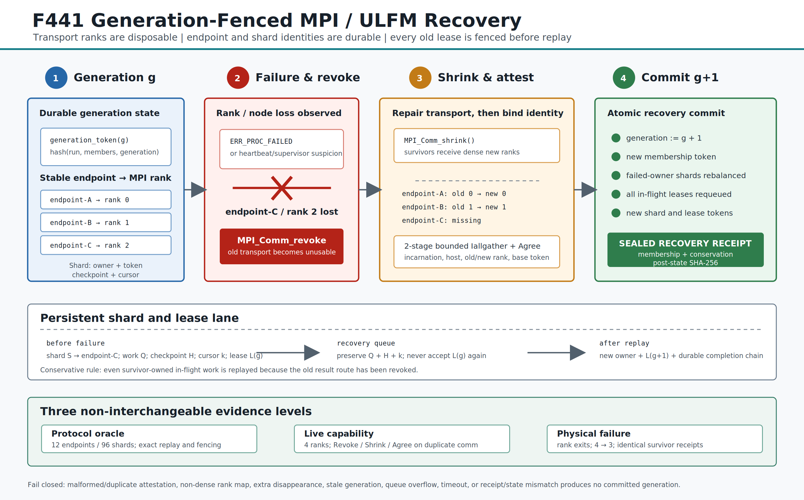

# F441：Generation-Fenced MPI / ULFM 故障恢复

**日期**：2026-08-19  
**状态**：I/T/E-local；恢复协议与本机真实进程失效均可复验，尚未接入
`mpi_concolic_execution.py` 的默认热路径，尚无真实多节点 R 级性能结论。  
**协议**：`symcc-generation-fenced-ulfm-recovery-v1`

> **后续状态（2026-08-25）**：本文“尚未接入主执行器/QueryStore”的表述是 F441
> 验收时的历史边界。F443 已完成 opt-in 生产热路径、每次状态迁移持久化以及真实
> worker/master 失效接管；当前状态见
> [`Production_ULFM_Hot_Path_Recovery_F443_2026-08-25.md`](Production_ULFM_Hot_Path_Recovery_F443_2026-08-25.md)。



## 1. 研究问题与本次收口

F438 已能在预启动 MPI slot 上执行逻辑 worker 的 grow、drain、migrate 与 shrink，
但 communicator 中任一物理进程退出后，传统 MPI 作业通常整体失效。F441 解决的是更窄且
更基础的问题：**幸存进程怎样重建通信域，同时保证旧消息、旧租约和失效 worker 的在途任务
不能污染新一代状态**。

本次实现不是把 MPI rank 当作永久身份。rank 只表示某一 communicator 中的临时位置；
`endpoint_id`、`incarnation_sha256`、shard、checkpoint 与 work identity 才是可恢复身份。
实现以 generation token、shard token 和 lease token 形成三级栅栏，并用可独立复算的
recovery receipt 证明成员、分片和队列守恒。

本次收口形成以下可测试版本：

| 层次 | 已实现内容 | 可证明范围 |
| --- | --- | --- |
| 协议层 | 严格 controller、snapshot、plan、receipt 与篡改检查 | 身份、分片、租约、队列和代次守恒 |
| MPI 能力层 | `ERRORS_RETURN/Get_failed/Agree/Revoke/Shrink` 语义探测 | 指定 MPI 库的 API 不是表面存在而是真正可调用 |
| 真实失效层 | 4 rank 中最后一 rank 物理退出，3 个 survivor 修复并提交同一 receipt | 本机 TCP transport 上的进程失效恢复闭环 |

它**没有**证明主执行器已经无缝容错，也没有证明跨节点吞吐、coverage、defect yield 或
solver speedup。该边界由测试产物和交付 verifier 强制保留。

## 2. 状态模型

### 2.1 稳定 endpoint 与瞬时 rank

每个成员由以下字段标识：

- `endpoint_id`：逻辑执行端身份，communicator shrink 后保持不变；
- `incarnation_sha256`：进程实例身份，防止同名 endpoint 退出后以新进程冒充旧实例；
- `host_id`：用于拓扑记录和成员证明；
- `rank`：当前 communicator 中的稠密传输编号，允许变化。

成员表进入 generation token：

```text
G_g = SHA256(protocol, run_id, generation, sorted endpoint membership)
```

因此相同 endpoint 集合但不同 generation、不同 incarnation 或不同 rank 映射都得到不同
token。attestation 必须完整、无重复且 new rank 精确覆盖 `0..survivors-1`。

### 2.2 shard 与 lease

每个 shard 保存 owner endpoint、generation、shard token、checkpoint digest、cursor、
lease ordinal、active work、completed count 和 completion hash chain。shard token 绑定
`G_g + shard_id + owner`；lease token 再绑定 `shard_token + work_id + ordinal`。

这个结构提供两个关键性质：

1. 旧 generation 的结果即使延迟到达，也无法通过新 shard/lease token 校验；
2. recovery 前后的 checkpoint、cursor 和完成链可逐 shard 对接，不能通过重新封装 JSON
   隐藏丢失或重复任务。

### 2.3 保守重放规则

revoke 后，旧 communicator 上“发送成功但对端是否提交”可能无法区分。F441 因此重放
**全部在途工作**，不只重放失效 endpoint 所拥有的工作；已完成并进入 durable completion
chain 的任务不重放。该选择把不确定性转换为可由 work identity 去重的 at-least-once 执行，
优先避免漏探索。副作用是故障后可能产生重复计算，因此结果提交必须继续按 work identity、
generation 和 lease token 幂等裁决。

## 3. 精确执行次序

### 3.1 正常代次

1. controller 以稳定 endpoint inventory 和 shard inventory 创建 generation 0；
2. 调度器读取 `shard_permission()`，用当前 shard token 领取工作；
3. `attach_work()` 原子生成 lease token；
4. worker 周期调用 `checkpoint_work()`，cursor 只能单调前进；
5. `finish_work()` 校验 generation、shard、work、lease 和结果摘要，并扩展 completion chain；
6. `classify_message()` 将消息划分为 `current/stale/unowned/malformed`，只有 current 进入提交。

### 3.2 故障与 transport 修复

1. MPI 调用返回 `ERR_PROC_FAILED/ERR_PROC_FAILED_PENDING/ERR_REVOKED`，或外部
   heartbeat/supervisor 形成失效怀疑；
2. controller `prepare_recovery()` 冻结旧成员、suspected endpoint、旧 generation 和所有
   在途 lease，生成 sealed plan；
3. 幸存者设置 `MPI_ERRORS_RETURN`，调用 `MPI_Comm_revoke()` 使旧 communicator 上的操作收敛失败；
4. 调用 `MPI_Comm_shrink()` 构造只含幸存者的新 communicator；
5. 在新 communicator 上执行两阶段有界 `Iallgather`：先交换规范 JSON 长度，再交换固定
   4096-byte slot；每个 request 都按单调时钟轮询到有限 deadline；
6. 验证 endpoint、incarnation、host、old/new rank、base generation token，拒绝重复 endpoint、
   失效 endpoint 重现、非稠密 rank 和超预算输入；
7. `MPI_Comm_agree(True)` 确认幸存者都通过同一语义门；
8. `commit_recovery()` 接受实际 survivor 集合。repair 期间发生额外失效时允许实际集合小于
   原计划，但任何 reappearing identity 或非法成员变化都失败关闭；
9. rendezvous hashing 只重分配失效 owner 的 shard；所有旧在途 lease 清空并将 work、checkpoint、
   cursor 放入 recovery queue；
10. generation 加一，为所有 shard 产生新 token，封存 recovery receipt；
11. `claim_recovery()` 优先于 fresh work，且“出队 + 新 lease”是一次 controller 原子转换；
12. 所有 survivor 交换 receipt SHA，只有完全相同才继续执行。

Open MPI 5.0.10 不导出 `MPIX_Comm_ishrink`，因此实现使用 blocking `Shrink()`；单次 repair
由外部 launcher 的硬超时封顶。代码不能把 Python 轮询 deadline 冒充对阻塞 C 调用的抢占。

## 4. 严格验证与失败原子性

`verify_endpoint_attestation()`、`verify_recovery_plan()`、
`verify_recovery_snapshot()` 和 `verify_recovery_receipt()` 都执行 exact-field、类型、范围、
排序、摘要和跨对象 join。controller 在 pending plan 与 snapshot 边界做规范深拷贝，避免调用者
持有的可变对象在密封后修改内部状态。

receipt 至少证明：

- before/after endpoint 集合与 removed set 精确守恒；
- before/after shard 集合完全相同；
- owner 仍存活，失效 owner 的 reassignment 完整且没有额外迁移；
- 每个旧 active lease 恰好进入 recovery queue；
- generation、membership、shard 和 lease token 已全部换代；
- post-state snapshot digest 与 receipt 声明一致。

格式错误、超预算、重复成员、非稠密 rank、旧 generation、队列溢出、timeout 或 receipt/state
不匹配均不会提交新 generation。这里的“原子”指 controller 状态转换；生产接线仍需将 sealed
snapshot/receipt 写入项目现有 durable store 后再对外发布。

## 5. 运行环境与资格结果

### 5.1 固定构建

项目提供 `benchmark/install_openmpi_ulfm_5_0_10.sh`。它固定 Open MPI 5.0.10 源码和
SHA-256 `5692cc80554a7117c99eaa725d35100edd8bbf73423a5e265ff867979192df7d`，
并使用：

```text
--with-ft=ulfm --enable-mpi-ext=ftmpi
```

安装器检查 `mpi_ft_enable` 以及 `MPIX_Comm_revoke/shrink/agree/get_failed/ack_failed`
公共符号。`ftmpi` 是 Open MPI 的公共 FT MPI extension 名称；写成 `ulfm` 会得到看似完成、
实际缺少 Python 可见公共符号的构建。

### 5.2 负结果与正结果

系统 Debian Open MPI 4.1.6 虽然让 mpi4py 暴露相关方法，但多 rank `Revoke()` 返回
`NotImplementedError`。这说明 `hasattr` 或 `COMM_SELF` 成功不是 ULFM 资格证明。

固定 Open MPI 5.0.10 的 4-rank duplicate-communicator 探测中，四个 rank 对
`ERRORS_RETURN/Get_failed/Agree/Revoke/Shrink/post-shrink Agree` 全部成功；库身份一致，
四份 capability receipt 完全相同。

本机真实进程失效使用 `pml=ob1` 与 `btl=tcp,self`。共享内存 transport 在本机试验的 60 秒
deadline 内没有完成失效收敛，因此不进入正结论。测试在 rank 3 退出后由 supervisor 风格控制面
触发 revoke；这避免把阻塞 Barrier 当作可移植 failure detector。生产系统仍需使用现有 heartbeat/
watchdog 形成怀疑，ULFM 负责 revoke 后的通信恢复。

## 6. 实验结果

### 6.1 确定性协议 oracle

| 指标 | 结果 |
| --- | ---: |
| 初始/恢复后 endpoints | 12 / 10 |
| 物理失效 endpoints | 2 |
| shards | 96 |
| 失效 owner 导致的 shard reassignment | 16 |
| 故障前 attach / durable complete | 32 / 8 |
| requeued / replayed leases | 24 / 24 |
| 被拒绝的旧 lease tokens | 24 |
| 最终 recovery queue | 0 |
| result SHA-256 | `d6a1c847c0372a3efb5422bb718657bd387a2ada5c6abfe4e51ed1a0d519ce42` |

该 oracle 还覆盖 recovery 期间额外 endpoint 失效、pending/committed snapshot fresh-process
重放、队列优先级、重复/reappearing member、receipt/post-state 拼接和篡改拒绝。

### 6.2 真实 MPI 结果

| 实验 | 结果 |
| --- | --- |
| 4-rank capability | 4/4 available；1 个唯一 capability receipt |
| capability result SHA | `2ec01d6e452b1e833652d377ee1ee0d136e57f4fed0ee48f94fe067d97d3b27a` |
| 物理失效 | rank 3 `os._exit(86)`；world 4 -> 3 |
| repair | 1 次；error class 77 `MPI_ERR_REVOKED` |
| survivor 一致性 | 3/3 receipt SHA 相同 |
| recovery receipt SHA | `451a6b2a60783919cc008ad469581eb5b99caba8eb1c7ea2a2841913a36211e8` |
| live result SHA | `c787b0f2e4a5f824514b0190edea54ec6f7d80351757e7cb4f520462f10eb70e` |

launcher 的退出码 86 是被有意杀死的 rank；一键脚本只在 live JSON 独立验证通过时把该退出码
认作预期结果，其他退出码或缺失产物仍失败。

## 7. 测试与复现

最短专项测试：

```bash
PYTEST_DISABLE_PLUGIN_AUTOLOAD=1 python3 -m pytest -q -p no:cacheprovider \
  test/test_mpi_ulfm_recovery.py
```

固定环境与三层测试：

```bash
bash benchmark/install_openmpi_ulfm_5_0_10.sh
F441_OUTPUT_DIR=/tmp/f441 benchmark/run_f441_ulfm_tests.sh
```

单独复验 JSON：

```bash
python3 benchmark/check_mpi_ulfm_recovery_oracles.py \
  --verify /tmp/f441/deterministic.json
python3 benchmark/check_mpi_ulfm_recovery_oracles.py \
  --verify /tmp/f441/capability.json
python3 benchmark/check_mpi_ulfm_recovery_oracles.py \
  --verify /tmp/f441/live-failure.json
```

一键脚本默认使用 `$HOME/.local/opt/openmpi-5.0.10-ulfm`，为 capability 与 live-failure
各启动 4 ranks，为本机 live-failure 固定 TCP transport，并生成 `SHA256SUMS.txt`。

## 8. 工程边界与后续接线点

本版本已经是**独立可测试的恢复 substrate**，但不是主程序默认容错版本：

1. 尚未在 `mpi_concolic_execution.py` 的 worker/master hot loop 捕获 ULFM 错误并驱动 controller；
2. sealed controller snapshot/receipt 尚未接入 QueryStore/CAS 的 durable commit；
3. 没有 spare process 补员，只做 shrink 后的幸存者继续执行；
4. 没有跨主机网络、多个连续故障、8/32/128 worker 的 MTTR 与吞吐实验；
5. 没有与 F438 malleable scheduler 联合优化恢复后的资源分配；
6. 没有据此声明 fuzzing coverage、缺陷发现速度或 solver 性能提升。

这些属于后续生产集成和 R 级实验，不影响本次协议、运行时能力与本机物理失效闭环的可复验性。
按当前收口要求，F441 完成后暂停继续扩展。

上述六项是 F441 当时的后续清单。F443 已关闭第 1、2 项，并对第 3 项实现“无补员、缩容继续”；
第 4--6 项仍是当前边界。

## 9. 代码与证据索引

- 协议与 MPI adapter：`util/mpi_ulfm_recovery.py`
- 专项测试：`test/test_mpi_ulfm_recovery.py`
- 三层 oracle：`benchmark/check_mpi_ulfm_recovery_oracles.py`
- 固定构建：`benchmark/install_openmpi_ulfm_5_0_10.sh`
- 一键门禁：`benchmark/run_f441_ulfm_tests.sh`
- 原始证据：`docs/codex/evidence/f441-ulfm-recovery-2026-08-19/`
- SVG/PNG：`docs/codex/diagrams/solver-context/f441_ulfm_generation_recovery.*`

## 10. 主要参考资料

1. W. Bland et al., “Post-failure recovery of MPI communication capability: Design and rationale,”
   *International Journal of High Performance Computing Applications*, 2013,
   DOI: [10.1177/1094342013488238](https://doi.org/10.1177/1094342013488238).
2. Open MPI 5.0.10, [User-Level Failure Mitigation (ULFM)](https://docs.open-mpi.org/en/v5.0.10/features/ulfm.html).
3. MPI Forum, [Fault Tolerance Working Group](https://www.mpi-forum.org/working-groups/ft/).
4. Open MPI, [v5.0.x release downloads](https://download.open-mpi.org/release/open-mpi/v5.0/).

参考资料说明 ULFM 的通信修复语义；generation/shard/lease token、严格 receipt、全在途任务
保守重放、两阶段有界身份 attestation 及三层 fail-closed oracle 是本项目为符号执行任务模型增加的
工程协议，不能表述为 ULFM 标准本身提供的能力。
