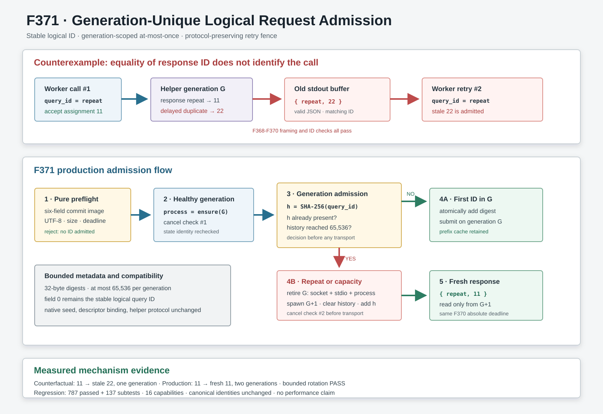

# F371：Generation-Unique Logical Request Admission

## 摘要

F367-F370已依次闭合artifact内容身份、持久helper故障原子性、完整请求预检和双通道deadline，
但响应关联仍只有一个条件：JSON中的`request_id`必须等于本次逻辑`query_id`。QueryStore在lease重试时会
复用同一内容寻址query ID；如果helper在第一次成功响应后又迟到输出一个同ID重复响应，第二次重试会把它当成
本次响应。ID相等因此是必要条件，却不足以证明响应属于当前调用。

F371引入**generation内唯一逻辑请求准入**：一个逻辑query ID在同一持久helper generation中最多进入
transport一次。首次出现时登记固定32字节SHA-256指纹并正常复用prefix cache；同ID再次出现时，在发送
descriptor或文本frame之前淘汰整个旧generation，冷启动新helper后再提交。历史集合最多保存65,536个指纹，
达到上限也保守换代，避免长期fuzzing过程中元数据无界增长。

该设计不修改native六字段协议，不替换字段0，也不改变Z3选择性求解的稳定种子。它提供的是
`at-most-once per helper generation`，而不是跨进程、跨worker或跨故障的全局exactly-once。



## 1. 审查发现

### 1.1 既有成功路径

一次`PersistentSubprocessSolver`调用按以下顺序运行：

1. 从`WorkLease`冻结六字段request preview；
2. 验证timeout类型/范围、全部字段grammar、UTF-8和总frame字节上限；
3. 建立绝对monotonic deadline，并登记当前可取消请求；
4. 选择或冷启动helper generation；
5. sealed模式先以`SCM_RIGHTS`发送prefix/target memfd；
6. 通过stdin pipe发送文本frame；
7. 在同一deadline内读取一个JSON对象；
8. 验证响应ID等于请求ID，再返回solver结果。

F368保证任一不确定transport/response故障会回收整代，F369保证预检图像等于实际提交图像，F370保证步骤5-7
共享一个绝对deadline。缺口出现在“步骤7读到的合法同ID响应究竟由哪一次调用产生”。

### 1.2 可执行反例

证据helper对第一次`repeat`执行以下输出：

```text
request #1: repeat
response:  request_id=repeat, assignment=11
delay
duplicate: request_id=repeat, assignment=22
```

worker在收到11后已完成第一次调用。driver等待22被flush到旧helper的stdout，再用同一逻辑ID提交第二次请求。
移除F371准入这一处机制的反事实稳定得到：

| 观察项 | 结果 |
| --- | --- |
| helper启动次数 | 1 |
| 两次调用是否同generation | 是 |
| 第一次assignment | 11 |
| 第二次assignment | 22 |
| 第二次是否接收迟到重复响应 | 是 |

22的JSON格式正确，且`request_id == repeat`，因此F368的单frame、UTF-8、JSON和ID检查全部通过。这不是字段注入；
它是同一逻辑ID重试时的调用关联歧义。

## 2. 为什么不增加随机transport ID

最直接的RPC设计是为每次调用产生独立correlation token，但当前native协议的字段0同时承担多种语义：

- `runServer()`把`fields[0]`保存为`request_id`并由`writeResult()`原样回显；
- `ArtifactDescriptors.receive()`用它校验`SCM_RIGHTS` datagram payload；
- `checkSolver(..., fields[0], ...)`把它带入稳定随机种子、generator metadata和选择性求解路径；
- 现有Python helper和第三方兼容helper都把字段0理解为逻辑query ID。

若把字段0直接替换为随机token，虽然可以区分两次调用，却会改变求解策略的可重复性、artifact绑定语义和helper
兼容契约。若扩展为第七字段，则需要同时版本化Python、native和外部helper协议。F371采用generation fencing，
在保持协议和算法身份不变的前提下消除当前歧义。

## 3. 设计与执行次序

### 3.1 完整生产时序

F371后的调用严格按以下次序执行：

1. **纯预检**：构造最终六字段tuple，完成F369/F370全部验证和frame编码；失败不触碰helper，也不登记ID。
2. **建立调用状态**：固定absolute deadline，设置`_active_query`、取消事件和`_active_deadline`。
3. **获得健康generation**：`_ensure_process()`拒绝closed状态，并替换已失效或已退出的helper。
4. **第一次取消检查**：若portfolio已有SAT winner，淘汰当前generation并返回cancelled结果。
5. **计算准入指纹**：严格UTF-8 query ID计算`SHA-256(query_id)`，只保留32字节digest。
6. **判定换代**：若digest已存在，或当前generation已有65,536个唯一digest，则先执行F368整代回收，再冷启动。
7. **原子登记**：在`_state_lock`下复核process身份、valid位与存活状态，把digest加入当前generation集合。
8. **第二次取消检查**：覆盖重复ID导致冷启动期间发生的portfolio取消；命中时同样回收新generation。
9. **双通道提交**：sealed descriptor、文本frame和response读取继续共享F370的绝对deadline。
10. **响应准入**：只接受一个有界、严格UTF-8、JSON object、ID完全相等的响应；否则整代回收。
11. **清理调用状态**：仅由仍匹配本次cancel event的调用清除active字段。

`_io_lock`串行化同一个solver实例的调用，`_state_lock`保护process/generation状态；取消和关闭仍可在I/O线程之外并发
发生。重复检测发生在所有descriptor/pipe副作用之前，因此旧generation不会看到重试frame。

### 3.2 Generation生命周期

`_generation_query_ids`在成功创建新helper后清空，而不是在错误刚被标记时清空。这使集合始终与一个实际process
generation绑定：旧process尚未被替换时不会把历史错误地解释为新代历史；新`Popen`和socketpair均成功后才开始
空集合。

首次请求无论最终得到SAT、UNSAT、UNKNOWN还是error，都已经占用其generation内ID。原因是响应一旦可能进入
stdout，就不能证明以后不会出现同ID迟到副本。若请求在descriptor、write或read阶段失败，F368已淘汰整个
generation；若在纯预检阶段失败，则尚未准入，不占用ID。

### 3.3 有界历史

直接保存原始ID有两个问题：ID长度可变，且长期helper可处理大量查询。F371保存SHA-256 digest并设置
65,536项上限：digest净载荷最大2 MiB，Python容器自身另有实现相关开销，但不再随请求数无限增长。达到上限时
下一请求主动换代。哈希碰撞只会导致保守的额外换代；换代后空集合仍会准入该请求，因此不会把一个旧响应错误
接纳为新响应。

## 4. 正确性不变量

| 编号 | 不变量 | 实现机制 |
| --- | --- | --- |
| G1 | 纯预检失败不登记ID、不换代 | 准入发生在frame完整验证之后 |
| G2 | 同一逻辑ID在一个generation最多提交一次 | digest membership + transport前换代 |
| G3 | 重试不能读取旧generation stdout | F368关闭stdio并TERM/KILL旧进程组 |
| G4 | 不改变native字段0语义 | 文本frame仍携带原逻辑query ID |
| G5 | 不同ID继续复用同一generation和prefix cache | 仅repeat/capacity触发换代 |
| G6 | 历史内存有确定上界 | 32字节digest，最多65,536项 |
| G7 | 取消覆盖重复ID冷启动窗口 | 准入前后各检查cancel event |
| G8 | process替换竞态失败关闭 | state lock下复核身份、valid位和`poll()` |

可概括为：

```text
submit(G, q) => q not in admitted(G)
retry(q)     => retire(G); submit(G+1, q)
```

这条性质与F370的deadline正交：deadline约束一次调用何时结束，F371约束某个generation允许哪些逻辑调用进入。

## 5. 与QueryStore/portfolio语义的关系

QueryStore query ID由规范化查询内容摘要产生，lease token区分所有权尝试。worker故障、lease过期或portfolio取消后，
同一query可能合法重试，因此不能简单拒绝重复逻辑ID。F371允许重试，但把它放入新helper generation。

代价是该重试丢失旧generation内的Z3 prefix cache、partial-solution cache以及helper局部policy状态；正常的不同ID
请求仍复用这些状态。该选择优先保证模型与调用关联正确。它不替代QueryStore的lease fencing、result commit或
跨worker内容身份，也不声称跨process exactly-once。

## 6. 测试设计

### 6.1 确定性driver

`run_same_id_retry_checks.py`使用真实子进程、stdin/stdout pipe和实际
`PersistentSubprocessSolver`：

- 反事实只替换新增的准入方法，保留所有F368-F370 transport/reader检查；第二次稳定接收22；
- production不mock transport，第二次在generation 2接收新的11；
- 非法newline pathname在预检阶段拒绝，随后同ID合法请求仍使用原PID；
- 两个不同ID使用同一PID，证明正常prefix复用路径未被全局禁用；
- 把容量上限临时设为1，第二个不同ID触发换代，证明历史有界策略可执行；
- 连续两遍JSON字节一致，最终driver SHA-256为
  `2bdd7cb0b3975b2e1bc51358255c9797bce3c156d826bb505d0d49ec934d4cb8`。

### 6.2 回归矩阵

| 验证层 | 实测结果 |
| --- | --- |
| F371反事实/production driver | PASS，连续两遍JSON字节一致 |
| QueryStore定向 | 20 passed + 12 subtests，4.96 s |
| QueryStore/QF_BV/semantic/distributed关联 | 227 passed + 30 subtests，31.69 s |
| native query/string filtered lit | 10/10 passed，226 discovered、216 excluded，5.28 s |
| F368/F369/F370历史driver | 三份归档JSON逐字节一致 |
| 规范pytest身份 | expected=observed=787，digest不变 |
| 完整16-capability门禁 | 787 passed + 137 subtests，115.91 s |

完整门禁中skip、xfail、xpass、deselection、collection error、missing/unexpected/duplicate nodeid均为0。

## 7. 先进性、创新性与挑战

### 7.1 稳定逻辑身份与调用关联解耦

符号执行系统希望query ID稳定，以便内容寻址、重放、调度和solver随机策略可复现；RPC系统又希望每次调用有唯一
关联身份。当前协议只提供一个字段。F371没有把稳定ID随机化，而是用可丢弃process generation作为第二维身份：
有效关联键由`(generation, logical_query_id)`构成。这是一种兼容现有solver协议的系统性补强。

### 7.2 从错误后恢复扩展到成功后迟到输出

F368处理的是已观察到的失败。F371处理更隐蔽的情形：第一次调用已经成功，但helper随后违反“一请求一响应”的
隐含假设。仅在发现第二frame时失败仍可能让重试遭受拒绝服务；transport前的同ID准入从源头保证旧stdout不会
参与重试。

### 7.3 正确性、缓存收益和空间上界的三方权衡

每次重试都冷启动会损失cache，但只对同逻辑ID和容量边界触发；每个不同ID都冷启动则会摧毁Pangolin/Z3 context
复用。无限保存历史又不适合长时间campaign。固定digest与65,536项换代把这三个目标组合成一个明确、可测的策略。

## 8. 科研边界与后续实验

本轮证明的是本地Linux I/T/E-mechanism正确性。没有执行GitHub托管job、完整LLVM lit、vendored QSYM/PIN、
真实MPI或跨主机文件系统资格验证；没有运行公开solver benchmark、fuzzing campaign或LAVA-M，也没有测量
coverage、漏洞数、吞吐、RSS、prefix-cache命中率和重复重试率。因此不能把本轮结果表述为覆盖率或性能提升。

后续性能研究应至少记录：每百万请求的重复ID频率、capacity换代次数、冷启动延迟、换代前cache size、
prefix hit损失、solver CPU和coverage AUC。若将来版本化协议，可以增加独立`attempt_id`并让descriptor、frame、
response共同绑定`(query_id, attempt_id)`；在所有helper升级前，F371仍是保持现有字段0语义的兼容正确性门。

## 9. 复现

```bash
PYTHONDONTWRITEBYTECODE=1 python3 \
  docs/codex/evidence/f371-generation-unique-request-admission-2026-08-11/\
run_same_id_retry_checks.py

PYTHONDONTWRITEBYTECODE=1 PYTEST_DISABLE_PLUGIN_AUTOLOAD=1 \
  python3 -m pytest -q test/test_query_store.py
```

完整证据、日志和SHA-256清单位于
[`evidence/f371-generation-unique-request-admission-2026-08-11/`](../evidence/f371-generation-unique-request-admission-2026-08-11/)。
