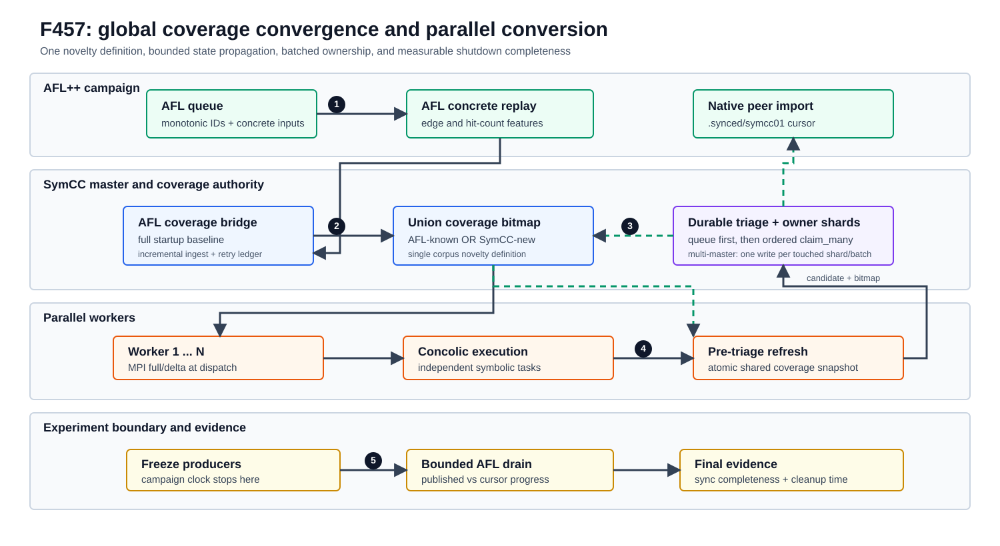

# F457：全局覆盖收敛与并行有效产出优化

**日期：** 2026-08-26  
**性质：** 并行混合执行正确性与效率加固  
**实现范围：** AFL++/SymCC 覆盖同步、长跑队列准入、worker 覆盖刷新、多主覆盖裁决批处理、并行规模在线比较、benchmark 收尾证据

## 1. 结论摘要

本轮工作处理的不是新的求解算法，而是影响所有上层 SOTA 技术实际收益的六个系统问题：AFL 已知覆盖没有在第一次符号任务前成为全局基线；长队列中的历史条目可能耗尽扫描时限；执行中的 worker 使用过期覆盖过滤候选；多主模式逐候选、逐分片持久化；相邻时间窗的并行度比较混入覆盖收益自然衰减和在途任务；实验结束时把同步等待计入吞吐，同时又可能漏掉最后一批 SymCC 输入。

修复后，系统建立以下闭环：

1. master 在首次派发前完整回放 AFL queue，并持续增量吸收 AFL 新输入；
2. `AFL 已知覆盖 OR SymCC 新覆盖` 成为统一、单调的 novelty 定义；
3. worker 在执行后、候选过滤前读取最新原子快照，降低并行重复回传；
4. 多主覆盖裁决按 candidate 顺序归因、按 shard 批量持久化；
5. 并行度用 A-B-A switchback 窗口比较，旧规模的迟到结果不污染新窗口；
6. benchmark 在生产者冻结时停止实验计时，再单独测量 AFL drain 和清理时间。



## 2. 修复前为什么会限制并行收益

| 问题 | 原行为 | 后果 |
| --- | --- | --- |
| 启动覆盖缺口 | master 从空 bitmap 开始，AFL queue 只用于选输入 | AFL 已见特征可能被误记为 SymCC 新发现；早期 worker 重复生成 |
| 队列尾部饥饿 | 扫描时限在过滤 `seen` 前生效 | 大量历史文件排在前面时，新追加的高价值输入长期进不了符号执行 |
| busy worker 视图过期 | bitmap 主要在下一次 MPI 派发时更新 | 长任务结束时仍按旧覆盖回传候选，worker 越多，重复传输和 triage 越重 |
| owner 写放大 | 每个候选分别锁、读、写涉及的 shard | 并行产出增加后，持久化和目录同步进入 master 串行热路径 |
| 并行度比较混杂 | 用连续相邻时间窗直接比较 worker 数 | 后一窗口通常面对更难的剩余路径；在途旧任务又被算进新规模，决策不稳定 |
| 停止边界失真 | teardown 与同步等待混入 campaign wall time | 吞吐口径随清理速度变化；最后发布输入又可能未被 AFL 导入 |

旧的去重集合在超限时整表清空也会形成“重复任务悬崖”：大量历史输入在同一时刻重新具备准入资格。现在改为逐出到低水位；容量为 1 等边界仍严格满足硬上限。

## 3. 新执行流程与不变量

### 3.1 启动阶段

1. master 读取 AFL 配置和 queue；
2. `AflCoverageBridge.ingest_queue()` 对完整启动语料执行 concrete replay；
3. stdin 目标优先用一次 corpus showmap，且 `require_all=True`；批处理失败时逐输入重试，不把部分结果伪装成完整基线；
4. 成功输入以稳定 regular-file identity 记账，失败输入保留在 retry 集合；
5. bitmap 合并允许稀疏 64 KiB 基线与 AFL++ 协商出的更大原生 map 进行零扩展，避免因长度不同静默丢弃覆盖；
6. 若启用多主，特征先经 coverage owner 裁决，再立即收敛到本地 bitmap；
7. master 记录 bitmap journal，并发布首个共享覆盖快照；完成这些步骤后才派发第一个任务。

### 3.2 稳态并行阶段

1. queue scanner 先跳过已处理路径，再计算“未见输入准入工作”的数量和时间预算；历史前缀不再消耗新输入预算；
2. master 依据调度策略选择输入，以 MPI full bitmap 或版本化 delta 派发给 worker；
3. worker 独立运行 concolic execution；
4. master 同时吸收新的 AFL queue 输入、合并覆盖、更新 journal，并按 100 ms 默认节流发布原子快照；
5. worker 执行结束后、运行 showmap 和内容去重前，读取比本地版本新的快照；损坏、超限或旧版本快照被忽略，MPI bitmap 仍是兼容路径；
6. worker 只回传相对最新视图仍可能有价值的候选；master 是最终覆盖裁决者。

共享快照使用 `SCOVv1` header、单调版本、显式长度和 64 MiB 上限。写入采用同目录临时文件加 `os.replace`，读取者只会看到旧的完整版本或新的完整版本。它是低延迟优化，不替代 MPI 协议和持久 journal。

### 3.3 多主批量裁决阶段

对一个 worker result 中的候选，master 按以下次序处理：

1. 按候选原顺序，对“当前全局覆盖 + 本批更早候选”计算预览增量；
2. 只为本地仍新颖的候选生成连续 queue ID，并原子发布 queue 文件；
3. 对 queue 目录执行一次 durability barrier；
4. `claim_many` 按 shard 聚合所有候选特征；每个 touched shard 只加锁、读取和持久替换一次；
5. shard 内仍按原 candidate 顺序计算新位，因此返回的 novelty 可准确归因到各候选；
6. 即使另一 coordinator 赢得全局 claim，本地已完整发布的 queue ID 仍保留，避免 AFL peer cursor 因编号缺口停滞；其内容摘要立即登记，避免下一轮再次符号执行；
7. 新特征合并进本地 union bitmap，再写 journal、更新共享快照和调度反馈。

旧持久化次数近似为 `候选数 C × 每候选触及 shard 数`；新路径为 `本批触及的不同 shard 数 S`。这是确定的 I/O 次数下降，不等价于已经证明端到端加速。该事务是“每 shard 原子”，不是跨全部 shard 的分布式原子事务；queue 先持久化保证崩溃后仍可通过 concrete replay 收敛。

### 3.4 必须始终成立的约束

- 全局覆盖只增不减：`G(t+1) = G(t) OR delta(t)`；
- AFL 和 SymCC 使用同一 edge/hit-count feature 域；
- worker 可以预过滤，只有 master/coverage owner 能决定最终 novelty；
- queue entry 的持久化先于其覆盖 claim；
- batch 优化不能改变 candidate 顺序或 novelty 归因；
- showmap/文件身份失败必须可重试，不能记作已同步；
- 过期快照和旧并行 cohort 的结果不能回退或污染当前控制状态。

## 4. 并行规模的在线 switchback 控制

旧控制器比较相邻窗口 A、B。混合测试的覆盖收益通常随时间下降，因此即使 B 更好，也可能仅因发生得更晚而显得更差。本轮改为三窗口 `A（基线）→ B（相邻规模）→ A（确认）`，用两个 A 窗口的均值估计 B 时刻的基线：

```text
signal     = reward + 0.25 * coverage_delta + 0.10 * interesting
throughput = signal / wall_window
objective  = throughput / workers^0.35
objective *= max(0.1, 1 - 0.9 * timeout_ratio)
baseline_B = (objective_A_before + objective_A_after) / 2
```

当 `objective_B + 8% 容差 >= baseline_B` 时接受 B，否则回到 A，并对被拒绝的方向设置短 cooldown。各规模维护 EWMA 观测。每次规模变化生成新 cohort；旧规模在途任务可以正常完成，但不进入当前实验窗口。

这里的 A-B-A 结构借鉴 switchback experiment 用时间反转减少趋势偏差的思想，但本实现是确定性的在线工程控制器，不是随机化因果实验。`0.25/0.10/0.35/8%` 均为项目初始启发式参数，尚需在公开目标、等 CPU 预算、多 seed 长时实验中校准，不能写成论文给出的普适常数。

## 5. Benchmark 收尾与新证据

新的 hybrid 停止次序为：

1. 到达预算时冻结 campaign wall clock；
2. 停止 MPI、honggfuzz、Grimoire 等语料生产者；
3. 记录冻结时 `symcc01/queue` 已发布数量；
4. 保持 AFL master 存活，在有界窗口内观察 `.synced/symcc01` cursor；
5. 停止 secondary AFL；
6. 最后停止 master，由 `AFL_FINAL_SYNC=1` 执行退出同步；
7. 单独记录 cleanup time，不把它计入实验吞吐分母。

| 指标 | 解释 |
| --- | --- |
| `symcc_peer_frozen_published` | campaign 停表时 SymCC peer 的固定发布总数 |
| `symcc_peer_cursor_before_final_sync` | 停止 AFL master 前已观察到的 native peer cursor |
| `symcc_peer_pre_stop_complete` | 有界 drain 内 cursor 是否追上固定发布总数 |
| `symcc_sync_drain_seconds` | 实际等待在线同步的时间 |
| `symcc_peer_sync_complete` | 在线 drain 或最终同步后是否完整 |
| `cleanup_time` / CSV `cleanup_time_sec` | 停表后的独立清理成本 |

`SYMCC_AFL_SYNC_DRAIN_SEC` 默认 5 秒、上限 30 秒。它提高结束边界的可观测性，但不会把未完成同步伪装成完成；报告应同时展示 published、cursor 和 complete。

## 6. 配置与可观测性

| 配置 | 默认值 | 作用 |
| --- | ---: | --- |
| `SYMCC_SHARED_COVERAGE_SNAPSHOT` | `1` | 启用 busy-worker 覆盖刷新 |
| `SYMCC_SHARED_COVERAGE_SNAPSHOT_INTERVAL` | `0.1` 秒 | master 快照发布节流 |
| `SYMCC_QUEUE_SCAN_MAX` | `8192` | 每轮未见输入准入数量上限 |
| `SYMCC_QUEUE_SCAN_BUDGET_SEC` | `1.0` 秒 | 每轮未见输入准入工作预算 |
| `SYMCC_QUEUE_POLL_INTERVAL` | `0.5` 秒 | 独立coverage poll及busy-path调度扫描节流 |
| `SYMCC_AFL_COVERAGE_RESCAN_POLLS` | `120` | 目录代次未变化时的强制审计扫描周期 |
| `SYMCC_AFL_SHOWMAP_TIMEOUT_MS` | 现有 showmap 默认 | 启动和增量 concrete replay 超时 |
| `SYMCC_AFL_SYNC_DRAIN_SEC` | `5` 秒 | campaign 停表后的 AFL 在线 drain |
| `SYMCC_PARALLEL_INTERVAL` | `20` 秒 | 一个并行控制窗口的最短长度 |
| `SYMCC_PARALLEL_STEP` | `max(1, workers/8)` | 相邻试验规模间隔 |

master 定期和退出时输出 `AFLCoverageBridge`、`CoverageGossip` 与 `ParallelController` snapshot。新增关键计数包括：启动/增量同步次数、queue完整扫描/目录代次命中跳过次数、已跟踪/待重试 AFL 输入、全局新增特征、owner claim batch 数、shard 写次数、各并行规模 EWMA、完成/接受实验数、旧 cohort 丢弃数及 cooldown。

## 7. 验证结果

本轮新增或强化的测试覆盖：

- 完整 AFL 启动并集、增量输入只回放一次、失败重试及准确 examined 计数；
- 稀疏小图与更大/更小原生 bitmap 的零扩展合并；
- 长历史在数量预算和时间预算下都不能饿死 queue 尾部新输入；
- 原子快照的版本单调、损坏拒绝、尺寸边界和 worker 合并；
- `claim_many` 的 candidate 顺序与顺序 claim 等价，同 shard 四候选只写一次；
- 全局 claim 竞争失败后，本地已发布 child 仍登记摘要，不被再次符号执行；
- A-B-A 接受、拒绝、上限向下探测、cooldown 和旧 cohort 隔离；
- campaign 冻结、AFL peer 有界 drain、CSV/结果字段传播；
- 容量为 1 以及常规低水位的渐进去重表裁剪。

最终验证结果为：专项四模块 **316 passed、104 subtests**（25.21 秒）；项目默认完整门禁 **1556 passed、579 subtests**（305.55 秒）。完整门禁只有 4 条 Python 3.12 多线程进程调用 `fork()` 的弃用告警，无测试失败；严格语法/未定义名 lint 通过。原始输出见 [`F457证据目录`](../evidence/f457-global-coverage-convergence-2026-08-26/)。

这些测试证明协议、状态转换、失败路径和 I/O 次数语义正确；它们不证明覆盖率提升百分比或端到端并行加速。后者必须通过公开 benchmark 的等 CPU、多 seed、长时 campaign 另行给出。

有界去重表仍存在明确取舍：被低水位逐出的很老记录未来可能再次准入。新策略把这种代价摊开，避免整表清空引发集中重复，但不是无限历史的精确去重；需要无限期记忆时应使用持久摘要 ledger。

## 8. 实现文件

- `util/mpi_fuzzing_helper.py`：覆盖 bridge、bitmap 零扩展、queue 扫描、worker 快照、批量 triage、去重和控制器接线；
- `util/distributed_state.py`：coverage owner `claim_many` 与批写遥测；
- `util/adaptive_components.py`：A-B-A switchback controller、cohort 和 per-level EWMA；
- `benchmark/run_benchmark.py`：campaign/cleanup 时间分离、AFL drain、输出字段；
- `test/test_mpi_lifecycle.py`、`test/test_distributed_state.py`、`test/test_afl_profile_orchestration.py`、`test/test_adaptive_components.py`：反例与协议回归。

## 9. 研究边界与下一步

当前可以严谨声明：统一 coverage authority 已落地；启动和运行期 AFL 覆盖可收敛；worker 过期窗口有低延迟刷新；owner 持久化从逐候选改为逐 touched shard/batch；并行规模比较隔离了明显的时间趋势和旧 cohort；benchmark 能区分 campaign、drain 与 cleanup。

当前不能声明：这些修复已经在 LAVA-M 或大型公开目标上带来某个覆盖率、缺陷发现率或吞吐百分比。下一步实验应固定总 CPU 核时，至少比较旧版/新版、AFL-only/hybrid、1/2/4/8/16 symbolic workers，使用多个独立 seed 和足够长的 campaign，并同时报告 edge coverage、unique feature、solver time、worker stale drop、claim shard writes、master triage time、AFL peer sync completeness 和置信区间。

## 10. 依据

1. AFL++ Parallel Fuzzing：主/从实例和 queue synchronization，<https://aflplus.plus/docs/parallel_fuzzing/>。
2. AFL++ Environment Variables：`AFL_SYNC_TIME` 与 `AFL_FINAL_SYNC`，<https://aflplus.plus/docs/env_variables/>。
3. Marco: A Stochastic Asynchronous Concolic Explorer, ICSE 2024，<https://conf.researchr.org/details/icse-2024/icse-2024-research-track/10/Marco-A-Stochastic-Asynchronous-Concolic-Explorer>。
4. CherryPicker: A Hybrid Parallel-Mode Concolic Execution Engine, IEEE TDSC 2025, DOI `10.1109/TDSC.2025.3530010`，<https://hub.hku.hk/handle/10722/361948>。
5. Bojinov et al., Design and Analysis of Switchback Experiments, 2020，<https://arxiv.org/abs/2009.00148>。本项目只借鉴 A-B-A 时间反转思想，不声称完成该论文的随机化因果估计。
