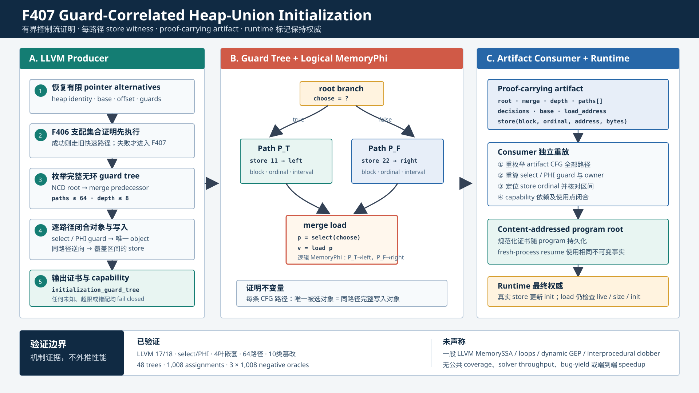

# F407：Guard-Correlated Heap-Union Initialization

## 文档元数据

- 功能编号：F407
- 完成日期：2026-08-16
- 实现等级：I/T/E-mechanism
- 生产能力：`bounded-guard-correlated-heap-union-initialization`
- 证书 schema：`symcc-guarded-heap-union-initialization-v1`
- 主要实现：[`compiler/ContinuationLowering.cpp`](../../../compiler/ContinuationLowering.cpp)、
  [`util/live_continuation.py`](../../../util/live_continuation.py)
- 回归入口：[`test/live_guarded_heap_union_initialization.ll`](../../../test/live_guarded_heap_union_initialization.ll)
- 证据目录：[`f407-guard-correlated-heap-union-initialization-2026-08-16`](../evidence/f407-guard-correlated-heap-union-initialization-2026-08-16/)

## 1. 结论先行

F407 关闭了 F406 明确保留的首要缺口：不同控制流前驱分别初始化不同 heap object，合并点
再按同一控制条件选择对应对象时，任何单条 store 都不支配 load，旧规则会把实际已初始化的
程序拒绝。

本次实现不是放宽检查，而是加入一个有界、可重放的路径证明：

1. 编译器从合并块的最近公共支配点恢复完整、无环的 guard tree；
2. 对每条 root-to-merge 路径，使用 `select` 条件或 pointer-PHI edge discriminator 确定唯一
   load object；
3. 在同一路径逆向寻找覆盖 load 字节区间的唯一对象 store；
4. 输出 root、merge、全部路径、分支决策、对象基址和 store 位置组成的 proof-carrying
   transcript；
5. Python consumer 不信任生产者结论，重新枚举 artifact CFG、重算 guard 选择、对象归属和
   store witness；
6. runtime 仍以真实 heap `live/size/init` marker 决定访问是否可行，证书不直接写入初始化状态。

因此，F407 把“所有候选对象都必须由支配写入初始化”扩展为“每条可认证 CFG 路径都必须写入
该路径实际选择的对象”，同时保持失败关闭。



## 2. 问题与旧规则为何失败

考虑下列控制流：

```llvm
br i1 %choose, label %left, label %right

left:
  store i8 11, ptr %left_object
  br label %merge

right:
  store i8 22, ptr %right_object
  br label %merge

merge:
  %p = select i1 %choose, ptr %left_object, ptr %right_object
  %v = load i8, ptr %p
```

程序的语义关系是：

| 路径条件 | 被写对象 | load 选择对象 | 是否初始化 |
|---|---:|---:|---:|
| `%choose = true` | left | left | 是 |
| `%choose = false` | right | right | 是 |

F406 只累计支配 load 的 store。`left` 和 `right` 中的 store 都不支配 `merge`，因此 F406 必须
拒绝。若简单地把“支配”检查删除，则错误程序也会被接受，例如 true 路径写 left、却读取
right。缺少的不是更多 alias，而是控制谓词、pointer alternative 与 memory definition 的
三方相关性。

## 3. 学术与工程依据

### 3.1 SymCC 与传统路径执行

[SymCC](https://www.usenix.org/conference/usenixsecurity20/presentation/poeplau) 将 concolic
逻辑编译进目标程序，以接近原生执行速度收集符号表达式。F407 沿用这一编译式边界：证明在
LLVM lowering 阶段形成，执行器消费有限 artifact，而不是在运行时启动通用 LLVM 分析。

[KLEE](https://www.usenix.org/conference/osdi-08/presentation/klee-unassisted-and-automatic-generation-high-coverage-tests-complex)
代表经典多状态符号执行模型：控制分支通常产生带不同路径条件的状态。F407 不取消真实控制流
分叉；它避免的是为了证明“哪个对象被初始化”而额外按 heap alias 复制状态。

### 3.2 POSE 的启发及严格边界

[POSE](https://arxiv.org/abs/2407.16827) 针对 heap-manipulating programs 追求 path
optimality，将对象别名与差异关系编码进符号堆表达式，只在程序真实控制路径处 fork。F405 到
F407 借鉴的是“不要为对象候选制造额外伪路径”的方向：有限 heap base、条件生命周期和路径
相关初始化都保留在一个 continuation 公式中。

但本实现不是完整 POSE：它不支持初始符号堆、fresh object materialization、任意对象图、
字段逻辑或一般 lazy initialization。支持域是 lowering 已布局的普通 C heap objects。

### 3.3 与 LLVM MemorySSA 的关系

[LLVM MemorySSA 官方文档](https://llvm.org/docs/MemorySSA.html)规定：memory-reading
instruction 对应 `MemoryUse`，可能修改内存的 instruction 对应 `MemoryDef`，多个前驱的
may-reach definitions 在 block 入口由 `MemoryPhi` 合并；clobber walker 可结合 alias analysis
查询实际 clobber。

F407 实现的是 **MemoryPhi-inspired bounded guard-tree proof**：它在一个无环、有限的
root-to-merge 区域中，为每个前驱路径携带一个 store definition，并在 merge load 处按同一
guard 选择对应 definition。当前 C++ pass 没有构造或序列化 LLVM `MemorySSA` 对象，也没有
输出一般 clobber chain。后者仍是 F408 的独立工作，不能由 F407 的结果外推。

## 4. 形式化准入条件

设 merge load 为 `L`，load 的有限 pointer alternatives 为 `A`，从 root 到 merge 的完整
路径集合为 `P`。每条路径 `p` 携带分支决策序列 `D(p)`。

### 4.1 路径完备性

生产者必须满足：

```text
2 <= |P| <= 64
1 <= max(|D(p)|) <= 8
P 恰好覆盖 merge 的全部 CFG predecessors
每个 predecessor 恰好对应一条路径
每条路径无环，且每条最多引用 64 个 block
全部路径合计最多引用 64 * 64 个不同 block
```

路径枚举固定采用 true successor 后 false successor 的 DFS 顺序；artifact consumer 用同一
CFG 事实重新枚举，而不是接受 transcript 自报顺序。

### 4.2 路径与 pointer alternative 相关性

对 alternative `a` 的 guards 与 `D(p)` 求兼容关系。支持两类路径判别：

1. `select`：guard 的 LLVM condition 必须与路径上 branch condition 是同一 SSA value，且
   `equals` 与该路径取值一致；
2. pointer PHI：guard 必须引用 merge block 的共享 edge discriminator，`equals` 必须等于
   该 predecessor 的稳定 block ID。

heap allocation identity guard 不决定控制路径，但必须把 alias case 绑定到 capacity-1 普通
heap allocation 的唯一 base。其他未识别 guard 只允许在该 candidate 已被外层 guard 排除后
出现；若 candidate 仍可达则整体拒绝。

令 `Sel(p)` 为路径上未被 guard 排除的 alternatives，要求：

```text
Sel(p) 非空
Sel(p) 中的项必须具有相同 heap allocation identity、address 和 object offset
```

这允许同一地址的等价 alternative 去重，但不允许一条路径仍对应多个对象。

### 4.3 同路径 store witness

令路径选中的对象为 `o_p`，load 对象内区间为
`[loadOffset, loadOffset + loadBytes)`。证明器从 predecessor 向 root 逆向寻找 store `S_p`，
要求：

```text
S_p 非 volatile、非 atomic
S_p 的 pointer domain 恰好一个 alternative
S_p 与 o_p 的 heap allocation identity 和 base 相同
storeOffset <= loadOffset
loadOffset + loadBytes <= storeOffset + storeBytes
```

当前切片要求至少两个不同 store instructions 和至少两个不同 heap bases。包含一般 call 的
block 不作为 witness block，以免在尚无 Mod/Ref transcript 时越过未知 clobber 关系。

### 4.4 完整接受谓词

可以将准入写成：

```text
Accept(L) iff
  CompleteAcyclicGuardTree(P, root, merge)
  and forall p in P:
        UniqueObject(Sel(p))
        and ExistsSamePathCoveringStore(S_p, Sel(p), L)
  and |unique(S_p)| >= 2
  and |unique(base(Sel(p)))| >= 2
```

任一条件未知、超限或不一致都返回 `nullopt`，随后 load 沿原有失败关闭路径输出
`heap load lacks a dominating ... initializing store`。

## 5. 编译器执行次序

`hasDominatingUnionStore()` 的顺序保持单调兼容：

1. 处理 calloc 等无需本地显式初始化的既有情况；
2. 尝试原有“一条支配 store 覆盖全部 alternatives”快速路径；
3. 尝试 F406“多条支配 store 的集合覆盖”；
4. 前述规则失败后调用 `guardedHeapUnionInitialization()`；
5. F407 成功时输出旧 `initialization_bases` 和新 `initialization_guard_tree`；
6. 同时声明 F406 collective capability 与 F407 guard-correlated capability；
7. 所有规则均失败时拒绝整个 lowering。

这保证 F407 是支持域的单调扩展，不改变原来可证明程序的快速路径。

## 6. Proof-carrying artifact

每个成功 load 保留 owner-base 集合，并增加如下 transcript：

```json
{
  "schema": "symcc-guarded-heap-union-initialization-v1",
  "root": "bb0",
  "merge": "bb3",
  "depth": 1,
  "paths": [
    {
      "blocks": ["bb0", "bb1"],
      "decisions": [{"block": "bb0", "equals": true}],
      "predecessor": "bb1",
      "base": 64,
      "load_address": 64,
      "store": {"block": "bb1", "ordinal": 0, "address": 64, "bytes": 1}
    }
  ]
}
```

实际两臂证书包含两条 path；示例只展示一条以说明字段。

`store.ordinal` 是该 block 内 store instruction 的零基序号，不是全函数 instruction ID。
consumer 用它定位真实 lowered store，并核对 width、address、alias owner 与 allocation guard。

## 7. Consumer 独立重放

`LiveContinuationExecutor._guarded_heap_union_initialization()` 执行以下闭合：

1. schema、精确字段集合、整数/布尔类型和 1--8/2--64 上界；
2. root、merge、terminal branch/jump 及无环路径枚举；
3. pointer-PHI edge block 的透明跳转和 predecessor discriminator；
4. transcript paths 与重建 CFG paths 的逐项精确相等；
5. 重复 branch condition 若出现冲突决策则拒绝；
6. load alias case 的 branch/PHI guard 与 heap allocation identity guard；
7. path base、load address 与普通 heap owner 的一致性；
8. store block/ordinal、宽度、区间、owner 和 allocation identity；
9. transcript bases 与 `initialization_bases` 精确相等；
10. capability 依赖和 capability 至少一个使用点。

这里特意不把 C++ 的布尔结果视为可信输入。artifact 若被截断、重排、换 base、换 store 或删
guard，会在 checkpoint 创建前被拒绝。

## 8. 运行时与持久恢复语义

F407 只控制 lowering admission，不执行以下危险捷径：

- 不把证书中的 base 直接标记为 initialized；
- 不跳过 `live`、runtime size 或逐字节 init 检查；
- 不为 alias choice 创建新的 continuation state；
- 不新增不可恢复的进程内缓存或 checkpoint 字段。

规范化 transcript 随整个 program artifact 进入 content-addressed program root。checkpoint
只引用该 root，因此 fresh-process resume 与原进程使用同一不可变证明。实际 store 执行后才
更新 byte-init marker；若路径释放了对象，F405 的条件 `live/size/init` 更新仍使后续访问不可行。

还需注意 concolic concrete projection：solver 探索另一个 branch 时，表达式的 concrete 值仍
可能来自原始 seed。测试因此不直接把 symbolic load 的 concrete projection 当作路径 oracle，
而是在 load 后用符号比较进入返回常量的分支，由 feasibility solver 排除不一致结果。

## 9. 软件工程实现

| 模块 | 实现内容 |
|---|---|
| `ContinuationLowering.cpp` | guard-tree 枚举、alternative 选择、interval witness、证书与 capability |
| `live_continuation.py` | CFG/guard/object/store 独立重放及 fail-closed normalization |
| `check_live_continuation_lowering.py` | 合同检查和 8 类在线篡改；与 oracle 合计 10 类 |
| `live_guarded_heap_union_initialization.ll` | select、PHI、嵌套树、64 路径边界、三类 source negative 与 F408 fallback |
| `generate_guarded_heap_union_initialization_fixture.py` | 生成深度 6、64 叶、127 CFG block 的生产者边界 fixture |
| `check_guarded_heap_union_initialization_oracles.py` | 独立有限域语义与手工 artifact validator oracle |
| `benchmark_guarded_heap_union_initialization.py` | Python 参考证明成本和分析态基数 |

## 10. 测试设计与结果

### 10.1 LLVM 生产链 fixture

| 用例 | 预期 | LLVM 17 | LLVM 18 |
|---|---|---:|---:|
| 两臂 `select` | 返回 11、22；2-path transcript | PASS | PASS |
| 两臂 pointer PHI | 返回 31、42；edge discriminator | PASS | PASS |
| 两层四叶 `select` | 返回 51、62、73、84 | PASS | PASS |
| 深度 6 完整树 | 64 paths、384 decisions，返回 1 | PASS | PASS |
| guard/store 对调 | lowering 拒绝 | PASS | PASS |
| 一条路径缺 store | lowering 拒绝 | PASS | PASS |
| store 宽度小于 load | lowering 拒绝 | PASS | PASS |
| 同一 condition 重复、四条边均完整初始化 | F407拒绝；F408按真实MemoryPhi接纳并返回1、4 | PASS | PASS |

F406 原先的 branch-local negative 已改为真正的 guard/store 对调；正确的 branch-local 程序
现在由 F407 接纳，而错误对应关系继续拒绝。2026-08-16 的 F408 演进复核进一步确认：旧
“重复 condition 冲突”程序的交叉组合实际不可达，四条可行 CFG/MemoryPhi edge 均有匹配
store，因此当前由 F408 安全接纳。F407 算法本身仍保守拒绝该形态；这不改变本节封存的
F407 原始证据，当前 source negatives 为错配、缺失和部分宽度三类。

### 10.2 独立有限域 oracle

oracle 不调用生产 C++ helper。它覆盖完整二叉树 depth 1--6、load width 1--8：

| 指标 | 结果 |
|---|---:|
| 正确 guard trees | 48 / 48 接纳 |
| path assignments / interval checks | 1,008 / 1,008 |
| 缺失同路径 store | 1,008 / 1,008 拒绝 |
| guard/store 错配 | 1,008 / 1,008 拒绝 |
| 部分宽度 store | 1,008 / 1,008 拒绝 |
| artifact mutations | 10 / 10 拒绝 |

10 类制品变异包括 capability 删除、decision 翻转、路径复制、foreign base、store ordinal、
store width、alias guard、load allocation identity、store allocation identity 和 transcript
删除。

### 10.3 完整回归

| 门禁 | 实测结果 |
|---|---:|
| Python exact node-ID gate | 1,041 passed + 250 subtests；0 skip/fail/deselect |
| heap/pointer 相关 Python | 17 passed |
| LLVM 17 full lit | 264 passed + 2 既有 unsupported；0 fail |
| LLVM 17 focused | 2 passed |
| LLVM 18 focused | 2 passed |
| LLVM 17/18 `SymCC` build | PASS / PASS |
| Ruff + `py_compile` | PASS |

### 10.4 机制成本

深度 6、64 paths、384 decisions，11 轮、每轮 10,000 次 Python 参考证明：

```text
median = 15,214 ns/proof
minimum batch = 149,953,073 ns
median batch  = 152,146,664 ns
maximum batch = 160,366,661 ns
```

旧 dominance-only 规则对 branch-local stores 的接受结果为 false；F407 参考规则为 true。
`64 -> 1` 只表示“若按每个 guard assignment 复制 memory proof state”与“一个 guarded formula”
之间的分析态基数，不是 wall-clock speedup，也不是路径数减少。

## 11. 多轮 review 中发现并修复的问题

1. **嵌套 guard 顺序**：inner guard 可能先于排除该 candidate 的 outer guard 出现在 alias
   case 中。consumer 原先遇到未知 inner guard 立即拒绝；修复为延迟 unresolved，只有
   candidate 最终仍可达时才失败。
2. **64 路径上限失真**：初版另设 64 个全局 unique blocks，完整二叉树实际只能到 32
   leaves。修复为显式 `64 paths * 64 blocks/path` 引用上界，并用 64 叶生产 fixture 验证。
3. **重复 condition 不一致**：F407 生产者与 consumer 对相同 condition 的冲突重复共同
   失败关闭。后续 F408 不依赖该 guard-tree 近似，而按真实 MemoryPhi incoming 证明全部可行
   edge；若每条边都有匹配 store，可安全接纳。二者是支持域递进，不是证书解释不一致。
4. **allocation identity 可删除**：consumer 原先只检查存在的 identity guards 是否正确，
   没要求必须存在。现 load alias 与 store witness 都要求至少一个精确 heap identity guard。
5. **旧 F406 tamper 隔离**：F407 依赖 F406 capability；F406 自测删除 capability 时会先触发
   F407 依赖错误。测试现先剥离 F407 transcript，再独立检查 F406 信任边界。
6. **测试 concrete 值误读**：alternate state 的 symbolic expression 仍保留 seed concrete
   projection。测试改用 loaded-value branch 与常量返回，避免把投影值误报为 memory 丢失。

## 12. 先进性、创新性与挑战性

### 12.1 先进性

- 将 LLVM 的 dominance、branch predicate、pointer select/PHI 与 heap byte interval 组合为
  一个可审计的 definite-initialization 子域；
- 延续 POSE 的 path-optimal 方向，不为有限 alias candidate 单独生成 continuation state；
- producer 不只输出结果，还输出 consumer 可独立重放的 proof transcript；
- select 和 pointer PHI 共用同一证书语义，PHI 经共享 edge discriminator 绑定 predecessor。

### 12.2 项目内创新

创新点不宣称为新的通用学术算法，而是本框架中的工程组合：

1. 在 compiler lowering 与可持久化 Python continuation 之间建立 guard-tree memory proof
   协议；
2. 将 F405 条件 heap lifetime、F406 owner-base collective certificate 与 F407 path store
   witness 组合，且三层各自保留 capability 与篡改边界；
3. 用规范 DFS path order、稳定 block IDs 和 store ordinal 使跨 LLVM 17/18 artifact 可重放；
4. 把 64-path producer 边界、有限域 oracle 和 consumer mutation tests 组成三角验证。

### 12.3 主要挑战

- LLVM SSA guard 的组合顺序与 CFG path 顺序不同，nested `select` 必须处理“先未知、后排除”；
- pointer PHI lowering 会插入 edge-copy blocks，consumer 必须透明穿越并仍绑定原 predecessor；
- 初始化证明不能篡改 runtime marker，否则会把静态分析错误升级为运行语义错误；
- producer 与 consumer 分属 C++/Python，两端必须对 path ordering、bool/int 类型和 object
  identity 有完全一致的解释；
- 有界算法既要防制品放大，又要让声明的 64-path 上限在真实生产链中可达。

## 13. 声明边界与未完成工作

F407 已实现并有机制证据支持的范围是：

- ordinary local heap objects；
- capacity-1 allocation identity；
- static scalar byte intervals；
- acyclic branch/jump guard tree；
- 最多 64 paths、每路径 64 blocks、decision depth 8；
- select condition 或 merge pointer-PHI discriminator；
- 同路径 singleton store witness。

F407 没有实现：

- LLVM `MemorySSA`/AA walker 的一般 clobber transcript；
- loop-carried memory definitions；
- dynamic-index GEP interval cover；
- interprocedural allocator/initializer summaries；
- arbitrary calls 的 Mod/Ref summary；
- complete POSE symbolic heap；
- public heap-heavy 等 CPU feature-off/on campaign。

因此当前没有 LAVA-M coverage、solver throughput、bug-yield 或端到端 speedup 数字。F407 的
实验结论限于机制正确性、支持域扩展、篡改拒绝和参考证明成本。

## 14. 后续顺序

1. F408：接入 LLVM MemorySSA/AA，输出 load `MemoryUse -> MemoryPhi -> MemoryDef` clobber
   transcript，并由 consumer 重放 location 与 incoming-edge 关系；
2. F409：跨过程 allocator/initializer effect summary；
3. F410：dynamic-index interval 与 byte-lane cover；
4. 在实现闭合后再进行公开 heap-heavy 等 CPU 消融，报告 acceptance、states、solver time、
   coverage AUC 和最终 coverage。

## 15. 复现命令

```bash
ninja -C build SymCC
ninja -C build-llvm17 SymCC

python3 /usr/lib/llvm-18/build/utils/lit/lit.py -sv build/test \
  --filter 'live_(guarded|collective)_heap_union_initialization'
python3 /usr/lib/llvm-17/build/utils/lit/lit.py -sv build-llvm17/test \
  --filter 'live_(guarded|collective)_heap_union_initialization'

python3 benchmark/check_guarded_heap_union_initialization_oracles.py
python3 benchmark/benchmark_guarded_heap_union_initialization.py \
  --depth 6 --repeats 11 --iterations 10000

python3 -m pytest -q test/test_distributed_state.py -k 'heap or pointer'
```

## 16. 最终声明

F407 是一个严格有界、跨语言 proof-carrying、失败关闭的 guard-correlated heap initialization
切片。它实际接纳了 F406 无法处理的 branch-local store + select/PHI load，并在 LLVM 17/18、
64 路径生产边界、独立 oracle、完整回归和 10 类制品变异上通过验证。它体现 MemoryPhi 与
path-optimal heap reasoning 的方向，但不冒充一般 MemorySSA、完整 POSE 或公共 benchmark
收益。
