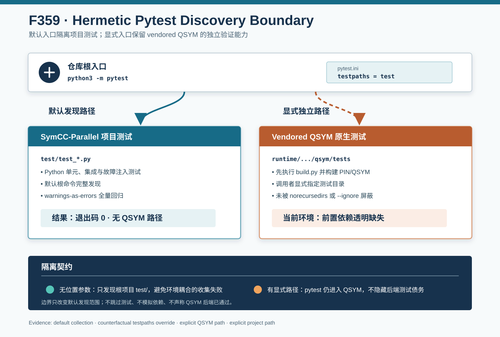

# F359：Hermetic Pytest Discovery Boundary

- 功能编号：F359
- 日期：2026-08-10
- 状态：已实现、已完成发现契约验证与完整回归
- 范围：仓库根 pytest 默认发现边界、SymCC-Parallel 与 vendored QSYM 测试入口分层



## 1. 研究背景与真实缺陷

F358 完整 Python 回归只能显式执行 `python3 -m pytest test`。继续审查根目录测试入口时发现，仓库没有
`pytest.ini`、`pyproject.toml` 或 `setup.cfg` 中的 pytest 配置。无位置参数的 pytest 因此递归扫描整个工作树，
同时发现两套生命周期完全不同的测试：

| 测试域 | 当前模块数 | 前置条件 | 权威入口 |
|---|---:|---|---|
| SymCC-Parallel Python 测试 | 49（修复前） | 当前 Python 开发环境 | 仓库根 `test/` |
| vendored QSYM 原生测试 | 6 | QSYM 安装、PIN runtime、测试目标构建 | QSYM 自身 `tests/` |

基线命令 `python3 -m pytest --collect-only -q` 先发现 776 个项目测试，随后导入 QSYM 的 6 个测试模块；这些模块
均通过 `test_utils.py` 导入独立的 `qsym` 包。当前环境未构建该上游运行时，最终得到：

```text
776 tests collected, 6 errors
ModuleNotFoundError: No module named 'qsym'
exit code = 2
```

这意味着常见的根目录测试命令在任何项目测试开始执行前就失败。失败既不代表 SymCC-Parallel 回归失败，也不能
证明 QSYM 后端有缺陷；它是父项目默认发现范围与 vendored 子项目独立环境之间的边界错误。

## 2. 目标与非目标

F359 建立五条测试入口不变量：

1. 无位置参数的根目录 pytest 只发现 `test/` 中的 SymCC-Parallel Python 测试；
2. 默认发现不得进入需要独立构建环境的 vendored QSYM 测试；
3. 不使用 `norecursedirs`、`--ignore`、动态 skip 或伪造 `qsym` 模块隐藏后端测试；
4. 调用者显式传入 QSYM 路径时，pytest 仍进入该套件并如实暴露前置条件；
5. LLVM lit/compiler 测试、父项目 Python 测试和 QSYM 原生测试继续是三个可单独执行的验证层。

本功能不修改 QSYM 源码、不把 QSYM 测试改写成父项目测试，也不尝试在普通 Python 回归中隐式构建旧版 PIN
运行时。后两种做法会引入宿主内核、工具链和权限耦合，破坏父项目单元测试的可重复性。

## 3. 发现语义设计

根目录新增最小配置：

```ini
[pytest]
testpaths = test
```

`testpaths` 只为“调用者没有给出文件或目录参数”的默认发现提供起点。因此两种调用具有不同且明确的语义：

```text
python3 -m pytest
  -> root pytest.ini
  -> default testpaths
  -> test/

python3 -m pytest runtime/src/backends/qsym/qsym/tests
  -> caller supplied an explicit path
  -> enter QSYM tests
  -> require the QSYM README build contract
```

这里没有添加 `norecursedirs = qsym`，也没有在根 `conftest.py` 中设置 `collect_ignore`。前者可能把显式后端测试
也变成不可见对象，后者会把缺失的后端验证伪装成成功。F359 的边界是默认路由，不是全局过滤。

## 4. 三套测试生命周期

### 4.1 父项目 Python 回归

根目录 `test/test_*.py` 覆盖调度、coverage、solver、parser、分布式状态、MPI 控制协议、研究制品与 benchmark
分析。它现在由以下命令完整发现：

```bash
PYTHONDONTWRITEBYTECODE=1 python3 -m pytest -q -W error
```

### 4.2 LLVM lit/compiler 回归

`test/` 还包含 C、C++、LLVM IR 与 Python lit fixtures。它们由 CMake 生成的 `lit.site.cfg`、LLVM `FileCheck`
以及构建时选择的 `simple`/`qsym` backend 驱动，入口仍是 `ninja check`。pytest 的 `testpaths` 不改变 lit 的
suffix、feature、substitution 或 backend 选择。

### 4.3 QSYM 原生回归

嵌套子模块的 README 明确要求先进入 QSYM `tests/`，运行 `python build.py`，再启动 pytest。该套件依赖 QSYM
包、PIN pintool、其测试二进制和相应宿主环境。F359 保留这个显式入口；当前机器的 `ModuleNotFoundError` 被记录
为 `prerequisite-missing`，而不是 skip、pass 或父项目失败。

## 5. 防回退契约测试

新增 `test/test_pytest_discovery_contract.py`，直接使用当前 pytest 的 `pytestconfig` fixture 检查：

- `rootpath` 精确等于仓库根；
- 实际生效的 `testpaths` 精确为单元素 `test`；
- QSYM 测试路径属于仓库但不属于父项目 `test/`；
- `norecursedirs` 不包含 QSYM；
- `addopts` 不含任何 `--ignore` 形式。

测试不要求嵌套子模块已经初始化，因此浅检出环境仍可验证父项目配置；是否存在 QSYM 文件由显式 QSYM job 的
准备阶段负责。这避免把“测试源尚未 checkout”错误地变成父项目配置测试失败。

## 6. 可重算四路实验

证据 driver 通过生产 pytest 入口执行四路实验：

| 路径 | 命令语义 | 返回码 | 观察 |
|---|---|---:|---|
| 默认 | `--collect-only -q` | 0 | 778 个项目测试，无 QSYM 路径 |
| 反事实 | 额外使用 `-o testpaths=` | 2 | 同为 778 个项目测试，另有 6 个 QSYM 收集错误 |
| 显式 QSYM | 指定 `.../tests/test_utils.py` | 2 | 确实进入 QSYM；当前为 `prerequisite-missing` |
| 显式项目模块 | 指定 `test/test_self_config.py` | 0 | 9 个测试正常发现 |

反事实运行在不删除当前配置的情况下清空 `testpaths`，重现修复前的递归发现语义。默认与反事实的项目测试数相同，
说明配置没有减少父项目测试覆盖，只阻止默认入口越过项目边界。driver 的 12 项语义断言全部通过。

本轮新增两个契约测试，所以修复后的 778 与修复前记录的 776 相差 2；不能把该差值解释为发现了额外生产缺陷。

## 7. 完整验证结果

| 验证层次 | 结果 |
|---|---:|
| F359 配置契约测试 | 2 passed |
| 默认根目录 collect-only | 778 collected，exit 0 |
| 无边界反事实 collect-only | 778 collected + 6 QSYM errors，exit 2 |
| 四路生产命令机制集成 | 12/12 checks |
| 完整根目录 warnings-as-errors Python | 778 passed + 125 subtests（97.27 秒） |

完整回归现在真正使用无路径根命令，而不再把 `test/` 作为命令行补丁。`PYTHONDONTWRITEBYTECODE=1` 保证验证过程
不向源码树生成 Python bytecode；`-W error` 使警告仍然是失败。

## 8. 实现与文档位置

- `pytest.ini`：定义根项目默认发现根；
- `test/test_pytest_discovery_contract.py`：配置加载与无全局忽略契约；
- `docs/Testing.txt`：区分 Python、lit 与 QSYM 原生入口；
- `docs/codex/evidence/f359-hermetic-pytest-discovery-2026-08-10/`：四路 driver、JSON、日志和摘要；
- `docs/codex/diagrams/hermetic-pytest-discovery-2026-08-10.svg`：测试入口分层图。

没有修改 CMake target、lit 配置、QSYM 测试源码、Python import path 或生产符号执行代码。

## 9. 工程价值与先进性边界

F359 的工程贡献是把测试发现域变成版本化、可检查的仓库契约：

1. **环境分层**：快速父项目回归不再意外依赖 PIN/QSYM 的系统级构建环境；
2. **失败归因**：父项目测试失败、QSYM 前置条件缺失和 QSYM 原生测试失败具有不同入口与状态；
3. **显式可达性**：后端测试没有被 skip/ignore，构建完成后仍可直接执行；
4. **反事实证据**：同一工作树可通过清空 `testpaths` 重算旧缺陷，证明修复改变的是发现范围；
5. **默认即权威**：开发者和自动化系统使用最普通的根命令即可运行完整项目 Python 套件。

这是 hermetic testing 和可复现实验基础设施改进，不是新的符号执行算法或学术 SOTA 技术。它提高后续 solver、
coverage、MPI 和 benchmark 优化的证据可信度，但自身不产生路径覆盖率或漏洞发现提升。

## 10. 成本与兼容性

配置解析发生在 pytest 启动阶段，没有生产运行时成本。单次 collect-only 观察从修复前约 2.12 秒、退出码 2，变为
约 0.55 秒、退出码 0；这只是同机单次诊断，不是性能 benchmark，也不报告加速比。

显式文件、显式目录、node id 与 lit 入口保持可用。潜在兼容性要求是：以后若新增父项目 pytest 模块到 `test/`
之外，维护者必须有意扩展 `testpaths` 并同步契约，而不能依赖全仓库偶然扫描。这是预期的所有权约束。

## 11. 局限与有效性威胁

1. 当前环境没有构建 QSYM/PIN，因此只证明显式入口可达和前置条件透明，未执行 QSYM 原生测试；
2. 本轮没有运行 LLVM 17/18 `ninja check`，因为 pytest 发现配置不参与 lit；
3. collect-only 时间是单次描述性观察，未控制缓存、I/O 或系统负载；
4. 测试总数会随后续开发增长，长期稳定契约是范围和返回状态，不是永久固定为 778；
5. 本轮没有运行 solver、MPI、多机、coverage campaign、LAVA-M 或公开 benchmark；
6. 因此没有吞吐、覆盖、time-to-bug、漏洞数量或 SOTA 性能结论。

## 12. 后续计划

1. 在 CI 中增加独立的根 pytest job，使 F359 默认入口成为持续门禁；
2. 为已构建 QSYM/PIN 的容器增加独立 upstream-QSYM job，避免与父项目结果混合；
3. 将 LLVM lit、Python、QSYM 与 benchmark smoke 的状态汇总为分层测试矩阵；
4. 继续审查测试中的环境泄漏、未关闭资源、随机性和跨进程时序假设。

## 13. 结论

F359 修复了仓库根 pytest 将父项目与 vendored QSYM 测试混合收集的真实缺陷。默认根命令现在稳定发现 778 个
SymCC-Parallel 测试并完整通过；清空配置的反事实仍重现 6 个 QSYM 收集错误；显式 QSYM 路径仍进入原生套件并
透明报告当前前置条件缺失。12/12 机制检查和 778 passed + 125 subtests 完整回归支持测试边界结论，但不支持
QSYM 后端通过、符号执行性能提升或 benchmark/SOTA 主张。
