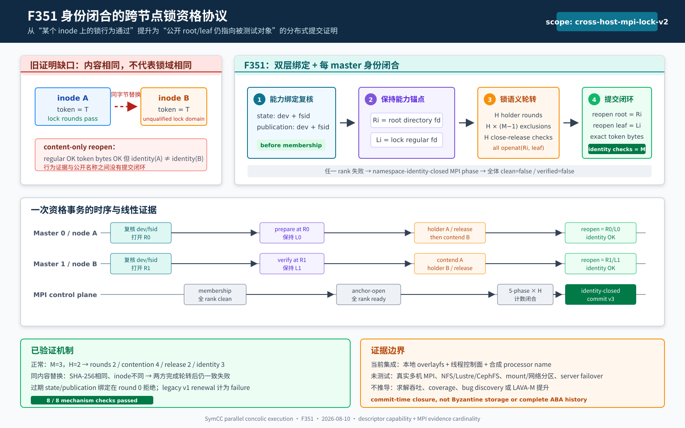

# F351：身份闭合的跨节点锁资格协议

- 日期：2026-08-10
- 状态：已实现；本地生产协议故障注入、定向测试与完整回归已完成
- 成熟度：I/T/E-mechanism
- 前置能力：F327-F333 shared-filesystem capability、MPI lock qualification 与运行期续期；F349-F350 descriptor/namespace closure

> **后续增强说明**：F351的namespace identity closure与v2 capability仍是现行底层证明。F352进一步
> 把资格结果绑定当前generation，增加全master规范化transcript commit，并在renewal completion核对
> ordered ranks与client-local startup capability。参见
> [F352报告](Generation_Bound_Lock_Proof_Transcript_F352_2026-08-10.md)。



## 1. 研究问题

F329 已经把本机 `flock` 探测扩展为 master-only MPI 轮转：每个 processor 代表依次持锁，其他 master
必须观察到排斥，随后另一个 processor 代表必须在 holder 关闭描述符后重新取得锁。F330-F333 又增加了
运行期续期、确定性抖动、配置共识和跨重启配置承诺。这套协议能够验证“参与者当时打开的 inode 是否处在
同一个锁域”，但深度复核发现它没有证明以下命题：

> 完成轮转后，公开路径 `.cluster-filesystem.lock` 是否仍然指向刚刚接受测试的那个 inode，且 state root
> 和 publication root 是否仍属于本机能力探测记录的文件系统。

旧流程在每轮重新以完整 pathname 打开锁文件，核对 regular file 与 epoch token 后关闭。若另一个进程在
最后一轮后用**字节完全相同**的新 inode 替换公开名称，content check 仍通过；已经结束的锁轮转却只证明
旧 inode。类似地，运行期续期沿用初始 capability 中的 `st_dev/f_fsid`，但没有重新核对当前 state/publication
路径的文件系统绑定。这是典型的 check-to-use identity gap，而不是摘要碰撞问题。

F351 的研究目标是把锁行为证据与命名空间证据合并为一个不可拆分的资格事务：每个 master 在轮转前保持
root 与 lock leaf 的目录/文件描述符，所有轮次完成后重新解析公开名称并核对本地 `(st_dev, st_ino)`；只有
全部 master 通过一次独立 MPI 汇总，能力对象才升级为 `cross-host-mpi-lock-v2`。

## 2. 技术依据与相关语义

### 2.1 为什么描述符是合适的能力锚点

Linux `open/openat` 文档将已打开的目录描述符描述为稳定引用：相对 `dirfd` 的后续操作不依赖进程工作目录，
目录被 rename 后描述符仍指向原对象。`O_NOFOLLOW` 可拒绝最终分量 symlink。POSIX 将 `st_dev` 定义为设备
标识、`st_ino` 定义为文件序号，并要求一个处理器可见文件树中的对象可由二者组合唯一标识。因此 F351
使用本地 `(st_dev, st_ino)` 比较“轮转时对象”与“提交资格时公开对象”，而不跨客户端直接比较 inode
数值；不同客户端的设备编号不必相同。

### 2.2 为什么不能只比较内容

锁附着于打开文件，而不是文件名字符串。Linux `flock(2)` 明确说明锁与 open file description 关联，
不同 `open()` 得到的描述可独立冲突；所有相关描述关闭时锁释放。于是两个包含同一 token 的 regular file
仍可能是两个互不排斥的锁域。SHA-256/content token 证明“协议代次一致”，inode identity 才证明“公开
名称仍指向接受轮转的对象”，二者缺一不可。

### 2.3 processor identity 的边界

生产代码仍使用 `MPI_Get_processor_name()` 聚合实际节点；Open MPI 文档将其定义为实际而非虚拟节点的唯一
specifier。若所有 master 返回同名，协议只记录 membership，保持 `cluster_lock_verified=false`，不会把
本机多进程结果误报为跨节点证明。本次保存的集成制品使用合成 processor name 触发生产分支，因此只属于
机制证据，不属于真实多机部署证据。

## 3. 故障模型与不变量

设 `M` 为 master 数，`H` 为去重 processor 数，`R_i` 是 master `i` 打开的 root fd，`L_i` 是其在
`R_i` 下相对打开的 lock anchor fd；`P_root(t)` 与 `P_lock(t)` 表示时刻 `t` 由公开名称解析得到的对象。

### 3.1 覆盖的故障

- capability 生成后，state root 或 publication root 被重新挂载到不同 `st_dev/f_fsid`；
- 锁轮转期间或结束前，公开 lock leaf 被不同 inode 替换，即使内容/token 完全相同；
- root 最终目录项被替换，轮转继续停留在 detached root fd；
- 任一 master 打不开 root/leaf、看到非目录/非普通文件、内容漂移或 identity 漂移；
- 旧 `cross-host-mpi-lock-v1` 能力对象或伪造的布尔 `cluster_lock_verified=true` 被送入运行期续期。

### 3.2 成功不变量

资格成功必须同时满足：

```text
local capability binding:
  current(state).(dev, fsid)       = probed state (dev, fsid)
  current(publication).(dev, fsid) = probed publication (dev, fsid)

lock behavior:
  completed holder rounds  = H
  contention checks        = H * (M - 1)
  release checks           = H

namespace closure on every master i:
  identity(reopen(root))              = identity(R_i)
  identity(openat(reopen(root), lock)) = identity(L_i)
  content(openat(..., lock))           = epoch-bound expected bytes
  identity checks                     = M
```

任一节点失败都会通过 `namespace-identity-closed` 控制面阶段传播为全体失败；不会出现一个 master 提交 v2
能力、另一个 master 继续持有 v1/失败状态的分裂结果。

## 4. 执行流程

### 4.1 启动与续期共同路径

1. 每个 master 本地执行 F327 完整操作探测，快照仍明确标记 `same-host-subprocess-v1`；
2. F351 重新打开 capability 的 canonical state/publication root，核对当前 `st_dev/f_fsid`；
3. master-only MPI 交换 rank、processor name、本机探测与绑定结果；任一失败立即停止，不进入锁轮次；
4. 若 `H < 2`，记录 membership 后返回 clean-but-unverified，不创建跨节点锁证明；
5. 每个 master 用 `O_DIRECTORY|O_NOFOLLOW|O_CLOEXEC` 打开 state root，保持 `R_i` 到事务结束；
6. rank 0 只通过 `R_0 + fixed leaf` 初始化 stable lock，写入 epoch token、file fsync、root fd fsync；
7. 每个 master 相对 `R_i` 打开并验证 lock，保持 `L_i`，再通过 MPI 确认所有 anchor 已就绪；
8. 对 `H` 个代表执行 OPEN → HELD → EXCLUDED → RELEASED → REACQUIRED 五阶段轮转；所有 leaf 打开都相对
   `R_i`，不再重走父 pathname；
9. 每个 master 重新打开公开 root，比较 `R_i`；再相对新 root 打开公开 lock，比较 `L_i` 并复核 exact bytes；
10. 交换 `namespace-identity-closed` 结果，要求 `identity_checks=M`；
11. `qualify_shared_filesystem_cluster_lock()` 再次验证四类基数，生成 v3 capability snapshot 与
    `probe_scope=cross-host-mpi-lock-v2`；
12. 运行期 `ClusterLockRenewalController.complete()` 仅在 scope 为 v2、result/capability identity count 相等且
    至少为 2 时记 success。standalone runtime setup 也要求 v2 与 `M` 个 identity check。

### 4.2 资源与异常闭合

root/lock anchor 覆盖准备、全部锁轮次和最终 namespace closure，并置于 `try/finally` 生命周期中。阶段失败、
MPI 超时、内容错误或 identity 错误都会关闭 anchor；per-round holder/contender fd 在排斥阶段结束时关闭，
使下一 processor 的 release check 能精确观察 close-release 语义。公开路径替换不会把在途 I/O 重定向到
新目录或新 leaf：描述符仍作用于原对象，但最终资格提交会失败。

## 5. 实现细节

| 模块 | 变更 |
| --- | --- |
| `util/distributed_state.py` | capability 增加 `cluster_lock_identity_checks`；升级 gate 要求精确 `M`；v2 proof 使用 v3 snapshot；probe 对 canonical root 记录设备/FSID |
| `util/mpi_filesystem_qualification.py` | current binding 检查、root/leaf descriptor anchors、descriptor-relative prepare/open、最终 root+leaf identity closure、独立 MPI phase、renewal typestate gate |
| `util/mpi_concolic_execution.py` | 运行期续期 setup 拒绝 scope 非 v2或 identity count 与 master 数不一致的 capability |
| `test/test_distributed_state.py` | v3 schema、证据基数及 identity count 缺失拒绝 |
| `test/test_mpi_filesystem_qualification.py` | 同内容 inode replacement、过期 FS identity、legacy-v1 renewal、正常三 master 基数 |

本次没有新增环境变量。旧的本机 full/partial capability schema 仍分别是 v1/v2；只有完成 F351 跨节点身份
闭合后才使用 v3，避免把历史本机探测误解释为更强证明。磁盘锁文件名与内容 schema 未改变，同一 epoch
可以由新版本重新资格；旧 v1 capability 不能直接续期，必须重新运行生产资格协议。

## 6. 正确性论证

### I1：同内容替换不能冒充原锁域

`L_i` 在替换前保持打开，因此旧 inode 不会被释放并复用。替换者可以生成 exact token bytes，但最终相对
公开 root 打开的 fd 具有不同 `(dev,ino)`；至少一个本地 check 失败，经精确 rank-ordered exchange 使全部
master 返回 `clean=false, verified=false, identity_checks=0`。

### I2：detached root 不能提交资格

所有轮转操作都相对 `R_i`，root 被 rename 后不会意外穿入替代目录。最终 reopen(root) 与 `R_i` 比较；若
公开目录项已改变，leaf 内容无需参与便失败。因此“测试留在旧目录”是隔离属性，不会被误当成公开成功。

### I3：过期 capability 不能借续期复活

membership 前每个 master 独立比较 state/publication 的 current `st_dev/f_fsid`。任何失配都以
`local_probe_ok=false` 进入共识记录，锁轮次保持 0。即使外部代码构造一个旧 v1 result，renewal complete
还要求 v2 scope、至少两个 identity checks、result/member/capability 三方基数一致，因而只增加 failure。

### I4：新证明不能由计数不完整的对象构造

能力升级函数要求：processor 至少 2、代表覆盖每个 processor 一次、round=`H`、contention=`H*(M-1)`、
release=`H`、identity=`M`。缺少任意一项都抛出 `ValueError`，不会设置 verified 位。

## 7. 验证结果

### 7.1 自动化测试

| 范围 | 结果 |
| --- | --- |
| F351 定向故障注入与升级 gate | 4 passed，186 deselected，0.63 s |
| distributed/filesystem/lifecycle 定向全集 | 249 passed + 73 subtests，16.81 s |
| 六模块 warnings-as-errors 关联回归 | 369 passed + 81 subtests，17.72 s |
| 完整 warnings-as-errors Python | 762 passed + 101 subtests，见证据日志 |

Ruff 覆盖生产模块、测试和证据 driver，Python bytecode compilation 与 `git diff --check` 均纳入最终门禁。

### 7.2 生产协议机制集成

保存的 driver 使用真实 regular file、`openat`/`flock`/`replace`、生产 capability probe 和生产资格函数；
线程消息总线仅替代 MPI transport，并用合成 processor name 激活跨 processor 分支。8/8 检查通过：

| 检查 | 观测 |
| --- | --- |
| 正常三 master / 两 processor | rounds=2，contention=4，release=2，identity=3 |
| 能力升级 | schema v3，scope `cross-host-mpi-lock-v2`，identity=3 |
| 本机探测边界 | schema v1，scope `same-host-subprocess-v1`，verified=false |
| exact-content leaf 替换 | 旧/新 inode 不同、SHA-256 完全相同；两方均完成2轮但 identity=0、失败关闭 |
| stale state device | 两方在轮次0一致拒绝 |
| stale publication FSID | 两方在轮次0一致拒绝 |
| 同 processor name | clean=true、verified=false、identity=0，锁文件不创建 |
| legacy v1 renewal | attempts=1、successes=0、failures=1 |

该数据证明的是机制正确性和失败分类，不是性能 benchmark。新增正常路径开销为每 master 两个长生命周期 fd、
最终常数次 reopen/stat/短 token read，以及一个 MPI 汇总阶段；锁轮次本身仍为 `O(H*M)` contention 观测。
尚未采集真实 NFS/Lustre 多节点延迟，因此不报告吞吐率或扩展性提升百分比。

## 8. 先进性、创新性与挑战

### 8.1 从行为 litmus 到可提交证明

常见部署探针把一次 syscall 成功记录为布尔 capability。F351 将“文件系统行为”“被测试对象身份”“公开
命名空间归属”和“分布式参与者共识”合成一个带提交门的证明对象。其关键不是增加一次 `stat`，而是让
descriptor capability 跨越整个分布式实验，再由全体节点执行 use-after-check closure。

### 8.2 双域 identity 设计

跨客户端直接要求 `st_dev/st_ino` 数值相同会错误排除一些网络文件系统客户端视图。F351 只在每个 master
内部比较 before/after identity，跨 master 交换的是有序成功证据和精确基数；同时用 `flock` contention
验证跨客户端锁域。这样既保留本地 object identity 的强判别力，又不引入不成立的全局 inode 编号假设。

### 8.3 兼容性 typestate

仅新增字段而继续接受旧 `verified=true` 会让新安全属性成为可选项。F351 用 scope v2 + snapshot v3 +
identity count 三重 typestate 区分证据代际，并在升级、续期 controller 和 runtime setup 三处重复校验。
这是一次有意的 fail-closed 兼容策略：旧作业状态可恢复，但锁资格必须重新生成，不能直接提升。

## 9. 局限与有效性威胁

1. 本次证据未使用真实 `mpirun`、多主机或共享 NFS/Lustre；合成 processor name 不能作为部署认证。
2. `O_NOFOLLOW` 只约束 canonical root 的最终分量；F351 尚未把 F350 的逐组件 no-follow walk 抽成通用
   shared-root primitive。稳定祖先仍属于部署假设。
3. 最终 check 后仍存在新的变化窗口；F330 周期续期只能限定陈旧证据时间，不能阻止有写权限进程在返回后
   立即替换名称。工作协议自身仍须保持 stable lock inode 规则。
4. `(dev,ino)` 不检测替换后又恢复原对象的 ABA 历史；当前性质是提交时 identity closure，不是完整历史证明。
5. bind/mount 替换若刻意保留相同 dev/fsid，或远端存储向客户端伪造稳定 inode，不在 crash-stop POSIX
   故障模型内；本实现不是 Byzantine storage protocol。
6. `flock` 在 NFS/SMB 上受内核版本、mount option 和 server 配置影响，必须在目标集群运行真实资格与续期。
7. 本功能不改变求解器、路径调度或 fuzzing 算法，不能由这些正确性测试推导 coverage、throughput、漏洞数
   或 LAVA-M 提升。

## 10. 后续研究

1. 将 component-wise no-follow directory capability 抽为共享 primitive，使 capability probe、cluster lock、
   lease table 与 CAS 使用同一祖先解析规则；Linux 可选 backend 评估 `openat2(RESOLVE_BENEATH|NO_SYMLINKS)`。
2. 在实际 NFS、Lustre 与 CephFS 上运行至少两物理节点、多个 master 的启动/续期实验，记录 p50/p95/p99、
   mount options、server failover 与 network partition 边界。
3. 为运行时 namespace/binding failure 增加有限 reason-code telemetry，并纳入 durable experiment manifest，
   区分 lock semantic drift、root drift、leaf drift、control timeout 与 configuration drift。
4. 评估把 root/leaf anchor 延伸到共享 lease lock 实际消费路径，进一步缩小“资格提交后到下一次使用”的窗口。

## 11. 证据与参考资料

- 生产实现：`util/distributed_state.py`、`util/mpi_filesystem_qualification.py`、`util/mpi_concolic_execution.py`
- 测试：`test/test_distributed_state.py`、`test/test_mpi_filesystem_qualification.py`、`test/test_mpi_lifecycle.py`
- 原始制品：`docs/codex/evidence/f351-identity-closed-cluster-lock-qualification-2026-08-10/`
- Linux `flock(2)`：<https://man7.org/linux/man-pages/man2/flock.2.html>
- Linux `open/openat(2)`：<https://man7.org/linux/man-pages/man2/open.2.html>
- POSIX `sys/stat.h`：<https://pubs.opengroup.org/onlinepubs/9699919799/basedefs/sys_stat.h.html>
- Open MPI `MPI_Get_processor_name`：<https://docs.open-mpi.org/en/v5.0.1/man-openmpi/man3/MPI_Get_processor_name.3.html>

结论边界：F351 已把跨节点 lock litmus 从“内容一致的行为快照”升级为“state/publication 文件系统绑定 +
root/leaf descriptor capability + 全 master namespace identity closure”的可执行资格协议。当前证据足以证明
本地生产机制及其故障分类，不足以证明任一真实共享存储部署、性能提升或符号执行覆盖收益。
