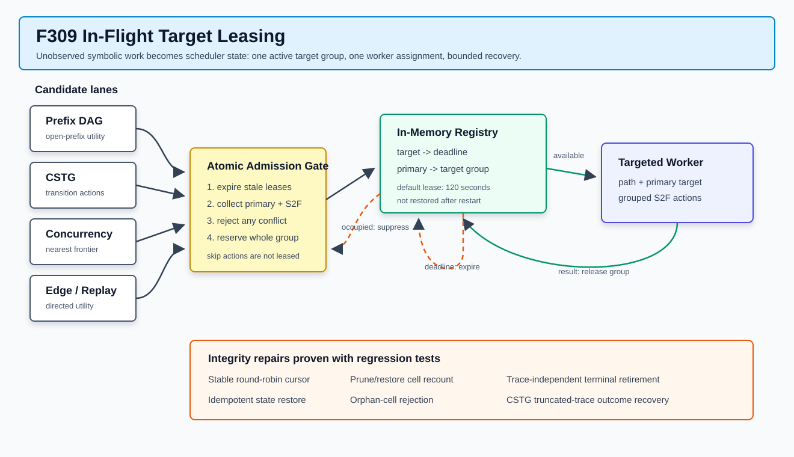

# F309：在途目标租约与调度状态完整性

- 日期：2026-08-07
- 实现等级：I/T（机制已实现并通过自动化回归）
- 影响范围：`util/hybrid_feedback.py`、`test/test_hybrid_feedback.py`、调度状态 schema 14
- 性能结论：尚未形成等 CPU、多轮 benchmark 证据，不宣称覆盖率或求解速度提升

## 1. 研究问题

F308 已将 edge-dependence replay 从 seed 级提升到 `ReplayJob(path, target_branch)`，但深度审查发现，
“能够指定目标”并不等于“并行地高效指定目标”。Prefix DAG、CSTG、hierarchical concurrency、
edge-dependence 和普通 replay 是不同的候选来源；如果它们在 worker 结果返回前仍只依据已完成历史，
就可能把同一个 branch target 同时交给多个 worker。昂贵约束查询尚未产生反馈时，调度统计天然滞后，
这种重复在 worker 数增加时会放大。

这一问题与并行 MCTS 的 unobserved sample 问题具有结构相似性。WU-UCT 显式记录已经发出、尚未返回的
simulation query，以减少并行选择使用陈旧统计造成的搜索开销；后续理论工作也把跟踪未完成样本列为
有效并行 MCTS 的关键设计条件之一。F309 借鉴的是“未完成工作必须进入下一次选择状态”这一原则，
不是 WU-UCT 的完整 UCT 公式或其理论保证。

主要研究依据：

- [Watch the Unobserved: A Simple Approach to Parallelizing Monte Carlo Tree Search](https://openreview.net/forum?id=BJlQtJSKDB)，ICLR 2020；
- [On Effective Parallelization of Monte Carlo Tree Search](https://openreview.net/forum?id=_FXqMj7T0QQ)，NeurIPS 2020；
- [SymCTS: Reevaluating the Relationship between Concolic Execution and Fuzzing](https://escholarship.org/content/qt60m9h8hb/qt60m9h8hb.pdf)，其 edge-dependence coverage 为本项目 F308/F309 的 concolic-local 结构基础。

## 2. 深度审查发现

### 2.1 分支裁剪后结构计数失真

`EdgeDependenceCoverage._prune()` 删除一个 branch row 时，会删除所有以该 row 为 source 或 destination
的 cell，但旧实现只删除被裁 row 自己的 `row_cells`。其他 source 指向该 destination 的 cell 已消失，
计数却没有同步减少，导致 structural score 和 `path_bonus()` 长期虚高。

F309 在 branch prune 后以保留 cell 为唯一事实源重建 `row_cells`，并在 state restore 时拒绝 source
或 destination 不存在的孤儿 cell。`restore()` 同时改为先清空旧状态，使同一 snapshot 重放两次仍然幂等。

### 2.2 重复观测破坏 round-robin 公平性

旧 `_add_target()` 每次再次看见已有 target 都会先删除再追加，但 `target_cursor` 仍按原下标解释。
高频 target 因此可不断移动队列并挤压其他 target，图中宣称的 round-robin 实际并不稳定。

F309 将重复 target 设为无状态变化；只有首次出现才追加。删除已终结 target 时，根据删除位置修正游标，
保证“下一目标”的语义不因 tuple 下标移动而改变。

### 2.3 终态错误依赖有限 trace

旧实现先解析 `branch_trace`，若 trace 为空便直接返回。目标已经得到 SAT/UNSAT，但 telemetry 因 trace
截断或独立终态回报而没有对应行时，target 会留在队列并再次求解。CSTG 还有相反问题：target 明确
`target_reached=true`，但不在有限 trace 中时会被记作 divergence。

F309 把显式 target outcome 提升为独立事实源：

1. 先释放该 target 的在途租约；
2. 只有 `target_reached=true` 且状态为 SAT/UNSAT 才永久退休；
3. 即使 trace 为空，也从全部 edge row 移除终态 target；
4. CSTG 在 trace 截断时依据显式 outcome 更新 arrival/status，必要时建立 site 未知的占位 transition；
5. `target_status` 与 `target_reached` 矛盾时不做永久退休，保持 fail-open 重试。

## 3. F309 机制设计



调度器维护两个仅驻留于当前 coordinator 进程的有界结构：

```text
target_leases[target] = deadline
target_lease_groups[primary] = (deadline, targets)
```

一次 `ReplayJob` 的租约不仅包含 `target_branch`，还包含其 S2F action 中所有非 `skip` 目标。这样，
同一次 concolic execution 已计划求解的 secondary action 也不会被另一个 worker 独立领取。group 以
primary target 为完成键；primary worker 回报时，只有 deadline 仍匹配的成员才被释放，避免旧结果删除
已经重新分配的新租约。

### 3.1 统一准入次序

每次候选选择遵循以下次序：

1. 清除 deadline 已到的 lease；
2. 将 active target 集合传给 Prefix DAG、CSTG 和 concurrency lane，使其在本地打分前排除在途目标；
3. 候选到达统一出口时，以 target group 原子检查冲突；任一非 `skip` target 在途则拒绝整组；
4. 成功准入后写入 deadline，才允许生成 worker work item；
5. edge-dependence 和 fallback replay 读取同一 registry，因此跨 lane 也不能重复 target；
6. worker telemetry 返回时释放 group；worker 丢失时由 lease 超时自动恢复可调度状态。

默认租约为 120 秒，可通过 `SYMCC_EDGE_DEP_TARGET_LEASE` 调整，最小 1 秒。有效期取该值与调用方 replay
cooldown 的较大者，避免冷却期尚未结束但 target 已被其他 lane 重复领取。

### 3.2 状态与恢复语义

调度 snapshot 升级为 schema 14，schema 1-13 继续兼容。持久化以下累计证据：

- `edge_dependence_lease_reservations`：成功占位的 target 数；
- `edge_dependence_lease_suppressions`：因在途冲突被抑制的 target 数；
- `edge_dependence_inflight_targets`：当前 coordinator 内尚未完成的 target 数。

active lease 本身不写入长期 state。coordinator 重启意味着旧进程内 worker 已不再受其控制；恢复旧 deadline
会把不存在的工作误当成仍在执行。因而重启后 lease fail-open，长期知识仍由 Prefix DAG、CSTG、约束摘要
和 edge utility state 提供。这一选择优先保证可恢复性，不假定跨进程 worker 存活。

## 4. 关键不变量

| 不变量 | 实现约束 |
| --- | --- |
| 同一 coordinator 内 target 至多属于一个活动 group | `reserve_targets()` 在写入前原子检查全部成员 |
| worker 回报不能删除更新一代租约 | group release 比较成员当前 deadline |
| worker 失联不能永久阻塞 target | 每次选择前惰性清理过期 lease |
| 重复 observation 不改变下一个 round-robin target | 已存在 target 的 `_add_target()` 为 no-op |
| `row_cells[source]` 等于实际保留 cell 数 | prune/restore 后从 cell 集合重建 |
| SAT/UNSAT 退休需要真实到达 target | 同时要求 `target_reached` 与 terminal status |
| 有限 trace 不覆盖显式 target outcome | edge queue 与 CSTG 独立消费 target outcome |

## 5. 自动化验证

新增测试覆盖：

- 重复 target observation 保持队列顺序和游标；
- 无 `branch_trace` 的 SAT target 仍释放 lease 并从所有 row 退休；
- 两条不同 row 指向同一 target 时，一次并行选择只生成一个 job；
- lease 到期后 target 可重新选择，worker 回报可提前释放；
- primary 回报释放同组 S2F secondary target；
- 128-row 裁剪后 `row_cells` 与实际 cell 集合严格一致；
- restore 重放幂等并丢弃孤儿 cell；
- CSTG 在 trace 截断时保留显式 SAT arrival，而不是记录 divergence；
- Prefix DAG 与 CSTG 以不同 seed 提议同一 target 时，统一出口只接受一个。

定向结果以本次最终验证为准：`test/test_hybrid_feedback.py` 53/53，相关调度/编排组合 89 passed 加
8 subtests，完整 Python unittest 550/550（82.659 秒）。Ruff 与 compileall 均通过；
F308-F309 未修改 LLVM pass，因此 LLVM 门禁沿用 F307 的 LLVM 18 221 passed + 1 unsupported、
LLVM 17 220 passed + 2 unsupported。文档一致性结果记录在阶段研究进展及技术总账中。

## 6. 科研边界与后续实验

F309 证明的是状态机和去重机制正确，不证明并行 campaign 一定更快。租约存在明确权衡：同一 target 的
不同 seed 可能提供不同约束上下文，严格抑制并行重复也可能减少有价值的多样化尝试；租约过长会降低利用率，
过短则无法覆盖慢查询。当前 target registry 只在单 coordinator 内共享，多 coordinator 的 target-only
去重尚未写入现有跨 master durable lease 协议。

下一步等 CPU 消融至少应报告：

1. target dispatch 总数、唯一 target 数和冲突抑制数；
2. 同 target 并发度、lease expiry 率和结果前释放率；
3. solver CPU、solver wall time、coverage AUC 与 time-to-target；
4. 30/120/300 秒租约敏感性；
5. target-only lease 与“允许同 target 的不同 seed 并发”策略的配对比较；
6. 单 coordinator 与多 coordinator 下的重复率差异。

只有这些指标在固定初始语料、相同总 CPU、固定版本和多轮独立运行下成立，才能把 F309 从 I/T 推进为
B/R 级性能证据。
