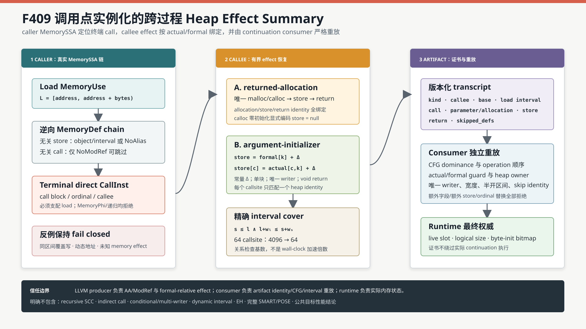

# F409：调用点实例化的跨过程 Heap Effect Summary

> 日期：2026-08-16  
> 定位：F408 LLVM MemorySSA/AA 函数内证明之后的跨过程初始化切片  
> 等级：I/T/E（生产实现、双 LLVM 测试、独立 oracle 与机制实验）

## 1. 问题与研究动机

F408 能从 caller 内的 `MemoryUse -> MemoryPhi/MemoryDef` 链证明每条到达路径都有初始化写，
但 LLVM MemorySSA 是函数内表示。以下两个常见模式此前不能形成可审计证明：

```c
uint8_t *make(void) {
  uint8_t *p = malloc(1);
  *p = 42;
  return p;
}

void init(uint8_t *p) { *p = 77; }
```

caller 中的 `p = make(); load p` 看不到 callee 内的 allocation/store；
`p = malloc(...); init(p); load p` 则只看到一个可能修改内存的 call。若简单地把 call 当作
“已初始化”，会在条件写、写错参数、宽度不足或写后覆盖时产生不健全接受；若一律拒绝，又丢失
大量 allocator wrapper、构造函数和小型初始化 helper。

组合式动态测试的经典 SMART 工作把函数测试结果编码为前置/后置条件并在 caller 复用；
demand-driven compositional symbolic execution 进一步强调按目标组合需要的过程内路径，而不是
盲目内联全部调用。F409 没有宣称完整复现这两类系统，而是把其“summary 必须在具体 callsite
实例化”的原则落实为一个面向有限 heap interval 的、可重放的 continuation 协议。

参考来源：

- [Compositional Dynamic Test Generation / SMART（POPL 2007）](https://patricegodefroid.github.io/public_psfiles/popl2007.pdf)
- [Demand-Driven Compositional Symbolic Execution（MSR-TR-2007-138）](https://www.microsoft.com/en-us/research/publication/demand-driven-compositional-symbolic-execution/)
- [LLVM MemorySSA 官方文档](https://llvm.org/docs/MemorySSA.html)
- [LLVM Alias Analysis 官方文档](https://llvm.org/docs/AliasAnalysis.html)
- [LLVM `memory(...)` effect 属性](https://llvm.org/docs/LangRef.html#function-attributes)
- [POSE：Path-optimal symbolic execution of heap-manipulating programs](https://arxiv.org/abs/2407.16827)

## 2. F408 到 F409 的语义差异

| 维度 | F408 | F409 |
|---|---|---|
| 证明范围 | 单函数 MemorySSA graph | caller MemorySSA chain + 单个 callee effect |
| 终端 witness | caller 内 full-width store | direct call 所实例化的 callee store/allocator |
| 指针相关性 | pointer-PHI incoming edge | callsite actual ↔ formal parameter |
| 无关定义 | LLVM NoAlias / NoModRef | 同样重放，直至终端 call |
| artifact | `initialization_memoryssa` | `initialization_interprocedural` |
| 当前边界 | 有界 phi/def DAG | 直调、非递归、单块、唯一 writer |

F409 不是用摘要绕过 F408。caller 的 load 仍从真实 MemoryUse 开始向前追溯：只有当到达的
MemoryDef 恰好是可证明的 direct call 时，才把该 call 作为终端初始化定义；其后的每个定义
仍必须分别证明 NoAlias/NoModRef。

## 3. 支持域

### 3.1 返回已初始化 allocation

`returned-allocation` 要求：

1. caller 的 load 指针直接来自一个内部 `CallInst`；返回的有限 heap-pool domain 逐对象
   生成证书，最多受 256-alternative 硬上界约束；
2. callee 只有一个基本块和一个 return；
3. return 直接返回 callee 内唯一的 `malloc`/`calloc` 结果；
4. `malloc` 模式恰有一个 simple scalar store，并完整覆盖 load interval；
5. `calloc` 模式无额外 store，零初始化由现有 heap runtime 语义承担；
6. allocation、store、return 的 artifact operation identity 全部进入证书。

### 3.2 参数初始化函数

`argument-initializer` 要求：

1. caller 传入一个本地、已识别、非动态索引的普通 heap base；
2. callee 只有一个基本块、一个 void return、一个 simple scalar store、无嵌套 call；
3. store 地址可恢复为 `formal_parameter + constant_offset`；
4. 在当前 callsite 将 formal 实例化为 actual 后，半开区间
   `[store, store + store_bytes)` 覆盖 `[load, load + load_bytes)`；
5. 当前 actual 的 heap identity、call ordinal、parameter index 和 callee store guard 一致。

### 3.3 显式拒绝

- recursive SCC、indirect call、invoke/EH；
- 多基本块或条件 writer；
- 多 writer、未知 side-effect call；
- dynamic GEP、symbolic length、未知 object identity；
- partial-width 或错位 store；
- load 前同区间覆盖写；
- 超过 64 个跳过定义或 64 个 callsite 的生产测试边界。

这些拒绝是完成定义的一部分，不是暂时忽略错误。

## 4. 生产执行流程



对每个候选 load，执行次序为：

1. `pointerAlternatives` 恢复 load 的有限 heap provenance；
2. 从 LLVM `MemoryUse` 获取 defining access；
3. 逆向遍历线性 MemoryDef chain；
4. 对无关 store 用静态 object/半开区间或 LLVM `NoAlias` 证明跳过；
5. 对无关内部 direct call 仅在 ModRef 为 NoModRef 时跳过；
6. 对候选 terminal call 分别尝试 returned-allocation 与 argument-initializer；
7. 将 callee 的 formal-relative effect 实例化到当前 actual；
8. 验证 store/load interval cover、call dominance 与唯一 writer；
9. 输出版本化 transcript，给 load 添加
   `initialization_interprocedural`；
10. continuation consumer 重新定位所有 operation 并重放结构不变量；
11. runtime 仍以 live heap、logical size 和 byte-init bitmap 为最终执行权威。

编译期证明、artifact consumer 和 runtime 三层互不替代。

## 5. 调用点实例化

若 initializer 有 `N` 个 callsite，callee 参数的 context-insensitive provenance union 有
`N` 个 actual。直接把 callee store 的 `N` 个候选再与 caller 的 `N` 个 load object 做笛卡尔
匹配，会产生 `N²` 个关系检查，且容易把一个 callsite 的事实误用于另一个 callsite。

F409 从 store pointer 恢复：

\[
  address_{store} = formal_k + \Delta, \quad \Delta \in \mathbb{Z}
\]

然后在 callsite `c` 上实例化：

\[
  address_{store,c} = actual_{c,k} + \Delta
\]

因此每个 argument-initializer certificate 只绑定一个 callsite、一个 actual object 和一个
formal parameter。64-callsite
generated fixture 会真实产生 64 个 certificate；callee 的 lowered store 可以保留 64 个受
`arg0 == base_i` guard 区分的 alias case，但每个证书只接受其中唯一匹配当前 base 的 case。

returned-allocation 的多槽 heap pool 使用同一原则的集合形式：每个可能返回对象各有一份
v1 certificate，consumer 要求证书的 `load_address/base` 集合与 load alias cases、allocator
`addresses` 和 callee store cases 三方精确相等。它不是一个“任选其一”的弱见证。

## 6. MemorySSA 链与覆盖条件

对 load interval `L=[l,l+w_l)`，terminal effect store interval
`S=[s,s+w_s)` 的准入条件为：

\[
  s \le l \land l+w_l \le s+w_s
\]

对 load 与 terminal call 之间的 store `D=[d,d+w_d)`，仅当对象不同，或：

\[
  d+w_d \le l \lor l+w_l \le d
\]

才可用 allocation-disjoint 跳过；否则必须得到 LLVM `NoAlias`，否则 fail closed。
F409 测试特意覆盖“同一 2-byte object 中 offset 1 的 store 不影响 offset 0 的 load”，消费者
会重新计算实际 store 宽度与半开区间，不能只看 object owner。

## 7. Transcript 协议

典型参数初始化证书：

```json
{
  "schema": "symcc-interprocedural-heap-effect-summary-v1",
  "kind": "argument-initializer",
  "callee": "initialize_argument",
  "base": 64,
  "load_address": 64,
  "load_bytes": 1,
  "call": {"block": "bb0", "ordinal": 0},
  "parameter": 0,
  "store": {"block": "bb0", "ordinal": 0, "address": 64, "bytes": 1},
  "return": {"block": "bb0", "ordinal": 0},
  "skipped_defs": [
    {
      "block": "bb0", "ordinal": 0, "kind": "store",
      "opcode": "store", "proof": "allocation-noalias"
    }
  ]
}
```

returned-allocation 用 `allocation` 替代 `parameter`，并绑定 allocator、allocation block/ordinal、
base 与 `zero_initialize`。`store` 在 calloc 零初始化模式显式为 `null`，避免省略字段造成 schema
歧义。

## 8. 严格 consumer 重放

`LiveContinuationExecutor._interprocedural_heap_effect_initialization` 不信任 producer，至少重放：

- capability 依赖与 capability/use-point closure；
- schema 精确字段集合和整数/布尔类型；
- load alias case 与唯一普通 heap owner；
- caller call block/ordinal、callee 名称和 call-before-load dominance；
- callee 单块、唯一 return、唯一 writer；
- heap_alloc/store/return 的实际 operation identity 与执行顺序；
- caller allocation 对 initializer call 的 dominance；
- call pointer argument、callee pointer parameter 与 `argN` guard；
- store 实际宽度、地址与 load interval cover；
- 每个 skipped store/call 的 artifact identity 与同对象 interval 不相交；
- 不允许 orphan capability、额外 callee store 或字段替换。

消费者不能从 JSON 重新运行 LLVM AA，也不声称能证明原始 IR 的所有别名事实；LLVM producer
负责 NoAlias/NoModRef 的语义判断，consumer 负责把该判断绑定到精确、不可替换的 artifact
operation。这一信任边界与 F408 相同且在证据中显式记录。

## 9. Runtime 语义

F409 没有新增绕过运行时检查的快速路径。callee 的 `heap_alloc`、`store`、`return` 和 caller 的
`call` 都按原 continuation IR 执行；load 仍检查：

1. heap slot 当前 live；
2. 地址落在 logical size 内；
3. 对应 byte-init bitmap 已置位；
4. alias guard 与当前 pointer/domain 值匹配。

因此伪造 transcript 不能凭空使未初始化内存可读：它会先被 consumer 拒绝；即使绕过
consumer，runtime byte-init 仍会拒绝实际未初始化读取。

## 10. 测试与实验

### 10.1 LLVM 生产测试

`test/live_interprocedural_heap_effect_summary.ll` 覆盖：

- allocator wrapper 返回已初始化对象，结果 42；
- 同一 wrapper 的 2-slot finite heap pool 返回 42，并生成两份逐对象证书；
- calloc wrapper 返回零初始化对象，结果 0；
- argument initializer，结果 77；
- 同对象不相交 store 的 MemorySSA skip；
- 两个 callsite 的 context-sensitive 实例化，结果 154；
- `formal + 1` subobject 初始化，结果 99；
- generated 64-callsite fixture，结果 64；
- 条件 writer、partial width、post-initializer overlapping clobber 三类拒绝；
- capability、call ordinal、callee、store width、额外 writer、skip proof、缺 transcript 篡改。

LLVM 17 与 LLVM 18 聚焦测试均通过；该 lit 文件包含 21 条 `RUN` 命令。

### 10.2 独立有限域 oracle

`check_interprocedural_heap_effect_oracles.py` 不调用生产 C++ 或 consumer，穷举：

| 指标 | 结果 |
|---|---:|
| callsite 范围 | 2--64 |
| object size | 1--8 bytes |
| interval 实例 | 182,196 |
| 合法 cover 接受 | 49,896 / 49,896 |
| 非 cover 拒绝 | 132,300 / 132,300 |
| 错误 callsite 拒绝 | 49,896 / 49,896 |
| 结构化 artifact mutation | 8 / 8 拒绝 |

### 10.3 机制成本

64-callsite、11 轮、每轮 1,000 次、每次验证 64 个 Python 参考证书的当前封存结果为：

- context-insensitive 关系检查基数：4,096；
- callsite-instantiated 关系检查基数：64；
- median reference-validator cost：816 ns/certificate；
- median batch：52,226,581 ns。

这是 Python reference validator 成本和分析关系基数，不是 LLVM summary construction latency，
也不是 executor throughput、coverage、solver time、漏洞数量或端到端 speedup。

### 10.4 回归门禁

- F406--F409 相关 lit：LLVM 17/18 各 4/4；
- heap/pointer 相关 Python：22 passed；
- F409 Python：5 passed；
- 完整 Python：1046 passed 加 250 subtests，零 skip/xfail/deselection/node-ID drift；
- 完整 LLVM 17：269 discovered，267 passed 加 2 个既有 unsupported，零失败。

## 11. 多轮 review 修复

1. **callsite 敏感性**：初版直接读取 callee 参数的全局 union，多 callsite 时会保守拒绝；改为
   formal-relative offset 在当前 actual 上实例化，并新增 2-callsite/64-callsite 测试。
2. **同对象区间**：consumer 不以 owner 不同作为唯一 NoAlias 条件，重新计算真实 store width
   和半开区间。
3. **执行顺序**：consumer 显式检查 caller allocation < call < load，以及 callee allocation <
   store < return。
4. **额外 writer**：consumer 重新统计 callee store/heap_alloc/call，拒绝 transcript 之外的
   第二 writer。
5. **字段闭合**：calloc 的 `store` 用 JSON null 显式编码；kind 对应字段集合严格互斥。
6. **声明边界**：`4096 -> 64` 只写为关系检查基数，绝不解释为 64 倍 wall-clock speedup。
7. **历史兼容与集合闭合**：首版 singleton 证书误拒绝既有2-slot returned heap pool；改为
   每对象一份v1证书，并要求证书/load alias/allocator/store case四域精确相等。额外、重复、
   错对象或越界case均主动拒绝。
8. **整数与测试基础设施**：同对象disjoint端点改用128位计算，避免u64 wraparound；确认
   `/dev/shm`在本机为noexec，只用于不执行临时二进制的聚焦lit，全量门禁使用默认TMPDIR。

## 12. 先进性、创新性与挑战性

- **先进性**：将组合式函数摘要、LLVM MemorySSA/AA 和 continuation artifact replay 放在同一
  生产链上，而不是仅实现一个脱离执行器的静态分析原型。
- **框架创新**：摘要不是全局函数标签，而是 callsite-instantiated、heap-identity-bound、
  interval-exact 的证书；其 operation identity 可跨 producer/consumer 重放。
- **工程挑战**：必须同时处理 caller/callee 两套 SSA 命名、参数/实参替换、heap pool identity、
  MemorySSA clobber 顺序、LLVM 17/18 API 兼容和运行时 byte-init 权威。
- **科研严谨性**：独立 oracle、篡改拒绝、生成式 64-callsite fixture 与 claim boundary 同时封存。

这里不宣称发明函数摘要、MemorySSA 或 POSE，也不宣称完整 SMART。创新结论只限于本框架的
有界组合、证书协议和防御纵深闭环。

## 13. 未完成边界与后续顺序

F409 仍不是一般跨过程 symbolic heap：没有递归 SCC fixed point、间接调用 target-specific
effect、multi-block conditional summary、动态 interval、exceptional postcondition、custom
allocator annotation、跨 module/link-time summary 或完整 POSE。

下一顺序为 F410 dynamic-index/symbolic-length byte-lane cover，F411 loop-carried MemoryPhi 有界
归纳；这些闭合后再进入 heap-heavy 等 CPU 公开实验，报告 acceptance、states、solver CPU、
coverage AUC、最终 coverage 与 bootstrap/randomization 置信结论。

## 14. 复现

```bash
ninja -C build SymCC
ninja -C build-llvm17 SymCC

python3 /usr/lib/llvm-18/build/utils/lit/lit.py -sv \
  build/test/live_interprocedural_heap_effect_summary.ll
python3 /usr/lib/llvm-17/build/utils/lit/lit.py -sv \
  build-llvm17/test/live_interprocedural_heap_effect_summary.ll

python3 benchmark/check_interprocedural_heap_effect_oracles.py
python3 benchmark/benchmark_interprocedural_heap_effect_summary.py \
  --callsites 64 --repeats 11 --iterations 1000
pytest -q test/test_interprocedural_heap_effect_summary.py \
  -p no:cacheprovider
```
