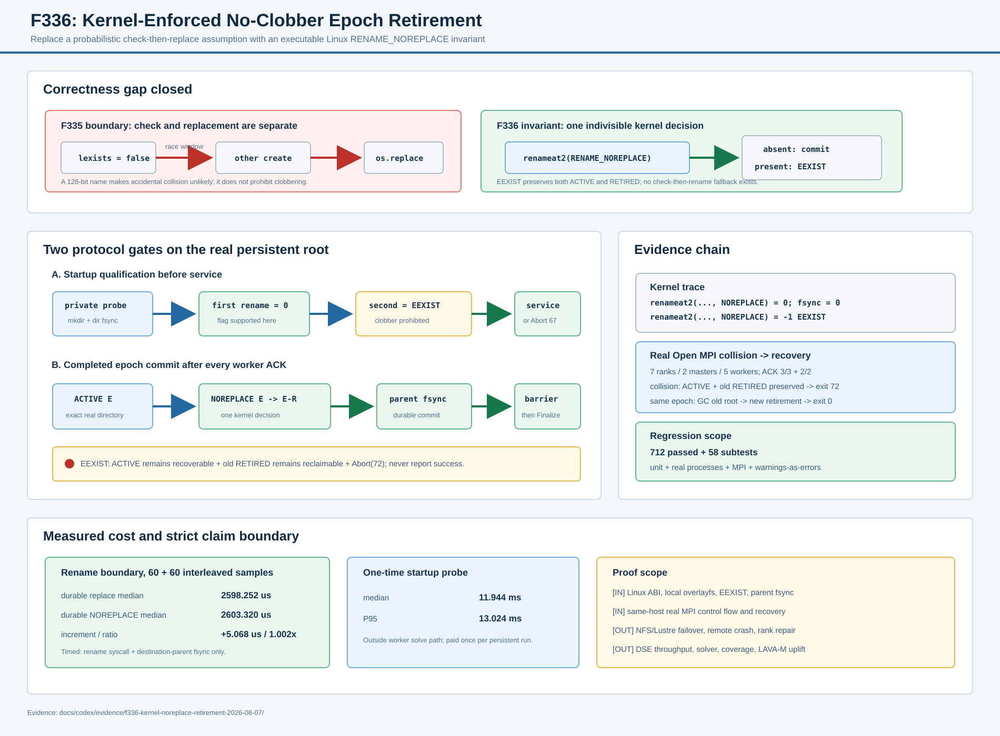

# F336：内核强制的 No-Clobber Epoch 退役

> 功能编号：`F336`  
> 日期：`2026-08-07`  
> 状态：实现完成，自动化、真实 MPI、syscall 与机制成本已验证  
> 前置功能：F323 目录持久化、F327 文件系统能力契约、F334 完成门控、F335 原子退役与延迟回收

> 后续加固：F337 已把本报告只约束 retired 根数量的启动 GC 升级为 root/entry/cooperative-time
> 三预算、descriptor-relative 可恢复删除。本文保留 F336 no-clobber 提交和实验快照；当前物理回收
> 语义以 [`F337 报告`](Resumable_Budgeted_Retired_Tree_GC_F337_2026-08-07.md) 为准。

## 1. 研究问题

F335 把 persistent output 的完成动作从递归删除改为同目录名称退役：active epoch 被改名到随机
retired 名称并同步 shared root。它缩短了 MPI collective completion critical path，但原实现采用：

```text
if not lexists(retired):
    os.replace(active, retired)
```

这段代码只检查调用时刻的目标状态。检查和 `os.replace` 之间仍有竞态窗口，而且普通 rename 在目标已存在
且类型兼容时会原子覆盖目标。128-bit 随机 id 使偶然冲突极小，却不能把概率隔离写成内核级
no-clobber 正确性。对于恢复状态，覆盖一个既有 retired tree 会破坏“冲突时保留双方、由恢复器决定”的
失败模型。

F336 的研究目标是把该假设升级为可执行不变量：

> 完成态退役只能在目标名称不存在时发生；若目标已存在，内核必须以 `EEXIST` 拒绝操作，active 和
> retired 两棵树均保持原样，作业不得报告成功。

## 2. 技术依据

[Linux `rename(2)`](https://man7.org/linux/man-pages/man2/renameat2.2.html) 规定普通 rename 会原子替换已
存在的 `newpath`；Linux 专有的 `renameat2(..., RENAME_NOREPLACE)` 则明确禁止覆盖，并在目标已存在时
返回 `EEXIST`。该接口从 Linux 3.15 提供，glibc wrapper 从 2.28 提供；不同文件系统支持版本不同，
因此仅发现 libc 符号还不足以证明当前 shared root 支持该语义。

[Linux `fsync(2)`](https://man7.org/linux/man-pages/man2/fsync.2.html) 仍然决定持久化边界：rename 原子可见
不等于目录项已经持久。F336 在成功的 no-clobber rename 后继续同步目标父目录；失败的 `EEXIST` 不改变
目录项，不伪造成功的 fsync。

F336 是 Linux 存储原语在并行符号执行生命周期中的工程化应用，不是新的约束求解算法，也不代表已经
提升 DSE 覆盖率。

## 3. 设计总览



系统包含两个相互补充的门：

1. **启动能力门**：persistent output 在 service 前用真实 shared root 验证成功 rename、冲突拒绝与清理；
2. **完成提交门**：rank 0 使用同一个内核原语退役 exact active tree，成功后 fsync shared root，再允许
   post-cleanup barrier 和 `MPI_Finalize`。

## 4. 内核 ABI 接线

`util/distributed_state.py` 新增 `durable_rename_noreplace()`：

```text
ctypes.CDLL(None, use_errno=True).renameat2(
    AT_FDCWD, source,
    AT_FDCWD, destination,
    RENAME_NOREPLACE,
)
```

实现约束如下：

- `AT_FDCWD=-100`、`RENAME_NOREPLACE=1` 使用 Linux UAPI ABI；
- 路径通过 `os.fsencode` 转换，嵌入 NUL 显式拒绝；
- libc 没有 `renameat2` 时抛出 `EOPNOTSUPP`，绝不回退到 check-then-rename；
- 非零返回值从 ctypes 的线程局部 errno 复制为 Python `OSError`；`EEXIST` 自然映射为
  `FileExistsError`；
- 成功后先 fsync destination parent，跨目录时再 fsync source parent；F336 完成态固定为同目录，故只
  需要一次 shared-root directory barrier。

该 helper 与 `durable_replace()` 并存。后者仍用于“替换是协议语义”的 manifest、heartbeat 和 staged
publication；只有不能覆盖目标的完成态退役切换到新 helper，避免错误地改变其他事务的 last-writer 或
idempotent replace 语义。

## 5. 启动能力探针

仅在命令行提供 persistent `--output-dir` 时，rank 0 在 service 前执行
`_probe_retirement_noreplace(shared_dir)`：

```text
create private random probe root and fsync it
  -> active --NOREPLACE--> retired                 must succeed
  -> recreate active
  -> active --NOREPLACE--> existing retired       must return EEXIST
  -> durable_rmtree(private probe root)            must succeed
  -> broadcast qualification result
```

探针根使用 pid、monotonic timestamp 和 128-bit 随机值，并在 `os.mkdir` 成功后立即记录本进程所有权。
这一区分很重要：随机名称如果已存在，探针不会把它当作自己的残留删除；目录创建后即使 fsync 或 rename
失败，`finally` 仍会耐久清理已拥有的 probe root。

错误语义：

| 阶段 | 结果 | MPI 行为 |
| --- | --- | --- |
| libc 无 `renameat2` | `EOPNOTSUPP` | service 前 `Abort(67)` |
| 文件系统不支持 flag | 内核错误，例如 `EINVAL` | service 前 `Abort(67)` |
| flag 被错误忽略、第二次覆盖成功 | 主动生成 `EOPNOTSUPP` | service 前 `Abort(67)` |
| probe 创建、fsync 或清理失败 | 持久状态未知 | service 前 `Abort(67)` |
| 完成态目标已存在 | `EEXIST`，双方保留 | ACK 后 `Abort(72)` |
| 完成态 rename 成功、parent fsync 失败 | retired 可见但持久性未知 | `Abort(72)`，不报告成功 |

程序自有的 temporary output 完成时仍删除整个 root，不需要退役名称，因此不强制 Linux
`RENAME_NOREPLACE`。

## 6. 完成与恢复流程

F334/F335 的两道 collective barrier 保持不变：

1. 所有 worker 停止并 ACK；
2. master 完成统计交换与 cleanup rendezvous；
3. 所有 rank 通过 bounded pre-cleanup barrier；
4. rank 0 校验 active basename 必须是 `.standalone-work-<64 lowercase hex>` 且为真实目录；
5. 生成 128-bit retirement id；
6. 执行 `durable_rename_noreplace(active, retired)`；
7. 成功后 shared-root fsync 成为持久完成点；
8. 所有 rank 通过 bounded post-cleanup barrier；
9. 才允许 `MPI_Finalize`。

若第 6 步命中已有目标，active 仍是可恢复 epoch，既有 retired tree 仍是 GC 对象。下一次相同 epoch 启动
先在 F335 的稳定 no-follow lock 下回收 retired 冲突根，再恢复 active work state；这不需要猜测哪棵树
被普通 replace 覆盖。

## 7. 自动化验证

新增回归覆盖：

- 成功 no-clobber rename 的内容保持和一次父目录 fsync；
- 已存在非空目标触发 `FileExistsError`，源/目标字节均不变；
- libc 原语缺失时失败关闭且 source 保留；
- 两个独立进程竞争同一个目标，严格一个 publisher、一个 rejection；
- MPI lifecycle 固定 retirement id 冲突不覆盖 active 或 retired；
- 能力探针的正常、原语缺失、probe fsync 失败和“错误 clobber 实现”路径全部无残留；
- F335 的 post-rename fsync 不确定性、GC、exact namespace 和 temporary-root 路径继续回归。

测试结果：

| 范围 | 结果 | 时间 |
| --- | ---: | ---: |
| distributed/lifecycle/filesystem 定向 | 199 passed + 30 subtests | 16.39 s |
| 六模块 MPI/distributed/hybrid 关联 | 316 passed + 38 subtests | 19.77 s |
| 全量 Python，`-W error` | 712 passed + 58 subtests | 98.48 s |

## 8. Syscall 证据

`strace -e trace=renameat2,fsync` 观察到：

```text
renameat2(.../active, .../retired, RENAME_NOREPLACE) = 0
fsync(shared-root-fd) = 0
renameat2(.../active-collision, .../retired, RENAME_NOREPLACE) = -1 EEXIST
```

这直接证明运行路径使用的是带 flag 的内核接口，而不是文档层面的目标预检查。第二次调用没有后续成功
fsync，源目录和内容由脚本复验仍存在。

## 9. 真实 MPI 冲突与恢复

真实 Open MPI 实验使用 7 ranks、2 masters、5 workers，同一物理主机，无 synthetic processor
topology。测试 wrapper 只在 rank 0 完成阶段创建一个已 fsync 的固定 retired 目标，不替换生产
`durable_rename_noreplace`：

| 观察 | 结果 |
| --- | --- |
| 两组 worker shutdown ACK | 3/3 + 2/2，均早于冲突报错 |
| 冲突运行 | `EEXIST`，exit 72，3.650 s |
| 冲突后 active | 存在，包含恢复状态 |
| 冲突 retired | 精确一个，`must-not-clobber` 字节保持 |
| 相同 epoch 重启 | 启动 GC 1 个冲突根，能力探针再次通过 |
| 恢复运行 | exit 0，3.682 s |
| 恢复后命名空间 | active 消失，生成非冲突 id 的一个新 retired 根 |
| corpus | seed SHA-256 与字节保持正确 |

该证据证明同机真实 MPI 控制流、ACK 顺序、Abort 接线和恢复收敛；注入的目标冲突不是实际随机碰撞，
也不是远程文件系统故障。

## 10. 机制成本

本机环境为 Linux 7.0、glibc 2.39、Python 3.12、overlayfs。5 次 warm-up 后，以交替次序分别收集
60 个 raw 样本；计时区只包含 rename syscall 与 destination-parent fsync，source 创建和样本后清理
不计入：

| 机制 | median | P95 |
| --- | ---: | ---: |
| `durable_replace` | 2598.252 us | 2626.527 us |
| `durable_rename_noreplace` | 2603.320 us | 2643.998 us |
| 差值/比率 | +5.068 us | median 1.002x |

启动能力探针覆盖 probe root 创建、一次成功 rename、一次 `EEXIST` 和耐久清理，60 次样本中位
11.944 ms、P95 13.024 ms。它是 persistent-output 每次启动的一次性固定成本，不在 worker 求解热路径。

这些数据表明 no-clobber 的 syscall 增量被目录 fsync 主导，在本机中位差约 0.2%；不能外推到 NFS、
Lustre 或其他内核/文件系统。

## 11. 先进性、创新性与挑战

- **从概率隔离到内核不变量**：随机 id 仍用于命名，但正确性不再依赖“冲突大概不会发生”；
- **能力不是版本推断**：不根据 kernel/glibc 版本宣称支持，而在真实 output mount 上同时验证成功和冲突
  两种语义；
- **失败可恢复**：`EEXIST` 保留 active 与 retired 双方，严格契合现有 WAL-like epoch 恢复和延迟 GC；
- **协议最小侵入**：保留需要 replace 的事务路径，只收紧完成态名称提交，避免全局替换造成行为回归；
- **证据分层**：单元、多进程竞争、syscall、真实 MPI、机制成本分别回答语义、并发、接线、系统流程和
  代价问题。

主要挑战在于同时处理内核 ABI、Python errno 传播、文件系统 flag 支持差异、rename 可见性与目录持久化
的区别，以及确保失败探针本身不留下会被恢复器误认的状态。

## 12. 局限与有效性威胁

1. `renameat2` 是 Linux 专有接口；F336 有意失败关闭，不提供非 Linux 降级路径；
2. 当前真实 MPI 和 syscall 证据来自单机 overlayfs，未证明 NFS/Lustre/GPFS 的跨客户端语义；
3. NFS 上“server 已执行但 RPC 重试报错”的 rename 不确定性仍存在，错误仍按 Abort 和下次扫描处理；
4. 能力探针证明当前挂载点和时刻的行为，不等价于 server failover、断电或网络分区证明；
5. 启动探针约 11.944 ms，短生命周期任务需要在端到端实验中计入；
6. F337 已增加 hard entry budget 和 cooperative time budget；后者不能抢占单个阻塞 syscall，且顶层
   reserved namespace 完整扫描仍未纳入 entry budget；
7. 没有测量真实 DSE campaign、solver throughput、coverage、bug discovery 或 LAVA-M 提升。

## 13. 后续研究

1. 在真实 NFS/Lustre/GPFS 多节点环境执行 flag 支持与跨客户端 collision matrix；
2. 把 retirement capability 纳入版本化 filesystem capability snapshot，避免独立控制面字段；
3. F337 已完成可中断、可恢复、按 entry/time 双预算的 retired-tree 增量 GC；下一步是有界顶层发现与
   独立 maintenance mode；
4. 在长时 hybrid campaign 中报告 startup 固定成本、Finalize critical path、backlog 与总 I/O；
5. 研究 `openat2`/dirfd 相对路径解析以进一步缩小外部 pathname 替换边界。

## 14. 证据索引

- 生产代码：`util/distributed_state.py`、`util/mpi_concolic_execution.py`
- 测试：`test/test_distributed_state.py`、`test/test_mpi_lifecycle.py`
- 原始证据：`docs/codex/evidence/f336-kernel-noreplace-retirement-2026-08-07/`
- 机制图：`docs/codex/diagrams/kernel-enforced-noreplace-retirement-2026-08-07.svg`
- 配置语义：`docs/Configuration.txt`
