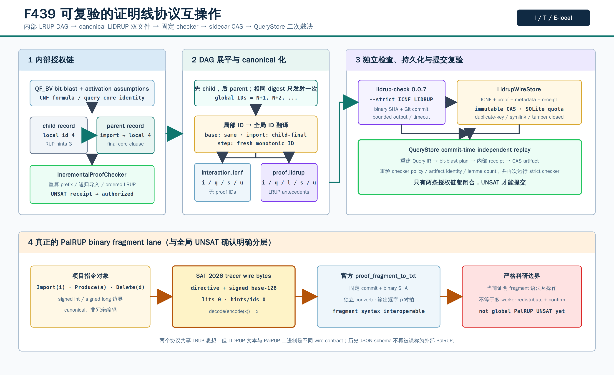

# F439：LIDRUP / PalRUP Proof-Wire 互操作与双重独立复验

- 功能编号：F439
- 日期：2026-08-18
- 研究主题：增量 SAT 证明格式互操作、递归证明 DAG 展平、外部 checker 身份固定、不可变 sidecar、提交时二次裁决、PalRUP 二进制 codec
- 当前等级：I/T/E-local
- 严格边界：LIDRUP 已进入 CaDiCaL/QueryStore 生产路径并由官方 checker 复验；PalRUP 已实现真实 fragment wire 与官方 converter 互操作，但尚未把多 worker `local_check → redistribute → confirm` 全流程作为 UNSAT 授权边界



## 1. 为什么需要 F439

F432--F438 已形成一条可检查的并行 QF_BV 求解链：bit-blast、activation assumptions、LRAT 提升、
递归 LRUP clause DAG、求解中 checked import、跨 rank ACK、activity 反馈、效用配对和可塑 worker 调度。
但内部记录的 `fragment_schema` 历史值是
`symcc-qfbv-palrup-proof-fragment-v1`，实际序列化对象却是项目自定义 JSON LRUP DAG，并不是 PalRUP
论文和官方 tracer 定义的二进制片段。继续混用名称会导致三个问题：

1. 外部工具无法直接消费内部 JSON，互操作声明不可验证；
2. 单一项目 checker 的实现错误可能同时影响 producer 和 consumer；
3. 实验材料无法交付标准的增量交互文件与证明文件。

F439 因而不改变旧 schema 字符串和已有 record SHA，而是增加显式兼容别名
`PROJECT_LRUP_DAG_SCHEMA`，并在其外建立两条独立 wire lane：可严格复验的 LIDRUP 双文件，以及真正的
PalRUP 二进制 fragment。

## 2. 前沿依据与本项目取舍

| 一手工作 | 核心思想 | F439 的吸收与差异 |
| --- | --- | --- |
| Certifying Incremental SAT Solving, LPAR-25 (2024) | LIDRUP 为 input/query/lemma/status/core 提供 clause ID 和 antecedent hints | 实现 canonical `i/q/l/s/u` 子集；输出 proof 与 interaction 两份文件，导入时再用项目 LRUP core 重放 |
| Real-time Proof Checking for Distributed Incremental SAT Solving, TACAS 2026 | ImpCheck/LIDRUP 式 checker 独立于 solver，并在分布式增量求解中实时确认 | F439 固定 checker 内容身份并在 backend 与 QueryStore 两次运行；当前 sidecar 是 post-result 标准化，不替代 F433 的求解中流 |
| A Natively Parallel Proof Framework for Clause-Sharing SAT Solving, SAT 2026 | PalRUP 将并行 proof files 与去中心化持久检查结合，避免单体 proof 瓶颈 | 实现官方 fragment 字节格式和 converter oracle；尚不声称完成全局 PalRUP confirmation pipeline |

主要一手来源：

- [Certifying Incremental SAT Solving（LPAR-25）](https://easychair.org/publications/paper/TbPs/download)
- [lidrup-check 官方仓库](https://github.com/arminbiere/lidrup-check)
- [Real-time Proof Checking for Distributed Incremental SAT Solving（TACAS 2026）](https://satres.kikit.kit.edu/papers/2026-tacas-distrincproof.pdf)
- [A Natively Parallel Proof Framework for Clause-Sharing SAT Solving（SAT 2026）](https://drops.dagstuhl.de/entities/document/10.4230/LIPIcs.SAT.2026.17)
- [PalRUP-Check 官方仓库](https://github.com/rubenGoetz/PalRUP-Check)

论文报告 PalRUP 在最多 3072 cores 的评估上具有可扩展检查能力；这是论文结果，不是本项目实测数据，
本文不做移植式性能声明。

## 3. 严格执行流程

### 3.1 后端第一条授权链

1. `CadicalQfbvSolver` 从 Query IR 确定性重建 `BitBlastPlan`；
2. CaDiCaL 3.0 产生 assumption-unit LRAT；
3. `lift_ascii_lrat_proof` 把临时 assumptions 提升为永久公式上的 core clause；
4. `IncrementalProofChecker` 重算 CNF prefix，递归检查所有 import，并逐步执行 ordered LRUP；
5. `IncrementalProofStore` 按 record SHA 发布不可变 JSON DAG；
6. internal result receipt 绑定 formula、assumption set、failed assumptions 和最终 record。

只有这一步通过，F439 才开始生成外部 wire。外部 checker 不是内部授权的替代品。

### 3.2 递归 DAG 到线性 LIDRUP

对根 record 做深度优先遍历：

```text
emit(record):
  emit every imported child first
  local base IDs       -> unchanged CNF input IDs
  local import IDs     -> imported child's emitted final ID
  local proof-step IDs -> fresh global IDs N+1, N+2, ...
  translate every ordered hint and replay LRUP again
```

相同 `record_sha256` 被多个父节点引用时只发射一次。输出 ID 严格单调且大于全部 input IDs，避免祖先
increment 中的 local ID 与目标公式后续 input ID 冲突。展平器对每个翻译后的 step 再调用 `check_lrup`，
因此错误的 ID 映射不能仅靠内部 DAG 已验证而漏过。

### 3.3 为什么必须输出两份文件

`proof.lidrup` 含 input IDs、query、learned clauses、结论和 core hints：

```text
p lidrup
i 1 1 0
...
q 2 3 0
l 4 -2 -3 0 1 3 0
s UNSATISFIABLE
u 2 3 0 4 0
```

`interaction.icnf` 独立记录调用者声称的输入和查询：

```text
p icnf
i 1 0
...
q 2 3 0
s UNSATISFIABLE
u 2 3 0
```

生产调用固定为：

```bash
lidrup-check --strict interaction.icnf proof.lidrup
```

只传 proof 文件会默认相信交互序列与调用者相同，不能证明 query/input 没有被替换。双文件 strict 模式正是
F439 的外部信任边界。

### 3.4 反向导入

`import_lidrup_artifacts` 只接受有界 canonical `p/i/q/l/s/u` 子集，并要求：

- input ID 为 `1..N`，clauses 与重算 `BitBlastPlan` 逐项相同；
- query assumptions 与 plan 完全相同；
- lemma ID 从 `N+1` 连续递增，clause 规范排序，hints 只指向已存在 clauses；
- 每个 lemma 通过项目 LRUP core；
- proof 与 interaction 的 failed core 完全相同；
- 最后 lemma 等于 failed assumptions 的规范否定，core hint 精确指向该 lemma；
- 不允许额外 query、status 或尾随命令。

导入结果是一个无 import 的项目 LRUP record，随后再次经过 `IncrementalProofChecker`。这使外部 artifact 能
回到原有内容寻址和 QueryStore 授权体系，而不是形成旁路。

## 4. checker 身份、进程和 receipt

固定版本为 `lidrup-check 0.0.7`，源码 commit
`3ae8c23cd978c313ee14472327bf0f9560601015`。运行策略同时绑定 binary SHA-256、版本、commit、
`--strict` 模式和协议版本。

实现还处理了通常被忽略的外部工具边界：

- 每次使用前重读原工具并检查 inode 内容身份；
- 实际执行的是已哈希 bytes 写入私有临时目录的 executable snapshot，避免 check 与 exec 间路径替换；
- 不使用 shell，不接受未解析 placeholder；
- stdout/stderr 用非阻塞 pipe 实时读取，任一超过 64 KiB 即终止进程组；
- checker deadline 到期先 `SIGTERM`，再有界升级为 `SIGKILL`；
- 只接受 exit 0、空 stderr 和独立一行 `s VERIFIED`；
- receipt 绑定 formula/assumption、内部 result/record、两份 artifact、checker policy 和输出摘要；
- receipt 不是数字签名，因此 `validate_receipt` 默认重新运行 checker，而不是只检查 JSON SHA。

## 5. 不可变 sidecar 与生产接线

`LidrupWireStore` 分别保存：

```text
objects/<sha>.icnf
objects/<sha>.lidrup
artifacts/<artifact-sha>.json
receipts/<receipt-sha>.json
wire.sqlite3
```

它使用 `O_NOFOLLOW`、directory-relative open、`O_EXCL`、`fsync`、跨进程 `flock`、SQLite
`BEGIN IMMEDIATE`、record/byte 双配额和 duplicate-key JSON parser。重复发布相同 receipt 返回
`created=false`；相同 key 不同内容、文件替换、symlink shard、索引不一致都失败关闭。

生产执行次序为：

1. CaDiCaL 后端内部 LRUP 授权；
2. canonical LIDRUP 导出；
3. pinned checker 第一次 strict 复验；
4. sidecar CAS 发布；
5. 后端返回 artifact/receipt/policy identities，不在结果 JSON 中复制大 proof；
6. QueryStore commit 重建 Query IR 和内部 proof；
7. QueryStore 从 sidecar 重载全部 bytes、重算 identity，并第二次运行 pinned checker；
8. 两条链均闭合后才提交 UNSAT。

服务启用示例：

```bash
benchmark/install_lidrup_check_0_0_7.sh

python3 util/symcc_query_service.py \
  --store /data/symcc-query-store \
  --portfolio /data/cadical-portfolio.json \
  --qfbv-lidrup-checker "$HOME/.local/opt/lidrup-check-0.0.7/bin/lidrup-check" \
  --qfbv-lidrup-checker-sha256 <installed-binary-sha256> \
  --qfbv-lidrup-wire-store /data/symcc-lidrup-wire
```

可用环境变量为 `SYMCC_QFBV_LIDRUP_CHECKER`、`SYMCC_QFBV_LIDRUP_CHECKER_SHA256`、
`SYMCC_QFBV_LIDRUP_WIRE_STORE`、`SYMCC_QFBV_LIDRUP_WIRE_MAX_RECORDS`、
`SYMCC_QFBV_LIDRUP_WIRE_MAX_BYTES` 和 `SYMCC_QFBV_LIDRUP_TIMEOUT_MS`。

## 6. PalRUP fragment 的真实字节合同

官方 tracer 的三类 directive 为：

```text
a <external-id> <literals...> 0 <hints...> 0
i <global-id>   <literals...> 0
d <ids...> 0
```

二进制整数先做符号映射：非负 `n → 2n`，负数 `-n → 2n+1`，再用 little-endian base-128
varint。F439 实现 32-bit literal 与 64-bit ID 的独立边界、非规范冗余编码拒绝、截断/溢出/未知 directive
拒绝，以及 `encode → decode` 等价。

固定官方 PalRUP commit 为 `d9382fb4b0acf094034ee91e2ed0a22b1b479c1d`。
`PalrupFragmentOracle` 把本地编码交给该 commit 构建的 `proof_fragment_to_txt`，并要求转换文本逐字节
等于本地独立解码结果。receipt 的 scope 明写为
`fragment-syntax-interoperability-not-global-unsat`。

这一实现关闭了“格式被误称为 PalRUP”的问题，但一个 fragment 可被解析不等于整个并行 proof 已完成
local checking、通信重分配和最终 confirmation。后者保留为下一阶段动态多 rank 工作，不能提前计入 F439。

## 7. 测试、故障注入与当前数据

### 7.1 专项测试

`test/test_qfbv_proof_wire.py` 当前为 `13 passed + 12 subtests`，覆盖：

- 历史 schema 哈希兼容；
- 单层和递归 import DAG 展平、重复 child 去重与 ID 重映射；
- canonical 导出/导入及内部 round trip；
- input、hint、core、尾随命令、byte budget 篡改；
- checker SHA/version/marker/stderr/output flood/timeout/运行中工具替换；
- sidecar 发布、去重、quota、内容替换检测；
- CaDiCaL backend 首次验证与 QueryStore commit 二次验证；
- PalRUP 精确 bytes、signed limits、截断、overflow、冗余 varint 和 converter identity。

关联门禁：`test_qfbv_incremental_sat.py + test_qfbv_proof_wire.py + test_query_store.py` 为
`56 passed + 50 subtests`。

### 7.2 真实官方工具 oracle

`benchmark/check_qfbv_proof_wire_oracles.py` 不允许 silent skip。本机固定工具结果：

| 项目 | 结果 |
| --- | --- |
| LIDRUP checker | 0.0.7，binary SHA `a7ebaae5...072e08`，`--strict` 通过 |
| 内部 DAG | 1 条 recursive import，展平为 2 条 learned clauses |
| artifacts | ICNF 64 bytes，LIDRUP 110 bytes，artifact SHA `29dee2f1...1d2fc` |
| round trip | record SHA `6775300e...bea66`，内部 checker 再通过 |
| PalRUP converter | binary SHA `4c85cf05...5394`，3 directives / 16 bytes |
| PalRUP fragment | SHA `1c10c832...f7299`，官方转换文本 SHA `9c869df5...84fd9` |

这些是协议机制数据，不是 solver speedup、coverage 或 defect-yield 数据。checker elapsed 包含进程创建和小
fixture，不能外推到公开 QF_BV benchmark。

### 7.3 完整回归门禁

本功能在专项测试之外执行了完整 Python capability gate 和两个 LLVM build tree 的串行 lit 门禁。串行执行
避免两个 build tree 并发时争用 CPU/内存而污染结果；canonical node-ID inventory 同时防止测试未被发现却被
误报为通过。

| 门禁 | 结果 |
| --- | --- |
| canonical Python inventory | 1320 node IDs，SHA `34d02157...f76`，missing/unexpected 均为 0 |
| 完整 Python gate | 1320 passed + 303 subtests；0 failed/skipped/xfail/xpass/deselected/collection error |
| LLVM 17 lit | 329 discovered；327 passed；2 expected unsupported；exit 0 |
| LLVM 18 lit | 329 discovered；328 passed；1 expected unsupported；exit 0 |
| 静态门禁 | `py_compile`、Ruff、两个 installer 的 `bash -n`、technology index、`git diff --check` 全部通过 |

完整原始输出、capability 清单、inventory digest 和汇总 JSON 位于
[`F439 证据目录`](../evidence/f439-proof-wire-2026-08-18/)。unsupported 是既有 LLVM 版本能力差异，不是
本功能跳过；Python 门禁不允许 skip 或缺失 capability。

## 8. 多轮 review 与修复

### Round 1：调用合同与文档一致性

逐项核对 service 参数、环境变量、官方 oracle 参数和安装脚本。发现测试文档曾把 oracle 参数写成
`--lidrup-checker`，而脚本真实参数为 `--lidrup-check`；已修正 `docs/Testing.txt` 与
`benchmark/README.md`，同时保留 service 的 `--qfbv-lidrup-checker`，二者用途不同。

### Round 2：格式、整数边界与官方实现交叉检查

逐字节核对官方 PalRUP tracer/converter 的 signed base-128 规则，并用固定 commit 的 converter 解析生成物。
项目只接受 canonical varint，拒绝冗余编码、截断、未知 directive、负 ID 和溢出。官方 C/C++ 路径对
`INT_MIN`/`LONG_MIN` 取绝对值不具备可移植语义，因此合同明确只接受对称范围
`[-INT_MAX, INT_MAX]` 和正的 `LONG_MAX` ID；新增 `INT_MIN` 与 `LONG_MAX + 1` 负例。

### Round 3：外部 checker 信任边界

检查工具路径替换、执行时内容变化、stdout/stderr flood、timeout、version/marker/mode 和 receipt 复验。
checker 构造时保存可执行内容快照，运行时从私有临时文件执行并绑定内容 SHA；输出采用有界并发读取，避免
只等待进程退出导致 pipe 阻塞。后端通过不替代 QueryStore 提交时的第二次独立检查。

### Round 4：持久化、并发和失败原子性

检查 sidecar 的 create-or-verify、staging 文件、目录同步、配额和并发发布。相同内容并发发布收敛到同一
artifact；同名不同内容、超配额、崩溃残留 staging 和 receipt/artifact 交叉替换均失败关闭。数据库结果只有在
内部 proof、外部 LIDRUP 和已发布 sidecar 三者重新一致后才提交。

### Round 5：证据、索引和科研结论边界

复核档案、compendium、历史、路线图、配置、测试、benchmark 和图的交叉引用；交付验证器独立重算 oracle
canonical digest、源码合同、图像尺寸和证据 SHA。最终结论保持为 LIDRUP 生产互操作与 PalRUP fragment
语法互操作，不把本机小 fixture 外推为多节点性能、覆盖率或全局 UNSAT confirmation。

## 9. 创新性、挑战性与下一边界

F439 的项目内创新不在于重新发明 LIDRUP/PalRUP，而在于把它们嵌入符号执行的既有内容寻址证明链：

1. 将跨 worker 的递归 LRUP DAG 确定性展平为标准增量证明，同时保留 formula/core identity；
2. 用 matched interaction/proof 防止仅凭 proof 假定外部调用序列；
3. 后端和 QueryStore 在不同阶段独立运行 checker，sidecar 只传 identity，不放宽 UNSAT 授权；
4. 兼容历史错误命名而不破坏数百万潜在 record hashes；
5. 同一模块同时给出 LIDRUP 语义互操作和 PalRUP 字节互操作，并对二者结论边界做机器可读区分。

仍未完成且不能计入本功能的工作：

- PalRUP 多 worker `local_check/redistribute/confirm` 全流程和全局 UNSAT receipt；
- 节点故障后的 checker shard 恢复与 communicator 修复；
- 8/32/128 worker、多节点、公开 QF_BV 数据集上的 R 级性能实验；
- proof-prefix partitioning 与可组合的完整性/不交叠证书。
