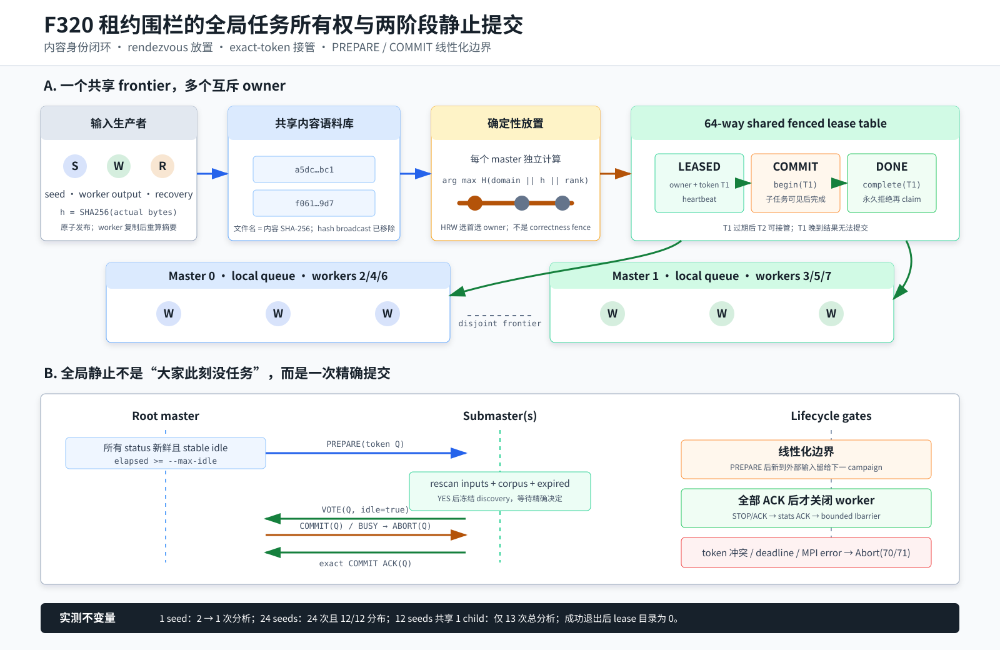

# F320：租约围栏的全局任务所有权与两阶段静止提交

- 日期：2026-08-07
- 实现范围：`util/mpi_concolic_execution.py`、`util/distributed_state.py`
- 测试范围：`test/test_mpi_lifecycle.py`、`test/test_distributed_state.py`
- 当前证据等级：I/T/E-mechanism

## 1. 研究问题

F319 统一了两个 MPI 前端的关闭协议并消除了 READY/RESULT 跨 tag 乱序，但真实双
master 实验揭示了一个独立的扩展性问题：共享目录中只有一个种子文件，最终却报告两次
analysis observation。旧协议把新 hash 广播给每个 master，各 worker group 因而复制探索同一
frontier。更多 worker 提高了硬件占用，却不一定提高有效符号执行数。

这个问题不能只用本地 `set` 修复。多 master 并发发现同一内容时，需要同时回答：

1. 哪个 master 是正常路径的首选 owner；
2. 首选 owner 卡顿或租约过期时，谁可以接管；
3. 旧 worker 晚到的结果为什么不能完成新 owner 的任务；
4. 所有 master 暂时空闲时，如何避免一个 master 提前退出，而另一个随后又发布工作；
5. 共享文件名被截断或错误替换时，如何防止“文件名哈希”冒充真实内容身份。



## 2. 核心设计

### 2.1 内容身份和 rendezvous owner

所有输入继续使用 `h = SHA256(content)` 命名。对 master 集合 `M`，首选 owner 为：

```text
owner(h) = arg max(m in M) SHA256("symcc-work-owner-v1" || h || m)
```

实现取 128 位评分并以 rank 作为确定性平局规则。该方法对应 Thaler 与 Ravishankar 的
[Highest Random Weight 映射](https://doi.org/10.1109/90.663936)：所有 master 无需维护
路由表即可独立得到同一 owner；增加一个节点时，只有新节点获胜的 key 发生迁移。测试对
600 个固定摘要验证了确定性、三节点分布以及这一最小重映射性质。

Rendezvous hashing 只是**放置策略**，不是并发正确性证明。两个进程仍可能因恢复扫描、时钟
边界或旧状态同时尝试处理一个 hash，因此还需要共享 fencing lease。

### 2.2 job epoch 和 fencing lease

rank 0 为每次 MPI 作业生成随机 256-bit epoch，并经全局 communicator 广播。多 master 在
共享目录下使用 `.standalone-work-<epoch>`，其中 `FencedWorkLeaseTable` 按 hash 分片保存：

| 字段 | 含义 |
| --- | --- |
| `status` | `leased -> committing -> done` |
| `owner` | 作业 epoch 与 master rank 绑定的 owner 名称 |
| `token` | 每次 claim 唯一的 fencing token |
| `updated` | 跨进程可比较的 Unix 时间戳 |
| `attempts/steals` | 重试与跨 owner 接管证据 |
| `payload` | schema、内容 hash 与 `initial/generated` 来源 |

正常准入必须同时满足“当前 rank 是 rendezvous owner”和“共享表原子 claim 成功”。pending和
active token周期heartbeat。结果到达后先执行 `begin_commit(hash, token)`；该操作经F321复核后
成为不可过期偷取的提交决定，避免旧holder在结果副作用执行期间被新owner替换。只有current token
可以计入生成数、发布子输入并执行`complete`。过期pre-commit token的晚到结果被
记为 stale，不得修改新的 owner 状态。这一设计借鉴时间租约的故障隔离思想；租约的经典系统
背景见 Gray 与 Cheriton 的 [SOSP'89 leases](https://doi.org/10.1145/74850.74870)。本实现额外
使用 fencing token 处理“旧执行在租约过期后仍然返回”的情形。

### 2.3 共享 corpus 发现和过期恢复

F320最初由worker把生成文件直接写入共享content-addressed corpus；F321已将当前实现修订为
worker写入隐藏的per-result staging目录，master核对完整清单和逐文件SHA-256，并在父任务
`begin_commit`成功后才提升到公开corpus。每个master周期扫描公开目录，但只claim分配给自己的
文件；生成者与owner不同不影响正确性，目标owner在下一扫描周期发现并认领。

恢复扫描只读取过期`leased`记录。任一master都可尝试重新claim，原子表保证只有一个新token
获胜；恢复故意不受原rendezvous owner限制，从而在owner于commit前暂停时保持进展。
`committing`表示结果已经越过不可逆fence，不再按TTL恢复；没有持久事务日志时，偷取它会让旧
holder与恢复者并发应用结果，安全性弱于保守阻塞。
若记录存在而 corpus 文件缺失，恢复者立即 `abandon` 刚取得的 pre-commit token，避免把一个
不可执行任务永久 heartbeat。完成记录永久拒绝再次 claim。

### 2.4 内容寻址完整性闭环

master 派发 hash，worker 从共享目录复制对应文件后重新计算 SHA-256，并在所有 RESULT 路径
回显 `input_hash`。master 把回显值与 active assignment 的 hash 一起交给严格结果解析器。
复制失败、无法读取或摘要不一致均成为 invalid result：该 rank 被隔离，本轮生命周期失败，
原任务不会被错误标记为 done。由此，任务身份绑定到实际执行字节，而不只绑定到可变文件名。

### 2.5 两阶段全局静止提交

“每个 master 当前都空闲”不足以推出全局终止，因为消息、共享文件或恢复任务可能仍在途。
这是经典分布式终止检测问题；背景可参见 Dijkstra 与 Scholten 的
[termination detection](https://doi.org/10.1016/0020-0190(80)90021-6)。本项目的工作传播经过
共享文件系统而不是纯消息扩散，因此实现了与本地 frontier 语义匹配的 root 协调协议：

1. 每个 master 周期发布带单调 sequence 的 idle/busy 状态；旧序列、错误 source 或畸形
   schema 被隔离；
2. root 只在所有状态新鲜且连续空闲达到 `--max-idle` 后生成随机 PREPARE token；
3. submaster 收到 PREPARE 后重新扫描外部输入、共享 corpus 和过期 lease；若仍空闲则投
   YES，并冻结新任务发现，直到收到同 token 的决定；否则投 BUSY；
4. 任一 BUSY 使 root 向已准备节点广播精确 ABORT，释放冻结状态；
5. 全部 YES 后 root 广播 COMMIT。submaster 仅在 token 与本地 prepared token 精确一致时
   回 `committed=true` ACK 并退出调度循环；root 收齐全部 exact ACK 后才进入 worker shutdown；
6. COMMIT 后出现 busy status 或拒绝 ACK 被视为控制面冲突，走有界 Abort(70)，不伪装成功。

YES 后冻结明确了有限批次的线性化边界：参与者接受 PREPARE 后才由外部生产者加入的文件保留
在 corpus 中，交给后续 campaign；它们不被错误计入本轮“已经穷尽”。该协议不是 Paxos/Raft
共识，也不能在 MPI rank 硬失败后缩容 communicator。

### 2.6 全等待有界

共享租约原先的 lock-directory 获取循环没有 deadline；不可删除的锁会绕过 F319 的所有有界
关闭保证。本轮给 `FencedWorkLeaseTable` 增加 monotonic acquisition deadline。新配置
`SYMCC_STANDALONE_WORK_LOCK_ACQUIRE_TIMEOUT` 到期后抛出 `TimeoutError`，standalone master
将其转换为控制面失败并进入已有 Abort(70) 路径。F320最初还允许按跨进程wall-clock年龄删除
锁目录；F321复核证明暂停holder可能恢复并覆盖新状态，已取消该stale-break行为。当前实现只用
wall clock报告观测年龄，等待上界使用本进程monotonic clock，到期fail closed。

## 3. 执行流程

```text
外部 seed
  -> 原子发布并回验 SHA-256 文件
  -> rendezvous 计算首选 master
  -> 共享表 claim，取得 token
  -> local pending queue
  -> READY worker 接收 hash
  -> worker 复制并重算输入 SHA-256
  -> worker将child写入隐藏stage
  -> RESULT 回显输入 hash、子 hash 与stage id
  -> master校验stage清单及字节摘要
  -> begin_commit(hash, token)
  -> 提升child到公开corpus
  -> 子文件由各自 owner claim
  -> complete(hash, token)
  -> 全 master stable idle
  -> PREPARE/VOTE -> COMMIT/ACK
  -> worker STOP/ACK -> stats exact ACK -> bounded Ibarrier
```

## 4. 代码与测试映射

| 能力 | 权威实现 | 直接测试或证据 |
| --- | --- | --- |
| 确定性 owner 与最小重映射 | `_rendezvous_work_owner()` | 600 hashes、重复 master 集合、扩容性质 |
| 全局 claim/commit fencing | `_SharedWorkCoordinator` + `FencedWorkLeaseTable` | 双 coordinator claim、错 token、done 拒绝 |
| 过期接管 | `recover_expired()` | 旧 token 失效、单一新 token、完成闭环 |
| 缺失文件释放 | `_SharedWorkCoordinator.abandon()` | current pre-commit token 约束 |
| 锁等待上界 | `FencedWorkLeaseTable._locked()` | 新鲜锁目录 0.01 秒 deadline |
| 内容身份校验 | worker SHA-256 + `_worker_result_payload()` | assignment hash 匹配/不匹配 |
| 两阶段静止 | `_MasterQuiescenceGate` | stable status、vote、abort、commit、exact ACK、commit conflict |
| 多主统计可观测性 | `_bounded_master_stats_exchange()` | 每 master 分解、exact stats ACK、跨 peer 状态排空 |
| 作业代次清理 | `main()` epoch broadcast + final barrier cleanup | 真实单/双 master 后隐藏目录数为 0 |

## 5. 验证结果

### 5.1 自动化门禁

| 验证项 | 结果 |
| --- | --- |
| `py_compile`、Ruff、`git diff --check` | 通过 |
| lifecycle + distributed-state 定向回归 | 100 passed + 9 subtests（5.62 秒） |
| 完整 `pytest -q test` | 611 passed + 37 subtests（84.11 秒） |

新增测试方法共 6 项：5 项覆盖 rendezvous、共享 owner、过期恢复和静止状态机，1 项覆盖租约锁
deadline；原有 strict result 测试同时扩展了输入 digest assignment 绑定。

### 5.2 真实 Open MPI 机制证据

环境：Open MPI 4.1.6，`mpi4py`，`-np 8 --workers-per-master 3`，即 2 masters + 6 workers；
每次执行 timeout 1 秒，idle window 1 秒，shutdown/finalize grace 5 秒。除生成物实验外，目标为
`/bin/true`。这些数据证明协议行为，不是符号求解覆盖率 benchmark。

| 场景 | F319 基线 | F320 结果 | 结论 |
| --- | ---: | ---: | --- |
| 1 个非空 seed、双 master | 2 analysis observations | 1 observation | 复制执行从 1 次冗余降为 0；总执行数减半 |
| 24 个不同 seed、双 master | 未测 | 24 observations，24 corpus files | 无丢失、无重复 |
| 同上逐 master 分布 | 不可见 | master 0 = 12，master 1 = 12 | 本次固定输入上完全均分 |
| 12 seeds 均生成同一 child | 未测 | 13 observations、13 generated、1 interesting | child 全局只分析一次 |
| 生成物实验逐 master 分布 | 不可见 | master 0 = 6，master 1 = 7 | 跨 owner 发现路径工作正常 |
| 单 master 回归 | 1 observation | 1 observation；2/2 shutdown ACK | 原拓扑语义保持 |
| 成功退出后的 lease 目录 | 不适用 | 0 个 `.standalone-work-*` | final barrier 后清理成功 |

24-seed 运行在约 1.06 秒稳定空闲后提出 COMMIT，两个 worker group 均 3/3 shutdown ACK，
全体 exact COMMIT ACK 和 stats ACK 完成，进程退出码 0。12+child 运行报告 corpus 文件 13、
digest mismatch 0、退出码 0。

四组运行的原始 stdout/stderr、输入构造、等价重放命令、退出与目录检查结果已经归档到
[`F320 real-MPI evidence`](../evidence/f320-global-work-ownership-2026-08-07/)，并由目录内
SHA-256 清单及 `verify_delivery.py` 自动复核。F319 的 2-observation 基线没有原始日志归档，
因此只作为前一轮记录的对照值，不伪装成当前证据目录内可重算的制品。

### 5.3 如何解释“提升”

单 seed 从 2 次降到 1 次是**调度冗余的确定性消除**：若定义
`redundancy = observations / unique_work - 1`，该场景从 `1.0` 降到 `0.0`。这不是
“覆盖率提高 100%”，也不能直接推出大型程序吞吐翻倍；真实 SymCC 运行还包含共享目录扫描、
lease I/O、约束难度偏斜和 worker 长尾。24-seed 与共享-child 实验进一步排除了简单的
“少执行是因为漏任务”解释，但仍属于机制验证。

## 6. 配置

| 配置 | 默认值 | 作用 |
| --- | --- | --- |
| `SYMCC_STANDALONE_WORK_LEASE_TTL` | `max(120, 4*timeout)` | pre-commit work token过期与恢复边界；committing不可偷取 |
| `SYMCC_STANDALONE_WORK_LOCK_TTL` | 30 秒 | F321后仅保留为兼容/诊断年龄提示，不授权删锁 |
| `SYMCC_STANDALONE_WORK_LOCK_ACQUIRE_TIMEOUT` | `min(30, max(1, shutdown_grace/4))` | 锁获取 monotonic deadline |
| `SYMCC_STANDALONE_WORK_SCAN_INTERVAL` | 0.25 秒 | corpus/recovery 扫描周期 |
| `SYMCC_STANDALONE_WORK_LEASE_SHARDS` | 64 | 共享 JSON record 目录分片数 |

完整范围和异常值处理见 `docs/Configuration.txt`。单 master 不创建共享 work coordinator，仍走
F319 的本地 monotonic idle deadline。

## 7. 创新性与挑战性

本轮不是简单把一个去重集合搬到共享目录，而是组合了四个不同层次的机制：

1. **无中心路由的正常放置**：rendezvous owner 避免所有 hash 先经过 root；
2. **可接管的正确性边界**：租约过期允许任意 master 恢复，fencing token 隔离旧结果；
3. **内容级端到端身份**：shared filename、worker 实际字节和 master assignment 三者闭合；
4. **任务面与生命周期面的联合终止**：稳定 idle 只是触发条件，PREPARE rescan、冻结、
   COMMIT ACK 才是进入关闭阶段的凭据。

困难在于这些层次不能互相替代：只做 HRW 无法处理旧 owner，只做 lease 会让所有 master 争抢
热点，只看本地队列会提前退出，只等 MPI send completion 又不能证明远端已经提交。当前实现把
这些不变量落实到一条真实可执行路径，并为每个拒绝分支保留 fail-closed 行为。

## 8. 已知边界与后续实验

- 依赖共享文件系统对原子 rename、mkdir 和可见性的正常 POSIX 语义；尚未在 NFS/Lustre 的
  多节点故障和 metadata 高压下测量；
- corpus 扫描仍为目录级 O(N) 发现。下一步可研究 append-only manifest、inotify 辅助提示或
  分片目录，但 manifest 必须保持“提示可丢、共享 lease 为权威”的容错关系；
- lease 使用 wall clock 比较跨节点过期时间，lock wait 使用 monotonic deadline；大幅跨节点
  时钟漂移可能改变恢复延迟，但 stale token 仍由 fencing 隔离；
- PREPARE 后到达的外部输入被明确留给下一轮。持续在线 AFL 协同应继续使用
  `mpi_fuzzing_helper.py` 的独立生命周期，而不是把本工具的有限批次提交解释为流式快照；
- MPI rank 硬失败通常仍由当前 Open MPI 作业级错误处理终止。未实现 ULFM revoke/shrink、
  rank replacement 或跨作业继续同一 epoch；
- 尚缺等 CPU、真实 SymCC 目标、多轮运行的 throughput、coverage AUC、worker utilization、
  lease metadata cost 和长尾恢复实验，因此当前不授予 R 级性能证据。

建议下一阶段用 1/2/4 masters、固定总 worker 数和相同 corpus，分别比较旧复制广播、
HRW-only、lease-only 与完整 F320；同时报告 `observations/unique_work`、CPU-hours、扫描 I/O、
lease steals、coverage AUC 和 time-to-target，并进行多轮配对统计。
