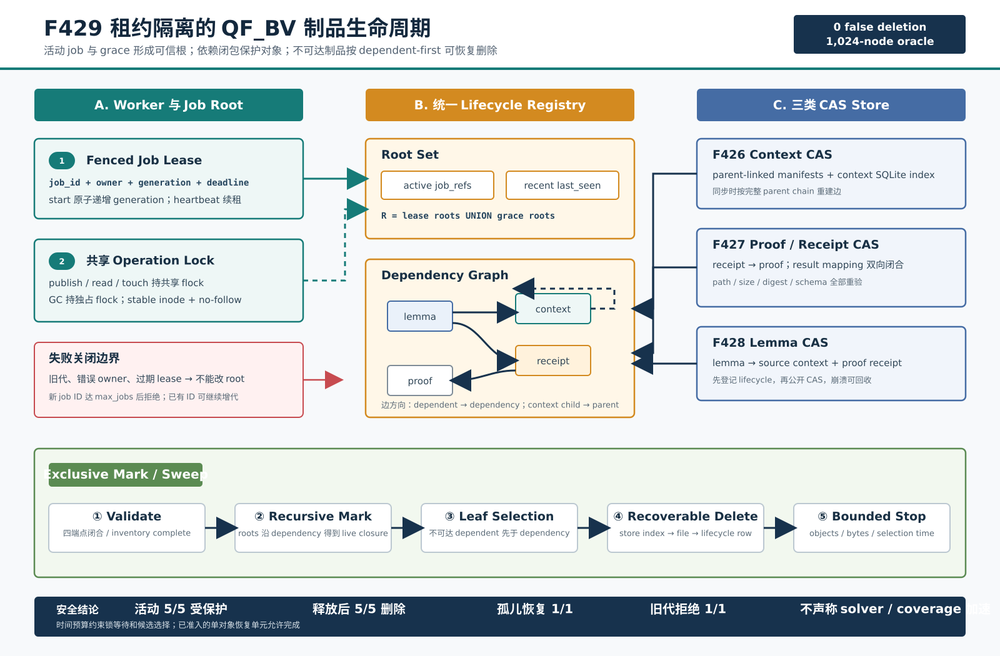

# F429：租约隔离的 QF_BV 制品生命周期与依赖感知 GC

- 日期：2026-08-17
- 状态：I/T/E-mechanism；W4 跨作业存储阶段完成
- 支持域：F426 context、F427 proof/receipt、F428 verified lemma 的共享 CAS
- 生产入口：`symcc_query_service.py` 的显式 lifecycle/GC 参数
- 权威测试：`test/test_qfbv_artifact_lifecycle.py`、`test/test_qfbv_lemma_exchange.py`
- 独立 oracle：`benchmark/check_qfbv_artifact_lifecycle_oracles.py`
- 原始证据：`docs/codex/evidence/f429-qfbv-artifact-lifecycle-2026-08-17/`



## 1. 研究问题

F426--F428 把跨 worker 的 QF_BV 公式、UNSAT 证明和 learned lemma 变成内容寻址制品，
但长期并行实验还存在一个独立于求解正确性的存储问题：什么时候可以安全删除一个共享对象？
仅按文件年龄、SQLite 行年龄或单一 store 的引用计数删除都不正确：

1. 一个活动 lemma 间接依赖 proof receipt、proof 和 source context；只看 lemma 文件会误删依赖；
2. 一个 worker 可能刚读完索引、尚未打开 CAS 文件；GC 与读取并发会产生 use-after-delete；
3. worker 崩溃后不会主动释放引用，永久引用计数又会造成空间泄漏；
4. context/proof/lemma 使用三个独立索引，旧版本对象和“文件已发布、索引未提交”的 orphan
   不能由单个 store 的查询完整发现；
5. 删除跨越 SQLite 和文件系统，任意一步崩溃后必须可重试，不能把部分完成解释为成功。

F429 将这四类 CAS 统一为一个跨 store 依赖图，以**带 generation 的可续租 job root**和访问
grace root 定义活对象，再执行依赖感知、有对象/字节/选择时间预算的 mark/sweep。GC 只负责
回收不可达制品；SAT/UNSAT 和 lemma 的语义授权仍分别由 Query IR replay、CPC/Ethos 和 F428
ancestor entailment 决定。

## 2. 技术来源与迁移边界

设计借鉴了三个不同领域的原则：

- [Nix store GC](https://nix.dev/manual/nix/2.35/command-ref/nix-store/gc.html) 将 live 定义为从
  roots 经文件系统引用可达的闭包，并删除其补集；F429 迁移 root/reachability 原则，但 root
  是带租约的 solver job，而不是用户 symlink；
- [Buildbarn](https://github.com/buildbarn) 代表分布式内容寻址构建基础设施；F429 同样把对象内容
  身份与生命周期元数据分离，但没有声称实现远端 CAS 协议、复制或跨地域一致性；
- [Makalu recoverable allocation](https://research.google/pubs/makalu-fast-recoverable-allocation-of-non-volatile-memory/)
  强调崩溃后恢复与追踪不可达对象；F429 使用 SQLite WAL、幂等删除和 publish-before-index
  次序，而不是其非易失内存分配器算法。

分布式 SAT/SMT 的 clause sharing 与 proof production说明“共享求解知识”需要独立处理内容正确性
和生命周期，例如 [Gimsatul proof-producing sharing](https://arxiv.org/abs/2207.13577) 与
[Scalable SAT Solving in the Cloud](https://arxiv.org/abs/2205.06590)。F429 只解决已经通过
F426--F428 验证的制品存活性，不传输 solver heap、watch list 或未经证明的 clause。

## 3. 数据模型与不变量

### 3.1 四类节点

统一注册表使用 `(kind, sha256)` 作为节点身份：

| kind | 内容 | 精确依赖 |
| --- | --- | --- |
| `context` | F426 prefix delta manifest | 非根 context 指向 parent context |
| `proof` | F427/F428 CPC proof body | 无 |
| `receipt` | 经 Ethos 验证策略绑定的结果回执 | 指向 proof |
| `lemma` | F428 verified learned literal record | 指向 source context 与 proof receipt |

边方向固定为“依赖者 -> 被依赖者”。因此一个活动 lemma 的递归闭包会同时保护 source context、
receipt 和 proof；一个活动 child context 会保护全部 ancestor context。

节点内容身份不仅包含 digest，还在首次登记时冻结 `encoded_bytes` 和精确依赖集合。相同 digest
若以不同大小或不同边集再次登记会失败关闭，避免索引漂移改变同一内容身份的可达语义。

### 3.2 Job root 与 fencing

`start_job(job_id, owner)` 在 `BEGIN IMMEDIATE` 事务中执行：

1. 新 job ID 的 generation 为 1；已有 ID 的 generation 单调加一；
2. 删除该 ID 的旧代引用；
3. 原子写入 owner、generation、lease deadline 和更新时间；
4. 返回不可变 `ArtifactJobLease`。

heartbeat、touch 和 release 都要求 `(job_id, owner, generation)` 精确匹配。旧 worker 即使在网络或
调度暂停后恢复，也不能续租、添加引用或释放新一代 root。审查中发现旧 release 路径在 owner
错误时虽然返回失败，仍会删除同 generation 引用；F429 最终实现把删除引用严格放入成功更新的
分支，伪造 release 现在保持活动 root 不变。

job 行不能简单按年龄删除：若同一 ID 后续从 generation 1 重新开始，旧 lease 可能重新获得权限。
因此行作为 fencing tombstone 保留，并由持久 `max_jobs` 限制唯一 ID 总量。新 ID 达到配额后失败
关闭，已有 ID 仍可增加 generation；不同进程以不同 `max_jobs` 打开同一 store 会触发 metadata
drift 拒绝。默认 1,000,000，允许范围 1--10,000,000。

### 3.3 两类 root

给定当前时间 `t` 和 grace `g`，初始 live 集为：

\[
R = \{a\mid a\text{ 被 lease\_until}>t\text{ 的 job 引用}\}
    \cup \{a\mid last\_seen(a)\ge t-g\}.
\]

最终 live 集为沿依赖边的传递闭包：

\[
L = \mu X.\;R\cup\{v\mid \exists u\in X,\;u\rightarrow v\}.
\]

job lease 处理活动执行，grace root 处理刚完成读取、尚未建立长期引用或运维上希望保留的热对象。
过期 job 的引用在同一 GC 事务中移除；job 行仍保留 generation 历史。

## 4. 并发协议与执行次序

### 4.1 统一锁域

生命周期根下的 `.lifecycle.lock` 必须是稳定 regular file，并使用 `O_NOFOLLOW` 打开及
`(dev,ino)` 前后复核：

- store publish/read/touch 进入共享 `operation()` 锁；
- schema 初始化和 GC 进入独占锁；
- 同一线程的嵌套 operation 只增加深度，不重复取得文件锁；
- operation 内发起 collection、operation 内发起 maintenance 均失败关闭。

由此读者在“索引检查 -> 文件打开 -> 内容验证”整个操作期间不会与 GC 删除交错。该锁只在合格的
共享文件系统上提供跨进程互斥；部署方仍需保证 lifecycle root 祖先路径和挂载本身稳定。

### 4.2 发布与崩溃窗口

受管 store 在公开 CAS 文件前先登记 lifecycle 节点，随后执行既有 create-once、文件/目录 fsync
和 store index 提交。这一顺序选择使崩溃语义偏向空间泄漏，而不是漏追踪：

- 注册后、CAS 发布前崩溃：registry 可能有无文件 phantom，删除 callback 幂等清理；
- CAS 发布后、store index 提交前崩溃：registry 已知 orphan，GC 可以回收；
- store index 已存在但 lifecycle 是从旧版本启用：GC 前必须完成全索引同步；
- 同步扫描超过显式上限：整轮 GC 拒绝，不删除任何对象。

context、proof/receipt、lemma 三个同步器逐行稳定读取文件、复核 path/size/digest/schema，并重建精确
依赖。proof 同步额外要求 `receipts <-> result_receipts` 双向映射和 receipt -> proof 闭合。
所有 store 同步完成后，registry 再检查每条 edge 的 source/target 和每条 job reference 的
job/artifact 端点；任一缺失使 collection 在调用删除 callback 前失败。

### 4.3 Mark/sweep

1. 独占 lifecycle 锁并开始 SQLite immediate transaction；
2. 删除已过期 job 的引用，验证完整图；
3. 用 SQLite recursive CTE 计算 active/grace roots 的依赖闭包；
4. 从不可达节点中选择“没有不可达 dependent”的节点，因此按 dependent-before-dependency 删除；
5. 调用 kind 对应 store 的幂等删除器；
6. 删除 lifecycle edge、job reference 和 artifact 行；
7. 直到对象、字节或候选选择时间预算耗尽。

依赖环没有可删除叶子时返回 `dependency_cycle` 且不误删环内节点。SQLite progress handler会中断
递归 mark 和候选查询，但一个已经准入的单对象删除允许完成其 index/file 恢复单元；因此
`gc-time-ms` 是**锁等待与选择预算**，不是硬端到端 wall-clock deadline。

### 4.4 幂等删除

各 store 的 callback 采用 index-first、file-second 次序：

1. 验证 kind、digest、relative path、记录大小及没有仍存活的 store-local child/reference；
2. 删除本 store 的 SQLite 行并提交；
3. 稳定重读/复核文件后 unlink，fsync 父目录；
4. 若进程在 2 和 3 之间退出，下一次 callback 允许 index 缺失但文件仍存在并继续 unlink；
5. lifecycle 行只在 callback 返回后删除。

这不提供跨两个 SQLite 数据库和文件系统的单一原子事务，而是提供每个崩溃前缀都可安全重试的
恢复协议。

## 5. 生产配置

生命周期管理必须显式启用，不会因配置了 context/proof/lemma store 而静默开始删除：

```bash
python3 util/symcc_query_service.py \
  --store /shared/query-store \
  --qfbv-context-store /shared/qfbv-contexts \
  --qfbv-proof-store /shared/qfbv-proofs \
  --qfbv-lemma-store /shared/qfbv-lemmas \
  --qfbv-artifact-lifecycle-store /shared/qfbv-lifecycle \
  --qfbv-artifact-job-id campaign-2026-08-17-worker-01 \
  --qfbv-artifact-job-lease-seconds 60 \
  --qfbv-artifact-max-jobs 1000000 \
  --qfbv-artifact-gc-on-start \
  --qfbv-artifact-gc-grace-seconds 86400 \
  --qfbv-artifact-gc-max-objects 1024 \
  --qfbv-artifact-gc-max-bytes 268435456 \
  --qfbv-artifact-gc-time-ms 30000 \
  --qfbv-artifact-gc-scan-max-objects 100000
```

对应环境变量为：

- `SYMCC_QFBV_ARTIFACT_LIFECYCLE_STORE`；
- `SYMCC_QFBV_ARTIFACT_JOB_ID`、`SYMCC_QFBV_ARTIFACT_JOB_LEASE_SECONDS`；
- `SYMCC_QFBV_ARTIFACT_MAX_JOBS`；
- `SYMCC_QFBV_ARTIFACT_GC_GRACE_SECONDS`；
- `SYMCC_QFBV_ARTIFACT_GC_MAX_OBJECTS`、`SYMCC_QFBV_ARTIFACT_GC_MAX_BYTES`；
- `SYMCC_QFBV_ARTIFACT_GC_TIME_MS`、`SYMCC_QFBV_ARTIFACT_GC_SCAN_MAX_OBJECTS`。

`--qfbv-artifact-gc-only` 同步全部已配置 store、执行一轮 GC、打印 JSON 后退出。正常 worker 模式
创建 lease，并由后台线程以约 lease/3 周期 heartbeat；退出时释放。heartbeat 失败会传播为服务
错误，不能继续以已失效 root 运行。

## 6. 测试与实验结果

### 6.1 独立有限图 oracle

oracle 使用独立 Python 集合闭包和拓扑删除实现生成 64 个确定性 DAG，每图 16 节点，共 1,024
节点。生产 collector 与参考结果比较：

| 指标 | 结果 |
| --- | ---: |
| false deletions | 0 |
| missed deletions | 0 |
| dependency-order violations | 0 |
| 图 / 节点 | 64 / 1,024 |

### 6.2 真实五制品链

固定 cvc5 1.3.4 与 Ethos 构造：两个 parent-linked contexts、一个 CPC proof、一个 receipt 和一条
verified lemma，共 5 个对象、4 条依赖边：

| 观察 | run 1 | run 2 |
| --- | ---: | ---: |
| active protected / deleted | 5 / 0 | 5 / 0 |
| release 后 deleted | 5 | 5 |
| release 后 bytes | 12,169 | 12,169 |
| stale generation rejected | 1 | 1 |
| publish-before-index orphan deleted | 1 | 1 |
| 最终 context/proof/receipt/lemma | 0/0/0/0 | 0/0/0/0 |
| mechanism elapsed | 464,704 us | 436,942 us |

两次 JSON 除 `elapsed_us` 外语义字段完全相同。该时间包含真实 proof/lemma 建立、文件系统同步、
索引同步、mark 和删除，仅是当前主机上的机制成本，不能解释为 solver speedup。

### 6.3 自动化门禁

| 门禁 | 结果 |
| --- | --- |
| F429 定向 pytest | 22 passed |
| lifecycle/F426/F427/F428 关联 | 52 passed + 20 subtests |
| capability-closed Python | 1,197 passed + 273 subtests；零 skip/xfail/xpass/deselection |
| canonical node IDs | 1,197/1,197；SHA-256 `14f8b6acc3cdec6ae57ed9ce81a3cd7bde090c5a1815e934a684bbd3269a9464` |
| LLVM 17 | 311 passed + 2 expected unsupported / 313 |
| LLVM 18 | 312 passed + 1 expected unsupported / 313 |
| 双版本 F429 定向 lit | 1/1 + 1/1 |

测试覆盖 active/grace/expired roots、generation fencing、错误 owner release、job-ID 配额、对象/字节/
锁/选择时间预算、依赖环与缺失端点、并发 reader/collector 排斥、heartbeat、八 worker 初始化、
publish-before-index 和 index-before-unlink 两个崩溃窗口、旧索引有界同步、三 store 管理模式漂移及
真实 executable oracle。

## 7. 多轮 review 记录

1. **图语义**：把只检查 target 存在扩展为 edge source/target 与 job reference job/artifact 四端点
   闭合；同步不完整时删除 callback 调用数必须为零。
2. **证明索引**：补齐 `result_receipts -> receipts` 和 `receipts -> result_receipts` 双向映射，且
   receipt 必须指向存在的 proof；防止单向索引看似完整而依赖图缺边。
3. **fencing**：发现失败 release 仍删除引用的授权错误，将引用删除绑定到成功 owner/generation
   更新；伪造 owner 后 active reference 保持 1，GC 保护对象。
4. **资源有界性**：job tombstone 为避免 generation 复活不能安全删除；新增持久 `max_jobs` 配额，
   饱和后只拒绝新 ID，已有 ID generation 仍递增。
5. **数值与超时**：所有 wall-time 注入拒绝 NaN/Inf/bool；文档和 CLI help 将时间预算限定为
   selection/lock，不虚假承诺已准入文件删除的硬中断。
6. **实验声明**：两轮 oracle 仅比较稳定语义字段，保留非稳定耗时原值；不从零误删推导覆盖提升，
   不从两次机制时间推导吞吐改进。

## 8. 已关闭与未关闭边界

F429 已关闭：

- context/proof/receipt/lemma 跨作业引用图；
- fenced job lease、heartbeat、grace root；
- 依赖闭包 mark 与 dependent-first bounded sweep；
- 旧索引同步、publish/index/unlink 崩溃恢复；
- job 元数据硬配额和完整图失败关闭。

仍未关闭：

1. solver-native preprocessing/search state、fork-server 或经验证的 snapshot transport；
2. arbitrary clause 的 assumption scope、跨版本能力协商和混合 theory lemma；
3. 多地域 object storage、网络分区、分布式 lock manager failover；
4. lifecycle SQLite 的在线分片和超大图 resumable mark cursor；
5. 固定硬件多节点上 disabled/context/proof/lemma/lifecycle 的至少 20 轮等 CPU R 级实验。

因此 F429 的准确等级是 I/T/E-mechanism，不是 R。下一阶段进入 solver-specific fork-server 或
可验证 preprocessing/search-state 复用；在版本冻结前不报告公开 benchmark 加速。

## 9. 复现命令

```bash
python3 -m pytest -q -W error test/test_qfbv_artifact_lifecycle.py
python3 -m pytest -q -W error \
  test/test_qfbv_artifact_lifecycle.py \
  test/test_qfbv_lemma_exchange.py \
  test/test_qfbv_proof_receipt.py \
  test/test_cross_worker_context.py
python3 benchmark/check_qfbv_artifact_lifecycle_oracles.py \
  --graphs 64 --output /tmp/f429-oracle.json
python3 util/python_test_gate.py --output /tmp/f429-python-gate.json \
  --require-nodeid-manifest test/pytest-nodeids.json -- -q -W error
lit -sv --path=/usr/lib/llvm-17/bin build-llvm17/test
lit -sv --path=/usr/lib/llvm-18/bin build/test
```
