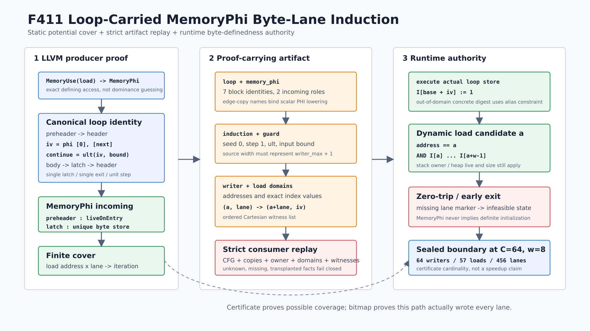

# F411：Loop-Carried MemoryPhi Byte-Lane Induction Certificate

> 日期：2026-08-16  
> 定位：F410 线性 MemoryDef 动态 lane cover 之后的规范循环归纳扩展  
> 等级：I/T/E-mechanism（生产实现、双 LLVM、严格重放、有限域 oracle 与机制实验）

## 1. 研究问题

F410 能证明符号长度区域操作之后的动态 load，但它从 load 的 `MemoryUse` 逆向遍历时只接受
线性 `MemoryDef` 链。一旦字节由循环逐次写入，LLVM MemorySSA 会形成头部 `MemoryPhi`：

```c
for (size_t i = 0; i < symbolic_count; ++i)
  object[i] = 0x41;
return *(uint16_t *)(object + symbolic_index);
```

这里存在两个不能混淆的问题：

1. **静态潜在覆盖**：规范归纳变量能否为 load 的每个候选 byte lane 提供一个 writer
   iteration witness？
2. **当前路径已初始化性**：实际 `symbolic_count` 是否已经执行到该 witness？

MemorySSA 的 `MemoryPhi` 表示多条 incoming memory definition **可能到达**，不是标量 PHI
那样的值选择证明。若直接把 backedge store 当作支配 load 的完整初始化，会错误接纳零次循环或
提前退出路径。F411 因此采用“静态 potential cover + 动态 byte bitmap”分工：证书只证明每个
lane 存在规范归纳 witness；runtime 仍要求当前路径上的每个 lane 已实际写入。

主要依据：

- [LLVM MemorySSA](https://llvm.org/docs/MemorySSA.html)：MemoryUse/Def/Phi 与 may-reach 语义；
- [LLVM Loop Terminology](https://llvm.org/docs/LoopTerminology.html)：preheader、single latch、
  dedicated exit 等规范循环概念；
- [A Bounded Symbolic-Size Model for Symbolic Execution, FSE 2021](https://www.cs.tau.ac.il/~maon/pubs/2021-fse.pdf)：
  以对象容量约束符号大小；
- [LoopSCC, 2024](https://arxiv.org/abs/2411.02863)：基于路径图/SCC 的循环摘要及归纳性陷阱；
- [Array-Carrying Symbolic Execution for Function Contract Generation, 2026](https://arxiv.org/abs/2602.23216)：
  以连续数组片段的 invariant/assigns 表达循环内存效应。

F411 借鉴这些方向，但只实现可审计的单 latch、单位步长、逐字节写入切片；它不是完整数组
不变量推断器、一般 loop summarizer 或 ACSE/LoopSCC 的完整复现。

## 2. 精确语义

设对象字节域为 `O=[0,C)`，规范归纳为：

\[
i_0=0,\qquad i_{k+1}=i_k+1,\qquad continue_k=(i_k <_u n)
\]

loop body 执行一字节写 `M[base+i_k] := v_k`。动态 load 的有限地址域为 `A`，宽度为
`w`。producer 枚举 writer 域 `W={(base+j,j) | 0<=j<C}`，并要求：

\[
\forall a\in A,\ \forall \ell\in[0,w),\
\exists!(p,j)\in W:\ p=a+\ell
\]

证书中的 witness 为 `(load_address=a, lane=l, writer_address=p,
induction_value=j)`。这是唯一映射，不是“循环一定执行 C 次”的断言。

运行时对具体已执行 store 更新：

\[
I'[base+i_k] = 1
\]

load 候选只有满足以下条件才可行：

\[
readable(a)=address=a \land \bigwedge_{\ell=0}^{w-1} I[a+\ell]
\]

因此 `n <= index+1` 的 `i16` load 会变成 infeasible，不会读取尚未初始化的第二个字节。
静态证书不会直接修改 `I`，也不会绕过 heap live/logical-size 或 stack frame owner 检查。

## 3. 支持域

当前生产域严格限制为：

- load 的真实 `MemoryUse` defining access 是循环 header 的 `MemoryPhi`；
- LoopInfo 识别恰好三个 loop blocks：header、body、latch；
- 单 preheader、单 backedge、单 latch、单 exit，load 位于该 exit，且 exit 的唯一前驱为 header；
- `MemoryPhi` 恰有 `{preheader: liveOnEntry, latch: writer MemoryDef}` 两条 incoming；
- header 是 `iv <_u symbolic_bound`，true 进入 body，false 进入 exit；
- scalar PHI 为 `iv=0`，latch 中 `next=iv+1`，loop 内不存在第二个 PHI、call 或 alloca；
- bound 直接来自 integer argument，或是该 argument 的一次 `zext`；其源位宽最大值必须能表示
  `writer_max+1`；
- body 中唯一 memory access 是一个 simple、非 atomic/volatile 的一字节 dynamic-index store；
- writer 与 load 属于同一 stack/heap allocation identity，writer scale 为 1；
- 最多 256 aliases 和 2,048 `address x lane` witnesses；load 仍受既有 1--8 byte scalar 限制。

以下情况失败关闭：多 latch、多个 loop memory accesses、第二个 writer、非单位或反向步长、
非零 seed、窄 bound、signed/非 `ult` guard、条件 body、多 exit、嵌套/非规范 CFG、部分 lane
cover、跨对象/跨过程 writer、动态 writer base、atomic/volatile 和未知 memory effect。

严格范围是刻意选择：MemoryPhi 是 may-reach，任何没有同时绑定 CFG、标量 recurrence 和真实
MemorySSA incoming 的“宽松识别”都会把潜在 writer 错当成必然初始化。

## 4. Producer 执行次序



`ContinuationLowering.cpp` 的执行顺序为：

1. 对 dynamic load 运行 `memoryAliases`，得到有限 `load address/index` 域；
2. 取得 load 的 LLVM `MemoryUse`，要求 defining access 为 `MemoryPhi`；
3. 用当前 `DominatorTree` 构造 `LoopInfo`，验证 preheader/header/body/latch/exit 及 exit 唯一前驱；
4. 验证 header conditional branch 和唯一 `ult(iv,bound)`；
5. 验证唯一 scalar PHI 的 preheader seed 0、latch incoming `iv+1`，拒绝额外 PHI/call/alloca；
6. 验证 bound 的 argument provenance，并在构造窄 `APInt` 前检查所需 exclusive upper bound
   可由源位宽表示；
7. 精确绑定 MemoryPhi 的 liveOnEntry 与 backedge writer MemoryDef；
8. 扫描 loop 内 MemorySSA access，除该 writer 外出现任何 MemoryUse/Def 即拒绝；
9. 解析 writer pointer provenance，枚举单位步长 writer address/index 域；
10. 对每个 load address 和每个 byte lane 查找唯一 writer address/induction value；
11. 输出版本化 transcript，并给 load 添加 `initialization_loop_memoryphi`；
12. 正常 lower scalar PHI 为 preheader/latch 两个显式 edge-copy blocks，runtime 按原 CFG 执行。

F410 的线性 region 路径保持独立；F411 只在该路径遇到 MemoryPhi 而失败后尝试，不改变既有
证书语义。

## 5. Proof-Carrying Artifact

成功 load 声明 capability `bounded-loop-memoryphi-byte-lane-induction`，transcript schema 为
`symcc-loop-memoryphi-byte-lane-induction-v1`。核心字段包括：

```json
{
  "loop": {
    "preheader": "bb0", "preheader_edge": "edge_bb0_bb1",
    "header": "bb1", "body": "bb2", "latch": "bb3",
    "latch_edge": "edge_bb3_bb1", "exit": "bb4"
  },
  "memory_phi": {
    "block": "bb1", "preheader": "live-on-entry",
    "backedge": "writer-memory-def"
  },
  "induction": {
    "variable": {"var": "v2"}, "bits": 64,
    "seed": 0, "step": 1, "next": {"var": "v5"}
  },
  "writer": {
    "block": "bb2", "ordinal": 0, "bytes": 1,
    "minimum": 0, "maximum": 7,
    "addresses": [64, 65, 66, 67, 68, 69, 70, 71],
    "index_values": [0, 1, 2, 3, 4, 5, 6, 7]
  }
}
```

完整 transcript 还绑定 guard/bound、load index 域、load addresses 和严格有序 witnesses。字段
集合必须精确相等，不能依赖 consumer 忽略未知字段的宽松 JSON 行为。

## 6. Consumer 独立重放

`LiveContinuationExecutor._loop_memoryphi_byte_lane_initialization` 不运行 LLVM，但从 artifact
独立重建：

- direct successor/predecessor 图，要求 header incoming 恰为两个 edge-copy blocks；
- preheader edge 的 `const 0 -> temporary -> iv`；
- latch edge 的 `next -> temporary -> iv`；
- header 中唯一 `ult(iv,bound)` 与 true/false 方向；
- latch 中唯一 `add(iv,1)`，以及 loop blocks 只包含允许的纯 operation 和唯一 store；
- writer ordinal、宽度、alias/index 域与 store 指令逐字段一致；
- bound 沿 `identity/zext` 链回溯到 input 或 parameter，要求 identity 保持位宽、最多一次 zext
  且必须严格扩宽，并重算可表示最大值；
- stack/heap owner、base、load alias/index 域；
- witnesses 恰为 `load_addresses x lanes` 的有序笛卡尔积，writer address/index 映射唯一。

缺 capability、有 capability 无 use-point transcript、edge 替换、witness 改写等均在
`executor.create()` 阶段拒绝。LLVM producer 仍负责 MemorySSA 与 LoopInfo 数学事实；consumer
负责防止证书被复制到不同 CFG、store、load 或对象。

最终深度审查还闭合了两类跨层非对称：producer 现在显式要求 exit 只有 header 前驱，并拒绝
额外 loop PHI、readnone call 与 alloca，避免生成 consumer 无法重放的 artifact；consumer 对
seed/step/width/index/witness 显式排除 Python `bool`，并验证 identity 位宽不变、至多一次 zext
且严格扩宽，防止 JSON 中 `true == 1` 或伪造宽位 identity 绕过整数合同。

## 7. Runtime 修复

F411 的真实循环执行暴露了一个跨功能错误：动态 store 的地址表达式在某次循环展开后可能化为
concrete digest。旧 executor 只在 digest 仍是 symbolic 时应用 `aliases/alias_cases`；于是
`iv==C` 的 one-past address 被送入普通 concrete store 路径，并抛出“outside declared objects”，
而不是把该候选约束为不可行。

修复后，symbolic 地址仍始终走 alias contract；若地址已化为 concrete，则先判断它是否属于
声明的有限 alias 地址域。域外地址转入 `_memory_alias_candidates`，条件析取为 false，状态以
`infeasible` 终止；域内地址继续走原有 concrete 对象生命周期与 logical-size 检查，从而保留
inactive heap 等确定性错误。该分流同时由 F411 one-past 正例和既有 heap-UAF 回归覆盖，不是
只测试静态 JSON。

## 8. 测试矩阵

`test/live_loop_memoryphi_byte_lane_induction.ll` 的生产测试覆盖：

- 8-byte stack object、逐字节 writer、动态 `i16` load；
- 7 个 load aliases、14 个 byte-lane witnesses；
- producer、consumer、runtime 和 artifact mutation 端到端；
- seed 1 导致的部分 writer domain 拒绝；
- step 2 导致的非连续 writer domain 拒绝；
- 2-bit symbolic bound 无法覆盖 8-byte exclusive upper bound 的拒绝；
- 同一迭代第二个 MemoryDef/writer 的拒绝；
- 第二个 loop scalar PHI 导致 producer/consumer edge-copy 支持域不一致的拒绝；
- capability removal、witness induction value、latch edge、布尔 step 类型、伪造 bound cast 和
  transcript removal 六类篡改拒绝；
- LLVM 17 与 LLVM 18 使用各自 plugin 的同一 fixture。

Python 单元测试覆盖 canonical recurrence、runtime bitmap、非规范 seed/step、12 类 mutation、
有限域 oracle、64-byte generator 和机制基准合同。

最终门禁结果为：LLVM 17/18 聚焦 fixture 各 `1/1` 文件通过（每个文件实际执行 15 条
`RUN`）；F407--F411 五文件关联回归在两个工具链各 `5/5` 通过；LLVM 17 完整 lit 为
`271 passed + 2 unsupported`；能力闭合 Python 门禁为 `1,056 passed + 250 subtests`，无
skip、xfail、deselection、collection error 或 node-ID 漂移。Python manifest SHA-256 为
`94db3d6385abeb73051b50430d29abb4e8f4877e0777e8adcddd2402a895142a`。

## 9. 独立有限域结果

oracle 不调用 C++ producer 或生产 consumer，独立枚举对象宽度、load 宽度、seed、step、bound
位宽和 load domain：

| 指标 | 结果 |
|---|---:|
| object bytes | 2--16 |
| load bytes | 1--8 |
| 总 cases | 8,019 |
| canonical covers 接受 | 585 |
| noncanonical/partial 拒绝 | 7,434 |
| lane checks | 91,773 |
| runtime bitmap equivalences | 22,154 |
| structured mutations | 12 / 12 拒绝 |

全部结果闭合：`cases = accepted + rejected`，且 canonical runtime bitmap 与
`load_offset + load_width <= min(count, object_size)` 等价。

## 10. 机制边界实验

64-byte object 与 8-byte dynamic load 构成当前边界：

- writer aliases：64；
- load aliases：57；
- byte-lane witnesses：456；
- MemoryPhi incoming edges：2。

封存 benchmark 计时仅测 Python reference validator；它不包含 LLVM LoopInfo/MemorySSA 构造、
continuation 执行、SMT 求解或 fuzzing。11 轮、每轮 1,000 次验证的 batch
minimum/median/maximum 为 `48,176,739 / 51,116,708 / 55,564,197 ns`，折算 median 为
`51,116 ns/certificate`。上述 64/57/456/2 是证书基数，不是 state 数、加速倍数或覆盖率提升。

## 11. 先进性、创新性与挑战性

- **先进性**：把 MemorySSA、规范 loop recurrence、有限 symbolic alias、proof-carrying artifact
  和 runtime byte-definedness 组合为一条可执行链，并与近期数组片段/循环摘要研究方向对齐。
- **框架创新**：显式分离“潜在 writer cover”与“当前路径已初始化性”。该分工避免静态分析
  为 zero-trip/early-exit 作不成立的归纳假设，又能准入 F410 无法处理的 loop-carried MemoryPhi。
- **挑战性**：同一事实跨 LLVM MemorySSA、scalar PHI、edge-copy IR、JSON consumer、符号
  byte bitmap 五种表示；任何 incoming、位宽、步长或 lane identity 偏差都可能造成错误准入。
- **可证伪性**：source negatives、artifact mutations、独立穷举 oracle、双 LLVM 和真实 runtime
  边界共同约束结论。

不宣称发明 loop summarization、MemorySSA 或数组 invariant；创新性限于本框架的有界组合、
证书协议、动态 definedness 分工和跨层重放闭环。

## 12. 未完成边界

F411 仍未覆盖多 block body、多 MemoryUse、conditional writer、多个 latch、nested loops、非单位
affine recurrence、descending loop、多个对象/guarded pointer union、region writer composition、
跨过程 loop effect、一般数组 segment invariant 或 public-target end-to-end 对照。

下一扩展应按风险顺序进行：先支持可证明的常量 stride 与 residue-class lane cover，再支持
single-latch conditional writer 的 guard-carry certificate；之后才考虑多 latch SCC fixed point。
任何扩展都必须保留 runtime bitmap authority，不能把 MemoryPhi may-reach 外推为必然写入。

## 13. 复现

```bash
cmake --build build -j2
cmake --build build-llvm17 -j2
python3 /usr/lib/llvm-18/build/utils/lit/lit.py -sv \
  build/test/live_loop_memoryphi_byte_lane_induction.ll
python3 /usr/lib/llvm-17/build/utils/lit/lit.py -sv \
  build-llvm17/test/live_loop_memoryphi_byte_lane_induction.ll
pytest -q test/test_loop_memoryphi_byte_lane_induction.py
python3 benchmark/check_loop_memoryphi_byte_lane_oracles.py
python3 benchmark/benchmark_loop_memoryphi_byte_lane.py
```

结果只能在相同 schema、fixture、边界参数和环境下比较；机制微基准不能外推为覆盖、吞吐、
solver time、bug yield 或端到端 speedup。
