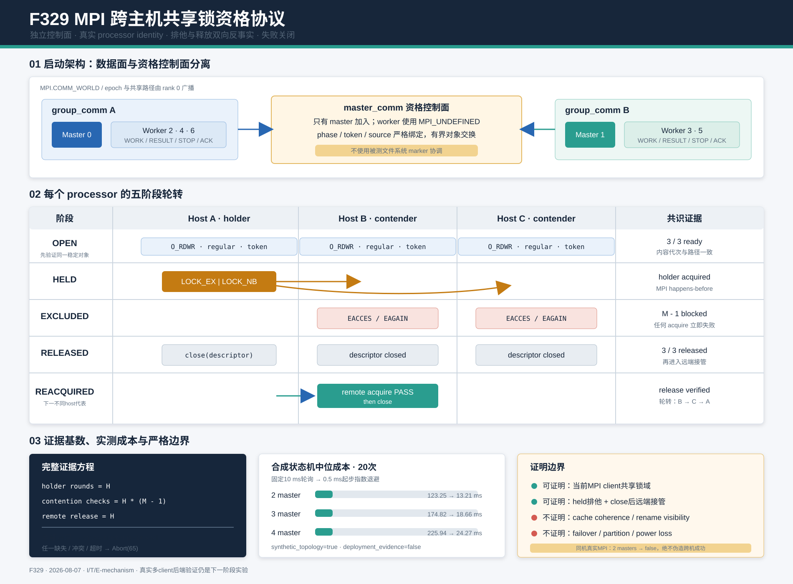

# F329：MPI 跨主机共享锁资格协议

- 日期：2026-08-07
- 功能编号：F329
- 成熟度：I/T/E-mechanism
- 代码范围：standalone MPI frontend、共享文件系统能力快照、独立资格协议
- 证据范围：协议状态机、故障注入、真实同机 Open MPI 反误报、合成拓扑开销、完整 Python 回归

> **历史快照说明（2026-08-10）**：本文记录F329首次落地时的v1协议与原始证据，不应解释为当前
> 消费契约。F351已增加state/publication文件系统重绑定、root/leaf descriptor锚点和全master
> namespace identity closure；现行成功能力为v3 snapshot及`cross-host-mpi-lock-v2`，运行时不再接受
> v1资格证据。参见[F351报告](Identity_Closed_Cluster_Lock_Qualification_F351_2026-08-10.md)。

## 1. 研究问题

F327在真实状态根上执行九项文件系统能力探测，F328进一步按standalone、lease和coverage writer
拆分9/6/5项最小契约。但二者的锁测试都由当前主机启动隔离子进程完成，只能说明当前kernel/client
上的两个进程共享`flock`域。NFS可以通过`local_lock=flock`把锁限制在单个client；旧版或特定SMB
组合也可能不向远端传播锁。因此“同机child被阻塞”不能推出“另一计算节点上的master也被阻塞”。

该缺口直接影响standalone多master的fenced lease：若两个client分别认为自己取得同一record lock，
就可能并发读改写同一lease record，opaque fencing token也失去单赢家前提。F329研究的问题是：

> 如何在任何epoch元数据和符号执行结果发布之前，利用独立MPI控制面让所有真实master client共同
> 证伪共享锁域，并把“参与者、竞争、释放、证明边界”形成机器可读证据？



## 2. 技术依据与定位

MPI 5.0将`MPI_Get_processor_name`定义为实际节点的唯一标识，并允许通过communicator划分建立独立
通信子集；Open MPI的`MPI_Comm_split`文档明确说明`MPI_UNDEFINED`成员返回`MPI_COMM_NULL`。
[MPI 5.0](https://www.mpi-forum.org/docs/mpi-5.0/mpi50-report.pdf)、
[MPI_Get_processor_name](https://docs.open-mpi.org/en/v5.0.8amzn1/man-openmpi/man3/MPI_Get_processor_name.3.html)、
[MPI_Comm_split](https://docs.open-mpi.org/en/v5.0.8/man-openmpi/man3/MPI_Comm_split.3.html)

Linux `flock(2)`文档说明：NFS client自Linux 2.6.12起通常把`flock`模拟为全文件POSIX锁，但
`local_lock` mount option可以把它重新限制为本机；SMB的远端语义又随kernel、protocol、mount
option和server变化。因此F329不根据`filesystem_type=nfs/cifs/lustre`猜测支持，而是让当前真实
client直接竞争同一inode。[flock(2)](https://man7.org/linux/man-pages/man2/flock.2.html)、
[nfs(5)](https://man7.org/linux/man-pages/man5/nfs.5.html)

Python文档规定非阻塞锁竞争失败可能返回`EACCES`或`EAGAIN`，实现同时接受两者；其他errno不是
“被正确阻塞”，而是资格失败。[fcntl](https://docs.python.org/3/library/fcntl.html)

本功能属于**部署前可执行一致性契约**，不是新的分布式共识算法，也不把一次成功litmus升级为
server failover、network partition或掉电恢复证明。

## 3. 架构审计与接入点

standalone的`compute_roles()`把全局rank前缀分配为master，并为每个master建立worker group。
多个master属于同一个`MPI.COMM_WORLD`，因此可以在现有`group_comm`之外再建立master-only
communicator：

```text
COMM_WORLD
  ├─ group_comm[master 0 + workers]   READY / WORK / RESULT / STOP
  ├─ group_comm[master 1 + workers]   READY / WORK / RESULT / STOP
  └─ master_comm[all masters only]    filesystem qualification control
```

接入顺序经过重新安排：

1. 所有rank确定worker group、共享路径和rank 0生成的work epoch；
2. 每个master在隐藏work root及真实public corpus边界执行F327/F328完整九项本机探测；
3. 所有master通过`master_comm`交换实际processor identity和本机探测结果；
4. 若至少两个processor参与，执行F329跨client轮转；否则记录同机membership但不升级证明；
5. 通过后把同一个capability对象注入`_SharedWorkCoordinator`，不重复九项探测；
6. 此后才创建`state.json`、lease shards、导入输入并启动正常master loop；
7. 任一步失败均`Abort(65)`，等待任务的worker随作业终止，不形成半启动集群。

hybrid frontend通常每个MPI job只有一个master；多个coordinator可能来自彼此独立的job，当前没有
共同communicator。F329没有用hostname配置或文件marker伪造跨job同步，hybrid仍保持本机证明范围。

## 4. 协议设计

设master数为`M`，由真实processor identity去重后的节点数为`H`。每个processor选择global rank
最小的master作为代表，代表序列按global rank稳定排序。

### 4.1 独立、有限控制面

`_bounded_master_exchange()`使用rank 0聚合的`isend/iprobe/recv`对象交换，而不使用待验证文件系统
上的ready marker。每个envelope精确绑定：

- schema：`symcc-cluster-lock-exchange-v1`；
- 256-bit epoch派生token；
- phase名称；
- communicator rank；
- 严格字典payload。

root只接受来自期望source的精确phase/token，随后回送完整有序records。缺失、重复代次、malformed、
send未完成或MPI异常均失败关闭。membership及全部轮次共享一个monotonic deadline，而不是每个phase
重新获得完整timeout。正常轮询从0.5 ms开始，无进展时指数退避到10 ms，兼顾启动延迟与故障等待CPU。

### 4.2 稳定锁对象

rank 0在隐藏epoch root内准备`.cluster-filesystem.lock`：

- `O_RDWR | O_CLOEXEC | O_NOFOLLOW`，保证NFS exclusive lock所需写权限并拒绝symlink；
- `fstat`必须是regular file；
- 内容精确绑定schema和epoch派生token，空文件只在持锁后初始化并`fsync`；
- 不在运行期unlink该路径，避免旧holder仍锁住已删除inode、后来opener锁住新inode的split-brain；
- 恢复epoch遇到不同内容直接拒绝，而不是覆盖未知代次。

### 4.3 每个processor的五阶段轮转

对每个holder代表执行：

1. **OPEN**：全部master打开同一路径、验证regular file和精确内容；
2. **HELD**：holder执行`LOCK_EX | LOCK_NB`并保留descriptor；
3. **EXCLUDED**：其余`M-1`个master必须得到`EACCES/EAGAIN`；任何成功取得锁都立即判失败；
4. **RELEASED**：所有descriptor关闭并通过MPI exchange确认已到达释放边界；
5. **REACQUIRED**：下一个不同processor的代表必须打开并取得锁，再关闭descriptor。

因此成功证据不是一个布尔值，而是精确满足：

```text
holder rounds       = H
contention checks   = H * (M - 1)
remote release      = H
```

升级函数再次核验member rank唯一、至少两个processor、每个processor恰有一个代表，以及三类计数完整，
然后才设置`cluster_lock_verified=true`和`probe_scope=cross-host-mpi-lock-v1`。同机多master只记录
membership，保持false和零轮次；不存在能强制置真的环境变量。

## 5. 能力快照

F329在原v1/v2 operation快照上增加以下可审计字段：

| 字段 | 含义 |
| --- | --- |
| `cluster_lock_members` | global rank与实际MPI processor identity |
| `cluster_lock_representatives` | 每个processor的holder代表 |
| `cluster_lock_rounds` | 已完整完成的holder轮数 |
| `cluster_lock_contention_checks` | 观察到held-lock排他的master次数 |
| `cluster_lock_release_checks` | 远端代表在close后成功接管的次数 |
| `cluster_lock_verified` | 只有完整多processor证据才为true |
| `probe_scope` | 本机保持`same-host-subprocess-v1`；成功跨机为`cross-host-mpi-lock-v1` |

operation schema继续用v1/v2区分完整或部分profile；F329字段是向后兼容的附加证据，不把未执行轮次
写成成功。standalone coordinator会校验prequalified root、publication root、required operation set
及九项true，再复用对象，因此跨机结果不会被错误注入另一路径或弱profile。

## 6. 正确性不变量

| 编号 | 不变量 | 实现 |
| --- | --- | --- |
| P1 | 控制同步不能依赖被测文件系统 | master-only MPI envelope exchange |
| P2 | 配置不能伪造第二主机 | 生产路径只调用`MPI.Get_processor_name()` |
| P3 | holder取得锁后contender才运行 | `HELD`共识先于`EXCLUDED` |
| P4 | close-release与排他都必须证明 | 每轮远端`REACQUIRED`，计数成对校验 |
| P5 | 所有client view都参与 | 每轮除holder外全部master竞争，而非只抽样一个 |
| P6 | inode不能在holder存活时替换 | 稳定文件保留、`O_NOFOLLOW`、内容代次绑定 |
| P7 | 超时不能扩大为每phase timeout | 整个协议共享单一monotonic deadline |
| P8 | 部分证据不能升级 | membership、轮次、竞争、释放任一不完整即失败 |
| P9 | 资格必须早于权威状态 | preflight在`state.json`和lease table之前 |
| P10 | 本机拓扑不能误报跨机 | 少于两个processor时false、零轮次 |

## 7. 自动化验证

原始证据位于
[`F329 evidence`](../evidence/f329-mpi-cross-host-lock-qualification-2026-08-07/)。

| 门禁 | 结果 |
| --- | ---: |
| F329定向/故障测试 | 8 passed，160 deselected |
| distributed state + MPI qualification/lifecycle | 168 passed + 13 subtests |
| 完整`pytest -q -W error test` | 681 passed + 41 subtests，93.83 s |
| Ruff / `py_compile` / `git diff --check` | 全部通过 |

故障测试覆盖：所有host轮转成功、排他失效、单master本机探测失败、缺失master deadline、稳定记录
代次不匹配、同机processor不升级、capability完整性升级门以及prequalified capability不重复探测。

## 8. 实验结果

### 8.1 真实同机Open MPI反误报

`run_same_host_mpi.py`实际启动7个Open MPI rank，自动形成2 master与5 worker，使用真实
`MPI_Get_processor_name()`。结果为：

- exit 0；master 0/1分别完成3/3和2/2 STOP ACK；
- snapshot记录两个master都位于processor `cuda-ke`；
- 代表为`[0]`，`cluster_lock_rounds=0`，`cluster_lock_verified=false`；
- scope保持`same-host-subprocess-v1`；
- epoch隐藏状态清理完成，初始seed按SHA-256发布。

该实验直接证明“同机多master不会被配置数量误判成跨机”，但没有第二台机器，因此不证明远端锁域。

### 8.2 合成拓扑协议成本与轮询优化

`benchmark_synthetic_protocol.py`在同机overlayfs上用线程化MPI消息bus和**合成processor名称**执行
完整状态机；本机九项探测不计时。每个拓扑2次warm-up、20次测量：

| master/合成processor | rounds | contention | release | 固定10 ms轮询中位 | 自适应轮询中位 | 中位下降 |
| ---: | ---: | ---: | ---: | ---: | ---: | ---: |
| 2 | 2 | 2 | 2 | 123.249 ms | 13.205 ms | 89.29% |
| 3 | 3 | 6 | 3 | 174.823 ms | 18.661 ms | 89.33% |
| 4 | 4 | 12 | 4 | 225.942 ms | 24.267 ms | 89.26% |

优化后20次均零失败，经验P95分别13.364、19.295和31.237 ms。检查数严格匹配`H*(M-1)`，说明
降延迟没有删除协议阶段。这里的处理器名称是测试注入，时间包含Python thread调度、本机消息bus和
overlayfs `flock`，不包含真实MPI网络、远端lock manager或本机九项probe，故只能解释为机制级
before/after，不是跨机部署延迟、DSE吞吐或coverage提升。

## 9. 先进性、创新性与挑战性

1. **Executable distributed assumption。** 把“共享存储应该支持远端锁”从部署手册假设变成由
   当前真实MPI成员共同执行、可失败的启动契约。
2. **Independent control/data planes。** MPI只控制phase顺序，文件系统只承载被测inode；避免用
   被测对象自身宣布ready形成循环证明。
3. **反事实双向证明。** 不仅要求held时远端失败，也要求close后不同host成功，区分“锁永远失败”
   与正确exclusion/release。
4. **全client observation。** 每个holder轮次让所有其他master竞争，发现同一集群中某个client的
   mount option或lock manager配置漂移。
5. **Machine-readable proof cardinality。** `H`、`H*(M-1)`、`H`计数由独立升级门重新核验，日志
   不再只有难以审计的“probe passed”。
6. **Fail-closed but bounded。** 故障证据不降级为warning；共享deadline和指数退避又避免失联rank
   无限挂起或以1 kHz持续忙轮询。

挑战主要来自分布式负面证据：contender成功可能意味着锁域破裂，也可能是holder尚未建立；因此必须
用MPI建立严格happens-before。释放测试同样必须位于所有descriptor close之后。另一个难点是避免
测试工具反过来扩大证明边界：单机线程注入可以验证代码状态机，却绝不能把合成hostname当成真实集群
证据；报告、JSON和snapshot都显式保留这一区分。

## 10. 局限与有效性威胁

1. 当前执行环境只有一个实际processor，尚无两台真实NFS/CIFS/Lustre client的true snapshot；
2. F329只验证当前启动时刻和当前参与client，运行期mount remount或lock manager故障仍可能改变语义；
3. 不验证file data cache coherence、close-to-open consistency、rename visibility或断电恢复；这些仍由
   本机operation probe和未来专用协议承担；
4. 不处理server restart、network partition、client pause/kernel panic或MPI rank replacement；
5. resumed epoch仍依赖运维契约“旧作业已停止”，并发复用同一epoch不受共识membership fencing保护；
6. `flock`是协作式协议，非协作writer可以绕过；
7. `MPI_Get_processor_name`遵循MPI实现提供的硬件标识，容器/调度器错误配置可能影响拓扑分组；
8. root聚合控制面是启动期O(HM)检查，master数量很大时应研究树形或分层聚合；
9. 合成实验没有真实网络和远端文件系统，只能衡量实现状态机的相对轮询成本；
10. 本轮不运行真实target、LAVA-M、solver或coverage campaign，不能声称符号执行效果提升。

## 11. 后续研究

1. 在至少三种真实后端（NFSv4、SMB3、Lustre/CEPHFS之一）执行多client矩阵，并记录mount option、
   server identity、kernel版本和true snapshot；
2. 加入受控server/lock-manager restart与network partition实验，验证失败能否在work lease TTL内被
   运行期health probe发现，而不是只依赖启动资格；
3. 为hybrid跨作业coordinator设计独立membership service或MPI intercommunicator，不能复用standalone
   的单job结论；
4. 将锁litmus扩展为publication visibility与rename ordering的跨client反事实测试，但必须避免把
   一次可见性观察表述为掉电耐久性；
5. 当master规模增长时比较root gather、树形gather和每host representative分层协议的消息数、延迟与
   故障可诊断性。

## 12. 结论

F329补上F327/F328明确保留的远端锁域缺口：standalone多master现在先完成每host本机九项能力探测，
再由master-only MPI控制面驱动稳定inode的跨host排他和close-release轮转。只有真实MPI membership
包含至少两个processor、且`H`轮、`H*(M-1)`次竞争和`H`次远端释放全部完成时，snapshot才升级为
`cross-host-mpi-lock-v1`。8项定向故障测试、168项相关回归和681项完整回归通过；真实同机2-master
作业正确保持false；合成状态机轮询优化在不减少检查数的前提下把2/3/4-master中位成本降低约89.3%。
当前仍缺真实多机后端证据，因此结论是“跨机资格机制已实现并通过机制测试”，不是“所有分布式文件
系统已经验证”。
