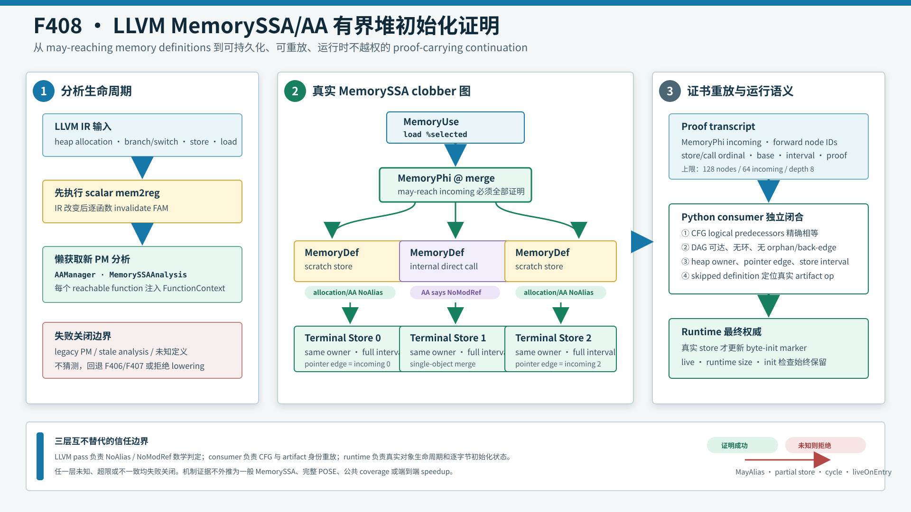

# F408：LLVM MemorySSA/AA 有界堆初始化证明

## 文档元数据

- 功能编号：F408
- 完成日期：2026-08-16
- 实现等级：I/T/E-mechanism
- 生产能力：`bounded-memoryssa-aa-heap-initialization`
- 证书 schema：`symcc-memoryssa-aa-heap-initialization-v1`
- 核心实现：[`compiler/ContinuationLowering.cpp`](../../../compiler/ContinuationLowering.cpp)、
  [`util/live_continuation.py`](../../../util/live_continuation.py)
- LLVM 回归：[`test/live_memoryssa_aa_heap_initialization.ll`](../../../test/live_memoryssa_aa_heap_initialization.ll)
- 证据目录：[`f408-memoryssa-aa-heap-initialization-2026-08-16`](../evidence/f408-memoryssa-aa-heap-initialization-2026-08-16/)

## 1. 结论先行

F408 将 F407 的“从 CFG 推导 guard tree”推进为真实 LLVM MemorySSA/AA 分析驱动的初始化
证明。pass 从 load 对应的 `MemoryUse` 出发，沿 defining access 逆向遍历 `MemoryPhi` 和
`MemoryDef`；每个可达 incoming 必须最终落到一个覆盖 load 字节区间的 store。链上的无关
store 只有在对象/区间静态不交或 LLVM AA 返回 `NoAlias` 时才能跳过；可一一映射到
continuation call 的内部直接调用，只有在 ModRef 结果不包含 `Mod` 时才能跳过。

LLVM 生产者不只输出一个布尔值，而是生成有界 proof-carrying transcript。Python consumer
重新验证 CFG incoming、节点拓扑、pointer-PHI edge、heap owner、store ordinal、静态区间和
skipped definition 的 artifact 身份。runtime 仍以实际 store 和逐字节 `live/size/init` marker
为权威，静态证书不能直接初始化内存。



## 2. 前序缺口与目标程序

| 层次 | 证明方式 | 仍然失败的典型情况 |
|---|---|---|
| F406 | 多个支配 store 集合覆盖 pointer union | 分支 store 不支配 merge load |
| F407 | 完整无环 guard tree，逐路径找 store | switch、多级 merge、链上无关 MemoryDef |
| F408 | LLVM MemoryUse/Phi/Def 图加 AA/ModRef | 无界循环、动态区间、跨过程 summary |

三路 switch 的每个分支先写不同 heap object，又写 scratch object，最后以 pointer PHI 选择
对象并读取时，memory graph 是：

```text
                       MemoryUse(load %selected)
                                  |
                          MemoryPhi @ merge
                         /        |        \
                 scratch store scratch store scratch store
                       |          |          |
                 store object0 store object1 store object2
```

F407 的二叉 guard-tree 不天然表示三路 memory merge；仅沿 dominance 搜索又会被最近的
scratch store 挡住。F408 使用 LLVM 已构建的 memory-version graph，再由 AA 证明 scratch
definitions 不 clobber 当前 load location。

## 3. LLVM 语义依据

LLVM 官方 [MemorySSA 文档](https://llvm.org/docs/MemorySSA.html)定义：`MemoryUse` 表示只读
memory operation，`MemoryDef` 表示可能修改内存或引入顺序约束的 operation，`MemoryPhi`
在 block 入口合并多个可能到达的 memory versions。MemoryPhi 合并的是 **may-reach
definitions**，不能当成 must-definition。

因此 F408 对每个 MemoryDef 做 location-sensitive 检查。LLVM 官方
[Alias Analysis 文档](https://llvm.org/docs/AliasAnalysis.html)定义
`NoAlias/MayAlias/PartialAlias/MustAlias`；只有 `NoAlias` 足以跳过潜在重叠 store。调用使用
ModRef，只在结果不含 `Mod` 时跳过。LLVM MemorySSA 是函数内分析，F408 也保持这一边界。

POSE 的 [path-optimal symbolic execution](https://arxiv.org/abs/2407.16827)启发了“不因
heap alias 候选额外复制执行状态”的方向。F408 的项目内创新是把真实 LLVM memory-version
证明封装为可持久化、可重放的 continuation artifact；它不是完整 POSE 符号堆。

## 4. Pass 生命周期与执行次序

### 4.1 分析失效处理

continuation lowering 会先执行 `mem2reg`。若在 promotion 前取得 MemorySSA/AA，查询会使用
过期分析。F408 的顺序是：

```text
检查 SYMCC_LIVE_PROGRAM_OUT
  -> promoteLiveScalarAllocas(module)
  -> IR 改变时逐函数 invalidate FAM
  -> 懒获取 AAManager 与 MemorySSAAnalysis
  -> FunctionContext(AAResults*, MemorySSA*)
  -> continuation lowering
  -> PreservedAnalyses::none()
```

未请求 export 时不修改 IR、不查询分析并返回 `PreservedAnalyses::all()`。legacy PM 没有同等
可靠的 FAM 生命周期，因此传入 null analysis，F408 自动失败关闭并回退旧证明。

### 4.2 load 准入顺序

1. calloc/既有初始化快速路径；
2. 单一支配 store；
3. F406 collective dominating stores；
4. F407 guard-correlated acyclic tree；
5. F408 MemorySSA/AA graph；
6. 全部失败则拒绝 lowering。

F408 是单调扩展，旧规则已证明的程序不会重新分类。

## 5. 生产者证明

### 5.1 有界支持域

- 1--64 个 ordinary local heap pointer alternatives；
- capacity-1 allocation identity 与非负静态 object offset；
- 固定 scalar byte interval；
- 最多 128 个证书节点、每个 MemoryPhi 64 个 incoming；
- MemoryPhi 深度最多 8、每条 terminal chain 最多 64 个 skipped definitions；
- 无环 defining graph，不能在没有 full-width store 时到达 `liveOnEntry`。

未知 alias、部分覆盖、volatile/atomic store、动态 index、cycle、超限、缺失路径和未知
MemoryDef 均失败关闭。

### 5.2 从 MemoryUse 开始

生产者通过 `MSSA.getMemoryAccess(load)` 取得 `MemoryUse`，再取 defining access。若根为
`liveOnEntry`，说明函数内不存在足够初始化，直接拒绝。F408证书的根必须是load merge
block的MemoryPhi；多对象pointer union还要求该block有pointer-PHI edge discriminator，
使memory incoming与pointer alternative按同一个CFG edge绑定。

### 5.3 MemoryPhi 递归

对每个 MemoryPhi：

1. 验证 2--64 个 incoming block 无重复；
2. 验证 phi block 支配当前证明点；
3. 用 active set 拒绝 cycle；
4. 根 phi 的 incoming 通过 pointer edge tag 选择唯一对象；
5. 对全部 incoming defining access 递归；
6. 所有 incoming 成功才生成 `memory-phi` 节点。

MemoryPhi 是 may-merge，所以不能只找一条“最可能”路径；任一 incoming 未初始化都整体拒绝。

### 5.4 MemoryDef 终止与跳过

简单 store `S` 只有满足以下条件才作为 terminal witness：

```text
singleton static pointer domain
and same allocation identity
and store interval covers load interval
and S dominates this incoming point
```

不能终止的 store 只允许两种 skip：

```text
allocation-noalias := 不同对象，或同对象静态区间不相交
aa-noalias         := AA.alias(loadLocation, storeLocation) == NoAlias
```

非 store MemoryDef 当前进一步限制为可一一映射的内部直接 `CallInst`。只有
`AA.getModRefInfo(call, loadLocation)` 不含 `Mod` 时才输出 `aa-no-modref`。intrinsic、外部
调用、indirect call、invoke、atomic 和 fence 暂不进入证书，保证 consumer 能定位同一操作。

### 5.5 接受谓词

```text
Accept(L) iff
  BoundedAcyclic(G, nodes<=128, phiDepth<=8)
  and forall phi in G: ExactIncoming(phi, CFG)
  and forall leaf in Leaves(G): Covers(leaf.store, leaf.loadInterval)
  and forall skip in G: NoAlias(skip) or NoModRef(skip)
  and Bases(Leaves(G)) == Bases(loadAliasDomain)
  and PointerPhiEdgesAgree(G, loadAliasDomain)
```

多对象 union 还要求至少两个不同 base 和两个 witness stores；单对象、多路径 MemoryPhi 允许
多个路径写同一 base。

## 6. Proof-carrying transcript

两路单对象加 NoModRef call 的证书核心如下：

```json
{
  "schema": "symcc-memoryssa-aa-heap-initialization-v1",
  "merge": "bb3",
  "load_bytes": 1,
  "root_node": 0,
  "nodes": [
    {"id": 0, "kind": "memory-phi", "block": "bb3",
     "incoming": [{"block": "bb1", "node": 1},
                  {"block": "bb2", "node": 2}]},
    {"id": 1, "kind": "store", "block": "bb1", "base": 64,
     "load_address": 64,
     "store": {"block": "bb1", "ordinal": 0, "address": 64, "bytes": 1},
     "skipped_defs": [
       {"block": "bb1", "ordinal": 1, "kind": "call",
        "opcode": "call", "proof": "aa-no-modref"}
     ]}
  ]
}
```

实际证书含两个 terminal nodes，此处省略对称节点。节点 ID 连续且父在子之前。store ordinal
是 block 内 store 序号；call skip ordinal 是 block 内原始 memory-definition 序号，由 `kind`
区分。

## 7. Consumer 重放与信任边界

`LiveContinuationExecutor._memoryssa_heap_initialization()` 验证：

1. schema、精确 key set、bool/int 类型和全部上界；
2. 连续 ID、`root_node == 0`、child ID 大于 parent；
3. 从 branch/jump 和 PHI edge-copy descriptor 重建 logical predecessors；
4. memory-phi incoming block 集合与 CFG 精确相等；
5. 所有节点从 root 可达，禁止 orphan、back-edge、cycle；
6. base/load address 由唯一 ordinary heap object 拥有；
7. terminal store 的 block/ordinal、alias、width、interval 和 allocation guard；
8. skipped store 定位真实 store，且 owner 与 terminal object 不同；
9. skipped call 按 memory-definition ordinal 定位真实 lowered `call`；
10. leaf bases 等于 load alias owner bases；pointer-PHI incoming 的 descendant bases 与 edge
    tag 精确对应；
11. 可选 F406 `initialization_bases` 必须精确相等；
12. capability 依赖闭合且至少有一个使用点。

JSON consumer 无法重跑 LLVM AA。因此 LLVM pass 负责 `NoAlias/NoModRef` 数学判定；consumer
负责阻止 transcript 换 block、ordinal、对象、宽度、operation kind 或 CFG edge。证书随
content-addressed program root 封存，fresh-process resume 不能静默替换。

## 8. Runtime 语义

证书只决定 lowering admission，不会直接设置 heap init bitmap，不会跳过 `live`/runtime size
检查，不会跳过实际 store，也不会为每个 MemoryPhi incoming 复制 continuation state。实际
路径执行 store 后才更新 initialized bytes；对象被 free 后，F405 lifetime guard 仍使读取
不可行。

## 9. 实现映射

| 模块 | 实现内容 |
|---|---|
| `ContinuationLowering.cpp` | 分析生命周期、MemoryUse/Phi/Def 遍历、AA/ModRef、证书 |
| `live_continuation.py` | CFG、owner、store/call identity、pointer edge 和 DAG 重放 |
| `check_live_continuation_lowering.py` | 能力、执行结果及 10 类在线 tamper |
| `live_memoryssa_aa_heap_initialization.ll` | switch、单对象、nested、NoModRef、负例、64 路 |
| `generate_memoryssa_aa_heap_initialization_fixture.py` | 64-way pointer-PHI/MemoryPhi 边界 |
| `check_memoryssa_aa_heap_initialization_oracles.py` | 独立有限域 graph validator 与变异 |
| `benchmark_memoryssa_aa_heap_initialization.py` | 64 路参考证明成本和分析态基数 |

## 10. 测试与结果

### 10.1 LLVM 生产链

| 用例 | 验证点 | LLVM 17 | LLVM 18 |
|---|---|---:|---:|
| 三路 switch + pointer PHI | incoming correlation、scratch NoAlias | PASS | PASS |
| 两路写同一对象 | 单 base、多 terminal stores | PASS | PASS |
| nested MemoryPhi | 两层 memory merge | PASS | PASS |
| inaccessible-memory call | `aa-no-modref`、真实 lowered call identity | PASS | PASS |
| 同对象不相交store | offset 1 store跳过，offset 0 store终止 | PASS | PASS |
| 一路缺 store | 到达 liveOnEntry 后拒绝 | PASS | PASS |
| i8 store / i16 load | partial-width 拒绝 | PASS | PASS |
| 64-way fixture | 65 nodes、64 edges 生产上界 | PASS | PASS |

F407 的重复 condition 用例经 F408 重审：若四条真实 CFG/MemoryPhi edges 均有匹配 store，
只存在 `true/true` 与 `false/false` 可行组合，它不是未初始化反例。当前由 F408 安全接纳；
真正的 edge/store 错配、缺 store 和部分宽度仍拒绝。

### 10.2 独立有限域 oracle

oracle 不调用 C++ helper，枚举 fan-in 2--64、load width 1--8：

| 指标 | 结果 |
|---|---:|
| 正确 graphs | 504 / 504 接纳 |
| incoming assignments / interval checks / NoAlias skips | 16,632 / 16,632 / 16,632 |
| missing store mutations | 16,632 / 16,632 拒绝 |
| partial-width mutations | 16,632 / 16,632 拒绝 |
| alias mismatch mutations | 16,632 / 16,632 拒绝 |
| 结构化 artifact mutations | 8 / 8 拒绝 |

八类变异会真实运行独立 validator：缺 capability、错误 phi edge、back-edge、orphan、错误
store ordinal、错误 base、错误 skip proof、缺 transcript。production checker 另覆盖
NoModRef call ordinal 与 kind 替换。

### 10.3 完整门禁

| 门禁 | 实测结果 |
|---|---:|
| Python exact node-ID gate | 1,041 passed + 250 subtests；0 skip/fail/deselect |
| heap/pointer Python | 17 passed |
| Python test-gate identity | 11 passed |
| LLVM 17 full lit | 265 passed + 2 既有 unsupported；0 fail |
| LLVM 17/18 focused F408 | 每版本 1 个 lit 文件通过；文件含 17 条 `RUN` 命令 |
| LLVM 17/18 `SymCC` build | PASS / PASS |
| Ruff、`py_compile`、`git diff --check` | PASS |

### 10.4 机制成本

64-way 证书为 65 nodes、64 edges。11 轮、每轮 10,000 次 Python 参考验证的封存数据见
`memoryssa-init-benchmark.json`：batch minimum/median/maximum分别为180,001,754 /
196,612,660 / 206,715,221 ns，中位19,661 ns/proof。它不测生产 C++ pass latency。
`64 -> 1` 仅表示
fork-per-incoming 分析参照与单公式的状态基数差异；没有第二个 executor，不能解释为 64 倍
wall-clock speedup。

## 11. 多轮 review 修复

1. `mem2reg` 后显式 invalidate FAM，消除 stale MemorySSA/AA；
2. legacy PM 无可信分析注入时失败关闭；
3. 多对象 root MemoryPhi 强制绑定同一 pointer-PHI edge discriminator；
4. 仅静态不交或 `NoAlias` 可跳过 store，May/Partial/MustAlias 均拒绝；
5. NoModRef 初版 consumer 只看自报 kind/opcode，现生产者限制为内部直接 call，consumer 定位
   真实 lowered call，并新增 ordinal/kind 篡改；
6. 独立 oracle 初版 mutation 是标签，现改为构造、变异并执行 graph validator；
7. 修正 F407 重复 condition 的错误负例解释；
8. 以 nodes/incoming/depth/skips 四维上界、active set 和 reachability 防图环与放大。
9. producer显式要求merge-root MemoryPhi，与consumer的三节点/root-phi合同对齐，消除未来
   单节点证书在两端解释不一致的风险。
10. consumer原先只按heap owner检查skipped store，会误拒同对象静态不相交区间；现从真实
    lowered store重算width与半开区间，并加入offset 0/1跨LLVM正例。

## 12. 先进性、创新性与挑战性

- **先进性**：使用 LLVM 官方 MemorySSA may-def 骨架和 AA/ModRef 消歧，而不是自建近似；
- **项目内创新**：将 compiler-only analysis 转成跨语言 proof artifact，并以 pointer edge 同时
  约束地址 SSA 与 memory SSA；
- **防御纵深**：编译期证明、artifact replay、runtime byte-init 三层互不替代；
- **挑战性**：处理两张 SSA 图相关性、analysis invalidation、跨 LLVM 17/18 API、可重放的
  operation identity 和有界图拒绝；
- **证据完整性**：双 LLVM、64 路真实 producer、有限域 oracle、tamper、完整门禁同时闭合。

这里不宣称发明 MemorySSA、AA 或 POSE；创新结论限定在本框架中的组合、协议和验证闭环。

## 13. 严格边界与后续

F408 是 **bounded intraprocedural MemorySSA/AA heap-initialization slice**，不是任意 MemorySSA
clobber serialization、loop-carried proof、dynamic-index/length cover、跨过程 effect summary、
完整 points-to/POSE heap，也没有公共目标 coverage、solver throughput、漏洞数量或端到端
speedup 结论。

后续顺序：F409 跨过程 allocator/initializer/effect summary；F410 dynamic-index 与 symbolic
length byte-lane cover；F411 loop-carried MemoryPhi 有界归纳；之后再做 heap-heavy 等 CPU
消融，报告 acceptance、states、solver time、coverage AUC 和 bootstrap 置信区间。

## 14. 复现

```bash
ninja -C build SymCC
ninja -C build-llvm17 SymCC
python3 /usr/lib/llvm-18/build/utils/lit/lit.py -sv build/test \
  --filter 'live_(memoryssa_aa_heap_initialization|(guarded|collective)_heap_union_initialization)'
python3 /usr/lib/llvm-17/build/utils/lit/lit.py -sv build-llvm17/test \
  --filter 'live_(memoryssa_aa_heap_initialization|(guarded|collective)_heap_union_initialization)'
python3 benchmark/check_memoryssa_aa_heap_initialization_oracles.py
python3 benchmark/benchmark_memoryssa_aa_heap_initialization.py \
  --paths 64 --repeats 11 --iterations 10000
```

## 15. 最终声明

F408 已把“MemoryPhi-inspired”推进为真实 LLVM MemorySSA/AA 的有界生产实现，打通分析获取、
图证明、证书、consumer、runtime、双版本回归和独立 oracle。它解决 switch、多级 merge、
无关 store 与 NoModRef call 等 F407 无法稳健表达的情况，同时对循环、动态区间和跨过程
effect 保持失败关闭，不把机制微基准包装成公共性能结果。
