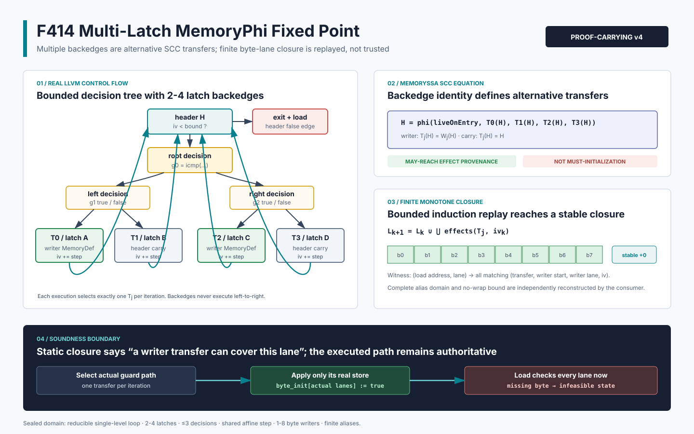

# F414：Multi-Latch MemoryPhi SCC 有界不动点证书

> 日期：2026-08-16  
> 定位：F411/F412/F413 单 backedge 循环之后的 2--4 latch 扩展  
> 等级：I/T/E-mechanism（真实 LLVM producer、严格 consumer、双 LLVM、有限域 oracle 与机制实验）

## 1. 研究问题

LLVM 的自然循环不要求唯一 latch；任意 loop block 只要存在到 header 的边，就是 latch，对应边是
backedge。只有 Loop Simplify Form 才额外保证 single backedge。因而未经过 `loop-simplify` 的合法
IR 可以具有多个 latch，header 的 scalar PHI 和 MemoryPhi 也会为每条 backedge 保留独立 incoming。

F411/F412 只接受一个直接 writer backedge，F413 接受一个由 writer/skip 合并后回到 header 的
backedge。若直接把多个 latch 上的 MemoryDef 依次复合，会错误地声称一次迭代执行了所有 arm；若
任选一个 incoming，又会遗漏其他路径。F414 把多 backedge 循环建模为 MemorySSA SCC 上的互斥
transfer 方程，在有限 alias 域中计算单调 byte-lane 闭包，并把 CFG、incoming block、guard path、
writer effect、归纳递推和稳定轮一并写入 v4 proof-carrying artifact。

权威语义依据：

- [LLVM Loop Terminology](https://llvm.org/docs/LoopTerminology.html)：latch 是存在到 header 边的
  loop block；Loop Simplify Form 才保证唯一 backedge；header 支配循环内全部节点；
- [LLVM MemorySSA](https://llvm.org/docs/MemorySSA.html)：MemoryPhi 合并可能到达的 memory
  definitions，不提供 must-reach 或 must-initialize 结论；
- [LLVM MemorySSA API](https://llvm.org/docs/doxygen/MemorySSA_8h_source.html)：incoming access 与
  incoming block 必须配对解释；
- [Array-Carrying Symbolic Execution for Function Contract Generation (2026)](https://arxiv.org/abs/2602.23216)：
  近期数组符号执行研究强调用循环不变量和 assigns/effect 信息跨循环携带数组状态。F414 是当前
  continuation 有限 alias/byte-definedness 架构中的窄化、可独立重放实现，不声称复现一般数组
  不变量或完整 ACSE。



## 2. 精确语义

设 header memory version 为 `H`，preheader incoming 为 `E`，共有 `n` 条 backedge transfer：

\[
H = \phi(E,T_0(H),T_1(H),\ldots,T_{n-1}(H)),\quad 2\le n\le4.
\]

每次迭代只沿决策树到达一个 latch，因此 `T_j` 是互斥选择，不是顺序管线：

\[
T_j(M)=
\begin{cases}
W_j(M), & \text{writer latch},\\
M, & \text{carry latch}.
\end{cases}
\]

所有 latch 共享 scalar induction：`i_0=0`，`i_{k+1}=i_k+s`，其中 `1<=s<=64`。writer `j`
的地址为 `p_j(i)=b_j+d_j i`，宽度为 `w_j`，并要求 `1<=w_j<=8`、`d_j>0`、
`w_j<=s*d_j`，从而同一 transfer 相邻 recurrence 写区间不重叠。

令 `D` 为有限 alias 域中过滤出的 recurrence-reachable induction values，`L_0` 为空集合：

\[
L_{k+1}=L_k\cup\bigcup_j \operatorname{bytes}(W_j,i_k),\qquad i_k\in D.
\]

byte-lane 集合有限，union 单调且幂等；处理完整 `D` 后再执行一轮 `+0 lane` stability check，得到
最小有限 potential-effect 闭包。每个 load `(address,lane)` 必须列出全部匹配的
`(transfer,writer_address,writer_lane,induction_value)` alternatives。

这个闭包只表示“存在某条 backedge transfer 可以写该 lane”。真实执行仍只对实际选择的
transfer 执行 store 并更新 runtime byte-init bitmap。zero-trip、carry、未达到所需 induction
value 或只初始化部分 lane 的状态，均在 load 时因缺 byte 而 infeasible。因此 F414 没有把
MemorySSA 的 may-reach 误升格为 must-initialize。

## 3. 严格支持域

F414 接受：

- 单 preheader、单 header、单 exit，exit load 的唯一 predecessor 是 header；
- header true edge 进入一棵无 join、无 side entry 的二叉 decision tree；
- 2--4 个 leaf，每个 leaf 是唯一 predecessor、无条件直回 header 的 latch；
- 最多 3 个 integer `icmp` decision；每条 transfer 保存根到 leaf 的完整 polarity path；
- decision operand 只能来自可递归重放的 bounded integer 参数、非负常量、cast、binary/icmp、
  select 或无 poison 的 defined freeze；load/call、pointer-derived 值和 nondeterministic freeze 拒绝；
- header scalar PHI 为 seed 0 加每 latch 一个 `add(iv,s)` incoming，所有 step 完全相同；
- header MemoryPhi 为 `liveOnEntry` 加每 latch 一个 incoming；incoming 只能是直接 writer
  MemoryDef 或同一 header MemoryPhi carry；
- 至少一个 writer latch；每个 writer latch 恰有一个 simple scalar store；
- writer/load 属于同一 stack/heap allocation identity；正 affine scale，1--8 byte writer；
- 每 writer 最多 256 aliases、load alias×lane 最多 2,048、witness alternatives 最多 8,192；
- bound 必须来自 bounded integer argument 或一次 `zext`，并证明完整域容量与无回绕。

失败关闭的形状包括：5 个及以上 latch、非树状 decision DAG、不同 latch step、非 `icmp` raw
`i1` guard、nested loop、latch 内 call/alloca、额外 MemoryUse/MemoryDef/MemoryPhi、多 store
latch、writer 经中间 MemoryDef 串联、非 affine/负 scale、动态 store width、atomic/volatile、
pointer union、多对象和未知跨过程 effect。

不同 writer transfer 可以覆盖相同 byte；它们是不同执行 alternative，证书不会合并或声称
last-writer value。F414 只证明 initializedness provenance，不总结 load value。

## 4. Producer 执行流程

`compiler/ContinuationLowering.cpp` 的生产顺序如下：

1. 从 exit load 的真实 `MemoryUse` 获取 defining header MemoryPhi；
2. 用 `LoopInfo` 确认 2--4 backedges、preheader、header、唯一 exit；
3. 从 header continue edge 深度优先遍历真实 branch successor，重建 decision tree；
4. 要求每个内部节点是同宽整数 `icmp`，每个 leaf 是直回 header 的 latch；
5. 绑定 scalar PHI 的 preheader seed 和所有 latch `add` incoming，拒绝不同 step；
6. 按 incoming block 查询 header MemoryPhi，把每条 backedge分类为 writer MemoryDef 或
   header MemoryPhi carry；
7. 枚举循环内全部 MemorySSA access，拒绝证书未列出的 effect；
8. 对每个 writer 恢复 object identity、GEP scale、完整 aliases 和 recurrence-reachable aliases；
9. 证明 bound capacity 与 whole-domain no-wrap，并显式检查 reachable 地址/索引有序；
10. 按 induction value 计算单调 lane closure、每轮新增/累计 lane 和稳定轮；
11. 对 load alias×lane 生成全部 transfer alternatives，限制总数为 8,192；
12. 输出 `symcc-loop-memoryphi-byte-lane-induction-v4` 和对应 capability。

该 producer 位于真实 load initialization admission 链上，不是测试专用旁路。任一证明失败会继续
尝试其他既有初始化证明，全部失败后拒绝该 load。

## 5. v4 Artifact

v4 继续使用 `initialization_loop_memoryphi` 字段，并新增 capability：

`bounded-multilatch-loop-memoryphi-byte-lane-fixed-point`

它同时依赖 `bounded-loop-memoryphi-byte-lane-induction`；若任一 writer 的 step/scale/width 是
广义 affine 形状，还依赖 `bounded-strided-loop-memoryphi-byte-lane-induction`。

核心转录包含：

```json
{
  "memory_phi": {
    "equation": "header=phi(entry,T0(header),...,Tn(header))",
    "incoming": [
      {"transfer": 0, "latch": "latch_a", "kind": "writer-memory-def"},
      {"transfer": 1, "latch": "latch_b", "kind": "header-memory-phi-carry"}
    ]
  },
  "transfers": [{
    "ordinal": 0,
    "kind": "writer",
    "guards": [{"variable": {"var": "g0"}, "equals": true}],
    "writer": {"bytes": 8, "scale": 1, "address_stride": 8}
  }],
  "fixed_point": {
    "algorithm": "finite-monotone-byte-lane-union",
    "semantics": "mutually-exclusive-backedge-transfer",
    "domain": [0, 8, 16, 24, 32, 40, 48, 56],
    "rounds": [
      {"induction_value": 0, "new_lanes": 8, "total_lanes": 8},
      {"kind": "stability-check", "new_lanes": 0, "total_lanes": 64}
    ],
    "stable": true
  }
}
```

实际 artifact 还包含完整 CFG block/edge identity、每个 decision 的 predicate/operand/successor、
每 latch 的 PHI next copy、writer aliases/index/reachable/residue、load aliases/index，以及逐 lane 的
全部 alternatives。示例为讲解节选，不是完整 schema。

## 6. Consumer 独立重放

`LiveContinuationExecutor._multilatch_loop_memoryphi_fixed_point_initialization` 不访问 LLVM 对象，
从 JSON 和 lowered blocks 独立完成：

- 精确 key 集、schema/capability/use-point/dangling-capability 四向闭合；
- 从真实 `jump/branch` 重建 predecessor、successor、decision tree 和每 leaf guard path；
- 迭代求 block dominators，验证比较 operand 在使用点之前可用；
- 独立恢复 scalar operand width，拒绝 bool-as-int、异宽常量、越界常量和 pointer-like provenance；
- 重放 preheader 与每 latch 的 scalar PHI edge copies，以及 header `ult(iv,bound)`；
- 对齐 MemoryPhi incoming ordinal、latch identity 与 writer/carry kind；
- 绑定每个 writer latch 内唯一 store、pointer_offset、width、aliases、scale 和 recurrence；
- 检查 stack/heap owner 与 load/write interval 均属于同一对象；
- 独立恢复 bound 的 unsigned domain和无回绕条件；
- 重新计算 domain、每轮 lane 增量、final lanes 和 stability check；
- 重建每个 load lane 的全部 writer alternatives，并要求字典序与 producer 输出完全相同。

运行时不根据 `fixed_point.final_lanes` 直接置位。唯一初始化权威仍是实际 `store` 对 byte-init
bitmap 的更新，因此 proof transcript 只扩大可验证的 IR 支持域，不改变未初始化读取语义。

## 7. 测试与实验结果

### 7.1 LLVM 与真实 continuation

`test/live_multilatch_loop_memoryphi_fixed_point.ll` 有 17 条 `RUN`，覆盖：

- two-latch writer/carry，执行真实 continuation 并观察 7 个返回值 65 与 infeasible states；
- two-latch 双 writer，验证每 lane 有多个互斥 alternative；
- three-latch skew tree；
- four-latch、三 decision、step 2、`i16` writer 的 strided tree；
- 不同 latch step、carry 额外 definition 与 nondeterministic guard 三类 source negative；
- 64-byte object、stride/writer/load 均为 8-byte 的四 latch producer boundary；
- v4 专属 17 类 actual artifact mutation；启用共享检查时另执行 base 6 类和 strided 8 类篡改。

LLVM 17 和 LLVM 18 的四 latch producer/consumer 产物均通过；F411--F414 定向 Python 为
`20 passed`，关联 LLVM fixture 为 `4 passed`。最终完整 Python 身份门禁为 `1071 passed` 加
`250 subtests`，无 skip/xfail/deselection/node-ID漂移；LLVM 17 全量为 `277 passed` 加2个既有
unsupported、0 failed。规范node-ID摘要为
`ddabe1a48648891f1b23c12e69a77d908cc622f2e4ea83a0c5600e2f7f3496c9`。

### 7.2 独立有限域 oracle

oracle 不调用生产 producer/consumer，独立枚举 object、step、scale、writer/load width、2--4
transfers、writer/carry mask、bound width 和 load domain，并对具体 transfer choice sequence 比较
方程重放与 runtime byte bitmap：

| 指标 | 结果 |
|---|---:|
| 总参数组合 | 42,208 |
| 严格支持域接纳 | 6,880 |
| unsupported / partial 拒绝 | 35,328 |
| byte-lane checks | 256,224 |
| runtime bitmap / transfer equation 等价 | 633,552 |
| writer path 且前缀充分的接纳 | 345,284 |
| carry 或前缀不足的拒绝 | 288,268 |
| reference certificate mutations | 18 / 18 拒绝 |

两项守恒关系均成立：`42,208 = 6,880 + 35,328`，
`633,552 = 345,284 + 288,268`。

### 7.3 机制边界实验

64-byte、stride 8、8-byte writer/load、四 transfers（两个 writer、两个 carry）的证书包含：

- 每 writer 57 个完整 aliases、8 个 recurrence-reachable writers；
- 128 个 potential writer-byte effects；
- 57 个 load aliases、456 个 byte-lane witnesses、912 个 witness alternatives；
- 3 个 decision blocks、4 条 backedge transfers、1 个 header MemoryPhi、5 条 incoming；
- 8 个 induction rounds 加 1 个 stability round。

11 轮、每轮 1,000 次 Python reference validation 的 batch 最小/中位/最大为
`103,406,795 / 104,156,971 / 111,543,685 ns`，折算中位 `104,156 ns/certificate`。

该数字只衡量 Python 参考证书构造/相等验证的机制成本和证书基数，不包含 LLVM 分析、SMT、
executor throughput、fuzzing coverage、错误发现率或端到端 speedup，不能作为公开 benchmark
性能结论。

## 8. 多轮 Review 与已修复问题

1. **LLVM 语义 review**：LLVM 17/18 均显示 header MemoryPhi 为
   `{entry,liveOnEntry},{writer_latch,MemoryDef},{carry_latch,header MemoryPhi}`；据此禁止顺序复合；
2. **CFG review**：从真实 successor 以 true-first DFS 固定 decision/transfer ordinal，拒绝 join、
   side entry、遗漏 block 和伪造 guard path；
3. **归纳 review**：所有 latch step 必须相同；补充极小 induction width 下的 no-wrap 下溢保护；
4. **alias review**：补充 reachable address/index 显式有序检查，避免 `lower_bound` 依赖未证明顺序；
5. **Python 类型 review**：发现并修复 `True == 1` 可能绕过 residue/round/ordinal 相等检查的问题；
6. **同步篡改 review**：同时改 transcript 与 actual comparison，仍会因异宽、越界、支配或
   pointer provenance 被拒绝；
7. **运行时 review**：carry、zero-trip 和不完整前缀不会被静态 closure 直接写入 bitmap；
8. **声明 review**：所有计时均标注 mechanism-only，未声称 coverage、bug yield 或总体加速。
9. **合同闭合 review**：producer 与 consumer 统一 guard-expression 域；递归检查 cycle、位宽、
   非负常量和 defined freeze，新增 nondeterministic-guard source negative，防止生成后才被消费端拒绝。

## 9. 先进性、创新性与挑战性

- **先进性**：把 LLVM 多 latch LoopInfo、MemorySSA SCC、affine induction、guard path 和
  byte-definedness 统一为可跨进程重放的 proof-carrying contract；
- **框架创新**：静态层输出 potential transfer union，动态层保留 actual-path bitmap authority，
  同时扩大支持域并避免 may/must 混淆；
- **挑战性**：同一 backedge identity 需要在 LLVM CFG、scalar PHI、MemoryPhi、JSON ordinal、
  Python CFG/dominance 和 runtime state 六层保持一致；
- **可证伪性**：双 LLVM、17 条真实 lowering RUN、17+6+8 类 actual artifact mutation、18 类
  独立 oracle mutation、633,552 次运行时等价检查共同限制结论。

## 10. 未完成边界

F414 关闭了 bounded 2--4 latch、单层 reducible tree loop 的 initializedness fixed-point 缺口，
但 W1 仍未完成。每 latch 多 writer 的有序 effect 已由 F415 关闭；后续候选包括 nested-loop summary composition、
overlapping last-write/value summary、pointer-union/multi-object loop effect、动态 extent、非树状
控制流和跨过程循环摘要。这些工作不能直接复用 F414 的 potential byte union；涉及值语义时必须
证明 writer order 或保留条件化 value merge。
