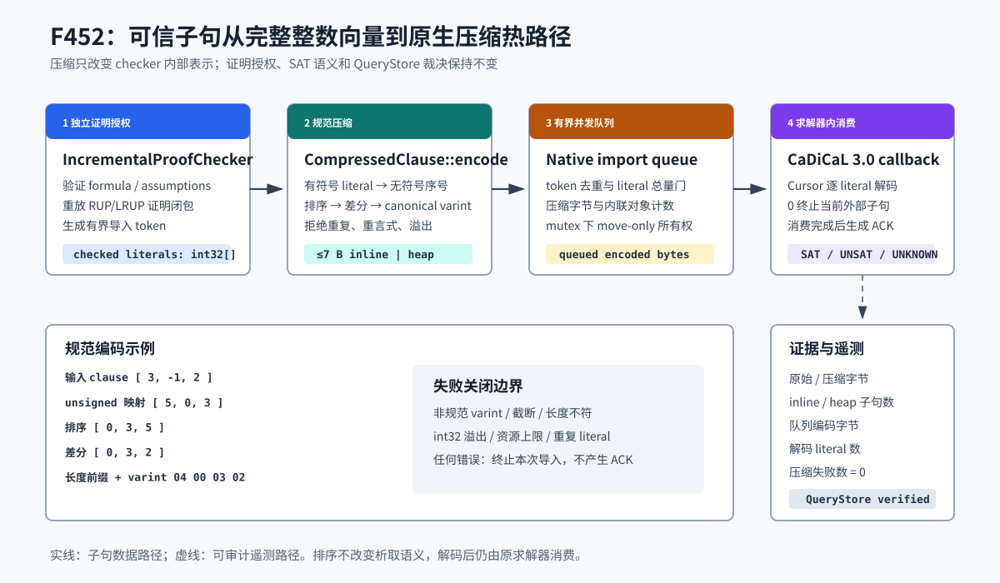

# F452：原生 Checker 子句压缩

## 1. 交付结论

F452 将经过证明授权的 QF_BV clause 从 `std::vector<int>` 完整存储改为原生规范压缩表示，并接入
CaDiCaL 3.0.1 实时外部子句回调。该实现已经形成“证明检查 → 压缩入队 → 求解中流式解码 → ACK →
QueryStore 遥测复核”的完整生产链路。

- 功能编号：F452；
- 证据等级：I/T/E-mechanism；
- 协议：`symcc-qfbv-native-clause-compression-v1`；
- 原生实现：`util/qfbv_clause_compression.hpp`、`util/qfbv_clause_compression.cpp`；
- 生产热路径：`util/qfbv_cadical_realtime.cpp`；
- Python 与配置：`util/qfbv_clause_compression.py`、`util/qfbv_realtime_stream.py`、
  `util/cadical_qfbv_backend.py`、`util/symcc_query_service.py`；
- 安装与 ABI 门：`benchmark/install_cadical_3_0_1.sh`；
- 可执行 oracle：`benchmark/check_qfbv_clause_compression_oracles.py`；
- 专项测试：`test/test_qfbv_clause_compression.py`；
- 正式证据：`docs/codex/evidence/f452-native-clause-compression-2026-08-26/`。



## 2. 为什么需要这项优化

F436 已允许在 CaDiCaL 求解过程中导入经过检查的子句，F450 又减少了同一 proof closure 的重复语义
重放，但 native import queue 和 clause-activity tracker 仍长期保存完整的 32-bit literal 数组。分布式
增量求解中，子句数量通常远大于单条子句长度，因此每条对象的 payload、堆分配和 cache footprint 会
累积为 checker 热路径压力。

Schreiber 等人的 TACAS 2026 工作把 on-the-fly checker clause compression 用于降低内存消耗；其官方
artifact 还报告 MallobSat 在最多 1216 cores 上进行可信增量检查时，相对 unchecked solving 的平均开销
小于 33%。这两个数字属于论文系统，**不是本仓库实验结果**。F452 复用的是其压缩机制，并按本项目的
失败关闭、可审计和稳定 C ABI 要求重新实现。

## 3. 编码合同

### 3.1 Literal 映射

有符号 literal 被映射到单调无符号序号：

```text
-1, +1, -2, +2, -3, +3, ...
 0,  1,  2,  3,  4,  5, ...
```

映射公式为：

```text
internal(lit) = 2 * (abs(lit) - 1) + (lit > 0 ? 1 : 0)
```

`0` 不是合法 literal；`INT_MIN` 的绝对值不能由 signed int 表示，也被明确拒绝。解码时使用 64-bit
中间值检查 magnitude，不能通过整数回绕构造越界 literal。

### 3.2 排序、差分与变长整数

映射值先按 unsigned 顺序排序，再存储相邻差分。每个差分使用 canonical 7-bit variable-length integer：
低 7 位承载数据，高位表示后续字节。编码前部还有一个同格式长度字段，该字段包含自身与 payload 的总
字节数。

例如 `[3, -1, 2]`：

```text
映射       [5, 0, 3]
排序       [0, 3, 5]
差分       [0, 3, 2]
最终字节   04 00 03 02
```

排序不改变析取子句的语义，却使同一 literal 集合得到唯一编码。唯一编码可直接用于稳定比较、哈希和
证据重放，避免同义子句因输入顺序不同形成多份缓存对象。

### 3.3 7-byte 小对象内联

总编码长度不超过 7 bytes 时，字节直接保存在 `CompressedClause` 的固定数组中；更长时才分配 owned
heap buffer。对象是 move-only，队列转移所有权时不复制 payload。实现没有沿用上游 artifact 中依赖
机器指针表示的 inline storage，而采用显式 `std::array<uint8_t, 7>`，因而不依赖 fabricated pointer、
tagged address 或特定端序。

## 4. 生产执行次序

1. `IncrementalProofChecker` 在 Python 层验证 formula identity、assumptions 和 proof record；未经授权
   的子句不能进入 native queue。
2. `symcc_qfbv_realtime_enqueue` 再检查 token、literal 上限、observed variable、重复和重言式，并调用
   `CompressedClause::encode`。
3. 队列继续以 literal 总量作为语义容量门，同时记录压缩后的真实排队字节；容量不足返回 backpressure，
   不产生部分对象。
4. CaDiCaL 的 `cb_has_external_clause` 把一个 move-only 压缩对象设为 active，并初始化有界 cursor。
5. 每次 `cb_add_external_clause_lit` 只解码一个 literal；返回 `0` 表示当前子句结束。正常消费完成后才
   产生包含 token、solve generation 和 delivery ordinal 的 ACK。
6. 启用 clause activity 时，已消费的压缩对象被移动到 tracker；只有生成 activity witness 时才按需
   解码，而不恢复一个长期完整整数副本。
7. Python session 对原始字节、压缩字节、inline/heap 数量、队列字节、解码数和失败数做基线差分；
   QueryStore 要求字段成组、协议匹配、计数守恒且 compression failures 必须为零。

内部编码损坏会请求终止当前 solve、拒绝该 import 且不发送 ACK。正常情况下字节完全由进程内 encoder
生成，这一分支用于防止内存损坏或 ABI 漂移被误当作可信导入。

## 5. 相对参考实现的工程强化

| 维度 | 参考 artifact 机制 | F452 实现 |
| --- | --- | --- |
| 编码主线 | unsigned 排序、差分、varint、7-byte inline | 保持相同主线与可核对字节示例 |
| 输入所有权 | 准备阶段原地改写 literal 数组 | 输入只读；候选对象成功后 move-commit |
| inline 表示 | 与 pointer storage 结合 | 显式固定数组，不伪造指针 |
| 解码 | checker 内部受信断言 | 每步有 size、canonical、overflow、count 上限 |
| 异常 | 内部 assert/abort 为主 | 稳定错误码；C ABI 捕获异常；生产路径失败关闭 |
| 容量协商 | checker 内部调用 | 两次调用式 C ABI；不足时只返回所需大小，不部分写 |
| 可观测性 | 面向 artifact 内部 | 21 项 native stats 中新增 7 项，并由 QueryStore 复核 |

这里的“强化”是本项目边界的适配，不表示参考 artifact 存在其预期受信部署之外的错误。

## 6. 配置与部署

重新运行固定版本安装脚本会把 codec 和实时 shim 编译为同一个 shared object，并用 `nm -D` 检查协议、
encode/decode 和 realtime callback 符号：

```bash
benchmark/install_cadical_3_0_1.sh
```

portfolio 可要求压缩能力：

```json
{
  "name": "cadical-realtime",
  "kind": "bitblast-cadical-qfbv",
  "persistent": true,
  "native_library": "/opt/cadical/lib/libcadical.so",
  "realtime_stream": {
    "library": "/opt/cadical/lib/libsymcc_qfbv_cadical_realtime.so",
    "require_clause_compression": true
  }
}
```

默认值为 `false`，以便旧 shim 继续运行；设为 `true` 后，缺少协议符号或返回未知协议的库会在启动阶段
失败，不能静默退化到完整整数向量。

## 7. 正确性与审查

### 7.1 测试覆盖

规范清单新增 24 个 nodeid、删除 0 个。专项覆盖：

- 精确已知字节、空子句、`INT_MAX/-INT_MAX`、7/8-byte inline 边界；
- `0`、`INT_MIN`、重复、重言式、Python bool 和 int32 越界；
- 截断、非规范 varint、长度不符、delta 0、映射溢出；
- 两次调用容量协商和输出 buffer 零部分写；
- 5000 组固定 seed 性质测试与 16 worker × 500 次并发隔离；
- portfolio 强制能力、安装脚本和生产 hot-path 接线；
- oracle artifact 摘要篡改反例；
- 旧实时 shim 兼容与强制能力失败关闭；
- QueryStore 遥测缺字段、非零 failure 和计数不一致拒绝。

另以 ASan/UBSan 运行 100000 组、每组 0--256 literals 的 C++ 随机 round-trip，无 sanitizer 报告；GCC
13.3 与 Clang 均在 `-Wall -Wextra -Werror` 下编译真实 CaDiCaL 3.0.1 组合库。
专项为 23 passed，耦合为 37 passed；完整能力门禁为 1467 passed 加 310 subtests，16 项能力全部存在，
nodeid inventory 为 1467/1467 且零 skip、xfail、xpass、deselect。

### 7.2 多轮审查发现

1. **配置审查**：发现布尔强制开关误入 numeric option 集，修正为独立严格布尔校验并加入反例。
2. **ABI 审查**：空解码结果不再对 null output 调用通用 copy；不足容量保持 buffer 完全不变。
3. **兼容审查**：协议为可选能力，只有显式 require 才拒绝旧 shim；unknown/partial ABI 始终失败。
4. **证据审查**：原生 telemetry 原先不会进入持久结果，现增加 session 差分与 QueryStore 成组复核。
5. **测试结构审查**：新增 unittest 曾切断既有 cleanup 作用域，已恢复原测试末尾并由耦合回归确认。
6. **声明审查**：单 literal 负收益保留；payload reduction 不称为进程 RSS、SAT speedup 或覆盖提升。

## 8. 机制实验结果

正式 oracle 使用 seed `0xF452`，完成 20000 组额外 canonical round-trip；每个长度生成 512 条、稠密与
稀疏变量各半的子句，重复 9 次。时间是 Python → ctypes 两次调用 ABI 的每子句中位数，包含排序、分配
和跨语言调用；“原始字节”只计算 `4 × literal count`，不包含 `std::vector` 控制块或 allocator 开销。

| literals | 原始 payload | 压缩字节 | payload 变化 | inline | encode 中位数 | decode 中位数 |
| ---: | ---: | ---: | ---: | ---: | ---: | ---: |
| 1 | 2,048 B | 2,281 B | **增加 11.4%** | 512/512 | 2.723 us | 2.037 us |
| 3 | 6,144 B | 4,648 B | 减少 24.3% | 256/512 | 2.886 us | 2.163 us |
| 6 | 12,288 B | 7,953 B | 减少 35.2% | 0/512 | 3.132 us | 2.364 us |
| 8 | 16,384 B | 10,052 B | 减少 38.6% | 0/512 | 3.745 us | 2.807 us |
| 16 | 32,768 B | 18,025 B | 减少 44.9% | 0/512 | 4.323 us | 3.329 us |
| 32 | 65,536 B | 33,785 B | 减少 48.4% | 0/512 | 5.019 us | 3.737 us |
| 64 | 131,072 B | 65,965 B | 减少 49.6% | 0/512 | 7.399 us | 5.403 us |
| 256 | 524,288 B | 251,073 B | 减少 52.1% | 0/512 | 22.346 us | 15.708 us |

结果表明：长度头使单 literal payload 变大；从 3 literals 起当前混合分布出现正收益，中长子句接近一半
整数 payload reduction。inline 是否命中还取决于首个变量编号和差分，而不只取决于 literal 数量。

真实 CaDiCaL hot-path case 导入 6-literal 与 32-literal 两条子句：原始整数 payload 152 B，压缩后 40 B，
减少 73.7%；1 条 inline、1 条 heap；38 个 literals 全部由 callback 解码；2/2 imports 获得连续 ACK，
queued encoded bytes 回到 0，compression failures 为 0，solve result 为 SAT。该 case 证明生产接线和
计数守恒，不是 SAT 性能基准。

## 9. 声明边界与后续顺序

F452 可以声明：实时 checked-import hot path 已使用规范原生压缩；格式可独立 round-trip；损坏输入失败
关闭；配置可强制能力；压缩收益、负收益和 ABI 时间均有可重放证据。

F452 不能声明：论文的 1216-core/<33% 结果由本仓库复现；所有短子句都节省字节；进程 RSS 与 payload
按相同比例下降；SAT search、hybrid fuzzing coverage 或 defect yield 提升。R 级内存和端到端求解收益
仍需公共 workload、等 CPU、长时多轮实验。

下一项为 F453 online activity/cost-guided cubing。F452 不改变 F448--F451 的 partition correctness、
generation fence 或 proof trust root。

## 10. 主要资料

- Schreiber, Fleury, Fazekas, Biere, [*Real-time Proof Checking for Distributed Incremental SAT Solving*](https://publikationen.bibliothek.kit.edu/1000193848), TACAS 2026, DOI `10.1007/978-3-032-22752-2_18`；
- [TACAS 2026 官方 artifact 与实验数据](https://zenodo.org/records/18330441), DOI `10.5281/zenodo.18330441`；
- 固定参考源码：[ImpCheck `clause.c` at `b5f37b2`](https://github.com/domschrei/impcheck/blob/b5f37b21385ee802ce015103b23aff62f92b1734/src/trusted/clause.c)；
- 上一项：[`Generation_Fenced_Distributed_Cube_Execution_F451_2026-08-26.md`](Generation_Fenced_Distributed_Cube_Execution_F451_2026-08-26.md)。
