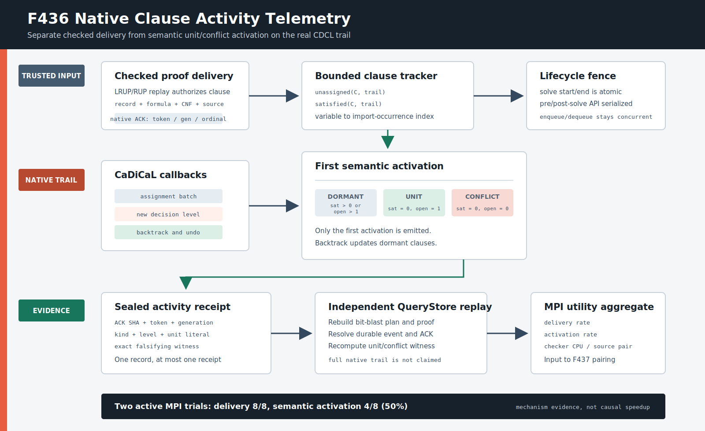

# F436：原生子句活跃度与可验证效用反馈

- 功能编号：F436
- 日期：2026-08-18
- 研究主题：CaDiCaL 原生 trail 观测、导入子句 unit/conflict 激活、密封 activity receipt、多 rank 效用聚合
- 当前等级：I/T/E-local；生产路径、真实 CaDiCaL oracle、sanitizer 和本机 MPI 机制实验已完成
- 严格边界：这是**语义激活遥测**，不是单条子句的唯一因果贡献证明，也不是 coverage、solver speedup 或公开多节点 R 级结论



## 1. 研究问题

F433 证明外部子句经过 checker 后被 CaDiCaL 完整消费，F435 又解决瞬时背压导致的永久丢失；但
二者只能回答：

1. record 是否通过 LRUP/RUP 检查；
2. controller 是否决定 enqueue；
3. native callback 是否完整读取 clause 并返回 ACK。

它们不能回答 **consumer 的实际搜索是否曾把该子句推到 unit 或 conflict 状态**。因此，过去的
source feedback 把“交付成功”近似成“对求解有用”。在 100% 交付但大量子句已满足、长期有两个以上
未赋值 literal 的情况下，这个近似会系统性高估 publisher 质量，并使后续 worker pairing 学到错误
关联。

F436 在 proof-first 边界之后增加一个原生观测层：只对已经产生 native ACK 的导入子句建立有界
增量状态；通过 CaDiCaL `ExternalPropagator` 的 assignment、decision-level 和 backtrack callback
维护该状态；第一次进入 unit 或 conflict 时生成与 ACK、proof record、formula 和 native identity
绑定的 activity receipt。QueryStore 和 MPI coordinator 重新加载 proof/event 并重放 receipt 的
结构语义。

## 2. 与相关 SOTA 的关系

| 工作 | 原论文核心 | F436 的关系与边界 |
| --- | --- | --- |
| Painless, SAT 2017 | 将并行 SAT 的 diversification、sharing 与 solver 封装为模块 | F436 为 sharing 增加 consumer-side utilization signal，不是 Painless 全框架复现 |
| Mallob, 2022 | 可塑并行 SAT job、动态资源和 clause sharing | F436 只提供未来 malleability/pairing 的反馈，不动态改变 worker 数量 |
| Streamlining Distributed SAT Solver Design, SAT 2025 | 系统消融分布式 SAT 设计；单 clause LBD 运输/打乱无可测收益 | 因此不把 LBD 设为默认 reward；优先观测 delivery 与真实 unit/conflict activation |
| Real-time Proof Checking, TACAS 2026 | 将 ImpCheck/LIDRUP 思想扩展到分布式 incremental SAT | F433 已实现 project-native checked stream；F436 在“使用前可信”后观测“使用机会”，仍不是 ImpCheck wire 互操作 |
| PalRUP, SAT 2026 | 并行持久 proof artifact 与小型顺序可信核 | activity receipt 引用现有持久 proof DAG；它本身不是 PalRUP 格式或形式化 trail proof |

主要来源：

- [Painless](https://www.lrde.epita.fr/dload/papers/le-frioux.17.sat.pdf)
- [Mallob](https://arxiv.org/abs/2205.06590)
- [Streamlining Distributed SAT Solver Design](https://drops.dagstuhl.de/entities/document/10.4230/LIPIcs.SAT.2025.27)
- [Real-time Proof Checking for Distributed Incremental SAT Solving](https://satres.kikit.kit.edu/papers/2026-tacas-distrincproof.pdf)
- [A Natively Parallel Proof Framework for Clause-Sharing SAT Solving](https://drops.dagstuhl.de/entities/document/10.4230/LIPIcs.SAT.2026.17)

## 3. 精确语义

对已经交付的规范子句 `C = (l1 or ... or ln)` 和 native 当前观测到的部分赋值 `alpha`，维护：

```text
satisfied(C, alpha) = alpha 下为 true 的 literal 数
unassigned(C, alpha) = alpha 下未赋值的 literal 数
```

第一次满足以下条件之一时封存事件：

| 条件 | 事件 | 证据 |
| --- | --- | --- |
| `satisfied > 0` | 未激活 | clause 已满足，不产生 receipt |
| `satisfied = 0` 且 `unassigned > 1` | 未激活 | 仍不能传播 |
| `satisfied = 0` 且 `unassigned = 1` | `unit` | 唯一 open literal + 其余 literal 的反向赋值 witness |
| `satisfied = 0` 且 `unassigned = 0` | `conflict` | 全部 literal 的反向赋值 witness |

这里只记录**第一次激活**。一个 clause 先成为 unit、回溯后再次成为 unit，仍只有一个 receipt；这样
每个 delivered record 至多贡献一个效用样本，避免深搜索中的高频 clause 仅因运行更久而无限放大奖励。
空子句在交付时直接形成 decision level 0 的 conflict event。

### 3.1 为什么不把它叫作“因果贡献”

unit/conflict 表明该 clause 在某个真实 native trail 上具备传播或冲突作用，但不证明：

- CaDiCaL 的后续 assignment 只可能由这一条 clause 推出；
- 没有其他重复/更强 clause 同时给出相同传播；
- 该事件一定降低 solve time；
- 多次 activation 与 coverage 或缺陷发现存在单调关系。

QueryStore 可以独立验证 clause、proof、ACK、event、unit/open literal 和 witness 的结构一致性；但没有
完整封存 CDCL trail，因此不能从数据库独立重演“该时刻确实发生”。native shim 在这里是测量边界，
而 LRUP checker 仍是逻辑可信边界。F437 只能把 activation 作为带不确定性的 reward，不能当作因果标签。

## 4. 原生执行流程

### 4.1 ACK 后注册

1. session 从 durable proof event 加载 record；
2. `IncrementalProofChecker` 重放 LRUP/RUP，产生 `ClauseAuthorization`；
3. native 完整读取外部 clause 终止符；
4. bridge 先产生 `token + solve_generation + delivery_ordinal` ACK；
5. 仅当 activity capability 显式启用时，将该 clause 注册到 tracker；
6. 使用当前 assignment map 初始化 `satisfied/unassigned`，导入即 unit/conflict 可立即产生事件。

未 ACK 的 enqueue 不会注册 activity，因而不存在“未被 solver 读取却有 utilization”的错误样本。

### 4.2 增量更新

bridge 建立 `variable -> [(import_index, literal)]` 倒排表。每次 assignment callback 只访问包含该
variable 的 tracked clause：

```text
unassigned -= 1
if assignment satisfies occurrence: satisfied += 1
evaluate first activation
```

decision callback 在 `observed_trail` 增加一层；backtrack callback 逆序撤销被删除层的 assignment，恢复
每个尚未激活 clause 的计数。CaDiCaL 可能重新通知 root assignment；相同 assignment 幂等忽略，矛盾
重复则请求终止。已激活 clause 不再维护计数，因为协议只承诺 first activation。

### 4.3 生命周期原子性

原 bridge 仅先读取原子 `solving` 再调用 `add/assume/observe/reset`，存在 check-to-use 竞态：另一线程
可能在检查后启动 `solve()`。F436 增加独立 `api_mutex`，把以下 API 与 solve 开始/结束串行化：

- `add`、`assume`、`observe`；
- `val`、`failed`、`clear_termination`；
- `enable_activity`、`reset_queues`；
- `solve` 的状态转换。

求解中允许的 enqueue/dequeue/terminate 仍使用原有 queue mutex/atomic，不阻塞 CDCL callback。
真实 lifecycle oracle 在 solver 活动时并发尝试 enable/reset/observe，三者都失败关闭；terminate 后再次
enable/reset 成功。

## 5. 协议与证据

native 通过独立可协商协议暴露能力：

```text
symcc-qfbv-native-clause-activity-v1
```

只有 protocol、enable 和 dequeue 三个符号同时存在才视为 capability 完整；部分 ABI 会在加载时拒绝。
默认 `track_clause_activity=false`，旧 shim 和 F433/F435 默认路径保持兼容。

每个 `symcc-qfbv-clause-activity-receipt-v1` 精确绑定：

| 域 | 内容 |
| --- | --- |
| stream/native | stream SHA、native signature、solve generation |
| delivery | token、ACK SHA、连续 activity ordinal |
| proof | formula/CNF/record/clause SHA、source worker |
| activity | decision level、`unit/conflict`、unit literal、完整 falsifying witness |
| identity | 对全部上述字段的规范 JSON SHA-256 |

所有整数要求 JSON exact integer；bool、float 和数字字符串不接受。摘要必须是 exact lowercase 64-byte
hex string。witness 必须逐项等于 proof checker 恢复出的规范 clause 所要求的反向 literal 序列。

## 6. Session、QueryStore 与多 rank 闭环

`RealtimeClauseExchangeSession` 先 drain ACK，再 drain activity，保证 event 只能引用已知 delivery。
finish 要求：

```text
activity ordinals == 1..N
unit + conflict + unactivated == delivered
native activation counters == receipt kind counters
native activity queue == 0
native tracked imports == delivered
native solving == 0
```

activity dequeue 使用每 context 懒分配、可复用的 65,536-int buffer，避免每次 poll 分配 256 KiB。

QueryStore 先执行结果 schema/计数/摘要检查，再从当前 Query IR 重建 bit-blast plan，重新加载 proof
record、重放 checker、核对 durable event 和 ACK，最后调用 `verify_clause_activity_receipt`。即使修改
witness 后重新计算 activity SHA，独立 clause 语义仍会拒绝。

F434 MPI runner 增加 `--track-clause-activity`：配置 SHA 显式绑定该开关；每个 consumer 报告 unit、
conflict、unactivated 和 receipts；rank 0 逐份重放 ACK/activity/proof/event；聚合器计算
`clause_activation_rate`。不同主机 monotonic clock 仍不互减。

## 7. 配置

生产 portfolio 显式启用：

```json
{
  "realtime_stream": {
    "library": "/path/to/libsymcc_qfbv_cadical_realtime.so",
    "max_imports": 64,
    "track_clause_activity": true
  }
}
```

该字段必须是 JSON boolean。启用时 shim 必须协商 exact activity protocol；否则启动失败。禁用时结果
仍输出零 activity accounting，便于 QueryStore 保持稳定 schema，但不分配 witness buffer。

多 rank 机制实验：

```bash
mpiexec -n 5 python3 benchmark/run_qfbv_realtime_multirank.py \
  --library /path/to/libsymcc_qfbv_cadical_realtime.so \
  --proof-root /shared/f436-runs \
  --publishers 2 --rounds 1 --variables 200 --clauses 860 \
  --mode active --track-clause-activity \
  --output /shared/f436-active.json
```

## 8. 实验结果

### 8.1 随机 checked-clause oracle

oracle 为每个 case 构造不同的 activation-guarded 公式：

```text
(A or X or B) and (A or not X or B), 以及 not A
```

从两个三元子句的 proof 推出 RUP resolvent `(-activation or A or B)`。运行时两个 root activation 令
`activation=true, A=false`，但原 Tseitin CNF 在外部 resolvent 到达前不直接 unit-propagate `B`；
checked import 因而在真实 trail 上成为 unit，预期 open literal 为 `B`。bit 位置和 A/X/B 极性从
8-bit 输入的 2,688 个互异组合中确定性洗牌抽取。

| 真实 CaDiCaL 3.0.1 运行 | checked delivery | unit receipt | 独立 replay | 重封印篡改拒绝 | lifecycle fence |
| --- | ---: | ---: | ---: | ---: | ---: |
| seed 62518，128 cases | 128/128 | 128/128 | 128/128 | 128/128 | 3/3 active mutation rejected |
| seed 127645，128 cases | 128/128 | 128/128 | 128/128 | 128/128 | 3/3 active mutation rejected |

两轮 artifact SHA 分别为 `29e6c4...54e522` 与 `bdb8f1...09015`，完整 SHA 见证据文件。另有四状态
matrix 验证 assumption-unit level 1、root-unit level 0、root-conflict level 0 和 satisfied-unactivated；
ASan/UBSan 下 32-case oracle 无诊断。

### 8.2 本机 MPI active 机制实验

配置为 5 ranks、2 publishers、2 consumers、1 round、200 variables、860 clauses。publisher 发送
不同的已检查 base clause，所有 consumer 在 `solving=1` 后才释放 publication：

| 运行 | delivered | active delivery | unit | conflict | unactivated | activation rate | rank-0 activity replay |
| --- | ---: | ---: | ---: | ---: | ---: | ---: | ---: |
| seed 62518 | 4/4 | 4/4 | 2 | 0 | 2 | 50% | 2/2 |
| seed 127645 | 4/4 | 4/4 | 2 | 0 | 2 | 50% | 2/2 |

这组数据展示 F436 的必要性：**delivery rate 均为 100%，但 semantic activation rate 仅为 50%**。
不能从两轮本机随机 3-SAT 推广出“真实 workload 中一半子句无效”，也不能把 50% 解释为 speedup；
它只证明 delivery 与 utilization 是两个不同且可测量的量。

## 9. 测试与多轮 review

专项测试覆盖：

- native unit/conflict/unactivated 状态和 decision level；
- ACK、record、formula、CNF、source、native identity 与 activity receipt 的闭合关系；
- receipt 字段、witness、ordinal、计数、缺字段和重封印篡改；
- QueryStore 当前 Query IR、proof CAS、durable event 的二次复核；
- capability 缺失、配置非 boolean、队列未清、active solve 提前 finish；
- 多 rank activity accounting、ACK mapping、聚合与 rank-0 independent replay；
- C++ `-Wall -Wextra -Werror`、ASan/UBSan 和 lifecycle 并发 fence。

最终门禁结果：

| 门禁 | 结果 |
| --- | --- |
| 能力封闭 Python | 1,274 passed + 291 subtests；0 skip/xfail/deselected；身份 1,274/1,274 |
| LLVM 17 | 326 discovered；324 passed + 2 expected unsupported；0 failed |
| LLVM 18 | 326 discovered；325 passed + 1 expected unsupported；0 failed |
| F436 关联 Python | 27 passed |
| native oracle | 两轮各 128/128 delivery/unit/replay/tamper rejection |
| sanitizer | ASan/UBSan 32 cases，无诊断 |

多轮 review 已修复：隐式整数/摘要转换、部分 ABI 误识别、每 poll 大 buffer 分配、无 `owner` 兼容
上下文异常、solve/config TOCTOU、finish 时未检查 native quiescence，以及多 rank 只聚合 delivery
不聚合 activity 的缺口。全量门禁还额外暴露并修复两个跨模块问题：

1. portfolio future 已运行但 QF_BV backend 尚未登记 query 的窄窗口会丢失 cancel；现在 cancellation
   跨 `_begin_query` hand-off 保留，并由确定性并发测试覆盖，恢复后的 context 必须 cold rebuild；
2. 干净 CMake 构建的 `check` target 未依赖 `symcc_schedule_rt`，会使六个调度测试因缺少 preload
   library 失败；现在 dependency graph 显式包含该 runtime，LLVM 18 clean build 已验证。

历史 F435 数字未用于替代 F436 门禁。完整原始结果、源码清单和摘要位于 F436 证据目录。

## 10. 实现映射与下一步

| 文件 | 责任 |
| --- | --- |
| `util/qfbv_cadical_realtime.cpp` | trail/counter/occurrence 状态机、first activation、activity ABI、lifecycle mutex |
| `util/qfbv_realtime_stream.py` | capability negotiation、buffer、receipt seal/replay、session accounting |
| `util/cadical_qfbv_backend.py` | production opt-in 与 session 接线 |
| `util/symcc_query_service.py` | portfolio 字段白名单和 exact boolean 配置 |
| `util/query_store.py` | schema、proof/event/ACK/activity 二次裁决与聚合统计 |
| `util/qfbv_multirank_evaluation.py` | 多 rank activity 守恒、聚合与 activation rate |
| `benchmark/run_qfbv_realtime_multirank.py` | consumer 采集与 rank-0 independent replay |
| `benchmark/check_qfbv_clause_activity_oracles.py` | 随机 checked oracle、四状态矩阵、lifecycle fence |
| `test/test_qfbv_clause_activity.py` | oracle artifact 严格验证和篡改测试 |
| `test/test_qfbv_realtime_stream.py` | fake native、backend、QueryStore、配置与 witness 测试 |

F436 关闭了 SOTA 审计中的“native utilization/activity”子项，但**没有关闭 proof-aware worker
pairing**。下一步 F437 应维护 `(publisher, consumer, formula-family)` 的有界历史，用 delivery、activation、
checker CPU 和时效性构造不确定性感知 reward；未激活不能直接当负因果标签，低样本 pair 必须保留探索。
