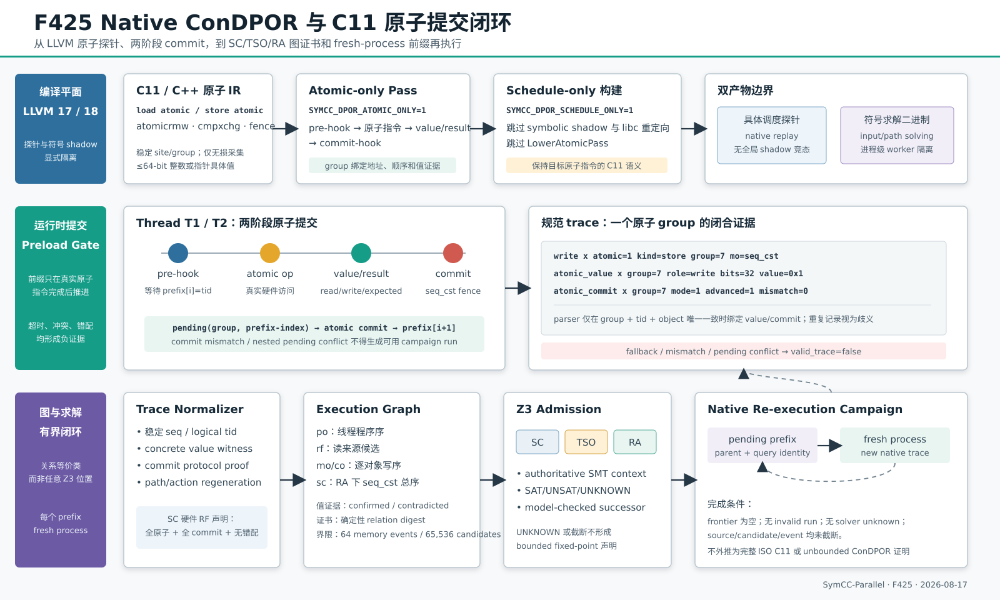

# F425：Native ConDPOR、C11 原子提交与有界再执行闭环

- 日期：2026-08-17
- 功能编号：F425
- 状态：I/T/E-mechanism；完整 ISO C11、无界证明与公开目标 R 级实验未完成
- 主要实现：`compiler/Pass.cpp`、`compiler/Main.cpp`、`compiler/Runtime.*`、
  `util/symcc_schedule_rt.c`、`util/schedule_exploration.py`、
  `util/native_condpor_campaign.py`、`util/symcc_native_condpor.py`

## 1. 研究问题与技术定位

[ConDPor（CONCUR 2025）](https://doi.org/10.4230/LIPIcs.CONCUR.2025.26)把并发调度
非确定性与 concolic 数据非确定性统一到 execution graph 中。图以事件为节点，以程序序 `po`、
reads-from `rf` 和逐位置 coherence order `co` 等关系划分等价类；论文算法按内存模型参数化，并对其
Java 实现给出 sound、complete、optimal 结论。项目此前 F62/F392 已有有界图、backward revisit 和
封闭 SC-QF_BV interpreter，但 native C/C++ 侧仍存在四个缺口：

1. 原生 trace 只知道访问地址，不知道原子读写的具体值，`rf` 无法获得硬件观测证据；
2. 调度 hook 位于指令之前，旧 runtime 在 pre-hook 返回时便推进前缀，后继线程可能在前一条原子
   指令真正完成前通过 gate；
3. SC/TSO/RA 求解只能逐个 replay query，不能枚举并封存确定性的 `rf/mo/sc` 图等价类；
4. prefix 只在旧 trace 上分析，没有一个 fresh-process campaign 用新执行重新生成 path、事件和值。

F425 关闭上述**有界 native 机制缺口**：新增原子值 ABI、两阶段原子提交、关系图证书和原生再执行
campaign。它也修复了一个容易产生错误科研结论的编译语义问题：SymCC 原 `LowerAtomicPass` 会把
atomic IR 降为普通访存，因此新的 schedule-only 构建明确跳过该 pass，LLVM 17/18 测试同时断言
`load atomic` 与 `store atomic` 仍存在。

本实现参考 [GenMC](https://plv.mpi-sws.org/genmc/) 的 execution-graph/C11 系模型研究方向，
但当前编码仅覆盖项目已有的 SC、x86-TSO 近似和 RA 子集。C/C++11 并发语义本身比这三个有界编码
更复杂；[Mathematizing C++ Concurrency](https://www.cl.cam.ac.uk/~pes20/cpp/)所描述的完整语言语义
及 GenMC 的 RC11/IMM/LKMM 支持均不应从 F425 结果中推导出来。



## 2. 系统架构与执行次序

### 2.1 双产物隔离

F425 不让一个二进制同时承担所有职责，而是形成两个可验证边界：

| 产物 | 编译模式 | 职责 | 不承担的职责 |
| --- | --- | --- | --- |
| 具体调度探针二进制 | `SYMCC_DPOR_ATOMIC_ONLY=1` + `SYMCC_DPOR_SCHEDULE_ONLY=1` | 保留 C11 原子指令，生成原子/栅栏 schedule probe，由 preload 控制 native replay | 不创建 symbolic shadow，不重定向 libc，不执行路径求解 |
| 符号求解二进制 | 常规 SymCC 配置 | input/path constraint、candidate generation、worker 级进程隔离 | 不作为 F425 原子提交正确性的直接证据 |

这个隔离来自真实反例：LLVM 17 QSYM backend 的全局 shadow map 不具备目标内多线程并发访问合同；
在一个没有符号输入的 pthread 程序中，完整符号插桩可产生 heap corruption。F425 没有用重试掩盖
问题，也没有声称修复整个 QSYM 多线程 shadow，而是把 native schedule control plane 从该共享状态
中移出。符号执行仍以项目原有的进程级 worker 隔离运行。

### 2.2 LLVM 插桩顺序

对 `atomic load/store`、`atomicrmw`、`cmpxchg` 和 `fence`，module pass 按以下顺序生成 IR：

1. 在目标指令前调用 `_sym_notify_schedule_atomic`，传入地址、字节宽度、kind、success/failure
   memory order 和 RMW operation，runtime 返回运行级唯一 `group`；
2. RMW operand、cmpxchg expected/desired 在指令前以 `atomic_value` 记录；
3. **执行原 LLVM 原子指令**；schedule-only 模式跳过 `LowerAtomicPass`；
4. store 写值、load/RMW/cmpxchg 旧读值在指令后记录；cmpxchg 另记录成功位；
5. 调用 `_sym_notify_schedule_atomic_commit(group,address)`，形成唯一提交边界；
6. 在原指令写入 `symcc.schedule.atomic.instrumented` metadata，阻止 Symbolizer 对同一原子访问重复
   生成普通 memory hook。

只对能无损归一化的 `1..64` bit integer 或 pointer 记录具体值。宽向量、浮点、聚合值不会被截断后
伪装成完整见证，而是保持 value evidence unknown。

### 2.3 Runtime 两阶段提交

设 replay prefix 为 `P=[t0,t1,...]`，当前索引为 `i`。原子 pre-hook 满足 `P[i]=tid` 时不再立即
令 `i=i+1`，而是在线程局部状态保存：

\[
pending=(group,i).
\]

目标原子指令及 value/result hook 完成后，commit hook 执行 seq_cst fence，并在 replay gate 锁内核对
`pending.group=group` 且全局 `prefix_index=i`；只有两者都成立才推进到 `i+1`。因此下一个 prefix
事件不能在当前原子操作实际完成前通过 gate。

Runtime 同时生成三类失败证据：

- 等待超时：`fallback`；
- commit 与 pending group/index 不一致：`atomic_commit ... mismatch=1`；
- 信号/重入等情况在上一原子尚未提交时进入第二个 deferred atomic：
  `atomic_pending_conflict`。

三类事件都会令 campaign 的 `valid_trace=false`。冲突路径不会静默推进前缀，也不会被解释成成功的
原子序列化。

### 2.4 Trace 规范化

Parser 先严格解析 `seq tid op object tags...`，再按 `(group,tid,object)` 将辅助事件绑定回 primary
atomic event：

- value role：`read/write/operand/expected/desired`；
- cmpxchg result：成功时保持 RMW，失败时降为 read；
- commit：`mode/advanced/mismatch/prefix-index`。

相同 group/role 或 group/commit 出现多条记录时视为歧义，不绑定到 primary event。bit width、value
范围、线程或对象不一致同样不绑定。纯 load/store 才获得通用 `value=` 标签；RMW 保留 role-specific
值，避免把旧读值误当成最终写值。

## 3. SC/TSO/RA 图证书

`native_condpor_memory_graph_certificate` 对有界 native trace 枚举以下关系轴：

1. 每个 read 的同对象 `rf` 来源，包括初始化写；
2. 每个对象上写事件的 pairwise `mo/co` 方向；
3. RA 模型中 seq_cst 事件的 `sc` 方向。

每个关系赋值交给项目权威 schedule SMT context 判断：SC 使用全序位置，TSO 使用 store-buffer 近似，
RA 使用 `mo/hb/release sequence/fence/sc/RMW` 约束。证书只保存规范关系身份和摘要，不保存 Z3 为
满足公式任意选择的 event position，因此等价类 identity 不受 solver tie-breaking 影响。

具体值用于给每条 `rf` 边标记 `confirmed`、`contradicted` 或 `unknown`。值矛盾的图仍保留在模型关系
审计中，但显式标记 `hardware_compatible=false`；这区分“内存模型关系可满足”和“与本次硬件读值
一致”两个不同问题。

资源界限为：trace 最多 131,072 条且 seq 唯一非负；模型事件 `2..512`；memory event `0..64`；
候选关系赋值 `1..65,536`。只有 source、memory-event、candidate 均未截断且 solver 无 unknown 时，
`bounded_exhaustive=true`。

## 4. Fresh-process Native Campaign

`symcc_native_condpor.py explore` 的每个 frontier item 是 `(prefix,parent_run,source_query)`。执行次序为：

1. 原子写入 prefix 文件，为本轮建立独立工作目录；
2. 启动**新进程**，注入 schedule preload、memory trace 和 atomic commit 模式；
3. 以 process group timeout 终止失控子进程，对 stdout/stderr 和 trace 设置有界捕获；
4. 严格解析 trace，复核 prefix fidelity、fallback、commit mismatch 和 pending conflict；
5. 从本次新 trace 重建 memory graph、observed ConDPOR graph 和 schedule SMT artifact；
6. 只有 query 为 SAT 且 exact semantics 时生成 successor prefix；
7. 持久记录尚未执行的 parent/query identity，直到 frontier 为空或达到资源界限。

证书记录 runtime 与实际 `command[0]` 的绝对路径和 SHA-256。Verifier 不重新运行目标程序，但会重算
每个已解析 trace 的协议状态、事件计数、三类 digest、全部 graph/SMT analysis、parent/query topology、
pending frontier 和 fixed-point/truncation 状态。

SC 后继的 `rf_hardware_enforced=true` 需要同时满足：所有建模内存/栅栏事件均为 atomic；所有 atomic
均有唯一 `commit-mode=1,commit-mismatch=0` 证据；memory model 恰为 SC。TSO、RA、普通内存混合或
commit 不完整时保持 false。这个字段只说明 prefix 对当前 SC 原子事件的硬件提交顺序有执行力，不是
完整 C11 证明。

## 5. 实验与独立 Oracle

### 5.1 有限内存模型对拍

`benchmark/check_native_condpor_c11_oracles.py` 使用不依赖生产 SMT 编码的 source-level 枚举器生成
SC store-buffering 的全部程序序线性扩展，再与生产关系图证书比较：

| Oracle | 独立期望 | 生产结果 |
| --- | --- | --- |
| SC store-buffering | 读值仅 `(0,1),(1,0),(1,1)`，双初值 `(0,0)` 不可达 | 3 SAT / 1 UNSAT；双 init `rf=(-1,-1)` 被拒绝 |
| TSO store-buffering | 允许双初值 | 4 SAT / 0 UNSAT；双 init 被接纳 |
| RA relaxed store-buffering | 允许双初值 | 4 SAT / 0 UNSAT；双 init 被接纳 |
| RA message passing | acquire 读到 release 后，不可再读到旧 data | 3 SAT / 1 UNSAT；stale data 图被拒绝 |
| 三写者 coherence | 一个对象的写序为 `3!=6` | 恰好 6 个唯一 `mo` 次序 |

这些是小模型语义 oracle，不是完整 herd7/diy litmus corpus。

### 5.2 真实原子回放

测试目标含两个线程：writer 对 `_Atomic int` 执行 seq_cst store 1，reader 执行 seq_cst load。每个 LLVM
版本分别运行 reader-first `(2,1)` 和 writer-first `(1,2)` 各 20 次：

| 编译器 | 总回放 | reader-first 读 0 | writer-first 读 1 | mismatch/fallback/conflict |
| --- | ---: | ---: | ---: | ---: |
| LLVM 17 | 40 | 20/20 | 20/20 | 0 |
| LLVM 18 | 40 | 20/20 | 20/20 | 0 |

两个版本的原生 campaign 均在 3 次 fresh-process run、3 个唯一 prefix 后达到 bounded fixed point，
`invalid_run_count=0`。每次原始 trace digest 可因地址和运行级 seq/group 变化而不同；科研结论依赖规范
关系/证书，而不是要求原始日志逐字节相同。

### 5.3 自动化回归

当前定向测试覆盖：值 ABI 和歧义拒绝、commit 绑定、SC/TSO/RA litmus、value-evidence tamper、campaign
fresh rerun/界限/环境所有权/CLI/证书篡改、双 LLVM IR 原子保留和真实提交回放。最终完整 Python、
LLVM 17/18 和 delivery gate 数字如下，原始 JSON/XML 均在本功能 evidence 目录封存，不把历史 F424
数字冒充本轮结果：

| 测试层 | F425 最终结果 | 失败/非预期跳过 |
| --- | ---: | ---: |
| F425 定向 Python | 12 passed | 0 |
| schedule/campaign 关联 Python | 73 passed | 0 |
| 完整 capability-closed Python | 1,143 passed + 253 subtests | 0；无 skip/xfail/deselect/node-ID drift |
| LLVM 17 完整 lit | 307 passed + 2 expected unsupported / 309 discovered | 0 failed，0 unresolved |
| LLVM 18 完整 lit | 308 passed + 1 expected unsupported / 309 discovered | 0 failed，0 unresolved |
| 双版本 F425 定向 lit | 每版 3/3 passed | 0 |

完整 Python node-ID manifest 为 1,143 项，SHA-256 是
`5768a318c52cfcdd3c45656c59bd8af28566e0a0e72ceed74057fc32a051f8a4`。上述数字证明的是本次工作树
在封存环境中的回归状态；它们不是公开 benchmark 上的覆盖率或加速比。

## 6. 创新性与挑战性

F425 的主要工程与研究创新不是重新命名一个 DPOR 队列，而是跨越了四个信任边界：

1. **pre-hook 到真实 commit 的语义闭合**：前缀推进点从“即将执行”移动到“原子指令与值观测已完成”；
2. **关系图与硬件值的双证据**：模型一致性和本次硬件读值兼容性分别记录，避免把 SAT 图误写成已观测图；
3. **编译产物职责分离**：调度控制不再依赖未声明线程安全的 symbolic shadow；同时保留另一产物继续
   承担符号路径求解；
4. **可重算 campaign 证书**：fresh execution、parent/query topology、truncation 和 protocol failures
   共同决定 fixed point，不因 frontier 暂时为空便宣称完成。

实现挑战包括 LLVM 17/18 原子 IR API 兼容、cmpxchg 多结果值的 post-instruction 插桩、preload 内部
重入、信号打断下的 pending atomic、地址随机化导致的证书身份、关系候选组合爆炸，以及 SC、TSO、
RA 三套约束不能共享未经声明的 relation variable。对应修复均有正向和负向测试。

## 7. 复现命令

```bash
# 有限模型 + LLVM 18 原生 40-run oracle
python3 benchmark/check_native_condpor_c11_oracles.py \
  --symcc build/symcc \
  --runtime build/libsymcc_schedule_rt.so \
  --repetitions 20 --output /tmp/f425-llvm18-oracle.json

# LLVM 17 对称实验
python3 benchmark/check_native_condpor_c11_oracles.py \
  --symcc build-llvm17/symcc \
  --runtime build-llvm17/libsymcc_schedule_rt.so \
  --repetitions 20 --output /tmp/f425-llvm17-oracle.json

# Python 与真实 LLVM 定向测试
python3 -m pytest -q test/test_schedule_exploration.py \
  test/test_native_condpor_campaign.py
python3 /usr/lib/llvm-18/build/utils/lit/lit.py -sv \
  build/test/schedule_atomic_trace.c \
  build/test/schedule_atomic_commit_replay.c
python3 /usr/lib/llvm-17/build/utils/lit/lit.py -sv \
  build-llvm17/test/schedule_atomic_trace.c \
  build-llvm17/test/schedule_atomic_commit_replay.c

# 用户目标 campaign
python3 util/symcc_native_condpor.py explore \
  --runtime build/libsymcc_schedule_rt.so \
  --output /tmp/native-condpor.json --memory-model SC -- ./target args
python3 util/symcc_native_condpor.py verify /tmp/native-condpor.json
```

## 8. 严格声明边界与后续工作

F425 可以声明：当前项目已具备 LLVM 17/18 原子值探针、SC 原子两阶段前缀提交、有界 SC/TSO/RA
`rf/mo/sc` 关系图证书，以及从 successor prefix 到 fresh native trace 的可验证再执行闭环。

F425 不能声明：

- 已复现 ConDPor 对 Java 程序的 sound/complete/optimal 定理与完整算法；
- 已实现 ISO C11/C++11 的全部 consume、non-atomic race/UB、mixed-size、tear、compiler transformation
  和全类型语义；
- 当前 TSO/RA prefix 能直接强制任意弱内存 `rf` 选择；
- 65,536 候选和 64 memory event 之外仍然 complete；
- 已与完整 herd7/diy/GenMC corpus 对拍，或在公开并发 benchmark 上获得 coverage、time-to-bug、
  speedup 提升。

下一优先级是 W3 剩余项：引入 herd7/diy/GenMC 可交换 litmus corpus 和 cross-oracle；扩展 RC11 的
mixed-size/fence/RMW 一致性；设计弱内存 RF 的可执行控制或确定性解释器；随后才有资格开展等 CPU、
不少于 20 次的公开目标实验。完整无界证明仍属于独立研究课题。
