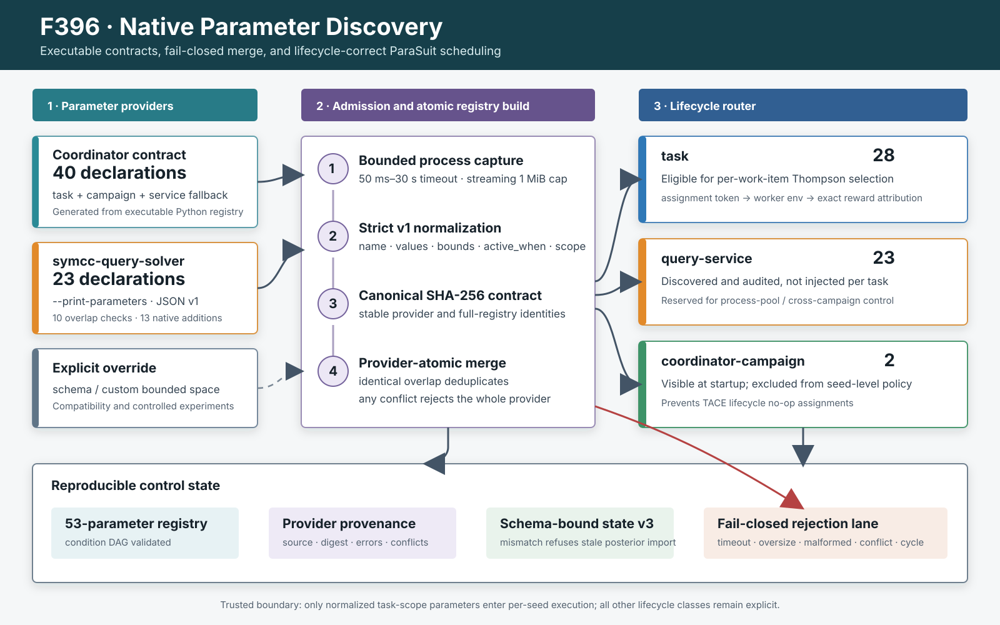

# F396：原生参数发现与生命周期安全的 ParaSuit Registry

**日期：** 2026-08-13  
**成熟度：** I/T/E-mechanism  
**实现范围：** executable parameter-provider、严格协议、原子合并、参数生命周期路由、schema-bound state  
**不包含：** ParaSuit 论文完整 value-space/clustering 算法、公开目标覆盖率或 bug-yield 复现



## 1. 为什么需要这一轮

F186 已把自配置从固定 profile 扩展为条件参数图、context posterior、pair interaction
和只读 transfer prior，但参数定义仍主要来自随源码发布的
`util/self_config_schema.json`。这有三个问题：

1. **实现与 schema 可漂移。** 二进制新增、删除或收紧参数后，静态文件可能继续采样
   已失效的值；
2. **多组件没有共同发现协议。** coordinator、QSYM runtime 和持久 query solver
   的参数由不同进程消费，旧 registry 无法证明某个值由当前可执行组件声明；
3. **生命周期混淆。** 逐 seed 环境只会影响 worker target。把 query-service 启动参数
   或 campaign 启动参数当作逐任务 arm，会产生“策略已选择、实际执行未改变”的虚假
   attribution。

本轮的核心不是再增加一层 JSON，而是把参数声明变成**可执行、可哈希、可拒绝且带
生命周期的运行合同**。

## 2. 与 ParaSuit 的关系

[ParaSuit（ICSE 2026）](https://conf.researchr.org/details/icse-2026/icse-2026-research-track/222/Enhancing-Symbolic-Execution-with-Self-Configuring-Parameters)
针对每个被测程序自动识别可用参数、评估参数影响、构造采样空间并迭代更新采样概率。
论文官方页面报告其 KLEE/12 个 C 程序实验平均分支覆盖率提高 26%，发现 11 个独特
bug，其中 4 个只由 ParaSuit 发现。这些数字属于论文，不是本项目结果。

[官方 ParaSuit 实现](https://github.com/skkusal/ParaSuit)把 extraction、parameter
selection 和 value sampling 分成独立阶段，并公开 silhouette threshold。F396 对应的
是“参数从执行组件进入可验证 registry”这一工程前置；本项目既没有宣称复现其 KLEE
黑盒参数抽取，也没有复现 silhouette 驱动的 exploit 切换和 12-program 实验。

## 3. 设计与执行流程

### 3.1 Provider 协议

组件执行 `--print-parameters` 后输出单个 UTF-8 JSON 文档：

```json
{
  "schema": "symcc-parameter-provider-v1",
  "provider": "symcc-query-solver",
  "scope": "query-service",
  "parameters": {
    "SYMCC_SOLVER_PSCACHE_SIZE": {
      "values": ["32", "128", "512", "2048"],
      "numeric": true,
      "min": 1,
      "max": 65536,
      "active_when": {"SYMCC_SOLVER_PSCACHE": ["1"]}
    }
  }
}
```

协议只接受受限的 `SYMCC_[A-Z0-9_]+` 名称、最多 128 个 scalar values、有限数值
上下界、最多 32 个条件父节点以及三种 scope：

| scope | 消费时机 | 当前策略行为 |
| --- | --- | --- |
| `task` | 每个 SymCC work item 启动前 | 可进入 Thompson/context/pair 策略并由 assignment token 精确归因 |
| `query-service` | 持久 solver service 创建时 | 可发现、校验和记录；不作为逐 seed arm |
| `coordinator-campaign` | master/campaign 启动时 | 可发现、校验和记录；不作为逐 seed arm |

`symcc-query-solver` 当前原生声明 23 个实际读取的 prefix-cache、selective-query 和
PSCache 参数。coordinator 的可执行 Python contract 声明 40 个参数，其中与 solver
重叠 10 个；合并后是 53 个唯一参数：28 个 task、23 个 query-service、2 个
coordinator-campaign。静态 schema 只作为经过测试的兼容快照和显式 override，不再是
默认能力发现的唯一事实来源。

### 3.2 有界采集

`discover_parameter_registry()` 按以下顺序工作：

1. 生成 coordinator 自身的 native contract；
2. 从 `SYMCC_SELF_CONFIG_PROVIDER_COMMANDS`、`SYMCC_QUERY_SOLVER`、`PATH` 或当前
   build tree 找到 provider；
3. 不经过 shell 启动组件，stdin 关闭、stderr 丢弃；
4. selector 流式读取 stdout，超过 1 MiB 立即 kill；超时限制在 50 ms 到 30 s；
5. 严格解析 schema、provider identity、values、有限 numeric bounds、condition 和
   scope；未知字段不能借宽松转换产生可采样参数。

超时、非零退出、非 UTF-8、非法 JSON、oversize 和非法数值都只形成有界错误记录，
不会把部分 provider 内容加入 registry。

### 3.3 Provider 原子合并

每个 provider 的 canonical parameter contract 计算 SHA-256。合并遵守两个不变量：

- 同名且合同完全相同的声明去重；
- 任一同名参数在 values、bounds、condition 或 scope 上冲突，**整个 provider 拒绝**，
  其不冲突的新参数也不会部分进入 registry。

全部 provider 合并后，再对 `active_when` 做未知父节点和环检测。显式
`SYMCC_SELF_CONFIG_SCHEMA`/`SPACE` 仍可用于兼容和受控消融，但其结果同样经过条件图
检查。

### 3.4 生命周期路由与 attribution

`ParameterRegistry` 保存全部 53 项和 provider provenance；
`SelfConfiguringPolicy.parameters` 只接收 28 个 `task` 参数。原先静态 schema 中的
selective-query 参数由 query-service 在创建时读取，TACE 参数由 coordinator 在
campaign 初始化时读取；F396 将它们分别标为 `query-service` 和
`coordinator-campaign`，从根源上阻止无效逐任务采样。

这不是简单过滤。若未来实现 solver process pool 或跨 campaign controller，完整
registry 已保留这些参数、范围、依赖和 provider hash，可以在正确生命周期上复用；
当前实现则宁可不调，也不产生错误 reward attribution。

### 3.5 持久状态

policy state 升级到 schema 3，保存：

- task 参数的规范 `parameter_schema_hash`；
- provider source、contract digest、parameter count、errors 和 conflicts；
- 完整 provenance hash；
- 原有 global/context/pair posterior、pending assignment 和 numeric expansion。

若 schema 3 文件的参数 hash 与当前 task registry 不同，旧 posterior、pending token
和动态 values 整体不导入。这一规则防止 provider 删除参数后，旧 state 又把已删除值
悄悄加回当前空间。旧 v1/v2 state 仍可按其兼容合同读取。

## 4. 实现位置

| 文件 | 主要实现 |
| --- | --- |
| `util/self_config.py` | provider v1、严格 parser、有界子进程、原子 registry、scope 路由、state v3、CLI |
| `runtime/src/backends/qsym/query_solver.cpp` | `--print-parameters` 及 23 项 query-service 原生声明 |
| `util/self_config_schema.json` | 与 coordinator native contract 对拍的兼容快照和 scope 标注 |
| `test/test_self_config.py` | 协议、冲突、超限/超时、lifecycle、state migration 单元门禁 |
| `test/self_config_native_provider.py` | LLVM 17/18 真实二进制 provider、53 项合并和 scope 隔离 |
| `benchmark/benchmark_self_config_provider.py` | 多次进程发现的稳定性和一次性启动成本 |

CLI 示例：

```bash
symcc-query-solver --print-parameters
python3 util/self_config.py --print-parameters
python3 util/self_config.py --print-schema \
  --provider-command /path/to/symcc-query-solver
```

## 5. 验证结果

### 5.1 定向正确性

- `test/test_self_config.py`：15 passed；
- LLVM 18 `self_config_native_provider.py`：1/1 passed；
- LLVM 17 同一测试：1/1 passed；
- provider 声明 23 项，合并 registry 53 项，provider 2 个，errors/conflicts 均为 0；
- 反例覆盖 incompatible overlap 整 provider 回滚、NaN numeric、1 MiB 超限、50 ms
  timeout、条件环、旧 state/schema mismatch，以及 service/campaign 参数不得进入 task
  policy。

### 5.2 机制开销

在本机 LLVM 18 build 上进行 10 次 warmup、100 次独立 provider discovery：

| 指标 | 结果 |
| --- | ---: |
| coordinator-only registry 构建 | 444.241 µs |
| native provider discovery 中位数 | 1887.812 µs |
| P95 | 2331.673 µs |
| 最大值 | 2518.865 µs |
| 成功且无 conflict/error | 100/100 |
| provider digest / registry hash 唯一值 | 1 / 1 |

约 1.89 ms 是 campaign 初始化时的一次性本地进程发现成本，不是每条约束或每个 seed 的
热路径成本，也不是符号执行加速数据。

### 5.3 全局回归

- capability-closed Python gate：960 passed + 235 subtests，960/960 canonical
  node IDs，无 skip/xfail/deselection，128.11 s；
- LLVM 18 完整 lit 第一轮：257 passed + 1 个既有 unsupported，211.13 s；
- LLVM 18 完整 lit 第二轮：同为 257 + 1，221.78 s；
- LLVM 17/18 `symcc-query-solver` 均重新编译并通过同一真实 provider 测试；
- Ruff、format check、py_compile、root/runtime whitespace gate 通过；环境未安装
  `clang-format`，不虚构该项结果。

原始输出和哈希位于
[`F396 evidence`](../evidence/f396-native-parameter-provider-2026-08-13/)。这些结果支持
“本轮未造成已覆盖回归”，不支持公开 benchmark 的覆盖率或性能提升结论。

## 6. 创新性与挑战

### 6.1 相对旧实现的进步

- 从“发布一份机器 schema”推进到“当前可执行组件声明并由 coordinator 验证”；
- 以 provider-atomic merge 防止部分成功造成不可解释配置空间；
- 把参数生命周期纳入合同，修复统计层最隐蔽的 no-op attribution；
- 将 registry identity 与学习 state 绑定，避免 stale posterior 穿越配置语义变化；
- 保留显式 override，支持 deterministic ablation，而不是把自动发现变成不可控隐式行为。

### 6.2 尚未完成

1. **ParaSuit extraction 复现：** 当前要求 SymCC 组件实现统一协议，不会从任意第三方
   binary 的 help text 自动推断全部参数；
2. **value-space construction：** 有限 values、上下界和历史 half/double expansion
   已有，但不是论文完整的每程序空间构造；
3. **silhouette 策略：** 当前是 hierarchical Thompson/context/pair policy，未与官方
   threshold/clustering policy 做同预算对拍；
4. **服务级控制：** query-service 参数已正确隔离，但尚未建立按配置分池、重启和
   query attribution 的持久 solver process portfolio；
5. **科研效果：** 尚无 12-program 或本项目公开 targets 上 20 次等 CPU 的 coverage、
   AUC、solver CPU、配置稳定性和 bug-yield 比较。

因此 F396 的严格结论是：**原生参数发现、合同合并、provenance 和生命周期安全已经有
实现与机制证据；完整 ParaSuit 算法及效果没有完成。**
