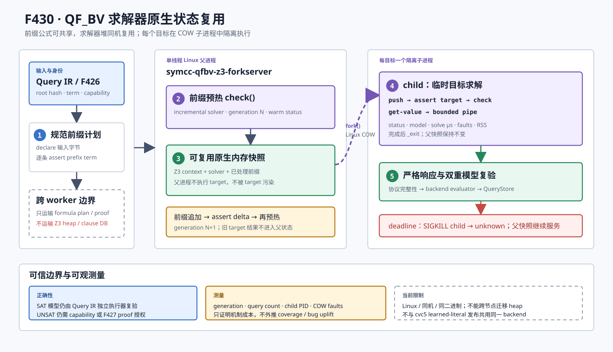

# F430：QF_BV 求解器原生状态的 COW Fork 复用

- 日期：2026-08-17
- 状态：I/T/E-mechanism；Linux 同机原生状态阶段完成
- 支持域：QF_BV、Z3 incremental solver、Linux `fork()`/copy-on-write
- 生产入口：query-service portfolio 的显式 `native_state_fork` 开关
- 权威实现：`util/qfbv_z3_forkserver.cpp`、`util/qf_bv_backend.py`
- 权威测试：`test/test_qfbv_native_state_fork.py`
- 独立 oracle：`benchmark/check_qfbv_native_state_fork_oracles.py`
- 原始证据：`docs/codex/evidence/f430-qfbv-native-state-fork-2026-08-17/`



## 1. 研究问题

F426--F429 已经形成四类可持久复用制品：规范前缀计划、UNSAT proof/receipt、经证明的
learned literal，以及它们的依赖感知生命周期。然而，这些制品都位于求解器外部。原
`PersistentSmtLibQfbvSolver` 虽然保留一个交互式 SMT-LIB 进程，但仍有三个实质缺口：

1. 建立前缀后没有先执行 `check()`，因此“持久进程”不等于已经完成前缀预处理的求解状态；
2. 目标查询直接在父 solver 上 `push/assert/check/pop`，超时或 solver 异常必须销毁整个前缀进程；
3. formula-plan、proof、lemma 的复用不能等价为 solver heap、内部索引或搜索状态的复用。

F430 的研究问题是：**能否让多个同前缀目标继承已经预热的 Z3 原生内存状态，同时使任一目标
的写入、超时和崩溃不能污染父快照？**

答案采用同机进程级方法，而不是宣称一个并不存在的“可移植 Z3 heap 序列化格式”：单线程父
进程持有预热 solver；每个目标通过 Linux `fork()` 得到 copy-on-write 子进程；子进程临时求解
并用有界 pipe 返回结果，随后 `_exit`。Linux 文档明确说明 `fork()` 以 copy-on-write 页实现，
主要初始成本是复制页表和创建 task structure；这正好提供“继承原生状态、隔离后续写入”的
操作系统基础。[Linux `fork(2)`](https://man7.org/linux/man-pages/man2/fork.2.html)

## 2. 与相关工作的关系

| 工作 | 已知核心思想 | 本项目此前覆盖 | F430 新增部分 |
| --- | --- | --- | --- |
| Green / GreenTrie | 规范化、切片、结果或蕴含关系复用 | 外部结果/约束缓存 | 不替代；F430复用求解器进程内状态 |
| Pangolin | polyhedral path abstraction 与增量混合测试 | F03/F182及F426 formula-plan | 不复现其polyhedral算法；补原生heap层 |
| Triereme (ACSAC 2023) | trie重排查询以保留公共前缀和incremental solving | F424/F426 Prefix DAG/context | F430让同一前缀的每个target具备进程隔离 |
| PSCache (FSE 2024) | 用partial solution增加cache entry | F32及相关partial model路径 | 外部candidate复用与原生状态复用正交 |
| Optimal ConDPOR (CONCUR 2025) | solver pool、incremental solver及model携带 | F392/F425并发图 | 本阶段只实现QF_BV目标的本地solver快照 |
| Cache-a-lot (2025 preprint) | 变量代换下扩大UNSAT core复用 | F427/F428尚未覆盖任意变量置换 | 仍是后续独立缺口，不混入F430结论 |

一手依据包括：Z3 官方教程确认 incremental solver 支持连续检查及 `push/pop` scope，并说明
`translate` 可复制到独立 context；但 `translate` 是 API 级 solver clone，不是跨节点、跨版本的
内部堆序列化。[Programming Z3：incrementality/scopes/clone](https://z3prover.github.io/papers/programmingz3.html)
Triereme 说明公共前缀和求解次序决定 incremental knowledge 的可利用程度，并报告其自身系统中的
solver-time 下降；这些论文数字不能移植为本项目结果。
[Triereme](https://download.vusec.net/papers/triereme_acsac23.pdf)
[Pangolin](https://doi.org/10.1109/SP40000.2020.00063)
[PSCache](https://doi.org/10.1145/3660817)
[Optimal ConDPOR](https://doi.org/10.4230/LIPIcs.CONCUR.2025.26)
[Cache-a-lot](https://arxiv.org/abs/2504.07642)

截至本次实现，官方 Z3 最新稳定发布为 5.0.0（2026-07-17）；双 LLVM 构建和最终 oracle 均链接
该版本，而不是机器原有的 4.8.12。版本事实以
[Z3 官方 release 页面](https://github.com/Z3Prover/z3/releases/tag/z3-5.0.0)为准。

## 3. 执行流程

### 3.1 父快照建立

1. Python backend 独立 lower Query IR，得到 canonical prefix terms、target term 和 input offsets；
2. F426 仍负责跨 worker 发布/验证 formula-plan，terminal context digest 仍是本地 LRU key；
3. backend 启动 `symcc-qfbv-z3-forkserver`，发送 QF_BV logic、model、timeout、声明和前缀断言；
4. helper 在 request 的 echo 边界执行隐藏的父级 `solver.check()`；
5. 完成后递增 `snapshot-generation` 与 `warm-checks`，形成可 fork 的原生内存快照。

声明本身不改变断言集合，因此后续只增加 input declaration 时不生成新代；追加 prefix assertion
或经验证的永久约束时，下一 echo 重新预热并进入 `generation + 1`。

### 3.2 每目标隔离求解

backend 仍生成标准的目标事务：

```smt2
(set-option :timeout <remaining-ms>)
(push 1)
(assert <target>)
(check-sat)
(get-value (<input-byte-symbols>))
(pop 1)
```

helper 在读到 `pop` 后执行以下动作：

1. 建立 `O_CLOEXEC` pipe；
2. `fork()`；父进程只监视 pipe、child PID 和绝对 deadline；
3. child 在继承的 solver 上 `push`、加入 target、`check`、读取模型；
4. child 写入固定头和最多 8 MiB 的模型 payload，再以 `_exit` 结束；
5. parent 非阻塞读取并 `waitpid`，验证 magic、状态、长度、模型基数和退出状态；
6. parent 输出 SMT status/model 和严格的 `symcc-native-state-fork-v1` 元数据；
7. Python backend 复验协议、序列、模型，SAT 再进入既有 Query IR evaluator 和 QueryStore 复验。

child 的 target assertion、bit-blast/SAT 临时写入和模型对象都只修改其私有 COW 页；父 solver 从不
执行 target。下一目标因此从同一父代开始，而不是从上一个目标的 `pop` 后状态猜测性恢复。

### 3.3 超时、异常与取消

- **目标 deadline**：parent 只向 child 发送 `SIGKILL`，完成 `waitpid` 后返回 `unknown`；父快照继续；
- **不完整 child payload**：helper 报错，Python 因缺少有效元数据逐出整个父 context；
- **协议缺失/篡改**：普通 cvc5/Z3 SMT-LIB 进程不能被误标成 native helper；严格失败关闭；
- **query count 或 generation 回退**：视为 helper 重启/状态混淆，逐出 context；
- **portfolio cancellation**：既有 `_interrupt_process` 会杀整个 process group，因此父快照也销毁；
  F430只承诺target内部timeout/crash隔离，不承诺portfolio取消后保留快照。

## 4. 实现细节与不变量

### 4.1 C++ helper

`util/qfbv_z3_forkserver.cpp` 有意只实现 backend 实际发出的 SMT-LIB 子集：

- `QF_BV`、8-bit `symcc_input_<offset>` nullary declaration；
- prefix/target Boolean assertion；
- 单层 `push/check/get-value/pop` 目标事务；
- timeout、model 和 echo；
- 单行4 MiB、响应8 MiB、输入符号1,048,576的硬界。

父进程显式关闭 Z3 parallel mode，避免在多线程 solver 上 fork。child 到 parent 使用同一可执行文件
内部的固定二进制头，不把任意文本解析为长度。正常、timeout、pipe过大、poll/read/wait失败路径均
回收 child；测试还读取 `/proc/<parent>/task/<parent>/children` 验证无残留子进程。

### 4.2 Python 协议验证

`parse_native_state_fork_metadata` 要求恰好一个元数据 form 和以下完整字段：

```text
snapshot-generation, snapshot-queries, warm-checks, forked,
child-pid, child-status, child-timed-out, child-solve-us,
fork-roundtrip-us, child-minor-faults, child-major-faults,
child-max-rss-kib, warm-status
```

校验包括：十进制/上界、`warm-checks == generation`、一次fork、正PID、timeout只能对应unknown、
roundtrip不小于child solve、metadata status与顶层SMT status一致，以及同一context的query count严格
加一且generation/warm count不能回退。模型在保留快照前先解析一次，finalize阶段再独立解析一次。

### 4.3 正确性权威没有改变

- SAT：helper model不是最终权威，backend与QueryStore仍分别依据Query IR执行/重建；
- UNSAT：`accept_unsat`关闭时仍降为unknown；启用F427时仍由独立CPC/Ethos证明链授权；
- capability hash：`native_state_fork`是部署机制，不写入QF_BV capability schema，因此F426--F429
  已封存的context/proof/lemma身份不漂移；
- F428：同一backend禁止同时启用`native_state_fork`与cvc5 learned-literal发布。可在portfolio中放置
  两个独立backend：Z3 native fork处理隔离复用，cvc5 backend处理可证明lemma发布。

## 5. 构建与配置

构建系统默认查找系统Z3，也允许显式选择已校验的发行版：

```bash
cmake -S . -B build \
  -DSYMCC_BUILD_QFBV_Z3_FORKSERVER=ON \
  -DSYMCC_QFBV_Z3_ROOT=/opt/z3-5.0.0
cmake --build build --target symcc_qfbv_z3_forkserver
```

query-service portfolio 示例：

```json
{
  "solvers": [
    {
      "name": "z3-native-qfbv",
      "kind": "smtlib-qfbv",
      "command": ["/path/to/symcc-qfbv-z3-forkserver"],
      "persistent": true,
      "native_state_fork": true,
      "prefix_cache": 4,
      "capabilities": {
        "incremental": true,
        "accept_unsat": false
      }
    }
  ]
}
```

开关必须是Boolean，且只允许persistent `smtlib-qfbv`。helper命令不能含`{query}`或
`{timeout_ms}`占位符。

## 6. 实验设计与结果

### 6.1 正确性与故障oracle

独立oracle固定前缀`0x20 <= byte0 <= 0xe0`，以seed 430生成128个目标byte。每个目标同时交给：

- 一个预热后的Z3 5.0.0 native parent，经独立child求解；
- 一个同版本Z3 5.0.0 fresh process，完整重放prefix+target。

两轮结果如下：

| 指标 | Run A | Run B |
| --- | ---: | ---: |
| 目标数 | 128 | 128 |
| status mismatch | 0 | 0 |
| invalid SAT model | 0 | 0 |
| unique child PID | 128 | 128 |
| timeout后同generation恢复 | 通过 | 通过 |
| child major faults总数 | 0 | 0 |
| child minor faults中位数 | 413 | 413 |

timeout反例使用`--child-start-delay-ms 100`和10 ms deadline：第一次目标确定性返回unknown且
`child-timed-out=true`；第二次把deadline恢复到1000 ms，在generation 1、query count 2上返回
模型`byte0=67`。这直接验证“只杀child，父快照存活”，而不是通过普通快速查询间接推断。

### 6.2 机制成本

| 微观指标 | Run A | Run B |
| --- | ---: | ---: |
| native初始化 | 8.950 ms | 8.541 ms |
| native wall中位数 | 2.545 ms | 2.535 ms |
| native wall p95 | 3.077 ms | 3.016 ms |
| child solve中位数 | 0.823 ms | 0.797 ms |
| fork roundtrip中位数 | 2.074 ms | 1.990 ms |
| cold Z3 wall中位数 | 5.763 ms | 5.706 ms |
| cold/native总成本比 | 2.252x | 2.249x |

这里的native总成本已经包含一次父前缀初始化；cold成本包含每目标进程启动、解析、前缀检查和目标
求解。该对比说明在这个固定一字节prefix机制实验中，fork+COW的额外成本小于逐目标冷启动成本。
它**不能**证明复杂程序一定加速，也不能证明coverage、bug数量或time-to-target提升；简单查询中
fork开销可能抵消复用收益，真实收益依赖prefix规模、目标数量、solver内部策略和调度命中率。

### 6.3 软件工程门禁

- native专项：8 passed + 5 protocol-tamper subtests；
- 相关QF_BV/proof/lemma链：43 passed + 25 subtests；
- LLVM17/LLVM18 targeted lit：各1/1；
- full QF_BV operator matrix：SAT模型`byte0=0x42, byte1=0x03`且QueryStore提交通过；
- ASan+UBSan：8 passed + 5 subtests，以及32目标oracle通过；
- Z3版本：官方5.0.0；LLVM版本：17.0.6与18.1.3。
- capability-closed完整Python：1205 passed + 278 subtests，零skip/xfail/xpass/deselection，
  规范node-ID集合完全匹配；
- 完整LLVM17：314项中312 passed + 2 expected unsupported；
- 完整LLVM18：314项中313 passed + 1 expected unsupported。

完整门禁原始JSON/JUnit记录在同名evidence目录，不能用旧F429门禁冒充F430结果。

## 7. 创新性与挑战性

F430的工程创新不是发明`fork()`或incremental SMT，而是把以下原本分散的条件组合成一个可审计
的并行符号执行合同：

1. F426内容身份决定“哪个公式前缀”可本地物化；
2. 父级隐藏warm check把formula presence升级为已执行的native solver state；
3. COW child让每个target继承该状态，同时隔离target写入和deadline故障；
4. generation/query序列、进程/缺页/时间遥测使“是否真的fork复用”可验证；
5. SAT双重执行器和UNSAT proof授权保持求解正确性权威不被性能机制替代；
6. 版本选择、协议缺失、状态回退、payload和生命周期全部失败关闭。

最大的挑战是不能把“内存继承”夸大为“solver保证保留全部learned clauses”。Z3内部哪些预处理、
索引和搜索对象在后续check中实际被利用属于solver实现策略；F430可严格证明的是：child从预热父进程
的同一内存映像开始、target修改不回写父进程、协议和结果经过独立复核。

## 8. 当前边界与后续缺口

1. 只支持Linux同机、同架构、同Z3二进制；不是跨worker heap transport；
2. 父heap是易失进程状态，不进入F429 CAS/GC，也不能跨服务重启恢复；
3. 当前每个backend串行目标fork；尚未做一父多child并发及内存压力自适应；
4. 没有用LAVA-M/FuzzBench/真实多节点campaign证明覆盖率或time-to-bug收益；
5. 尚未实现Cache-a-lot式任意变量置换UNSAT-core复用；
6. 尚未形成solver版本/参数变化下的state ABI，因为F430明确没有定义可迁移ABI。

因此F430应标记为`I/T/E-mechanism`，而不是`R`。下一阶段的优先级应先做公开目标paired campaign，
再决定是否增加并发child、变量置换UNSAT-core复用或跨节点求解器状态研究。
