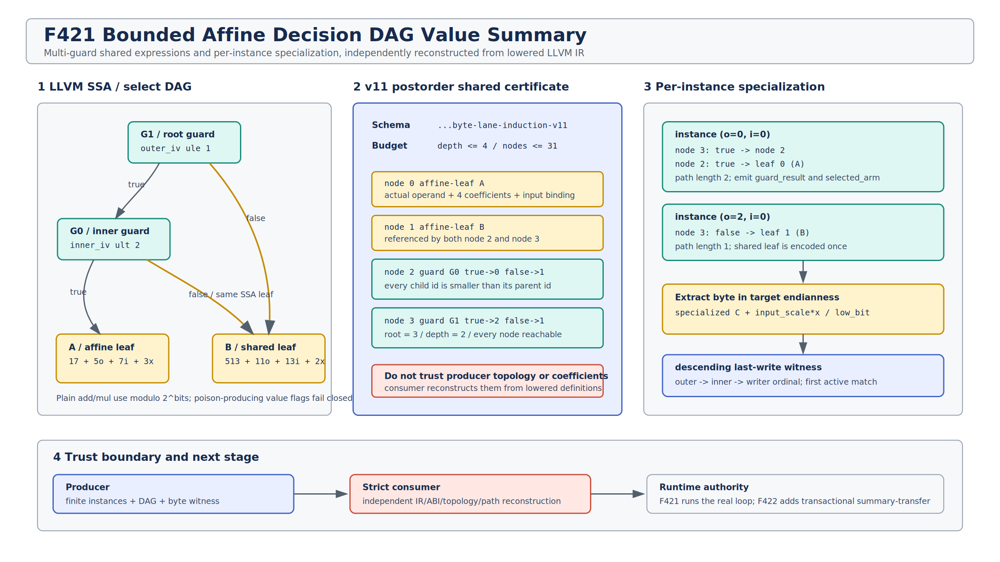

# F421: Nested-Loop MemoryPhi Affine Decision DAG Value Summary

日期：2026-08-17  
状态：实现完成；producer/strict consumer 闭合，真实 executor、双 LLVM、独立有限 oracle 与机制基准通过  
Schema：`symcc-loop-memoryphi-byte-lane-induction-v11`  
Capability：`bounded-nested-loop-memoryphi-decision-dag-value-summary`



## 1. 研究问题

F420 只能处理一个直接值选择：

```text
select(icmp P IV, C, affine_true, affine_false)
```

真实循环 writer 常出现嵌套 `select`、多个 induction guard，以及被多个选择节点共享的 affine
子表达式。如果把每条根到叶路径展开成一棵树，证书会重复编码共享子图；如果只保存最终叶值，consumer
又无法确认 producer 是否忠实解释了真实 `select/icmp`。F421 因而引入一个有界、后序编号、可共享的
Decision DAG，并保持 F416--F420 的有限二维 writer-instance、byte-lane 和 last-write 语义。

本次目标是扩展**证明语言**，不是跳过循环。真实 executor 仍执行 outer/inner loop、guard、select 和
store；F422 才会在更强 refinement/effect/live-out 契约下引入 executable summary-transfer。

## 2. 精确接纳域

一个 v11 writer-value DAG 满足：

- root 是 inner body 中、store 之前定义的整数 `select`；
- 每个 guard node 绑定一个先于该 select 的实际 `icmp`；
- predicate 仅为 `eq/ne/ugt/uge/ult/ule`；
- 比较精确依赖 outer IV 或 inner IV 与同位宽、非负、至多 `INT64_MAX` 的常量，常量可在任一侧；
- 每个 leaf 是 F419 affine bit-vector：

```text
V(o,i,x) = c + s_o*o + s_i*i + s_x*x  (mod 2^b)
```

- value 宽度为 byte-complete 8--64 bit；普通 `add/mul` 使用 modulo 语义，带 `nuw/nsw` 的 value
  运算拒绝；
- DAG guard depth 不超过 4，节点数不超过 31；
- 至少有 2 个 guard node 和 2 个模位向量语义不同的 affine leaf；
- 相同 LLVM SSA operand 只产生一个 node，允许 leaf 或非叶子子 DAG 被多条边共享。

input-dependent guard、signed predicate、跨 block select、悬空/循环节点、过深/过大 DAG，以及无法由
F419 grammar 完整恢复的 leaf 都失败关闭。

## 3. Producer 算法

### 3.1 后序 DAG 构造

producer 从 store operand 递归下降：

1. 命中已经处理的 SSA value 时复用 `(node_id, subtree_depth)`；
2. 命中 select 时先递归 true/false child，再创建 guard parent；
3. 命中非 select 时尝试 F419 affine normalization，成功则创建 leaf；
4. active set 阻止循环，节点/深度硬预算阻止证书膨胀；
5. root 完成后要求 guard 数和 leaf 语义非退化。

child 总在 parent 之前，因此 node id 自然满足 postorder：

```text
node 0 = affine A
node 1 = affine B
node 2 = guard(inner_iv ult 2, true=0, false=1)
node 3 = guard(outer_iv ule 1, true=2, false=1)  // shared node 1
root   = 3
```

第二轮 review 修复了共享**非叶子**子图的深度缓存：缓存必须保存 `(id, depth)`，只保存 id 并在复用时
返回深度 0 会低估 root depth。新增 depth-3 共享子树 fixture 覆盖该组合。

### 3.2 混合 writer 组合

同一个 ordered writer transfer 可以同时包含：

- constant-integer writer；
- F419 single affine writer；
- F420 direct piecewise writer；
- F421 Decision DAG writer。

只要至少一个 writer 使用 DAG，整个 transcript 升级为 v11。第二轮 review 发现 consumer 最初只允许
v11 writer 使用 DAG/affine/constant，误拒绝“DAG writer + direct piecewise writer”。修复后 v11 将
F420 encoding 作为合法子语言，但仍要求至少存在一个真实 DAG writer，避免纯 v10 伪升级。

### 3.3 逐 instance 专门化

对 F418 已证明的有限 `(o_k,i_k,address_k)`，producer 从 root 开始：

1. 用真实 predicate、operand 顺序和当前 IV 常量求 guard；
2. 记录 `node/guard/guard_result/selected_arm`；
3. 沿选中 child 前进，直到唯一 affine leaf；
4. 将 leaf 的 outer/inner 项代入实例，保留入口 input scale；
5. 按 target endianness 生成 `extract-affine-bitvector-byte`；
6. 复用 descending outer/inner/writer ordinal 的 first-match last-write witness。

路径长度可以小于 DAG 最大深度：root 直接命中共享 leaf 时为 1，进入 nested guard 时为 2 或更多。

## 4. v11 数据契约

writer 核心结构：

```json
{
  "kind": "affine-decision-dag-bitvector",
  "bits": 16,
  "variable": {"var": "v_root_select"},
  "root": 3,
  "depth": 2,
  "nodes": [
    {"id": 0, "kind": "affine-leaf", "value": {"kind": "affine-bitvector-arm"}},
    {"id": 1, "kind": "affine-leaf", "value": {"kind": "affine-bitvector-arm"}},
    {"id": 2, "kind": "guard", "when_true": 0, "when_false": 1},
    {"id": 3, "kind": "guard", "when_true": 2, "when_false": 1}
  ],
  "semantics": "postorder-shared-guard-specialized-modulo-2^bits"
}
```

专门化 byte witness：

```json
{
  "kind": "guard-specialized-decision-dag-byte",
  "root": 3,
  "path": [
    {"node": 3, "guard_result": true, "selected_arm": "true"},
    {"node": 2, "guard_result": false, "selected_arm": "false"}
  ],
  "leaf": 1,
  "value": {"kind": "extract-affine-bitvector-byte"}
}
```

能力闭包为：

```text
base loop MemoryPhi
  -> nested composition v6
  -> last-write value v7
  -> two-dimensional address v8
  -> affine symbolic value v9
  -> piecewise affine value v10
  -> affine Decision DAG value v11
```

v11 capability 依赖 v10 capability，是接口演进依赖；v11 transcript 本身不要求每个 writer 都存在一个
direct v10 select。

## 5. Strict consumer 独立重建

consumer 不把 JSON 当作可信证明结论。`executor.create()` 在任何执行前完成：

- 从 lowered blocks 建立唯一 definition 表、CFG predecessor/successor 和 dominator；
- 从 writer store operand 找 root select，逐 node 匹配真实 select true/false operand；
- 从 select condition 找唯一 icmp，复核 block、instruction order、predicate、IV、常量方向与位宽；
- 对 leaf operand 独立运行 affine grammar，复核系数、入口 input offset/bytes 与 modulo 范围；
- 要求 node id 连续、child id 小于 parent、root 为最后 node、全节点从 root 可达、operand 不重复；
- 独立计算每个 node depth、leaf 语义数以及每个 instance 的 guard path；
- 复算 byte extraction、大小端、fixed point、case order 和完整 witnesses；
- 检查 v11 capability 依赖、真实 use point 和 dangling capability。

checker 的 mutation battery 覆盖 capability、root/depth/id、越界 child、signed predicate、leaf scale、
witness guard result/leaf、实际 root select 交换和 transcript 删除；所有 mutation 均在 create 阶段拒绝。

## 6. 测试设计

### 6.1 真实 LLVM / executor

主 fixture 覆盖：

- 2 guard + 2 affine leaf 的共享 DAG；
- constant byte overlay 与 ordered writer last-write；
- path length 1/2；
- little-endian 真实 executor 返回 `13994`、`9898` 与未激活路径的零值集合；
- big-endian、3 个独立 leaf；
- v11 DAG writer 与 v10 direct piecewise writer 混合；
- depth-3 共享非叶子子图；
- signed guard 和 input-dependent guard producer fallback。

双 LLVM focused：

| 范围 | LLVM 17 | LLVM 18 |
| --- | ---: | ---: |
| F421 main + fallback | 2/2 | 2/2 |
| F416--F421 nested related | 14/14 | 14/14 |

### 6.2 Python 与独立 oracle

```text
F421 targeted: 5/5
F420--F421 targeted: 11/11
ruff + py_compile: PASS
```

独立 oracle 不读取 producer transcript。它用两套算法比较：

- concrete runtime：按 outer/inner/program order 真实写 byte array；
- summary reference：为每个 target byte 构造 descending last-write cases，选择第一个 active instance。

| 指标 | 结果 |
| --- | ---: |
| guard/order/induction/endian/sharing 配置 | 1,152 |
| runtime vs summary load-vector | 55,296 |
| scalar load equivalence | 608,256 |
| defined byte equivalence | 165,888 |
| complete loads | 114,048 |
| uninitialized/partial loads | 494,208 |
| one-guard specialized paths | 3,456 |
| two-guard specialized paths | 3,456 |
| unsupported cases rejected | 6/6 |

oracle JSON SHA-256：

```text
235b7fed1b5110e125d56fe04752edd0b92ad3003821cef31b195398a50fcf13
```

### 6.3 机制基准

9 轮、每轮 500 次的 Python reference benchmark：

| 指标 | 最小 batch | 中位 batch | 最大 batch | 中位单次 |
| --- | ---: | ---: | ---: | ---: |
| sealed-domain validation | 176,785 ns | 178,698 ns | 216,305 ns | 357 ns/DAG |
| guard selection | 170,485 ns | 173,771 ns | 203,015 ns | 347 ns/instance |
| last-write reconstruction | 4,732,166 ns | 4,755,501 ns | 5,432,397 ns | 9,511 ns/query |

这些数字只度量 Python reference 的 finite validation/specialization/reconstruction；不是 LLVM lowering
延迟、executor throughput、solver speed、coverage、缺陷发现数或端到端 speedup。benchmark JSON
SHA-256 为：

```text
3560f40a6191fd2d78c372fa3a5914a9ad766f014cc67586f871be799aef68f4
```

## 7. 实现位置

| 模块 | 职责 |
| --- | --- |
| `compiler/ContinuationLowering.cpp` | DAG 数据结构、递归 normalization、共享缓存、v11/capability、逐实例 path/witness |
| `util/live_continuation.py` | v11 schema、实际 IR/DAG/ABI/instance/witness 独立重建 |
| `util/check_live_continuation_lowering.py` | v11 期望开关、能力闭包、mutation battery |
| `test/live_nested_loop_memoryphi_decision_dag_value*.ll` | 真实 runtime、大小端、共享子树、混合 writer 与 fallback |
| `benchmark/generate_nested_loop_memoryphi_decision_dag_fixture.py` | 参数化 LLVM 生成器 |
| `benchmark/check_nested_loop_memoryphi_decision_dag_oracles.py` | concrete-vs-summary 独立有限 oracle |
| `benchmark/benchmark_nested_loop_memoryphi_decision_dag.py` | 机制级 validation/selection/reconstruction 成本 |
| `test/test_nested_loop_memoryphi_decision_dag_value.py` | property、端序、sharing、fallback、oracle 与 benchmark |

## 8. 与 SOTA 的关系

- [LoopSCC](https://arxiv.org/abs/2411.02863) 研究复杂循环的 SCC 组合与分支敏感摘要。F421 借鉴“组合
  多分支摘要”的方向，但当前只处理静态有限二维 writer domain 中的 select-value DAG；它不是一般
  LoopSCC、没有 oscillatory interval，也没有处理 data-dependent recurrence。
- [Automatic Partial Loop Summarization](https://www.microsoft.com/en-us/research/publication/automatic-partial-loop-summarization-in-dynamic-test-generation/)
  从 loop guard/induction relation 构造部分摘要。F421 同样利用 induction guard，但采用有限实例和双端
  重建，不复现动态猜测/确认算法。
- [LLVM Language Reference](https://llvm.org/docs/LangRef.html) 是 `icmp/select`、poison 和 wrap flag
  语义的权威依据。F421 将 unsigned/equality predicate 与普通 modulo add/mul 作为明确可信边界。

本项目的创新点不是发明 Decision DAG，而是把“真实 lowered SSA 定义、共享拓扑、有限二维地址、
affine leaf、端序 byte extraction、ordered last-write 和 capability closure”绑定到同一可独立重建的
artifact 中，为后续 executable memory transformer 提供可审计的值语言。

## 9. 尚未完成的下一步

F421 没有跳过循环，因而不能据此报告 loop speedup。F422 必须按
[`可执行循环摘要 refinement 契约`](Executable_Loop_Summary_Refinement_Contract_F421_2026-08-17.md)
继续完成：

1. producer 证明循环内完整 effect whitelist 与 memory-only live-out；
2. 在 outer preheader edge 安装唯一 summary-transfer；
3. runtime prepare/commit 原子生成 candidate memory/initializedness root；
4. 零次迭代、未初始化、overlap、poison、debug/coverage 模式与真实循环等价；
5. 小域 differential execution 后再测 instruction、solver query 与 wall time。

