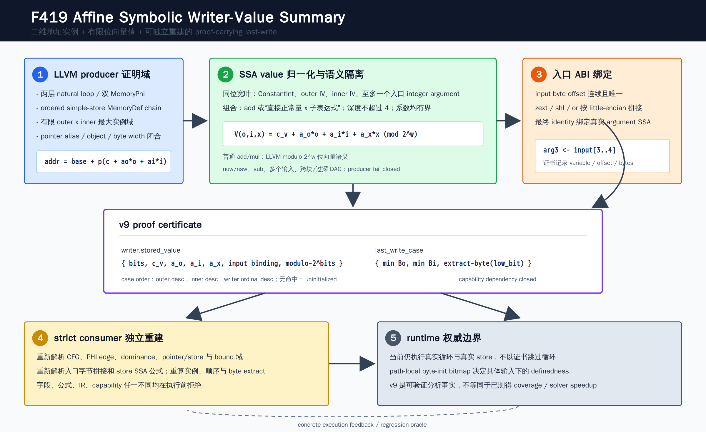

# F419: Nested-Loop MemoryPhi Affine Symbolic Value Summary

日期：2026-08-17  
状态：实现完成，严格消费者闭合，LLVM 17/18 与完整回归通过  
Schema：`symcc-loop-memoryphi-byte-lane-induction-v9`  
Capability：`bounded-nested-loop-memoryphi-affine-symbolic-value-summary`



## 1. 研究问题

F418 已能证明两层循环中的二维 affine 写地址：

```text
address(o, i) = base + p * (c_a + a_o * o + a_i * i)
```

但其 value summary 仍要求每个 writer 都写入 `ConstantInt`。现实程序常把输入字段、外层归纳
变量和内层归纳变量组合成待写值；地址虽然可精确枚举，最终 byte value 却只能退回普通动态执行。
F419 关闭这一缺口：在不跳过循环、不削弱 initializedness 检查的前提下，为一个有界、可独立
重建的 affine bit-vector 值域生成 proof-carrying last-write certificate。

目标不是宣称一般循环闭式求解，而是回答一个更窄且可验证的问题：对于 F418 已证明的有限二维
writer instance，能否把每个候选最后写者携带的值精确表示为入口输入的 affine 位向量字节表达式，
并由独立消费者从 lowered IR 重新证明？

## 2. 精确语义

对位宽 `b`、outer induction `o`、inner induction `i` 和至多一个入口整数参数 `x`，F419 接受：

```text
V(o, i, x) = c_v + s_o * o + s_i * i + s_x * x  (mod 2^b)
```

其中 `b` 属于 `{8,16,24,32,40,48,56,64}`；所有记录系数为 `[0, INT64_MAX]`，并且
`s_o`、`s_i`、`s_x` 至少一个非零。普通 LLVM `add`/`mul` 按固定位宽模 `2^b` 运算，因而输入
和中间结果溢出不是近似，而是证书语义的一部分。

对 writer instance `(o_k,i_k)`，证书先把 IV 项特化：

```text
C_k = c_v + s_o * o_k + s_i * i_k  (mod 2^b)
V_k(x) = C_k + s_x * x              (mod 2^b)
```

随后按目标端序提取内存 byte：

```text
byte_k,lane(x) = (V_k(x) >> low_bit(lane, endianness)) & 0xff
```

little endian 使用 `low_bit = 8 * lane`；big endian 使用
`low_bit = 8 * (writer_bytes - lane - 1)`。常量 writer 与符号 writer 可以在同一 v9 证书中
混合，常量覆盖用 `{kind: constant-byte}` 表示。

## 3. 执行与证明流程

1. 从 exit load 的真实 MemoryUse 找到 outer MemoryPhi，并复用 F416--F418 的两层 LoopInfo、
   双 recurrence、双 guard、ordered MemoryDef 和对象/alias 证明。
2. 从每个 store 的实际 value operand 向上遍历 definition tree，只接纳同位宽叶和有限语法。
3. 把表达式归一化为 `(c_v,s_o,s_i,s_x,input)`；用 128 位临时算术检查证书系数不会超出
   `INT64_MAX`，实际值运算仍使用 LLVM `APInt(b)` 保持模 `2^b` 语义。
4. 若存在输入参数，记录真实 argument SSA，并计算其 lowering 输入字节 `offset/bytes`。
5. 对 F418 最大 outer/inner 域枚举 writer instances；每个 load lane 按 outer、inner、writer
   ordinal 降序生成 last-write cases。
6. 每个 case 记录双 bound 阈值和 `value_byte_expression`；没有可行 case 仍是 uninitialized，
   绝不隐式补零。
7. strict consumer 不信任证书中的系数、实例、输入绑定或 byte expression，从 lowered CFG、
   store SSA、入口字节拼接和端序重新计算全部字段。
8. 只有字段、实际 IR、capability closure 和 use-point 全部一致，executor 才接受 artifact。
9. 执行期仍运行真实循环与真实 store；path-local byte-init bitmap 继续决定具体输入下 load
   是否完整初始化。

## 4. Producer 支持边界

| 维度 | 接纳条件 | 失败关闭条件 |
| --- | --- | --- |
| 地址 | F418 精确二维 `c+a_o*outer+a_i*inner`，完整有限域和真实 alias map | direct/2D 混合、非 affine、越界、回绕、超预算 |
| 值叶 | 非负 `ConstantInt`、同位宽 outer IV、inner IV、至多一个入口 integer Argument | 多个不同输入、错误位宽、负数或超过 `INT64_MAX` 的字面量 |
| 值节点 | `add`，或一侧为直接正常量的 `mul`；定义在 inner body 且先于 store | `sub/xor/shl`、跨 block、定义在 store 后、递归环、深度大于 4 |
| LLVM flags | 无 `nuw/nsw` 的普通 bit-vector `add/mul` | `nuw/nsw` 可能产生 poison，不能按普通模运算解释 |
| store | 1--8 byte、完整字节宽度 integer | 非整字节整数、pointer/aggregate、宽度不完整 |
| 输入 ABI | 可由 entry input bytes 唯一重建 | byte 缺失/重复、offset 不连续、shift 错误、非 little-endian 拼接 |
| writers | 全部是常量或受支持 affine value，且至少一个符号 writer | 只证明部分 writer、证书与 IR 不一致 |

生产者采用渐进 schema：F416 v6 证明 nested initializedness，F417 v7 加入常量 last-write value，
F418 v8 加入二维地址，F419 v9 加入 affine symbolic value。能力升级不能让一个不完整的值证明
伪装成更强证书。

## 5. 入口 ABI 独立绑定

F419 不只在 JSON 中写一个参数名。producer 记录：

```json
{
  "variable": {"var": "arg3"},
  "offset": 3,
  "bytes": 2
}
```

strict consumer 从 entry block 反向重建：

```text
input(offset+j) -> identity/zext -> shl(8*j) -> or tree -> identity(argument)
```

要求所有 byte offset 连续且唯一、shift 与 byte ordinal 一致、最终 identity 精确绑定证书中的
argument SSA。这样“公式正确但绑定到另一段输入”也会在 executor 创建前拒绝。mutation checker
分别破坏 variable、offset、bytes 和实际 input instruction offset，均应失败关闭。

## 6. Last-write 选择

F419 延续 F418 的具体执行顺序。候选 case 的静态顺序为：

```text
(outer induction desc, inner induction desc, writer ordinal desc)
```

一个 case 仅在以下条件同时成立时激活：

```text
outer_bound >= outer_induction_value + 1
inner_bound >= inner_induction_value + 1
```

消费者选择第一个激活 case。这一排序把“最后执行的外层迭代、最后执行的内层迭代、同一 body
中最后执行的 store”直接编码为 first-match 语义。静态 pair closure 只描述最大证明域；具体输入
的 zero-trip、短 prefix 和 partial multi-byte load 仍由 runtime bitmap 裁决。

## 7. 严格消费者与可信边界

v9 consumer 独立检查：

- schema 字段集合、capability dependency、use-point 和 dangling capability；
- 两层 CFG、PHI edge copy、dominance、双 guard/bound 和 MemoryPhi 方程；
- store ordinal、位宽、pointer expression、对象 owner、alias index/address；
- value definition tree 的 opcode、位置、深度、同位宽和单输入约束；
- entry input byte assembly；
- 最大域 writer instances、pair closure 和 last-write case 顺序；
- 模 `2^b` 特化常量、input scale、端序 `low_bit` 和常量 overlay byte。

证书是可验证分析事实，不是执行捷径。当前 runtime 不使用它跳过循环、预填内存或替换真实 store。
因此 F419 的正确性主张是“v9 artifact 与当前 lowered program 一致”，不是“摘要执行已经替代循环”。

## 8. 实现位置

| 模块 | 实现职责 |
| --- | --- |
| `compiler/ContinuationLowering.cpp` | SSA affine normalizer、input offset、v9/capability、APInt 特化、witness 输出 |
| `util/live_continuation.py` | 独立 IR/ABI/value 重建、实例与 byte expression 复算、执行前拒绝 |
| `util/check_live_continuation_lowering.py` | v9 期望开关和同步/异步 mutation battery |
| `test/live_nested_loop_memoryphi_affine_symbolic_value*.ll` | i16/i32/i64、纯 IV、输入、大小端、unsupported source shape |
| `benchmark/check_nested_loop_memoryphi_affine_symbolic_value_oracles.py` | 有限参考语义与 concrete-vs-summary oracle |
| `benchmark/generate_nested_loop_memoryphi_affine_symbolic_value_fixture.py` | 参数化真实 LLVM fixture 生成器 |
| `benchmark/benchmark_nested_loop_memoryphi_affine_symbolic_value.py` | 证书基数、reference validation 与 selection 成本 |
| `test/test_nested_loop_memoryphi_affine_symbolic_value.py` | 公式、端序、溢出、mutation、oracle 与 generator 单元测试 |

## 9. 测试与结果

### 9.1 LLVM 双版本

| 范围 | LLVM 17 | LLVM 18 | 覆盖内容 |
| --- | ---: | ---: | --- |
| F419 focused | 3/3 | 3/3 | 默认/大端/fallback，主 fixture 共 16 条 RUN |
| F416--F419 related | 9/9 | 9/9 | nested composition、常量值、二维地址、符号值 |
| LLVM 17 完整门禁 | 292 passed + 2 unsupported | 未作为本次完整门禁 | 294 discovered，8 workers，282.09 s |

focused positive 路径覆盖：

- i16 混合 affine symbolic writer 与 i8 constant overlay；
- i32、i64 byte-complete store；
- `input_scale=0` 的纯 outer/inner IV 公式；
- 真实 big-endian module；
- 模溢出输入和短 outer/inner prefix；
- v9 schema/capability、字段、IR、输入 ABI 与 witness mutation。

fallback 覆盖 `nuw` value、`sub`、多个输入，以及 F418 历史负例中的 `xor(input,1)`。首次关联
回归发现旧 F418 fixture 仍把“直接入口参数”视为必须拒绝；该形态已被 F419 有意支持，因此旧
负例改为仍超出 affine 语法的 `xor`。修订后 LLVM 17/18 related 均为 9/9。初次失败和原因保留在
本报告，避免把能力演进误记为实现回归。

### 9.2 Python 完整门禁

```text
1097 passed + 250 subtests passed
0 failed / skipped / xfailed / xpassed / deselected
node-ID manifest: 1097 expected == 1097 observed
manifest SHA-256: 0879d6e20ef492b553b2929a587f7bf3d9af9c684a45196686a65d86f51fe07d
time: 151.79 s
```

F419 targeted 为 6/6；F416--F419 related 为 21/21。

### 9.3 独立有限 oracle

| 指标 | 结果 |
| --- | ---: |
| 枚举配置 | 1,152 |
| 接纳完整 v9 summary | 6 |
| 拒绝 unsupported/partial | 1,146 |
| concrete vs summary load-vector 等价 | 384 |
| 已定义 value-byte 等价 | 1,392 |
| 完整 loads | 696 |
| uninitialized/partial loads | 2,504 |
| structured mutations rejected | 18/18 |

oracle 同时覆盖 little/big endian，输入 `{0,1,0x7fff,0xffff}` 和模溢出。两次独立输出逐字节
一致，SHA-256 均为：

```text
fae5d9ccaaa58ed3735bfce1ca83885cb6f4d3b67087e0e3b636e196097dfa04
```

### 9.4 机制基准

冻结证书包含 2 个 writer value records、24 个 writer instances、46 个 byte-lane witnesses、
69 个 last-write cases 和 46 个 symbolic byte expressions，每 lane 最多 2 个 case。9 轮、每轮
500 次的 Python reference benchmark 得到：

| 指标 | 最小 | 中位 | 最大 |
| --- | ---: | ---: | ---: |
| validation batch / 500 | 21,281,692 ns | 21,703,176 ns | 24,261,580 ns |
| selection batch / 500 | 5,408,827 ns | 5,431,741 ns | 6,721,082 ns |
| 单 certificate validation 中位 |  | 43,406 ns |  |
| 单 query selection 中位 |  | 10,863 ns |  |

这些数字只测 Python 参考重建和 byte-expression selection，不是 LLVM lowering latency、executor
throughput、SMT 时间、fuzzing coverage、漏洞发现数量或端到端加速。公共效果结论需要独立、重复、
交错的基线/消融 campaign，F419 当前只封存机制正确性与参考成本。

## 10. 与研究前沿的关系

- LLVM ScalarEvolution 的 `SCEVAddRecExpr` 为 affine recurrence 提供通用表示；F419 没有声称完整
  SCEV 支持，而是对真实 lowered SSA 中一个窄 grammar 做双端可重建证明。
- Automatic Partial Loop Summarization 研究说明可用输入和内存上的符号关系构造部分循环摘要；
  F419 将这一思想收窄为有限两层、byte-lane、last-write 的 proof-carrying artifact。
- LoopSCC 强调从内到外组合循环摘要；F416--F419 延续这一方向，但仍不是一般 LoopSCC 复现。
- 2025 年 multi-abstraction verified summaries 强调摘要与验证边界分离；F419 的 producer/strict
  consumer 分离及 mutation rejection 与这一可信计算基结构一致。

F419 的项目创新点不在于发明 affine arithmetic，而在于把“二维地址实例 + 模位向量 writer value
以及入口 ABI + target-endian byte extraction + last-write order”组合为可独立重建、能力闭合、失败
关闭的 artifact，并保持 runtime bitmap 权威。这比单纯在 producer 中识别表达式更接近可审计的
符号执行基础设施。

## 11. 未覆盖范围

- 负系数、减法、piecewise affine、select/icmp、多个输入变量；
- 一般 SCEV/Polly/ISL、多面体参数域、符号 bound；
- nested conditional 或 multi-latch value effect；
- pointer union、多对象、跨过程循环 value summary；
- floating point、vector、aggregate、pointer value；
- 用证书跳过循环或直接生成 memory transformer；
- 公开 benchmark 上的 coverage、solver speed、bug yield 或端到端提升。

后续最合理的切片不是直接放宽所有表达式，而是先加入带 guard 的 piecewise affine value summary，
同时保持 case budget、guard exclusivity 和严格消费者重建；再研究多输入线性形式和可验证的 loop
memory transformer。每次扩展都必须保留旧 schema、失败关闭路径、独立 oracle 和完整回归。

## 12. 参考资料

1. LLVM, [Scalar Evolution Expressions](https://llvm.org/doxygen/classllvm_1_1SCEVAddRecExpr.html).
2. LLVM, [Language Reference Manual](https://llvm.org/docs/LangRef.html).
3. LLVM, [Undefined Behavior Manual](https://llvm.org/docs/UndefinedBehavior.html).
4. Microsoft Research, [Automatic Partial Loop Summarization](https://www.microsoft.com/en-us/research/wp-content/uploads/2016/02/paper-63.pdf).
5. [LoopSCC: Loop Summary Generation with State Consistency Checks](https://arxiv.org/abs/2411.02863).
6. [Verified Multi-Abstraction Summaries](https://arxiv.org/abs/2506.09550).

完整原始结果见
[`f419-nested-loop-memoryphi-affine-symbolic-value-2026-08-17`](../evidence/f419-nested-loop-memoryphi-affine-symbolic-value-2026-08-17/)。
