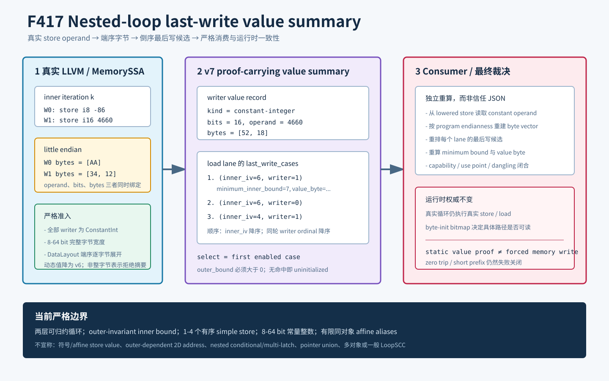

# F417：Nested-Loop MemoryPhi Last-Write Value Summary

> 日期：2026-08-16  
> 定位：在 F416 initializedness composition 上增加可验证的 constant-byte value / last-write 层  
> 等级：I/T/E-mechanism（真实 LLVM producer、严格 consumer、LLVM 17/18、独立有限域 oracle 与机制基准）

## 1. 研究问题

F416 已能证明两层循环最终覆盖哪些 byte lane，并保留所有潜在 writer provenance，但它有意不回答
“load 最终读取哪个 writer 的哪个值”。对重叠 store，initializedness 使用集合并即可，而值语义必须同时
考虑：

1. inner induction 的时间顺序；
2. 同一 inner iteration 内的 store ordinal；
3. 实际 inner bound 是否使候选 writer 执行；
4. outer loop 是否至少执行一次；
5. 多字节整数按目标 `DataLayout` 的端序如何映射到 memory lane。

F417 将上述关系做成新的 v7 proof-carrying transcript。它不把静态摘要写入运行时内存，而是提供一个
可独立重算的最后写者和值来源证明，为后续 loop-value substitution、符号值摘要和摘要执行提供稳定接口。



## 2. SOTA 关系与准确定位

- [LLVM MemorySSA](https://llvm.org/docs/MemorySSA.html) 提供有序 `MemoryDef` 链和 join 处的
  `MemoryPhi`；F417 以真实 defining access 与 block incoming 为 writer 身份基础；
- [LLVM Language Reference](https://llvm.org/docs/LangRef.html) 定义 `store` operand 及 module
  data layout。F417 使用 `DataLayout::isLittleEndian()` 展开整数，不假定执行主机端序；
- [LoopSCC](https://arxiv.org/abs/2411.02863) 面向更一般多分支循环的值级总结和 SCC 组合。F417
  延续 F416 的 inner-to-outer 方向，但仅处理严格两层结构中的常量整数 writer，不是一般 LoopSCC、
  周期振荡分析或任意符号值闭式求解的复现。

本实现的项目创新点是把 value bytes、writer order、trip-bound threshold、MemorySSA identity 和
lowered executable IR 放进同一可重放证书。这里的“先进性”指 proof-carrying 组合和严格失败关闭，
不是未经公共 benchmark 证明的覆盖率或速度领先声明。

## 3. 形式语义

对某个 load address `a` 的 lane `l`，F416 给出潜在来源：

\[
A_{a,l}=\{(k,q,p,b)\},
\]

其中 `k` 是 inner induction value，`q` 是同一 body 中的 writer ordinal，`p` 是 writer address，
`b` 是 writer lane。F417 将候选按下式全序排列：

\[
(k_1,q_1) \succ (k_2,q_2)
\iff k_1>k_2 \lor (k_1=k_2 \land q_1>q_2).
\]

每个 case 携带 `minimum_inner_bound=k+1`。给定实际 outer/inner bound `B_o,B_i`，lane 值为：

\[
V(a,l)=
\begin{cases}
byte(W_q,b), & B_o>0\ \land\ c=first\{c\in A_{a,l}:B_i\ge k_c+1\};\\
\bot, & \text{otherwise}.
\end{cases}
\]

`\bot` 表示未初始化，不是数值 0。inner bound 对 outer invariant，因此每个 outer round 重放同一
inner effect；常量 writer 的最后一轮结果与前轮相同。若将来允许 value 依赖 outer induction，这个
简化就不再成立，必须使用二维 summary。

对宽 `w` 的常量 APInt `x`，memory offset `j` 的字节为：

\[
byte(x,j)=
\begin{cases}
(x \gg 8j)\ \&\ 255, & little;\\
(x \gg 8(w-1-j))\ \&\ 255, & big.
\end{cases}
\]

例如 `i16 4660 = 0x1234` 在 little endian 是 `[0x34,0x12]`，在 big endian 是
`[0x12,0x34]`。

## 4. 严格支持域与回退

F417 继承 F416 的全部支持域：精确两层可归约自然循环、每层一个 latch、两组 seed-0/positive-step/
`ult` recurrence、outer-invariant inner bound、两个精确 MemoryPhi、同 inner body 的 1--4 个有序
simple store、同一有限 stack/ordinary-heap object、正 affine address、完整 aliases/no-wrap，以及
2,048 load lanes 和 8,192 witness cases 上限。

新增条件是每个 writer 的 value operand 必须是 `ConstantInt`，并且整数是 8--64 bit 的完整字节
宽度。只有全部 writer 都满足时才输出 v7 和新 capability。任何 writer 为参数、inner/outer
induction、load、select、PHI 或其他动态表达式时：

- 不伪造 value summary；
- 保留已证明的 F416 v6 initializedness summary；
- 不声明 F417 capability；
- 真实循环仍可按现有 continuation 语义执行。

这种“能力降级而非整体拒绝”避免值层尚不支持的表达式破坏 initializedness 层已有覆盖面。

非整字节整数（如 `i1`）是另一类边界：LLVM store size 包含的填充位不在当前逐字节证书语义内，
producer 因而不生成 F416/F417 摘要，严格 lowering 对随后无法证明完整初始化的 load 整体拒绝。
这不是动态值的 v6 渐进降级，二者在测试中分别断言。

## 5. Producer 实现

[`ContinuationLowering.cpp`](../../../compiler/ContinuationLowering.cpp) 在 F416 producer 完成真实
LoopInfo/MemorySSA/alias 证明后执行：

1. 对每个已按 MemoryDef 链和 `comesBefore` 排序的 store 读取真实 value operand；
2. 若 operand 为 `ConstantInt`，记录原始 bit width 和与 lowered constant 一致的 signed operand；
3. 确认整数 bit width 恰好等于 store byte width，再按 module DataLayout 展开每个 memory byte；
4. 仅当全部 writer 都具有完整 byte vector 时设置 `nestedValueSummary`；
5. 对每个 load address×lane 复制 F416 provenance candidates，并按 inner induction/ordinal 降序；
6. 为每个 case 写入 `minimum_inner_bound` 和来自对应 writer lane 的 `value_byte`；
7. 输出 `symcc-loop-memoryphi-byte-lane-induction-v7` 及
   `bounded-nested-loop-memoryphi-last-write-value-summary`。

v7 writer 记录的核心形状为：

```json
{
  "ordinal": 1,
  "bytes": 2,
  "stored_value": {
    "kind": "constant-integer",
    "bits": 16,
    "operand": 4660,
    "bytes": [52, 18]
  }
}
```

lane witness 不再是无序可能来源，而是 first-match 决策序列：

```json
{
  "load_address": 64,
  "lane": 0,
  "last_write_cases": [
    {
      "writer": 1,
      "writer_address": 64,
      "writer_lane": 0,
      "inner_induction_value": 0,
      "minimum_inner_bound": 1,
      "value_byte": 52
    },
    {
      "writer": 0,
      "writer_address": 64,
      "writer_lane": 0,
      "inner_induction_value": 0,
      "minimum_inner_bound": 1,
      "value_byte": 170
    }
  ]
}
```

同轮 ordinal 1 在 ordinal 0 之后执行，因此排在前面。

## 6. Strict Consumer

[`live_continuation.py`](../../../util/live_continuation.py) 不接受 producer 的值字段作为事实，而是：

- 识别 v6/v7 分离 schema，并要求 F417 capability 依赖 F416 capability；
- 继承 F416 对 CFG、四条 PHI edge-copy、双 recurrence/guard、bound dominance、双 MemoryPhi、
  owner、actual pointer、aliases、fixed point 和所有 lane 的重建；
- 从 inner body 的真实 store ordinal 读取 `value={const,bits}`，要求与 `stored_value.operand/bits`
  精确相同；
- 依据 program endianness 独立重算 byte vector，拒绝端序或 byte 内容漂移；
- 从真实 writer address/width/domain 重建每个 lane 的候选，再独立排序、重算 minimum bound 和
  value byte；
- 对所有数值字段显式拒绝 Python `bool`，避免 `True == 1` 绕过结构比较；
- 闭合 capability dependency、use point、dangling capability 和 transcript 删除。

[`check_live_continuation_lowering.py`](../../../util/check_live_continuation_lowering.py) 新增
`--expect-nested-loop-memoryphi-last-write-value-summary`。除 F416 通用破坏外，它还修改 value
semantics、endianness、case order/predicate、outer activation、stored kind/bits/operand/bytes、
actual store operand、case minimum/value/type/order和完整 transcript，全部必须在 executor create
之前失败关闭。

## 7. Runtime 关系

F417 当前没有跳过循环或直接用摘要替换 load。真实 continuation 仍逐轮执行真实 store，memory
page 和 symbolic bytes 由现有 runtime 更新；path-local byte-init bitmap 继续决定 load 在该具体
checkpoint 是否可读。因此：

- `outer_count=0` 时即使静态证书存在，load 仍不可读；
- `inner_count` 未达到某 case 的 minimum 时，该 case 不成立；
- 部分 lane 已写、部分未写的 multi-byte load 仍失败关闭；
- v7 是可验证的值来源证明，不是无条件 memory initialization，也不是当前性能快速路径。

该边界很重要：证书扩大的是可组合语义信息，而实验中的 executor 路径数和求解成本仍来自真实循环。

## 8. 测试与实验

### 8.1 真实 LLVM 测试

[`live_nested_loop_memoryphi_last_write_value.ll`](../../../test/live_nested_loop_memoryphi_last_write_value.ll)
与
[`live_nested_loop_memoryphi_last_write_value_big_endian.ll`](../../../test/live_nested_loop_memoryphi_last_write_value_big_endian.ll)
共包含 15 条 RUN：

- `i8 -86` 后接 `i16 4660` 的同轮覆盖，验证 ordinal-last-write；
- inner step 2 下跨 iteration 的 `i16` load，验证 lane 可来自不同 iteration；
- `i8 -1`，验证 signed operand 到 byte `255`；
- 动态 `trunc(inner_iv)` store，验证只回退 v6 且拒绝 F417 capability；
- `i1 true` store，验证非整字节表示不进入摘要且 lowering 失败关闭；
- `target datalayout = "E-p:64:64"` 的真实大端 LLVM 模块，验证 producer/consumer 端序闭合；
- 64-byte、writer widths `[1,2,4,8]`、15 个 stored bytes、456 witnesses 的生成式边界；
- v7 专属实际 artifact mutation。

LLVM 18 focused 为 2/2；LLVM 17 focused 为 2/2。F411--F417 关联 LLVM 在两版本各 8/8，关联
Python 为 35/35。完整 Python 身份门禁为 1,086 passed 加 250 subtests，0 skip/fail，node-ID
digest 为 `80deaadf1df782412b27b1a9c89cac56f15e512c440aee1614c4b1765b06bfc4`；
完整 LLVM 17 为 284 passed、2 个既有 unsupported、0 failed。

### 8.2 独立有限域 Oracle

[`check_nested_loop_memoryphi_value_summary_oracles.py`](../../../benchmark/check_nested_loop_memoryphi_value_summary_oracles.py)
不调用 production producer/consumer。它分别执行真实 nested loop byte writes 与 v7 first-match
summary，并对 little/big endian、不同 object/load/step/writer shape、zero trip 和短 prefix 做等价比较：

| 指标 | 结果 |
| --- | ---: |
| 总组合 | 3,456 |
| v7 接纳 | 496 |
| unsupported / partial 拒绝 | 2,960 |
| runtime load-vector 等价 | 16,416 |
| 已定义 value-byte 等价 | 62,112 |
| 完整 load | 43,212 |
| uninitialized / partial load | 57,572 |
| 证书内 last-write cases | 5,520 |
| reference mutations | 18 / 18 拒绝 |

守恒关系 `3,456 = 496 + 2,960` 成立。oracle 连续运行两次输出 byte-identical，SHA-256 为
`2c77fa549fae8e37202c97250c305e793f2b6881bd35d08f3a10b5b8409687a9`。

### 8.3 机制基准

[`benchmark_nested_loop_memoryphi_value_summary.py`](../../../benchmark/benchmark_nested_loop_memoryphi_value_summary.py)
使用 64-byte object、inner step 8、writer widths `[1,2,4,8]`、load 8、57 aliases、11 轮×1,000：

| 指标 | 结果 |
| --- | ---: |
| writer value records | 4 |
| stored value bytes | 15 |
| byte-lane witnesses | 456 |
| last-write cases | 855 |
| maximum cases / lane | 4 |
| validation batch min/median/max | 357,935,052 / 360,090,816 / 375,363,527 ns |
| median validation | 360,090 ns/certificate |
| selection batch min/median/max | 96,619,616 / 97,304,187 / 98,167,631 ns |
| median first-match selection | 97,304 ns/query |

这些是 Python reference validator 和 reference first-match 的机制成本，不是 LLVM producer latency、
executor throughput、SMT time、fuzzing coverage、bug yield 或端到端 speedup。

## 9. Review 结论

1. **值与地址身份分离**：writer value 只能从同一个已绑定 store operand 取得，不能由 witness 数字
   反推；
2. **端序闭合**：producer 和 consumer 分别按 DataLayout/program endianness 重算，oracle 同时覆盖
   little/big；
3. **最后写顺序闭合**：跨 iteration 先比较 induction，同 iteration 比较真实 ordinal；
4. **trip threshold 闭合**：case 用 `k+1` 表示 `ult` loop 中 induction `k` 的最小 exclusive bound；
5. **zero-trip 闭合**：outer positive 是独立激活条件，不能被 inner case 替代；
6. **渐进回退**：动态 writer 不产生半可信 v7，而是保留完整 v6；
7. **表示边界**：非整字节 integer store 不臆测 padding bits，而是在 producer 失败关闭；
8. **声明边界**：当前 runtime 不消费摘要做 loop skipping，因此不报告未经测量的提速。

完整 LLVM 17 首次与完整 Python 门禁并发运行时，既有 `poly_exact_widening_renaming.c` 在约
500 ms 预算处返回 unknown，形成 1 个失败；该用例随后隔离运行通过，F417 定向集通过，最后在无
并发负载下重跑完整 LLVM 17 得到 284 passed、2 unsupported、0 failed。证据包保留首次失败的
审计记录、隔离复测和最终独占门禁；首次原始日志因同一路径重跑被覆盖，这一缺失也在审计记录中
明确披露，不能把隔离通过倒推为首次运行通过。

## 10. 未完成边界与下一顺序

F417 尚未覆盖：

1. constant 之外的 affine/symbolic store value；
2. address 同时依赖 outer/inner induction 的二维 affine summary；
3. nested conditional 或 multi-latch inner effect；
4. pointer union、多对象和 heap generation；
5. interprocedural nested loops 与一般 SCC；
6. 经独立等价验证的 runtime loop-summary execution fast path。

下一切片优先处理 outer-dependent 2D affine address/value 域；其后再扩展 nested conditional/
multi-latch 和 pointer-union/multi-object。
