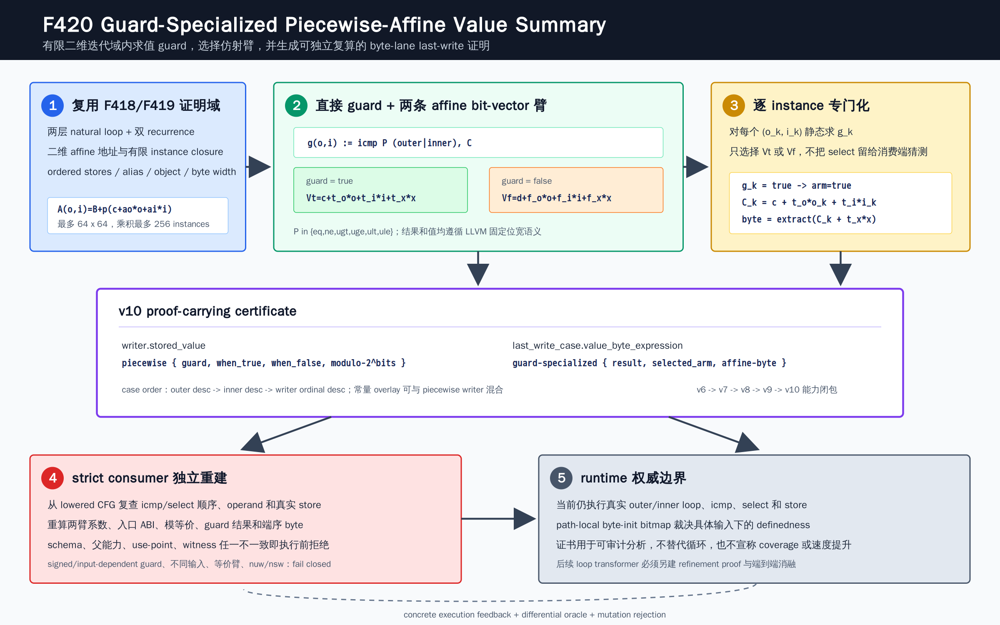

# F420: Nested-Loop MemoryPhi Guard-Specialized Piecewise-Affine Value Summary

日期：2026-08-17  
状态：实现完成，producer/strict consumer 闭合，双 LLVM 关联回归与完整门禁通过  
Schema：`symcc-loop-memoryphi-byte-lane-induction-v10`  
Capability：`bounded-nested-loop-memoryphi-piecewise-affine-value-summary`



## 1. 研究问题

F419 能证明两层循环 writer 的单一 affine bit-vector 值：

```text
V(o,i,x) = c + s_o*o + s_i*i + s_x*x  (mod 2^b)
```

但真实循环常用 `select(icmp(...), value_true, value_false)` 在同一个写点产生分段值。地址、迭代域
和 last-write 顺序均可精确证明时，仅因值由一个简单 induction guard 决定而完全退回动态值，会丢失
可审计的 byte-value 关系。F420 在不展开一般分支树、不跳过循环的条件下，加入一个有界的
guard-specialized piecewise-affine summary。

核心问题是：对 F418 已封闭的每个有限 writer instance `(o_k,i_k)`，能否静态求出直接 guard 的
真假，选择唯一仿射臂，并让独立 consumer 从 lowered IR 重新证明同一个选择和同一个目标端序字节？

## 2. 精确语义

F420 接纳一个位于 inner body、先于 store 的直接整数 `select`：

```text
g(o,i) = icmp P induction, C
V(o,i,x) = select(g(o,i), V_true(o,i,x), V_false(o,i,x))
```

其中：

- `P` 仅为 `eq/ne/ugt/uge/ult/ule`；常量可位于比较左右任一侧；
- `induction` 精确绑定 outer IV 或 inner IV，`C` 是同位宽非负常量且不超过 `INT64_MAX`；
- 两臂均为 byte-complete `8..64` 位 affine bit-vector；常量函数也是 affine 臂；
- 两臂合计至多绑定一个入口整数参数，普通 `add/mul` 按模 `2^b` 解释；
- 两臂在模 `2^b` 归一化后必须语义不同。

对静态 instance `(o_k,i_k)`：

```text
g_k = eval_unsigned(P, o_k or i_k, C)
arm_k = true if g_k else false
C_k = arm.constant + arm.outer_scale*o_k + arm.inner_scale*i_k  (mod 2^b)
V_k(x) = C_k + arm.input_scale*x                                (mod 2^b)
```

随后按目标端序提取 byte。v10 witness 不保留一个待运行时猜测的 `select`，而是显式记录
`guard_result`、`selected_arm` 和所选臂的 `extract-affine-bitvector-byte`。

## 3. 为什么采用 guard 专门化

F418 的证明域已经有限枚举 `(outer,inner)`，因此 guard 只依赖 IV 和常量时，其值在每个 instance
上是确定的。先求 guard 再选择臂有三个工程优势：

1. witness 是单值 byte expression，仍可复用 F417--F419 的 descending last-write first-match；
2. consumer 可从实际 `icmp/select` 和 instance 重新计算，而不必信任 producer 的路径条件；
3. 不把一般符号 ITE 引入 executor，也不增加求解器分支或路径状态。

该设计刻意拒绝 input-dependent guard。否则同一静态 instance 的臂选择仍依赖输入，当前
`minimum_outer_bound/minimum_inner_bound` 证书无法独立表达完整激活条件。

## 4. Producer 执行流程

1. 复用 F416--F418 的两层 LoopInfo、双 MemoryPhi、双 recurrence、双 loop guard、对象、alias、
   ordered MemoryDef 和有限二维地址实例证明。
2. 对非 ConstantInt store value 先尝试 F419 单仿射归一化；失败后才尝试 F420 direct select。
3. 要求 select 与 condition `icmp` 都在 inner body，`icmp` 先于 select，select 先于 store。
4. 验证 predicate、IV/常量 operand 方向和位宽；拒绝 signed 或 input-dependent guard。
5. 分别用 F419 grammar 归一化 true/false operand，检查深度、opcode、poison flags 和入口参数。
6. 用 `APInt(b)` 比较两臂的常量及三个 scale，拒绝模 `2^b` 等价臂。
7. 对每个二维 writer instance 用原 predicate 和 operand 顺序求 `g_k`，选择一臂并特化 IV 项。
8. 按 DataLayout 生成 byte expression，与常量 overlay 一起按真实 writer ordinal 构造 last-write cases。
9. 只要任一 writer 无完整值证明，就不产生 v10；不允许“部分 writer 有证书”的能力升级。

## 5. Schema 与能力闭包

v10 writer 核心字段：

```json
{
  "kind": "piecewise-affine-bitvector",
  "bits": 16,
  "guard": {
    "predicate": "ult",
    "induction": "inner",
    "constant_on_left": false,
    "constant": 2,
    "bits": 16
  },
  "when_true": {"kind": "affine-bitvector-arm", "semantics": "modulo-2^bits"},
  "when_false": {"kind": "affine-bitvector-arm", "semantics": "modulo-2^bits"},
  "semantics": "guard-specialized-modulo-2^bits"
}
```

每个符号 byte witness 为：

```json
{
  "kind": "guard-specialized-byte",
  "guard_result": true,
  "selected_arm": "true",
  "value": {
    "kind": "extract-affine-bitvector-byte",
    "bits": 16,
    "input_scale": 3,
    "constant": 17,
    "low_bit": 8
  }
}
```

能力依赖严格为：

```text
base loop byte-lane
  -> nested composition v6
  -> last-write value v7
  -> two-dimensional address v8
  -> affine symbolic value v9
  -> piecewise affine value v10
```

consumer 同时检查缺失父能力、缺失 v10 能力、没有 v10 use-point，以及 dangling v10 capability。
纯 v9 证书即使篡改 schema、value semantics 并补上 capability，也会因“没有真实 piecewise writer”
而失败关闭。

## 6. Strict consumer 的独立重建

consumer 不信任 producer 记录的 guard、臂系数或 witness：

- 从 store operand 找唯一 select definition，复核所在 block 与 instruction order；
- 从 select condition 找唯一 icmp definition，复核 predicate 和实际左右 operand；
- 将 metadata 的 `induction/constant_on_left/constant/bits` 与实际 IR 逐字段匹配；
- 从 true/false operand 独立恢复 affine tuple 和入口 input-byte assembly；
- 检查两臂最多共享一个入口参数，并按位宽复核模等价；
- 对所有 `(o_k,i_k)` 独立求 guard，复算 selected arm、APInt 特化常量和 endian `low_bit`；
- 复算 instance、pair fixed point、descending case order 和完整 witness 数组；
- 任何字段、真实 IR、能力或 use-point 不一致均在 `executor.create()` 前拒绝。

checker 的主动篡改覆盖 schema、父能力、v10 capability、value-semantics kind、guard predicate/IV/
constant/order、两臂 scale 与 input、witness result/selected arm/constant、实际 select 臂交换、实际 icmp
opcode 和 transcript 删除。

## 7. 支持边界与失败关闭

| 维度 | 接纳 | 拒绝 |
| --- | --- | --- |
| guard | direct scalar `icmp`，`eq/ne/ugt/uge/ult/ule`，outer/inner IV 与常量 | signed predicate、输入或计算表达式 guard、vector/pointer compare |
| select | inner body 中 direct select，先于同 block store | branch tree、nested select、跨 block、select 在 store 后 |
| affine arms | 同位宽常量/双 IV/至多一个共享入口参数；普通 add、直接正常量 mul；深度不超过 4 | `sub/xor/shl`、不同输入、跨块、过深 DAG |
| poison | 无 `nuw/nsw` 的整数值运算 | 可能产生 poison 的 wrap flags；不把 poison 当模运算 |
| 等价性 | 模 `2^b` 后两臂不同 | 语法不同但位向量等价，如 i8 的 `256*x` 与 `0` |
| store | byte-complete 1--8 byte integer | 非整字节、vector/aggregate/pointer value |
| 地址/顺序 | F418 有限二维实例与 ordered writer chain | 回绕、越界、实例超预算、direct/2D writer 混合 |

失败时当前完整 load lowering 会给出既有的“缺少 dominating full-width initializing store”诊断，
不会生成较强但不完整的 v10 证书。

## 8. 运行时权威边界

F420 仍然执行真实 outer loop、inner loop、`icmp`、`select` 和 store。证书当前不用于：

- 跳过循环或替换为 memory transformer；
- 为未初始化字节补零；
- 绕过 path-local byte-init bitmap；
- 推断 fuzzing coverage、solver speed 或 defect yield。

因此本次正确性结论是“producer 的 v10 分析事实可由独立 consumer 从真实 lowered program 完整
重建”，不是“循环摘要执行已带来端到端加速”。这是有意缩小可信边界，而非遗漏。

## 9. 测试与结果

### 9.1 双 LLVM 与运行时

| 范围 | LLVM 17 | LLVM 18 | 内容 |
| --- | ---: | ---: | --- |
| F420 focused | 3/3 | 3/3 | little/big endian、fallback；主 fixture 含六 predicate、反置 outer guard、i64 |
| F416--F420 related | 12/12 | 12/12 | nested composition、value、2D address、affine、piecewise |
| LLVM 17 完整门禁 | 296 passed + 2 existing unsupported | 未作为本次完整门禁 | 298 discovered，8 workers，286.24 s |

真实 executor 用例覆盖 true/false 两臂、短 outer/inner prefix、constant byte overlay 与大小端返回值。
fallback 覆盖 signed guard、input guard、不同入口参数、完全相同臂和模位宽等价臂。

### 9.2 Python 门禁

```text
F420 targeted: 6/6
F416--F420 related: 27/27
full gate: 1103 passed + 250 subtests passed
failed/skipped/xfailed/xpassed/deselected: 0/0/0/0/0
canonical node IDs: 1103 expected == 1103 observed
node-ID SHA-256: 4496a82560d35cb074a23095cca9d6bbaa104805d3d1c0daa88f78435f3fe285
full Python time: 145.28 s
```

### 9.3 独立有限 oracle

| 指标 | 结果 |
| --- | ---: |
| 总配置 | 96 |
| 合法 predicate/order/induction/endian 配置 | 48 |
| unsupported 配置拒绝 | 48 |
| concrete vs summary load-vector 等价 | 6,144 |
| 已定义 value-byte 等价 | 58,752 |
| 完整 loads | 29,376 |
| uninitialized/partial loads | 111,936 |
| structured mutations rejected | 22/22 |

两次独立 oracle 输出逐字节一致，SHA-256 均为：

```text
c6d13d7149e38ad67e09726746f466583735d9870c2d6205010d4c7fe64a631b
```

### 9.4 机制基准

冻结参考证书包含 2 个 writer records、24 个 writer-instance records、46 个 byte-lane witnesses、
69 个 last-write cases 和 46 个 guard-specialized expressions，其中 true/false 臂分别为 11/35，
每 lane 最多 2 个 case。9 轮、每轮 500 次的 Python reference benchmark：

| 指标 | 最小 | 中位 | 最大 |
| --- | ---: | ---: | ---: |
| validation batch / 500 | 24,945,259 ns | 25,489,368 ns | 29,102,586 ns |
| selection batch / 500 | 5,309,652 ns | 5,407,490 ns | 5,938,639 ns |
| 单 certificate validation 中位 |  | 50,978 ns |  |
| 单 query selection 中位 |  | 10,814 ns |  |

这些是 Python 参考证书重建与有限 guard selection 成本，不是 LLVM lowering latency、executor
throughput、coverage、SMT 时间、漏洞数量或端到端 speedup。

## 10. 实现位置

| 模块 | 职责 |
| --- | --- |
| `compiler/ContinuationLowering.cpp` | select/icmp 识别、双臂归一化、模等价、v10/capability 与 witness |
| `util/live_continuation.py` | 实际 IR/ABI/guard/arm/instance/witness 独立重建与失败关闭 |
| `util/check_live_continuation_lowering.py` | v10 期望开关、父能力与 metadata/IR mutation battery |
| `test/live_nested_loop_memoryphi_piecewise_affine_value*.ll` | 六 predicate、反置 operand、i16/i64、大小端、runtime 与 fallback |
| `benchmark/generate_nested_loop_memoryphi_piecewise_affine_value_fixture.py` | 参数化真实 LLVM 生成器 |
| `benchmark/check_nested_loop_memoryphi_piecewise_affine_value_oracles.py` | concrete-vs-summary 独立有限语义 oracle |
| `benchmark/benchmark_nested_loop_memoryphi_piecewise_affine_value.py` | 参考验证/选择成本与证书基数 |
| `test/test_nested_loop_memoryphi_piecewise_affine_value.py` | 六项 property、端序、mutation、generator 与 benchmark 测试 |

## 11. 与研究前沿的关系

- [LLVM Language Reference](https://llvm.org/docs/LangRef.html) 定义了六种 unsigned/equality
  `icmp` 和 `select` 的精确选择语义，也说明 `nuw/nsw` 溢出可产生 poison。F420 因而仅把无
  wrap flags 的普通整数 add/mul 当作模位向量，并保留未选择臂不传播 poison 的边界。
- Godefroid 与 Luchaup 的
  [Automatic Partial Loop Summarization](https://www.microsoft.com/en-us/research/publication/automatic-partial-loop-summarization-in-dynamic-test-generation/)
  说明可从 loop guard 与 induction relation 构造部分摘要。F420 借鉴 guard/induction 关系，但采用
  静态有限域与双端验证，不声称复现 SAGE 的动态猜测/确认算法。
- [LoopSCC](https://arxiv.org/abs/2411.02863) 面向多分支复杂循环的 SCC 组合摘要。F420 只处理一个
  direct select value，既不是一般 multi-branch loop interpretation，也没有复现其 oscillatory interval。
- 2025 年的
  [formally verified multi-abstraction summaries](https://arxiv.org/abs/2506.09550)
  强调摘要生成与形式验证结合。F420 的 producer/strict-consumer 分离与这一可信计算方向一致，
  但本项目当前是 bounded structural reconstruction，不等价于 VST-A/Frama-C 证明。

项目创新点不是发明 piecewise affine arithmetic，而是把“二维地址实例、直接 LLVM guard、两条模
位向量臂、入口 ABI、目标端序 byte extract、last-write 顺序、能力闭包和 runtime initializedness”
组合为一个可复算的 artifact，并用独立 mutation/oracle 证明 fail-closed 边界。

## 12. 未覆盖范围与后续切片

- input-dependent 或复合布尔 guard；signed predicate；branch-based piecewise CFG；
- nested select、多个 guard、共享 DAG、一般 decision tree；
- 多输入线性形式、负系数、sub/shl/xor、一般 SCEV/Polly/ISL 多面体域；
- multi-latch conditional value effect、跨过程或多对象循环摘要；
- 将证书执行为 loop-free memory transformer；
- 公共 benchmark 上的 coverage、solver speed、bug yield 或端到端提升。

下一合理切片是有界多 guard decision DAG，前提是先定义路径互斥/完备证明、case budget、poison
refinement 和 consumer 的独立拓扑重建。若要让摘要真正替代循环，还必须单独实现 concrete-vs-
summary refinement gate、状态转换事务和公开基准消融，不能直接复用 F420 的分析证书作性能声明。
