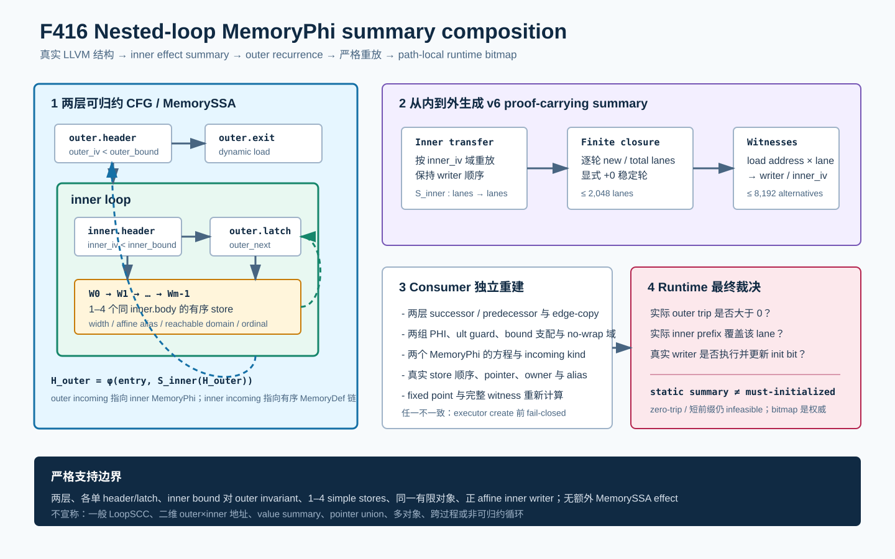

# F416：Nested-Loop MemoryPhi Summary Composition

> 日期：2026-08-16  
> 定位：F411--F415 循环内存证明链之后的首个 inner-to-outer 组合层  
> 等级：I/T/E-mechanism（真实 LLVM producer、严格 consumer、双 LLVM、独立有限域 oracle 与机制实验）

## 1. 研究问题与 SOTA 定位

F411--F415 已分别支持 canonical、strided、conditional、multi-latch 和同 backedge 多 writer 的
MemoryPhi 证明，但都要求目标 load 由一个循环层级解释。嵌套循环的真实 MemorySSA 不是把两层
writer 简单放进一个集合，而是外层 MemoryPhi 的 backedge 引用内层 MemoryPhi 所代表的完整效应：

\[
H_o=\phi(E,S_i(H_o)),\qquad
H_i=\phi(H_o,W_{m-1}(\cdots W_1(W_0(H_i))\cdots)).
\]

如果跳过内层摘要，outer backedge 不能绑定到一个直接 store；如果把 outer/inner 迭代域做笛卡尔
展开，则证书规模与两层 trip count 相乘，并容易把 potential writer 错当成 must initialization。
F416 因此实现一个窄而严格的两层组合：先把 inner loop 的有序 byte-lane effect 闭合成
`S_inner`，再把该摘要作为 outer MemoryPhi 的 backedge transfer。

权威背景与关系：

- [LLVM Loop Terminology](https://llvm.org/docs/LoopTerminology.html) 给出自然循环、header、latch、
  preheader、Loop Simplify Form 与嵌套层级的定义；F416 使用真实 `LoopInfo`，不从块名猜测层级；
- [LLVM MemorySSA](https://llvm.org/docs/MemorySSA.html) 定义 `MemoryUse`、`MemoryDef` 和
  `MemoryPhi`。F416 绑定的是实际 defining access 与 incoming block，不把控制流相邻关系替代
  MemorySSA；
- [LoopSCC（ICSE 2026）](https://conf.researchr.org/details/icse-2026/icse-2026-research-track/127/LoopSCC-Summarizing-Complex-Multi-branch-Nested-Loops-via-Periodic-Oscillation-Inter)
  与其[预印本](https://arxiv.org/abs/2411.02863)研究从内到外总结复杂多分支嵌套循环及周期行为。
  F416 借鉴“inner summary 先于 outer composition”的研究方向，但它是项目特定的、有限
  initializedness 证明，不是 LoopSCC 的复现，也不声称一般值关系、周期振荡或任意 SCC 支持。



## 2. 精确语义与信任边界

令 `I` 为某条具体执行状态中的 initialized-byte 集合。内层第 `k` 次迭代按程序顺序执行
1--4 个 writer：

\[
S_i^k(I)=W_{k,m-1}(\cdots W_{k,1}(W_{k,0}(I))\cdots).
\]

当前证书只总结 initializedness，所以单次内层 effect 对 byte 集合等价于 union；但 writer ordinal
仍保留，以便严格绑定 MemoryDef 顺序和 last-writer provenance。完整 inner summary 是有限可达
归纳域上的单调闭包：

\[
S_i(I)=I\cup\bigcup_{k\in D_i}\bigcup_q bytes(W_{k,q}).
\]

outer loop 每轮重新从 inner seed 0 执行相同 `S_i`。对 initializedness，重复 union 是幂等的，
因此静态证书无需枚举 `D_o × D_i`。这只描述“可能由哪一个 inner iteration/writer 初始化”；实际
`outer_count=0`、`inner_count` 太小或执行尚未覆盖某 lane 时，运行时 path-local bitmap 仍为 0，
load 会变为 infeasible。静态摘要从不直接设置 init bit。

## 3. 严格支持域

F416 的准入域有意窄于一般 nested-loop summarization：

- 恰好两层自然循环；outer 无 parent 且恰好一个 direct subloop，inner 无 subloop；
- outer 恰好 5 个逻辑块，inner 恰好 2 个逻辑块；两层各一个 header、preheader、latch、backedge；
- CFG 精确为 `outer.header -> inner.preheader -> inner.header -> inner.body -> inner.header`，
  inner exit 唯一进入 outer latch，outer header 的 false edge 唯一进入目标 load block；
- 两组 scalar PHI 均为 seed 0、`ult` guard 和 1--64 正常量 `add` step；两组 bound 都必须对 outer
  loop invariant，来源为有界整数参数或一次合法 zero extension；
- outer/inner 整个可表示输入域均满足 unsigned no-wrap，inner bound 的最大值足以覆盖每个 witness
  所需的 exclusive induction value；
- outer MemoryPhi 的 preheader incoming 必须为 live-on-entry，backedge incoming 必须是 inner
  MemoryPhi；inner MemoryPhi 的 preheader incoming 必须是 outer MemoryPhi，backedge 是同一
  inner body 内 1--4 个 simple store 的有序 MemoryDef 链；
- 每个 writer 宽 1--8 byte、正 affine scale、`width <= inner_step*scale`，绑定同一有限 stack/
  ordinary-heap object、完整 alias 域与 recurrence-reachable 子域；
- outer loop 内不得出现未转录的 MemoryUse、MemoryDef、额外 MemoryPhi、call、alloca 或 PHI；
- load alias×lane 不超过 2,048，全部 witness alternatives 不超过 8,192。

当前 C++ 类型仍复用 F415 的 writer sequence 容器，但 v6 不依赖 F414 multi-latch capability：这里
只有一个 outer latch 和一个 inner latch。它声明独立能力，避免把“两个循环层级”错误标成“同一
循环的多 backedge”。

## 4. Producer 执行流程

[`ContinuationLowering.cpp`](../../../compiler/ContinuationLowering.cpp) 中的生产流程为：

1. 从 exit dynamic load 的真实 `MemoryUse` 取得 defining outer `MemoryPhi`；
2. 以 `LoopInfo` 取得 outer/inner 层级，验证 parent/subloop、block count、single backedge 和唯一
   preheader/latch/exit；
3. 从真实 branch successor 验证两层 CFG 次序，确认 inner exit 就是 outer latch；
4. 从两条 `ult` guard 恢复 outer/inner PHI、seed、next、step 和 bound，并验证 outer invariance；
5. 验证 outer MemoryPhi 为 `phi(liveOnEntry, innerPhi)`，inner MemoryPhi 为
   `phi(outerPhi, orderedDefs)`；
6. 从 inner backedge incoming 逆向遍历 `MemoryDef`，直到同一 inner MemoryPhi；反转后用
   `comesBefore` 复核真实 store 顺序；
7. 枚举 outer loop 全部 MemorySSA access，要求除两个 MemoryPhi 和已记录 stores 外没有其他
   effect；
8. 对每个 writer 恢复 width、affine pointer、完整 aliases、按 inner step 可达的 index/address
   子域、owner 和 store ordinal；
9. 在 union domain 上计算逐轮新增 lane、总 lane 和显式 `+0` stability round；
10. 为每个 load address×lane 生成全部 `(writer,writer_address,writer_lane,inner_iv)` alternatives，
    输出 v6 transcript 和独立 capability。

当任一条件不成立时，该证明路径返回 `nullopt`；lowering 继续尝试已有保守规则，若 load 仍无合法
初始化证明则整个 artifact 以原有诊断失败关闭。

## 5. v6 Proof-Carrying Artifact

新增 capability：

`bounded-nested-loop-memoryphi-summary-composition`

它依赖基础 `bounded-loop-memoryphi-byte-lane-induction`；inner step、scale 或 writer width 广义化时
继续要求 F412 strided capability。代表性结构如下：

```json
{
  "schema": "symcc-loop-memoryphi-byte-lane-induction-v6",
  "memory_phis": {
    "equation": "H_outer=phi(entry,S_inner(H_outer))",
    "outer": {"preheader": "live-on-entry",
              "backedge": "inner-memory-phi-summary"},
    "inner": {"preheader": "outer-memory-phi",
              "backedge": "ordered-writer-memory-def-chain"}
  },
  "summary": {
    "order": "inner-to-outer",
    "input": "outer-memory-phi",
    "output": "inner-memory-phi",
    "writers": [
      {"ordinal": 0, "bytes": 1},
      {"ordinal": 1, "bytes": 2}
    ],
    "fixed_point": {
      "algorithm": "finite-monotone-byte-lane-union",
      "semantics": "inner-to-outer-ordered-writer-summary",
      "stable": true
    }
  }
}
```

实际 artifact 还包含 outer/inner 全部 block 与 edge-copy identity、两组 induction/guard、writer 的
完整 alias/index/reachable/residue 域、load 域、每轮 closure 和完整 witnesses；以上仅是可读节选。

## 6. 严格 Consumer 与 Runtime

[`live_continuation.py`](../../../util/live_continuation.py) 为 v6 使用独立 consumer，而不是把两层
拓扑强塞进 v4/v5 multi-latch validator。它执行：

- 精确 top-level/key set、列表长度、整数非 bool、稳定轮和资源上限校验；
- 从 lowered blocks 重建 successor/predecessor、两层 edge-copy、function dominator、两组 PHI/
  add/ult guard，并要求 bound 定义在 outer header 之前支配且不在 loop 内；
- 绑定两个 MemoryPhi 的 block、equation、preheader/backedge kind；
- 从 inner body 的真实 store 列表按 ordinal 绑定每个 writer，验证 pointer definition 先于 store、
  width、index bits、base、scale、完整 aliases 和 reachable domain；
- 验证目标 load 的真实 `pointer_offset`、正 scale、alias index/domain 和地址公式，拒绝 transcript 与
  executable IR 同步漂移；
- 排除 outer preheader 和 load 前的未转录 memory-defining operation，重新计算 fixed point 和所有
  witness alternatives；
- 闭合 capability dependency、v6 use point 和 dangling capability。

运行时没有新增快速通道。真实 store 仍逐条调用现有 memory write 与 init-marker 更新；load 使用
当前 checkpoint 的 byte-init bitmap。F416 扩大的是可被验证和执行的 LLVM IR 支持域，不是把
静态 may summary 转换成无条件已初始化事实。

## 7. 测试与实验结果

### 7.1 真实 LLVM producer/consumer

[`live_nested_loop_memoryphi_summary.ll`](../../../test/live_nested_loop_memoryphi_summary.ll) 有 14 条
`RUN`，覆盖：

- unit-step、single-writer 的两层正例和真实 symbolic execution；
- inner step 2、`i8 -> i16` 可观察顺序的 two-writer 正例；
- inner bound 依赖 outer induction、额外 inner MemoryUse、5 writers 三类 source negative；
- 生成式 64-byte、inner step 8、writer widths `[1,2,4,8]`、load 8 的容量边界；
- base/strided/nested 专属 checker 联合验证及实际 artifact 破坏。

LLVM 17 与 LLVM 18 focused fixture 均为 1/1；F411--F416 关联 fixture 在两版本各 6/6，关联
Python 为 30/30。完整 Python 身份门禁为 `1081 passed + 250 subtests`，skip、xfail、xpass、
deselection、collection error、missing/unexpected node ID 均为 0；规范 node-ID SHA-256 为
`4fa894f154bbda2c74bc9d122aa6cebb25ba887e30ac0ddb09f5627383f0cd3d`。LLVM 17 全量为
`281 passed + 2 unsupported`、0 failed。

专属 checker 对 singleton artifact 执行 25 类 fail-closed 破坏；在可区分 multiwriter artifact
上再加入 summary writer 与 actual store 顺序交换。覆盖 capability/schema、两层 block/edge、两组
induction/guard、MemoryPhi equation/kind、summary input/output/order、writer 数量/ordinal、实际
alias/next/load pointer、bound dominance、fixed-point 数值类型/内容、witness 和 transcript 删除。

### 7.2 独立有限域 Oracle

oracle 不调用 LLVM producer 或 production consumer。它分别实现 direct nested execution 与
`inner effect -> outer replay`，比较 initialized bitmap 和最后 writer `(outer round, inner round,
writer ordinal)`：

| 指标 | 结果 |
| --- | ---: |
| 总参数组合 | 18,240 |
| v6 接纳 | 670 |
| unsupported / partial 拒绝 | 17,570 |
| byte-lane checks | 68,160 |
| runtime bitmap / composed summary 等价 | 21,480 |
| last-writer provenance 等价单元 | 52,662 |
| 完整 load 接纳 | 24,084 |
| zero-outer / prefix 不足拒绝 | 25,932 |
| reference certificate mutations | 26 / 26 拒绝 |

守恒关系 `18,240 = 670 + 17,570` 成立。load 接纳/拒绝按每次组合中的多个 load offset 计数，
因此其总和不等于按 execution 计数的 21,480。oracle 连续两次输出完全相同，SHA-256 均为
`228f5cb0a98e95f1ef523396ea71455e249368dfce230a6879bf9421138586a9`。

### 7.3 生产容量边界与机制基准

真实生成式边界产物为 v6，包含：

- 2 个 loop levels、2 个 MemoryPhi、4 个 ordered writer records；
- 8 个 inner induction values、32 个 reachable writer instances；
- 57 个 load aliases、456 个 byte-lane witnesses、855 个 alternatives；
- 8 个 growth rounds 加 1 个 stability round。

冻结 Python reference benchmark 使用相同 64-byte shape，11 轮、每轮 1,000 次验证：batch
最小/中位/最大为 `96,371,593 / 97,062,772 / 103,855,714 ns`，中位
`97,062 ns/certificate`。这只量化参考 validator 成本和 artifact 基数，不包含 LLVM 分析时间、
executor throughput、SMT、coverage、bug yield 或端到端 speedup。

## 8. 多轮 Review 与修复

1. **真实形状审查**：先用 LLVM 18 `print<memoryssa>,print<loops>`确认 outer Phi 回边确实引用
   inner Phi，而不是根据预想编码；
2. **层级语义审查**：v6 使用独立 nested capability，不错误依赖 multi-latch/ordered-v5；
3. **producer 审查**：将 load affine scale 从“非零”收紧为“正数”，与 writer/consumer 域一致；
4. **支配审查**：consumer 递归验证两组 bound 来源，并要求每个定义支配 outer header，拒绝把
   load 后定义伪造成 bound；
5. **IR/证书同步审查**：新增真实 load pointer address formula 验证，alias 元数据与 pointer
   definition 同时篡改也不能静默通过；
6. **类型审查**：fixed-point round/domain/final lanes 与 witness 所有整数显式拒绝 Python bool，
   修复 `True == 1` 的结构相等陷阱；
7. **MemorySSA 边界审查**：preheader/load 前未转录 memory-defining op 与 loop 内额外 access 全部
   失败关闭；
8. **可证伪性审查**：source negative、actual artifact mutation、独立 mutation、双 LLVM、完整
   回归和两次 oracle 哈希共同约束结论；
9. **声明审查**：明确区分 SOTA 启发、本项目局部实现、机制成本和未测公共性能。

## 9. 先进性、创新性与挑战性

- **先进性**：把 LoopInfo 层级、双 MemoryPhi 方程、MemoryDef sequence、affine recurrence 和
  proof-carrying byte-lane replay 连成真实 producer/consumer 路径；
- **项目创新**：通过 initializedness union 的幂等性避免 outer×inner 静态展开，同时保留
  writer/inner-iteration provenance，并让 runtime bitmap 裁决具体 trip count；
- **可组合接口**：`S_inner(H_outer)` 为后续 value/last-write summary、二维地址与更一般 SCC
  组合提供明确的输入/输出 memory version；
- **挑战性**：同一 writer identity 必须跨 LLVM nesting、两级 MemorySSA、指令次序、JSON、
  lowered edge-copy、alias recurrence、fixed point 和 witness 八个层次一致；
- **可证伪性**：18,240-case 独立 oracle、21,480 次 bitmap 等价、52,662 个 provenance 单元、
  双 LLVM 与全量门禁比单一正例更能暴露错误组合。

## 10. 未完成边界与后续顺序

F416 尚不支持 store value/last-write expression、inner bound 随 outer induction 变化、二维
`base + outer*extent + inner` 地址、pointer union/multi-object writer、conditional/multi-latch inner
loop、三层以上 nesting、非可归约 SCC、跨过程 loop effect 或动态无界 recurrence。

后续应优先实现 value/last-write summary，因为 v5/v6 已保留 writer ordinal 和 inner iteration；
随后再扩展二维 outer-dependent affine address、nested conditional/multi-latch transfer、有限
pointer-union/multi-object effect，最后研究跨过程与一般 SCC。每一步仍需独立 capability、版本化
artifact、生产 consumer 重建、runtime authority 和公开实验边界，不能从 F416 直接推导一般
LoopSCC 能力或公共 benchmark 提升。
