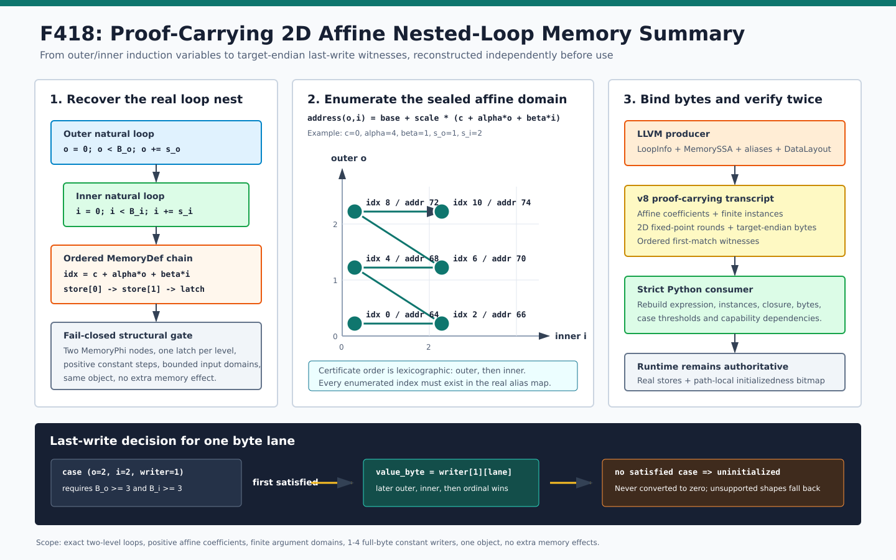

# F418：Nested-Loop MemoryPhi Two-Dimensional Affine Summary

> 日期：2026-08-16  
> 定位：将 F417 仅依赖 inner induction 的 last-write value summary 扩展为 outer/inner 二维 affine 地址域  
> 等级：I/T/E-mechanism（真实 LLVM producer、严格 consumer、LLVM 17/18、独立有限域 oracle、生成式边界与机制基准）

## 1. 研究问题

F416/F417 能总结严格两层循环中的 initializedness 与常量字节最后写者，但 writer address 只能是
`base + scale * inner_iv`。真实数组循环更常见的是二维线性化地址：

\[
index(o,i)=c+\alpha o+\beta i,\qquad
address(o,i)=base+p\cdot index(o,i),
\]

其中 `o/i` 分别是 outer/inner induction，`c` 是常量偏移，`p` 是 GEP scale。此时不同 outer round
写入不同地址，F417 的“outer 只决定是否激活、重复相同 inner effect”假设不再成立。要安全总结它，必须：

1. 从真实 LLVM IR 恢复二维 affine 系数，而不是相信证书中的数字；
2. 同时证明两个 trip-bound 的有限域、induction/index 无回绕与对象内 alias；
3. 用 `(outer, inner, writer ordinal)` 表示实际时间顺序；
4. 对每个 load byte lane 给出同时受 outer/inner bound 约束的 first-match case；
5. 保留 target-endian 常量字节与未初始化回退语义。

F418 为此引入 schema v8 与 capability
`bounded-nested-loop-memoryphi-two-dimensional-affine-summary`。



## 2. SOTA 关系与准确定位

- [LLVM ScalarEvolution](https://llvm.org/doxygen/classllvm_1_1SCEVAddRecExpr.html) 用 `SCEVAddRecExpr`
  表达关于 loop trip count 的 recurrence，并区分 affine/quadratic；LLVM 自身在
  [LoopTermFold](https://www.llvm.org/docs/doxygen/LoopTermFold_8cpp_source.html) 中也显式检查 affine、
  non-zero step 与 no-self-wrap，说明回绕条件不能从“表达式看起来线性”直接推出；
- [LLVM LoopAccessAnalysis](https://llvm.org/docs/doxygen/LoopAccessAnalysis_8h.html) 从 affine AddRec
  恢复常量 pointer stride，并保留是否检查 wrap 的接口。F418 同样把 address stride 与 no-wrap
  作为证书前提，而不是只保存 GEP 文本；
- [Polly](https://polly.llvm.org/publications/grosser-impact-2011.pdf) 的 polyhedral model 以 iteration
  domain、schedule 和 affine memory access 描述 static-control loop nest。F418 借用了“语句实例 =
  迭代向量 + affine access”的建模思想，但只做一个有限、两维、单 body 的精确子域；
- [LoopSCC](https://arxiv.org/abs/2411.02863) 面向多分支循环的 SCC contraction 与递归语义总结；
  [VMCAI 2025 affine disjunctive invariant work](https://conf.researchr.org/details/VMCAI-2025/VMCAI-2025-papers/3/Affine-Disjunctive-Invariant-Generation-with-Farkas-Lemma)
  将 affine invariant 传播扩展到 nested-loop summary。这些工作覆盖更一般的控制/不变量问题；
  F418 的贡献是把有限二维地址实例、MemorySSA writer identity、目标端序值和严格可重建证书闭合。

因此，F418 **不是**完整 ScalarEvolution、Polly/ISL、Farkas invariant generation 或 LoopSCC 的复现，
也不声称处理任意多面体、分段 affine、多分支或无界循环。它是适合当前 continuation memory proof 的
project-specific proof-carrying specialization。

## 3. 形式语义

### 3.1 有限二维实例域

两个循环均为 seed 0、正常量 step 和 unsigned exclusive bound：

\[
D(B_o,B_i)=\{(o,i)\mid o=k s_o < B_o,\ i=m s_i < B_i,\ k,m\in\mathbb{N}\}.
\]

producer 不仅查看某次运行的 `B_o/B_i`，而是从窄整数输入参数得到各自最大值
`M_o=2^{w_o}-1, M_i=2^{w_i}-1`，枚举整个可达上界域：

\[
D_{max}=D(M_o,M_i).
\]

每个 writer 对每个 `(o,i)` 生成实例
`(o,i,index,address)`。只有所有实例均能在真实 alias map 中找到完全相同的 index/address 时才接纳。

### 3.2 最后写者顺序

同一 byte lane 的候选 case 是
`(o,i,q,address,lane,value_byte)`，其中 `q` 为 inner body 内的真实 store ordinal。时间全序为：

\[
(o_1,i_1,q_1)\succ(o_2,i_2,q_2)
\iff o_1>o_2\ \lor
(o_1=o_2\land i_1>i_2)\ \lor
(o_1=o_2\land i_1=i_2\land q_1>q_2).
\]

case `(o,i,q)` 的最小激活条件是：

\[
B_o\ge o+1\quad\land\quad B_i\ge i+1.
\]

`+1` 来自 `ult` 的 exclusive-bound 语义，与 step 是否为 1 无关。按上述全序取第一个同时满足两个
threshold 的 case；不存在则结果为 `\bot`（未初始化），绝不转换为 0。

### 3.3 二维闭包

fixed point domain 是 `D_max` 中实际 writer 实例的 pair union，按 outer 后 inner 的字典序递增。
每一轮把该 pair 的所有 writer byte lane 加入集合：

\[
L_{t+1}=L_t\cup\bigcup_{w\in Writers}bytes(address_w(o_t,i_t),width_w).
\]

最后追加 `stability-check`，要求新增 lane 为 0。闭包证明“最大有限域覆盖哪些地址”，last-write cases
则证明“某个具体 bound 下哪个值胜出”；两者不能互相替代。

## 4. 严格支持域与回退

F418 继承 F416/F417 的结构条件，并新增以下边界：

| 维度 | 接纳条件 |
| --- | --- |
| CFG / MemorySSA | 精确两层 natural loop；每层单 latch；inner preheader/body 与 outer latch 固定；两个真实 MemoryPhi；无额外 memory effect |
| recurrence | 两层 seed 0、`ult`、1--64 正常量 step；bound 来自 integer argument（可有一次 LLVM zext） |
| bound | 原 argument bit width `<64`；每维最多 64 个最大域实例；Cartesian product 最多 256 |
| affine grammar | 仅同 width 的 `ConstantInt`、outer/inner IV、`add`、一侧为直接正 `ConstantInt` 的 `mul`；树深最多 4 |
| coefficient | `c>=0`，`alpha>0`，`beta>0`，均不超过 signed 64-bit；所有最大域 index 不回绕且不超过 `INT64_MAX` |
| pointer / object | 正 `pointer_scale`；同一有限 stack/ordinary-heap object；每个枚举 index 必须存在于真实 alias index/address map |
| writer | inner body 中 1--4 个有序 simple store；全部为 1--8 byte、完整字节宽度 `ConstantInt` |
| overlap | writer width 不超过 `beta * pointer_scale * inner_step`，避免同 writer 相邻 inner 实例自重叠 |
| witness | 所有 load address×lane 均至少有一个来源；总 witness/alternative 继续受全局上限约束 |

以下情况失败关闭：动态 store value、`outer*inner`、subtraction、负/零系数、混合 direct-inner 与 2D
writer、过深表达式、64-bit 无有限最大域的 bound、实例数超限、地址回绕/越界、对象或 alias 不一致、
额外 call/store/MemoryPhi 形状。F418 不伪造部分二维证书；若其他既有摘要无法证明 load 的完整初始化，
lowering 整体拒绝。真实 runtime 仍可在非 continuation 路径按原程序执行。

## 5. LLVM Producer

[`ContinuationLowering.cpp`](../../../compiler/ContinuationLowering.cpp) 的 producer 执行次序为：

1. 复用 F416 对 LoopInfo、CFG、双 recurrence/guard、MemorySSA chain、writer order、load aliases 和
   object identity 的证明；
2. 从 bound 的原始 LLVM argument bit width 计算有限最大值，同时证明 step 不使 induction 域回绕；
3. 对每个 writer 的 GEP dynamic index 做受限递归归一化，得到 `(c,alpha,beta,bits)`；
4. 从 `memoryAliases` 得到真实 `index -> address` map，枚举完整 `D_max`，逐实例查表而非自行假定别名；
5. 按 module `DataLayout` 展开所有 constant writer bytes；
6. 生成 pair-domain closure、每轮新增/累计 lane、最终稳定轮；
7. 为每个 load lane 收集二维来源，按 `(outer,inner,ordinal)` 倒序并写入双 threshold/value byte；
8. 输出 v8 及 F416/F417/F418 capability 依赖闭包。

核心 writer 记录示例：

```json
{
  "ordinal": 0,
  "bytes": 2,
  "pointer_base": 64,
  "pointer_scale": 1,
  "affine_index": {
    "bits": 64,
    "constant": 0,
    "outer_scale": 4,
    "inner_scale": 1,
    "variable": {"var": "v8"}
  },
  "instances": [
    {"outer_induction_value": 0, "inner_induction_value": 0,
     "index_value": 0, "address": 64},
    {"outer_induction_value": 1, "inner_induction_value": 2,
     "index_value": 6, "address": 70}
  ],
  "stored_value": {"kind": "constant-integer", "bits": 16,
                   "operand": 4660, "bytes": [52, 18]}
}
```

review 中修复了一项实际缺陷：v8 writer 原先沿用旧 `isStrided()`，在 `inner_step=1`、单字节写但
`beta>1` 或 `pointer_scale>1` 时可能漏发 strided capability。现在 v8 显式检查
`step/pointer_scale/affine_inner_scale/bytes`，并有 `alpha=1,beta=2` 的隔离生成式测试。

## 6. Strict Consumer

[`live_continuation.py`](../../../util/live_continuation.py) 对 v8 做独立重建：

- 重新验证两层 CFG、PHI edge copies、dominance、guards、MemoryPhi equation 与禁止的 memory effects；
- 从 lowering ABI 的 `input -> narrow -> argument -> zext` 链恢复窄整数 bound 最大值；
- 读取实际 pointer definition、store aliases/index values/min/max，并验证
  `address = pointer_base + pointer_scale * index`；
- 从实际 inner-body definition tree 重新归一化 affine 表达式，只接受与 producer 完全一致的
  literal-positive-constant multiplication grammar；
- 独立枚举最大域实例，检查每个 index/address、实例顺序、每维/乘积 cardinality 和 no-wrap；
- 从真实 store operand 与 program endianness 重算 constant bytes；
- 重建 pair closure、round deltas、最终 lanes、所有 witness、双 threshold、value byte 和倒序；
- 对 numeric 字段拒绝 Python `bool`，并闭合 F418 -> F417 -> F416 -> bounded alias capability 依赖；
- capability 无 transcript、transcript 无 capability、schema downgrade 或实际 IR 被改写均拒绝。

[`check_live_continuation_lowering.py`](../../../util/check_live_continuation_lowering.py) 新增
`--expect-nested-loop-memoryphi-two-dimensional-affine-summary`，并对 capability、schema、value order、
pointer base/scale、三个 affine 系数、四个 instance 字段、pair/round、minimum outer bound、实际 affine
operator、实际 pointer base 和 transcript 删除做 mutation。它还让 F416/F417 通用 mutation 路径识别 v8。

## 7. Runtime 关系

F418 当前是 proof-carrying metadata，不是 loop-skipping fast path。continuation executor 仍执行真实
outer/inner branch、store 和 load：

- checkpoint 的 path-local initializedness bitmap 仍是 load 是否可读的最终裁决者；
- v8 证书不会预填内存，也不会把 `\bot` 改成 0；
- concrete/symbolic bound 仍决定真实执行轮数；
- mutation checker 在 executor create 阶段验证证书，但运行时值来自真实 store；
- 因而当前实验只能证明机制正确性与 reference 成本，不能声称 executor、solver 或 fuzzing 已提速。

## 8. 测试与实验

### 8.1 真实 LLVM 17/18

三个 F418 LLVM 文件共 17 条 RUN：

- default little-endian `3 outer x 2 inner` 实例、`i16 0x1234` 后接 `i8 0xAA`，验证同地址 ordinal
  覆盖、跨实例 byte 拼接、未初始化分支和实际执行值；
- 24-byte 生成式边界：12 pair、两个 writer、完整二维地址域；
- `inner_step=1,beta=2,width=1` 隔离 affine-stride capability；
- 真实 `target datalayout = "E-p:64:64"` 大端模块，`[0xAA,0x34]` load 为 `0xAA34=43572`；
- dynamic `i16` writer 与 `outer*inner` non-affine 下标均不生成 v8 并失败关闭；
- v8 专属 mutation、F416/F417 通用 mutation 与真实 IR mutation。

定向 F418 在 LLVM 18 与 LLVM 17 均为 3/3；F416--F418 关联集在两版本均为 6/6，关联 Python
为 15/15。规范完整 Python 门禁为 1,091 passed 加 250 subtests，且无 skip、xfail、deselection、
collection error 或 node-ID 漂移。LLVM 17 受控 8-worker 完整门禁为 288 passed 加 2 个既有
unsupported。首次 192-worker 运行中，既有 QF_BV campaign 因 conformance artifact 无效失败；该项
隔离复跑 1/1 通过，随后受控完整复跑零失败。初次日志、隔离日志与最终日志均封存，不能把该过程删去
后只报告绿色结果。本节不将机制测试换算为覆盖率或缺陷数量。

### 8.2 独立有限域 oracle

[`check_nested_loop_memoryphi_two_dimensional_affine_oracles.py`](../../../benchmark/check_nested_loop_memoryphi_two_dimensional_affine_oracles.py)
不调用 production producer/consumer，分别执行 nested-loop byte writes 和 v8 first-match：

| 指标 | 结果 |
| --- | ---: |
| 总组合 | 4,608 |
| v8 接纳 | 28 |
| unsupported / partial 拒绝 | 4,580 |
| runtime load-vector 等价 | 608 |
| 已定义 value-byte 等价 | 3,384 |
| 完整 load | 1,692 |
| uninitialized / partial load | 5,252 |
| 证书内 last-write cases | 1,020 |
| reference mutations | 18 / 18 拒绝 |

守恒关系 `4,608 = 28 + 4,580` 成立。oracle 连续两次输出 byte-identical，SHA-256 为
`7be3e10a9aead4949038be68c0bd5a4b82639156fa5c64f55df9494d2d1ddd4e`。

### 8.3 机制基准

[`benchmark_nested_loop_memoryphi_two_dimensional_affine.py`](../../../benchmark/benchmark_nested_loop_memoryphi_two_dimensional_affine.py)
使用 24-byte object、3×4=12 pair、outer scale 8、inner step 2、writer widths `[2,1]`、load 2：

| 指标 | 结果 |
| --- | ---: |
| writer value records | 2 |
| writer instance records | 24 |
| fixed-point pairs | 12 |
| byte-lane witnesses | 46 |
| last-write cases | 69 |
| maximum cases / lane | 2 |
| validation batch min/median/max | 25,153,914 / 26,764,004 / 29,811,254 ns |
| median validation | 53,528 ns/certificate |
| selection batch min/median/max | 6,504,785 / 6,872,545 / 7,042,990 ns |
| median first-match selection | 13,745 ns/query |

这些数值仅是 Python reference reconstruction/selection 的机制成本，不能外推 LLVM producer latency、
executor throughput、SMT time、coverage、bug yield 或端到端 speedup。

## 9. 正确性审计结论

1. **表达式身份闭合**：系数来自实际 definition tree，证书不能自行声明 affine；
2. **最大域闭合**：使用原 argument bit width 枚举所有可达 bound，而不是只验证测试输入；
3. **地址闭合**：每个二维实例必须命中真实 alias map，pointer base/scale 与实际 GEP 同时绑定；
4. **时间顺序闭合**：outer 优先、inner 次之、ordinal 最后，匹配真实嵌套循环执行序；
5. **双 threshold 闭合**：case 必须同时满足 outer/inner exclusive bound；
6. **值与端序闭合**：实际 ConstantInt、store width、目标 DataLayout 和 witness byte 独立重算；
7. **能力闭合**：v8 必须同时声明 base/strided/nested/value/2D capability；漏发 affine stride 已修复；
8. **失败关闭**：动态值、非 affine、混合地址形状、回绕、越界和超预算均不产生半可信证书；
9. **声明边界闭合**：runtime 尚未使用摘要跳过循环，因此不报告未经测量的性能或覆盖提升。

## 10. 未完成边界与下一顺序

F418 之后仍未实现的相邻方向包括：

1. affine/symbolic writer value，而不只是 constant bytes；
2. nested conditional、multi-latch 或多 body statement schedule；
3. 分段 affine、min/max、负 stride、非矩形 iteration domain；
4. pointer union、多对象、heap generation 与跨函数 nested summary；
5. 与 SCEV/Polly/ISL 的一般化接入及 SMT-verified parametric domain；
6. 经独立差分和性能门禁验证的 runtime summary substitution/loop skipping。

按用户指示，本切片完成后暂停后续 SOTA 扩展；上述内容只作为明确研究边界，不在 F418 中提前宣称。
