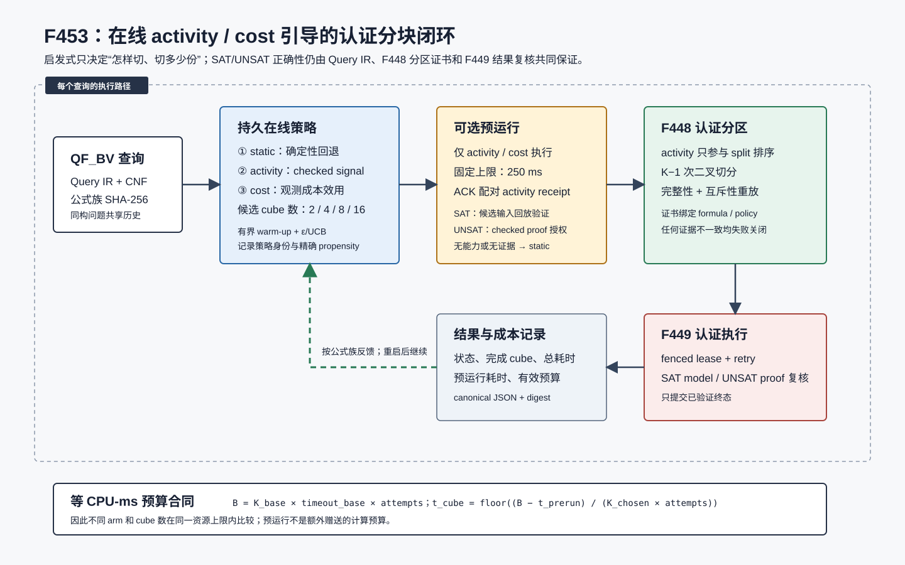

# F453：在线 Activity/Cost 引导的认证 QF_BV 分块

## 1. 研究问题与结论

F448 已能根据 checked proof activity 生成完整、互斥的任意 `K` 路 QF_BV 分区，F449--F451 已能
可靠执行、恢复并复核每个 cube；此前仍缺少一个闭环：系统不会根据同类查询的实际结果判断“是否值得
预运行”“应使用哪种引导信号”“应切成多少份”。固定 `K` 在简单公式上可能放大调度和证明开销，在长尾
公式上又可能暴露不足的并行性。

F453 实现了持久、可回放的 query-family 在线策略，在 `static`、`activity`、`cost` 三个 arm 和一组
候选 cube 数之间进行有界探索。策略只消费经过独立检查的 activity receipt 与已经落盘的执行结果；每次
选择记录策略身份、选择原因和精确 propensity。预运行与不同 cube 数都纳入同一 CPU-ms 上限，避免把
额外计算误认为策略收益。没有 realtime activity 能力、没有可信证据或状态不一致时确定性回退到 static。

结论等级为 **I/T/E-mechanism**：在线闭环、证据消费、并发持久化与预算合同已经实现并通过机制实验；
当前合成矛盾公式上 guided arm 明显慢于 static，因此本文不声称 solver 加速、覆盖率或缺陷发现收益。



## 2. 执行流程

1. Query service 将 Query IR bit-blast 后，以 F437 的 `formula_family_sha256` 计算稳定公式族身份。
2. `OnlineCubingPolicyStore.decide` 在单个 SQLite 事务内读取该公式族的已验证历史与 pending 决策。
3. warm-up 阶段在可用 arm 间做确定性、并发感知的均衡探索；之后使用固定点 reward、epsilon 和 UCB
   不确定性项选择 arm。没有 activity 能力时，可用集合严格缩减为 `static`。
4. `activity` 和 `cost` arm 使用复用的 persistent realtime CaDiCaL backend 做有上限的预运行。系统
   只提取与 checked-import ACK 配对的 clause-activity receipt；F448 会再次重放这些证据。
5. 若预运行返回 SAT，必须由 parent Query IR 验证候选输入；若返回 UNSAT，必须持有授权的 checked
   proof。只有这种已验证终态才能直接结束，否则继续认证分区。
6. F448 根据选择的 `cube_count` 建立完整且互斥的分区证书。activity 只影响 split 排序，不是正确性根。
7. F449 以归一化后的 per-cube timeout 执行所有 leaf。SAT winner 复核 model，UNSAT leaf 复核 proof
   并沿 split tree 聚合。
8. 终态、完成 cube 数、总耗时、预运行耗时和预算字段以 canonical JSON 和 SHA-256 写回同一策略库；
   QueryStore 再独立规范化 decision/outcome 与 formula-family 绑定，并汇总生产遥测。

## 3. 在线选择机制

### 3.1 arm 与 cube 数

| arm | 输入信号 | cube 数选择 | 失败关闭行为 |
| --- | --- | --- | --- |
| `static` | Query IR 与固定基线 | `base_cube_count` | 始终可用的确定性回退 |
| `activity` | ACK 配对、可重放的 checked activity | 当前固定基线 | 无 activity 能力时不可选 |
| `cost` | checked activity + 同公式族已验证执行成本 | 候选集内有界探索，随后按观测效用选择 | 历史不足时继续有界探索 |

默认候选为 `2,4,8,16`，上限为 16 个候选、每个值不超过 4096。arm warm-up、cost 候选 warm-up、
epsilon 探索和 UCB exploitation 都由 policy SHA-256 完整绑定。散列选择只用于可回放的 tie-break 与
探索，不影响求解正确性。

### 3.2 reward、探索与选择偏差

每个 outcome 先经过 schema、decision digest、policy、query、formula family、状态、预算和 reward
重算。有效 reward 是完成度与终态质量的有界整数得分，并按观测时间成本折算；未完成、unknown 或昂贵
结果不会得到与快速 verified terminal 相同的分数。

策略为 arm、cube 候选和联合选择分别保存精确分子/分母。warm-up 会把 pending 决策也计入分配，防止
多个并发请求都看见“零样本”后集中到同一个 arm；每公式族最多 64 个 pending，历史窗口最多 4096 条，
总决策默认不超过一百万条。F453 没有把这些 propensity 夸大为无偏因果估计，它们用于审计在线采样与
后续离线加权实验。

### 3.3 等资源预算

设基线 cube 数为 `K_base`，基线单 cube timeout 为 `T_base`，最大尝试数为 `A`：

```text
B_cpu = K_base × T_base × A
T_effective = floor((B_cpu - T_prerun_charged) / (K_chosen × A))
```

预运行按向上取整的毫秒数扣费。整数除法产生的余数不重新分配，因此
`effective_cpu_budget_ms <= configured_cpu_budget_ms`。这是一项资源上限合同，不表示所有 backend
必然消耗满额 CPU，也不把 wall-clock 与 CPU-time 混为一谈。

## 4. 持久化与可信边界

- SQLite 使用 WAL、`synchronous=FULL`、稳定 no-follow 路径和文件身份检查；数据库元数据精确绑定
  store schema、protocol、policy JSON、policy SHA-256 与路径身份。
- decision/outcome 采用严格字段集合、canonical ASCII JSON、重复成员拒绝和内容摘要。重试必须字节级
  幂等；同一 decision 的冲突 outcome 被拒绝。
- 学习时不信任可变 SQL 索引列，而是重新解析 canonical JSON、重算摘要，并核对 arm、family、reward
  与成本冗余列。任一旧记录损坏都会停止使用该历史，而不是静默训练。
- backend capability、activity receipt 和 proof 都不能自证：F433/F436 checker、F448 verifier、F449
  model/proof replay 与 QueryStore 二次裁决分别承担独立边界。
- 策略决定性能参数，不决定 SAT/UNSAT，也不能绕过完整性、互斥性和结果复核。

## 5. 工程接线

主要实现位于：

- `util/qfbv_online_cubing.py`：策略、持久 ledger、严格 verifier、预算与 QueryStore normalizer；
- `util/qfbv_partition_execution.py`：预运行、F448 partition、F449 execution 与 outcome 回写闭环；
- `util/symcc_query_service.py`：CLI/env 配置、persistent prerun backend 生命周期和服务统计；
- `util/query_store.py`：独立结果规范化与 static/activity/cost、prerun、预算聚合；
- `benchmark/check_qfbv_online_cubing_oracles.py`：三 arm 等轮次、等配置预算机制 oracle；
- `test/test_qfbv_online_cubing.py`：策略、并发、损坏、随机 trace、预算与真实 F448/F449 测试。

生产启用方式：

```bash
python3 util/symcc_query_service.py \
  --qfbv-partition-execution \
  --qfbv-online-cubing \
  --qfbv-online-cubing-store /var/lib/symcc/online-cubing.sqlite3 \
  --qfbv-online-cubing-candidates 2,4,8,16 \
  --qfbv-online-cubing-strategies static,activity,cost
```

在线功能要求 partition execution。`activity,cost` 还要求 persistent realtime stream 的 clause activity
能力；配置了 guided arm 却没有对应 backend 时启动失败关闭。

## 6. 测试设计与审查修复

专项测试覆盖：严格 policy/decision/outcome schema；重启与 availability drift；三 arm warm-up；cost
候选探索与 exploitation；24 个并发决策和同查询幂等；pending 上限；300 步、7 个公式族的随机 trace；
预算、digest、重复 JSON、symlink、metadata、SQL 冗余列篡改；QueryStore 绑定；真实 F448/F449 机制
oracle；query-service 无 activity 回退。

最终门禁结果为专项与 partition integration `37 passed`，耦合回归 `136 passed + 25 subtests`；完整
capability-closed Python gate 为 `1482 passed + 310 subtests`。16 项能力全部存在，nodeid inventory
为 `1482/1482` 精确一致，且 skip、xfail、xpass、deselect、collection error 均为零。

多轮 review 修复了八类问题：

1. 从仅记录 arm propensity 扩展为 arm、cube、联合三组精确概率；
2. 将 pending 纳入 warm-up 计数，消除并发过度探索，并增加每公式族上限；
3. 学习前重放 canonical record，阻止 SQL 冗余列污染 reward；
4. 将 guided prerun 从额外预算改为总预算内扣费；
5. 按 cube 数和 retry 数归一化 timeout，避免大 `K` 获得更多总预算；
6. 复用 persistent prerun backend，并通过 context manager 确保关闭；
7. 分离 arm warm-up 与 cost-candidate warm-up，避免两个探索层错误耦合；
8. 预运行 SAT/UNSAT 只有通过 model/proof 独立验证才允许提前终止。

## 7. 机制实验结果

最终 oracle 对同一公式族的 synthetic contradictory QF_BV 查询执行 15 次，每个 arm 恰好 5 次，
`K_base=4`、`T_base=1000 ms`、`A=2`，配置 CPU 上限均为 `8000 ms`。guided 预运行从该上限扣除。

| arm | 样本 | cube 序列 | checked activity | partition 中位 | execute 中位 | total 中位 |
| --- | ---: | --- | ---: | ---: | ---: | ---: |
| static | 5 | 4,4,4,4,4 | 0 | 0.416 ms | 347.613 ms | **348.016 ms** |
| activity | 5 | 4,4,4,4,4 | 60 | 147.180 ms | 1463.350 ms | **1813.961 ms** |
| cost | 5 | 4,8,16,2,2 | 60 | 141.955 ms | 1377.961 ms | **1742.517 ms** |

结果说明三点：第一，三路选择、checked activity 消费、cost 候选探索和持久反馈形成闭环；第二，cost
在探索 `4/8/16/2` 后下一次选择了观测成本较优的 `2`；第三，该小型矛盾公式不适合 guided cubing，
static 的中位总时间显著更低。系统保留 static fallback 正是为了避免把 SOTA 机制无条件应用到所有查询。

原始结果见 `evidence/f453-online-activity-cost-cubing-2026-08-26/oracle.json`。报告只使用实测中位数，
不将 5 轮合成实验外推为统计显著的公开 benchmark 结论。

## 8. 创新性、局限与下一步

与单次离线调参相比，F453 的工程创新在于把可信 activity、认证 partition、verified outcome、预算和
重启一致性置于一个可审计闭环；与只按 solver activity 切分相比，它显式记录选择概率并让 cost 反馈
改变 cube 数。项目特有的强化是每个启发式信号都保持 proof/model 二次裁决，在线学习不会成为新的
SAT/UNSAT 信任根。

当前局限包括：reward 仍是工程固定点代理；公式族聚合可能掩盖族内难度差异；没有跨主机长时训练；
没有证明 guided arm 在公开 hybrid-fuzzing 目标上提升 coverage AUC。后续 R-track 应预注册公开目标、
多 seed、6h/24h、AFL-only/static/activity/cost 消融，报告 CPU-hours、coverage AUC、time-to-edge、失败率
和置信区间。按实现路线，下一项是 F454 solver-native PalRUP producer。

## 9. 研究依据

- Smart Cubing 提出结合短预运行、solver activity 与 cubing 参数选择来改善并行 SMT 分解，F453 采用
  其“预运行信号 + 配置选择”的研究方向，但没有声称复现论文完整训练器或论文性能数据：
  [Smart Cubing: Improved Parallel SMT Solving for Nonlinear Real Arithmetic](https://arxiv.org/abs/2501.17201)。
- F448 的 checked proof-prefix partitioning：
  [`Proof_Prefix_Guided_Certified_Partitioning_F448_2026-08-25.md`](Proof_Prefix_Guided_Certified_Partitioning_F448_2026-08-25.md)。
- F449 的 proof-aware certified partition execution：
  [`Proof_Aware_Certified_Partition_Execution_F449_2026-08-25.md`](Proof_Aware_Certified_Partition_Execution_F449_2026-08-25.md)。
- F436 的 native checked-clause activity：
  [`Native_Clause_Activity_and_Utility_Feedback_F436_2026-08-18.md`](Native_Clause_Activity_and_Utility_Feedback_F436_2026-08-18.md)。
