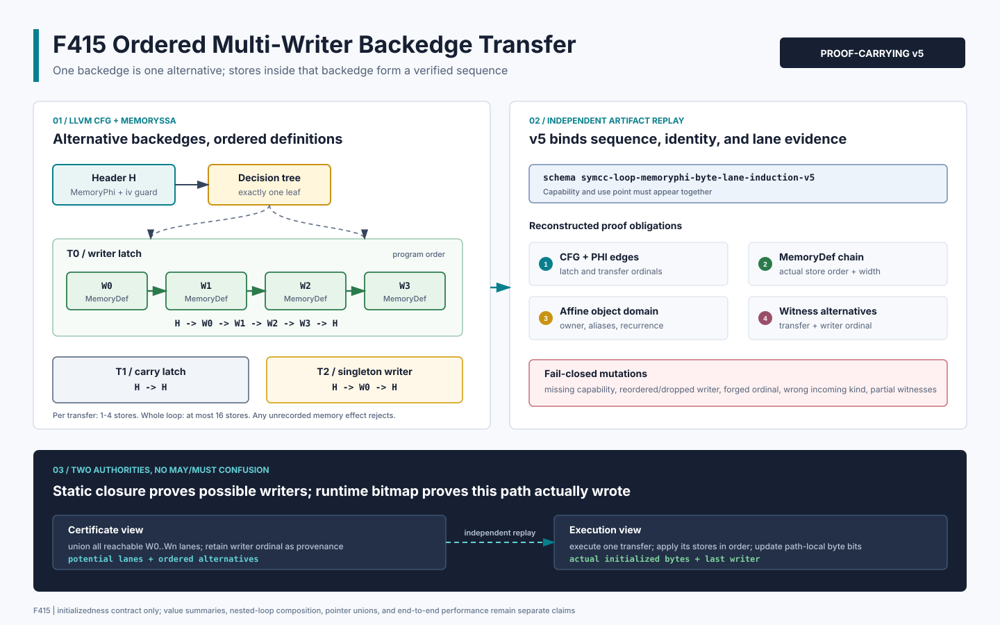

# F415：Multi-Latch MemoryPhi 有序多写者传递证书

> 日期：2026-08-16  
> 定位：F414 多回边不动点之后、F416 嵌套循环摘要组合之前的序列效应层  
> 等级：I/T/E-mechanism（真实 LLVM producer、严格 consumer、双 LLVM、有限域 oracle 与机制实验）

## 1. 研究问题与实现定位

F414 把 2--4 条 loop backedge 建模为互斥 transfer，但每条 writer backedge 只允许一个
`MemoryDef`。真实程序常在同一 latch 内连续初始化多个字段或重复覆盖同一字段，MemorySSA incoming
因此不是 `H -> W -> H`，而是：

\[
H\rightarrow W_{j,0}\rightarrow W_{j,1}\rightarrow\cdots
\rightarrow W_{j,m_j-1}\rightarrow H.
\]

把这些定义误当成不同 transfer 会声称它们互斥；把它们无序合并又会丢失 last-writer 信息。
F415 在不改变 F414 “不同 backedge 互斥”语义的前提下，为每条 writer transfer 增加有序
MemoryDef 序列，形成可审计的 v5 artifact。当前初始化证明只使用 byte-lane union，但 artifact
保留 writer ordinal，给后续 value/last-write 摘要与 nested-loop composition 提供稳定接口。

权威背景与研究关系：

- [LLVM MemorySSA](https://llvm.org/docs/MemorySSA.html) 将每次可能写内存的指令表示为
  `MemoryDef`，定义链的顺序必须按程序语义解释；`MemoryPhi` 仍只是可能到达定义的合并；
- [LLVM Loop Terminology](https://llvm.org/docs/LoopTerminology.html) 说明自然循环可以有多条 latch/
  backedge，只有 Loop Simplify Form 额外保证 single backedge；
- [LoopSCC（ICSE 2026）](https://conf.researchr.org/details/icse-2026/icse-2026-research-track/127/LoopSCC-Summarizing-Complex-Multi-branch-Nested-Loops-via-Periodic-Oscillation-Inter)
  采用从内到外顺序应用循环摘要。F415 不是 LoopSCC 复现，而是根据本项目 proof-carrying
  MemoryPhi 架构推导出的局部先决条件：外层摘要必须能引用一个有序 effect sequence，不能只接收
  单个 writer；
- [LoopSCC 预印本](https://arxiv.org/abs/2411.02863) 处理更一般的多分支、嵌套循环和周期行为；
  F415 仅关闭 bounded initializedness transfer 的窄缺口，不宣称一般循环值摘要。



## 2. 精确语义

header memory version 为 `H`，preheader 为 `E`，共有 `n` 条互斥 backedge：

\[
H=\phi(E,T_0(H),\ldots,T_{n-1}(H)),\qquad 2\le n\le4.
\]

一次迭代只选择一个 `T_j`。若它是 carry，则 `T_j(M)=M`；若它包含 `m_j` 个 writer，则：

\[
T_j(M)=W_{j,m_j-1}(\cdots W_{j,1}(W_{j,0}(M))\cdots),
\qquad 1\le m_j\le4.
\]

因此有两种不同次序：

1. **transfer 之间是 alternative**：不能把 `T0` 和 `T1` 在同一迭代顺序执行；
2. **同一 transfer 内 writer 是 sequence**：必须按 `W0,W1,...` 的真实 store 顺序执行。

对 initializedness，单个 store 的 effect 是写区间 byte 集合，序列最终使用 union：

\[
I'=I\cup\bigcup_{q=0}^{m_j-1}\operatorname{bytes}(W_{j,q}).
\]

union 对顺序不敏感，但 value/last-writer provenance 对顺序敏感。故 v5 的每个 lane alternative
新增 `writer` ordinal；独立 oracle 还比较最后覆盖该 byte 的 `(transfer,writer,round)`，证明序列
没有在参考模型中退化为集合。生产 artifact 暂不承诺 store value，所以地址、宽度等元数据完全
相同的两个 writer 交换后对当前合同不可观察；检查器不会制造“必须拒绝”的虚假要求。

## 3. 严格支持域

F415 继承 F414 的 CFG、归纳变量、guard、object、alias、bound 和 no-wrap 条件，并把 writer
准入扩展为：

- 每条 writer transfer 有 1--4 个 simple scalar stores；整个 loop 最多 16 个 stores；
- 至少一条 transfer 含 2 个及以上 writer，否则继续输出 byte-compatible v4；
- header MemoryPhi 的该 latch incoming 必须是链尾，沿 `getDefiningAccess()` 精确回溯到同一
  header MemoryPhi；链中每个节点必须是该 latch 内的 simple `StoreInst`；
- 逆向回溯结果反转后必须与 LLVM 指令 `comesBefore` 顺序一致；writer ordinal 必须等于该 latch
  的真实 store ordinal；
- 每个 writer 独立验证 1--8 byte 宽度、正 affine scale、`width <= step*scale`、同一 stack/heap
  owner、完整 alias 域和 recurrence-reachable 子域；
- loop 内所有 MemorySSA access 必须恰好属于已记录 writer 定义；额外 load、call、unknown def、
  MemoryPhi、atomic/volatile store 或跨 block writer 均失败关闭；
- load alias×lane 最多 2,048，全部 witness alternatives 最多 8,192。

有序链可以与 carry transfer 或 singleton-writer transfer 同时存在。v5 中所有 writer incoming 都
使用 `ordered-writer-memory-def-chain`，即便某条具体链只有一个 writer；这是全证书版本语义，
consumer 会按每条链的实际长度重放。

## 4. Producer 执行流程

`compiler/ContinuationLowering.cpp` 在 F414 admission 路径内执行：

1. 从 exit load 的真实 `MemoryUse` 定位 header MemoryPhi；
2. 由 LoopInfo 和真实 successor 重建 2--4 latch decision tree；
3. 绑定 scalar PHI seed、每 latch next 和统一 step，检查 guard/bound/no-wrap；
4. 按 incoming block 取得每条 latch 的 memory version；等于 `H` 时记为 carry；
5. 否则从 incoming 沿 MemoryDef 链逆行，逐节点要求 simple store、同 latch 且未超 4/16 上限；
6. 到达 `H` 后反转 writer 列表，并用 `comesBefore` 复核程序次序；
7. 枚举 loop 内全部 MemorySSA access，拒绝未被链收录的 memory effect；
8. 对每个 writer 独立恢复 width、pointer scale、aliases、reachable addresses/index values；
9. 按全部 writer 的 recurrence domain 重新计算 lane closure、稳定轮和 witness alternatives；
10. 任一 transfer 长度大于 1 时输出 v5 与 ordered capability；全 singleton 保持原 v4 shape。

这一设计保持向后兼容：F414 的单 writer artifact 字节结构、schema 和 consumer 路径不变。

## 5. v5 Proof-Carrying Artifact

新增 capability：

`bounded-multilatch-loop-memoryphi-ordered-writer-transfer`

它依赖 `bounded-multilatch-loop-memoryphi-byte-lane-fixed-point`，后者再依赖基础 loop MemoryPhi
capability。代表性节选如下：

```json
{
  "schema": "symcc-loop-memoryphi-byte-lane-induction-v5",
  "memory_phi": {
    "incoming": [
      {"transfer": 0, "kind": "ordered-writer-memory-def-chain"},
      {"transfer": 1, "kind": "header-memory-phi-carry"}
    ]
  },
  "transfers": [{
    "ordinal": 0,
    "kind": "writer",
    "writers": [
      {"ordinal": 0, "bytes": 1, "address_stride": 2},
      {"ordinal": 1, "bytes": 2, "address_stride": 2}
    ]
  }],
  "fixed_point": {
    "semantics": "mutually-exclusive-ordered-writer-transfer",
    "stable": true
  },
  "witnesses": [{
    "load_address": 64,
    "lane": 0,
    "alternatives": [
      {"transfer": 0, "writer": 0, "writer_address": 64,
       "writer_lane": 0, "induction_value": 0},
      {"transfer": 0, "writer": 1, "writer_address": 64,
       "writer_lane": 0, "induction_value": 0}
    ]
  }]
}
```

实际 artifact 还包含完整 CFG/PHI edge identity、guard path、writer block、完整 alias/index/
reachable/residue 域、load 域以及所有 fixed-point rounds。以上只是结构说明，不是完整 schema。

## 6. Consumer 与 Runtime

`LiveContinuationExecutor._multilatch_loop_memoryphi_fixed_point_initialization` 同时接受 v4/v5，但对
v5 额外执行：

- 精确 `writers` 数组 key 集、每 transfer 1--4、全 loop 1--16，以及至少一条 multiwriter 链；
- 从真实 lowered latch 收集 store 列表，按 ordinal 对齐 width、aliases、index domain；
- 每个 store 的 pointer definition 必须在 store 之前，且绑定同一 induction、base 和 scale；
- MemoryPhi incoming kind 必须与 v5 全局语义一致；
- fixed-point semantics 必须是 `mutually-exclusive-ordered-writer-transfer`；
- witness alternative 必须包含正确的 transfer 和 writer ordinal，完整列表必须与独立重算相等；
- ordered capability、base multi-latch capability、v5 use point 与 dangling-capability 四向闭合。

运行时不会根据 static closure 设置 initialized 位。实际进入某条 latch 时，lowered store 仍按
程序顺序执行并更新 path-local byte-init bitmap；zero-trip、carry、前缀不足或只写部分 lane 的
load 仍变为 infeasible。F415 扩大的是“可验证 IR 支持域”，没有放松运行时未初始化读取规则。

## 7. 测试与实验结果

### 7.1 LLVM 17/18 与破坏性测试

`test/live_ordered_multilatch_memoryphi_transfer.ll` 有 9 条 `RUN`：

- 同一 backedge 上 1-byte writer 后接 2-byte writer，step 2，验证可区分的真实顺序；
- 一条 2-writer transfer 与另一条 singleton-writer transfer 共存；
- 单 transfer 5 个 writer 的 source negative，必须回退并最终拒绝未证明 load；
- 生成式 64-byte、4 latch、每 latch 4 writer，总计 16 writer 的最大链边界；
- 基础、strided、multi-latch 与 ordered 专属 checker 联合重放。

专属 checker 对可区分正例拒绝 13 类 actual artifact 破坏，包括缺 capability、schema 降级、错误
semantics/incoming kind、writer 重排/缺失/重复、伪造 ordinal、错误或缺失 witness、实际 store
重排、退化 singleton-v5 和删除 transcript。LLVM 17 与 LLVM 18 focused fixture 均为 1/1 通过。
F411--F415 关联 fixture 在 LLVM 17/18 各 5/5，关联 Python 为 25/25。完整 Python 身份门禁为
`1076 passed` 加 `250 subtests`，skip/xfail/deselection、缺失和意外 node ID 全为 0；规范 node-ID
摘要为 `29d15f5e3d20b62728b732d549592b708449a0a3dec92ae08371b331ff5c17f4`。LLVM 17
全量为 `279 passed + 2 unsupported`、0 failed。

### 7.2 独立有限域 Oracle

oracle 不调用 LLVM producer 或 production consumer，独立枚举 object、step、load width/domain、
2--4 transfers、1--5 writer chain、seed 和 bound width，并分别计算具体执行与 transfer replay：

| 指标 | 结果 |
| --- | ---: |
| 总参数组合 | 13,632 |
| ordered fixed point 接纳 | 3,312 |
| unsupported / partial 拒绝 | 10,320 |
| byte-lane checks | 72,576 |
| runtime bitmap / transfer replay 等价 | 231,282 |
| last-writer provenance 等价单元 | 718,968 |
| 完整 load 接纳 | 102,108 |
| prefix/carry 不足拒绝 | 129,174 |
| reference certificate mutations | 22 / 22 拒绝 |

守恒关系成立：`13,632 = 3,312 + 10,320`，
`231,282 = 102,108 + 129,174`。oracle 连续两次输出 SHA-256 均为
`f1a1a9f6d6395b5865c9cbccf0b50f7acb7fac958eca3f5014382c6ad14568b8`。

### 7.3 机制边界基准

冻结基准使用 64-byte object、stride 8、load 8、四 transfers（两条 writer、两条 carry），每条
writer transfer 的宽度序列为 `[8,7,6,5]`：

- 8 个 writer metadata records、64 个 reachable writer instances、416 个 potential writer bytes；
- 57 个 load aliases、456 个 byte-lane witnesses、2,964 个 witness alternatives；
- 4 条 backedge、5 条 MemoryPhi incoming、8+1 个 fixed-point rounds；
- 11 轮 × 每轮 1,000 次 Python reference validation，batch 最小/中位/最大为
  `210,741,732 / 211,515,028 / 222,742,650 ns`；中位为 `211,515 ns/certificate`。

这些数字只描述 Python 参考 validator 成本与 artifact 基数，不包含 LLVM 分析时间、executor
吞吐、SMT 求解、fuzzing coverage、错误发现率或端到端 speedup，不能作为公共 benchmark 性能
提升结论。

## 8. 多轮 Review 与修复

1. **MemorySSA review**：验证 incoming 必须从链尾逐 Def 回到 header MemoryPhi，任何额外
   MemoryUse/Def 均拒绝，避免只数 store 而漏掉真实 clobber；
2. **顺序 review**：逆向 MemorySSA 列表反转后再用 LLVM `comesBefore` 复核，并在 consumer 中按
   lowered store ordinal 二次绑定；
3. **混合链 review**：补充 multiwriter + singleton 同一 v5 artifact，确认全局 schema 不会错误
   要求每条 writer transfer 长度都大于 1；
4. **边界 review**：生成式 4×4=16 writer 被接受，5 writer/latch 被拒绝；7,296 alternatives
   保持在 8,192 上限内；
5. **检查器 review**：发现“交换两个完全同地址、同宽度、且 artifact 不承诺 value 的 store”对
   initializedness 不可观察；修正为仅在 writer 元数据可区分时要求该变异被拒绝；
6. **兼容性 review**：F414 v4 focused Python/LLVM 回归保持通过，单 writer 继续输出 v4；
7. **可复现性 review**：两次独立 oracle 结果逐字节一致，双 LLVM fixture 与生成式边界均通过；
8. **声明 review**：机制计时与 coverage/solver/bug-yield 明确隔离，不把功能支持域扩展写成性能
   提升。

## 9. 先进性、创新性与挑战性

- **先进性**：把 LLVM MemorySSA 定义链、multi-latch alternative、affine byte-lane fixed point 和
  proof-carrying replay 统一到同一版本化合同；
- **框架创新**：同一个 artifact 同时保留“transfer 间互斥”和“transfer 内有序”两层代数，避免
  把 CFG 选择与内存效应顺序混为一谈；
- **前向可组合性**：writer ordinal 不参与当前 initializedness 决策，但为 last-write/value 和
  inner-to-outer loop composition 预留了不会破坏 v4 的明确接口；
- **挑战性**：writer identity 必须跨 LLVM instruction order、MemorySSA chain、JSON ordinal、
  lowered store list、alias recurrence 和 witness alternatives 六层保持一致；
- **可证伪性**：双 LLVM、9 条真实 lowering RUN、13 类 actual artifact mutation、22 类独立
  mutation、231,282 次 bitmap 等价和 718,968 个 provenance 单元共同限制结论。

## 10. 未完成边界与下一步

F415 仍只证明 initializedness，不总结具体 store value、条件 value merge 或 overlapping
last-write expression；也不支持 nested loop、pointer union/multi-object writer、动态 extent、
非树状 CFG、跨过程 loop effect 和 unbounded recurrence。

下一项 F416 将在此序列 transfer 接口上实现 nested-loop MemoryPhi summary composition：先为 inner
loop 生成有界、可重放的 effect summary，再按 LoopInfo 层级从内到外实例化到 outer recurrence。
该工作必须继续保持 runtime bitmap 权威，并用独立 reference model 证明组合不会把 inner
potential effect 误升格为 outer path 的 must initialization。
