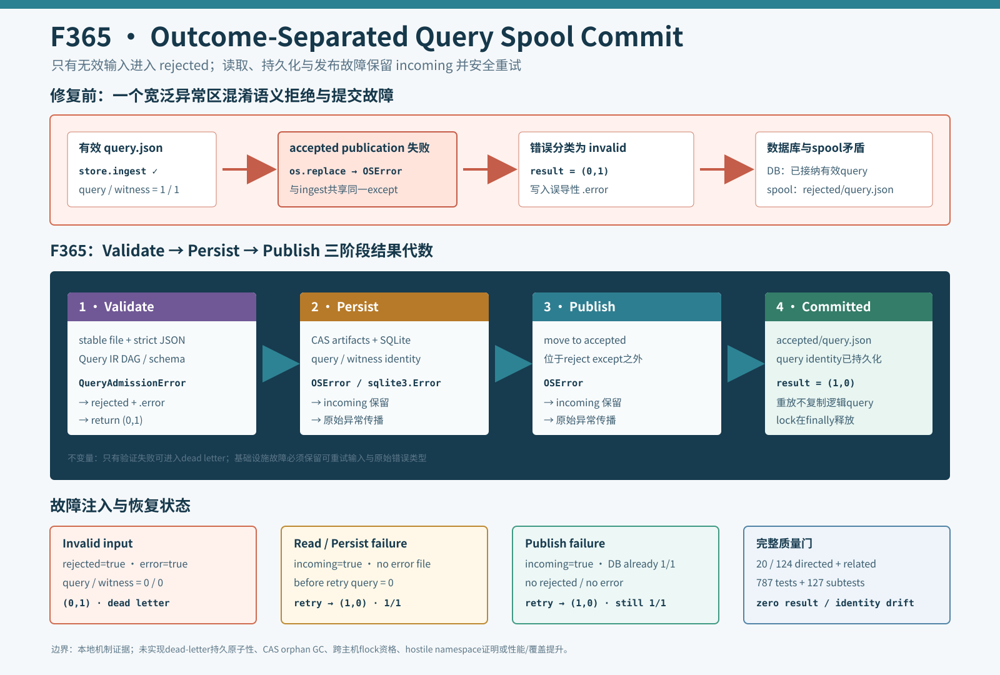

# F365：Outcome-Separated Query Spool Commit

- 功能编号：F365
- 日期：2026-08-11
- 状态：已实现、已完成反事实/故障注入/幂等恢复与完整回归
- 范围：Query IR语义拒绝、reader/持久化/publication故障隔离、可重试提交



## 1. F364之后发现的事务语义错误

F364用稳定regular-file reader和crash-released `flock`解决了多消费者重复提交，但
`ingest_spool()`仍把两个性质不同的操作放在同一个`try/except Exception`中：

```text
QueryStore.ingest_file(path)   # 读取、验证、CAS/SQLite持久化
move(path, accepted)           # 分类结果发布
```

因此，查询已成功进入QueryStore后，只要`accepted/`创建或`os.replace()`失败，宽泛异常处理就会把该控制面故障
误判为无效Query IR，写入`.error`并把原文件移入`rejected/`。数据库事实与spool分类由此矛盾。

生产旧算法的确定性反例得到：store调用1次、返回`(0,1)`、accepted为空、输入从incoming消失、rejected包含查询，
错误文件为`OSError: simulated accepted publication failure`。这不是展示性模型，而是把故障注入旧控制流后得到的
真实分类行为。

继续审查还发现，`store.ingest_file()`同时包含输入验证和CAS/SQLite I/O。捕获所有`Exception`会把数据库不可用、
对象目录写失败、权限错误或reader I/O错误同样描述成“坏查询”，导致有效输入失去自动重试机会。

## 2. 显式输入拒绝类型

新增`QueryAdmissionError(ValueError)`，其语义严格限定为：Query envelope在任何QueryStore持久副作用开始前，因
文件类型/稳定性、UTF-8/JSON或Query IR schema/语义无效而被拒绝。

`QueryStore.ingest_file()`现在按两个阶段执行：

1. `_load_query_envelope()`读取稳定文件，`_validate_envelope()`规范化并验证完整DAG；
2. 只有第一阶段成功才把规范结果交给`_ingest_validated()`执行CAS、SQLite、query artifact和candidate物化。

文件API把第一阶段的`ValueError`提升为`QueryAdmissionError`；direct `ingest(envelope)`仍保留原有`ValueError`
兼容。该拆分只验证一次，不用“双重验证换异常分类”。最终symlink的`ELOOP/EMLINK`仍作为无效输入，其他
`os.open/fstat/read/stat` I/O错误保持原始`OSError`并向控制面传播。

## 3. 四类互斥结果

`ingest_spool()`只捕获`QueryAdmissionError`。其余故障不写`.error`、不进入rejected，并由外层服务决定重试、退避
或终止：

| 结果 | 持久状态 | spool状态 | 返回/异常 | 下一步 |
|---|---|---|---|---|
| 输入无效 | query=0 | rejected + `.error` | `(0,1)` | 人工诊断或删除 |
| reader I/O失败 | query=0 | incoming保留 | 原始`OSError` | 修复I/O后重试 |
| CAS/SQLite失败 | query可为0或部分不可见 | incoming保留 | 原始持久化异常 | 存储恢复后重试 |
| accepted publication失败 | query=1 | incoming保留 | 原始`OSError` | 幂等重放并完成move |

sidecar继续写`ValueError: ...`，保持F363/F364已有消费者与证据兼容；内部类型则让服务代码精确决定何时允许
quarantine。accepted move位于语义拒绝`except`之外，因此publication失败不可能再落入拒绝分支。

## 4. 幂等恢复为什么成立

QueryStore以规范Query IR摘要作为`query_id`，表达式、artifact和witness也使用内容身份或唯一约束。若故障发生在
SQLite commit后、accepted move前，输入仍留在incoming；下一次持锁扫描会重新验证相同字节，`ingest()`观察到已有
query并复用身份，然后完成accepted move。

本轮production故障注入的状态为：

```text
publication failure:
  after failure  = incoming=true, query/witness=1/1, no rejected/error
  retry          = (1,0)
  after retry    = accepted=true, query/witness=1/1

persistence/read failure:
  after failure  = incoming=true, query/witness=0/0, no rejected/error
  retry          = (1,0)
  after retry    = accepted=true, query/witness=1/1
```

这里的`imported=1`表示本次成功消费了一个spool文件，不表示创建了第二个逻辑query。

## 5. 实现细节

### 5.1 QueryStore

- `_ValidatedEnvelope`把十项规范化结果作为验证/提交边界；
- `ingest()`保持公共Mapping API，验证后委托`_ingest_validated()`；
- `ingest_file()`先完成loader和validator，只把这一区域的`ValueError`包装为`QueryAdmissionError`；
- `_ingest_validated()`中的SQLite、CAS、converter和candidate故障保持原始类型。

### 5.2 Query service

- `except Exception`收窄为`except QueryAdmissionError`；
- 语义拒绝完成error sidecar和rejected move后`continue`；
- accepted move只位于成功分支，失败直接展开到持锁边界；
- 外层`finally`仍关闭F364锁，故障不会造成永久占有。

## 6. 反事实、故障注入与测试结果

| 验证层 | 结果 |
|---|---:|
| 可执行五结果driver | reject/read/persist/publish/retry全部PASS |
| 旧publication故障反事实 | store=1，`(0,1)`，错误进入rejected，反例成立 |
| QueryStore定向 | 20 passed + 2 subtests（2.44秒） |
| QueryStore/QF_BV/schedule/semantic proposal | 124 passed + 2 subtests（15.49秒） |
| canonical nodeid重建 | 787项，文件字节与SHA-256不变 |
| 完整capability + identity gate | 787 passed + 127 subtests（99.55秒） |
| 能力缺失 | 0 / 16 |
| 结果/身份退化 | 全部为0 |

新增断言仍位于既有spool测试中，因此pytest nodeid和subtest总数都不变。F363与F364两个历史证据驱动器也重新执行，
其JSON与归档逐字节一致，说明新异常类型没有改变已承诺的strict JSON、symlink/FIFO和SIGKILL接管行为。

## 7. 工程价值与研究定位

F365把一个隐式异常区域改为显式结果代数：invalid、read-failed、persist-failed、publish-failed和committed不再共享
同一个“failed”出口。这对应事务系统中的validation/commit/publication分层，也满足异常安全中的基本要求：错误必须
保留足够状态，使调用者能判断重试是否安全。

该实现的创新点不是新的SMT算法，而是把内容寻址Query IR、单消费者锁和故障分类组合成可验证的at-least-once
ingestion协议。它避免错误诊断吞掉可恢复工作，并为后续退避、dead-letter policy和跨节点存储资格提供了明确接口。

## 8. 局限与有效性威胁

1. QueryStore在主SQLite事务前可能已写入不可变CAS artifact；持久化失败不会回滚这些内容对象，本轮只证明逻辑
   query/witness状态和spool输入可恢复，未实现孤儿artifact GC；
2. error sidecar与rejected move仍不是一个持久原子事务，写入后崩溃可能留下sidecar和incoming输入；
3. accepted/rejected目录尚未逐组件锚定，hostile namespace、mount切换和metadata ABA仍未形式化关闭；
4. `flock`仍是本机已验证的协作式协议，未绑定F327/F329跨主机资格；
5. 服务当前把传播异常交给进程级循环，尚无按错误类型的指数退避、重试预算或机器可读health telemetry；
6. 未触发GitHub托管runner，也未运行LLVM lit、QSYM/PIN、真实MPI、solver/coverage campaign、公开benchmark或
   LAVA-M；99.55秒是单次回归耗时，不构成性能、覆盖或漏洞提升证据。

## 9. 实现与证据索引

- 显式准入类型和两阶段QueryStore：`util/query_store.py`；
- outcome-separated spool控制流：`util/symcc_query_service.py`；
- 故障与恢复单元测试：`test/test_query_store.py`；
- 五结果可执行证据：`docs/codex/evidence/f365-outcome-separated-query-spool-2026-08-11/`；
- 机制图：`docs/codex/diagrams/outcome-separated-query-spool-commit-2026-08-11.svg`；
- 用户可见语义：`docs/Configuration.txt`。

## 10. 后续方向

1. 为reader、persistence和publication错误增加有界重试、指数退避与分类遥测，避免服务进程直接退出；
2. 为error sidecar和最终分类设计claim/intent记录，使崩溃点可枚举、可恢复；
3. 复用F349/F350的dirfd能力链，锚定spool root及incoming/accepted/rejected；
4. 增加CAS orphan标记/扫描和保守GC，验证数据库不可见对象不会无限增长；
5. 在真实NFS/Lustre/CephFS上执行锁、rename、故障恢复和backlog吞吐资格实验。

## 11. 结论

F365修复了一个已由生产控制流复现的错误分类：accepted publication失败不再把已经持久化的有效Query IR送入
rejected。显式`QueryAdmissionError`和单次validate-then-commit边界进一步阻止reader、SQLite/CAS故障伪装成坏
输入。三类可重试故障都保留incoming，正常重试收敛为单一query/witness；真正无效的JSON仍保持原有拒绝行为。
完整`787 passed + 127 subtests`门禁支持本地正确性和无回归结论，但不支持跨主机、性能或覆盖提升主张。
