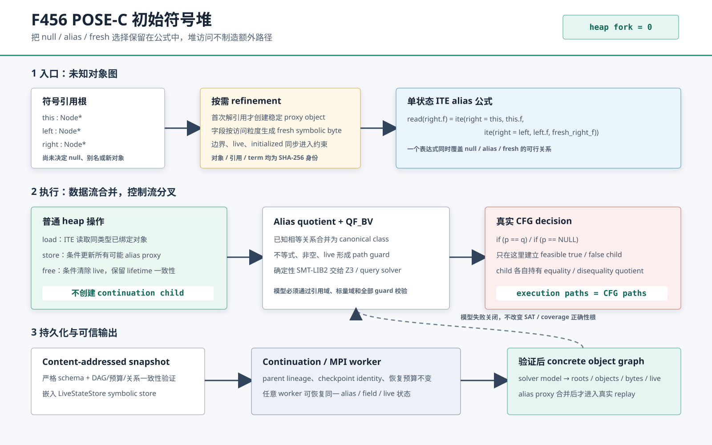

# F456：POSE-C 初始符号堆与路径最优 heap 执行

日期：2026-08-26  
结论等级：I/T/E-mechanism  
实现：`util/pose_symbolic_heap.py`



## 1. 问题与结论

F405--F422 已经能在编译器给定的有限 C heap 对象集合上处理 conditional free、初始化、MemorySSA、
跨过程 effect 和循环 MemoryPhi，但入口对象图仍必须事先确定。经典 lazy initialization 在首次访问
未知引用时枚举 `null`、既有对象 alias 和 fresh object，并为每个选择创建状态；这些分叉不是程序 CFG
分支，会使同一程序路径对应许多分析 trace。

F456 新增独立的 POSE-C initial symbolic heap 域。每个输入引用拥有稳定 proxy object；同类型引用之间的
alias 选择被编码为 byte/field 值内部的 ITE。`load`、`store`、`free` 和引用字段 materialization 只改变
一个符号状态，只有显式 `branch_alias`（对应真实 CFG reference comparison）才建立 continuation child。
状态可导出确定性 QF_BV SMT-LIB2，solver model 必须通过 alias quotient、disequality、path guard、标量域
和对象域校验，随后才可物化为 concrete object graph。

这关闭了审计中“已有有限 heap union 但没有 initial symbolic heap materialization/quotient 语义”的功能
缺口。结果不等于任意 C 程序的自动前端：调用方仍须提供有界 type layout、root 和 heap access；任意符号
pointer arithmetic、union/type punning、并发 heap 及 LLVM 自动恢复不在 F456 合同内。

## 2. 文献依据与适配边界

主源是 Braione、Denaro、Guglielmo 的
[Path-Optimal Symbolic Execution of Heap-Manipulating Programs，arXiv:2407.16827v2](https://arxiv.org/abs/2407.16827)
（2026-01-14）。论文定义 path optimality：分析 trace 只随程序路径分叉；POSE 用 ITE 表达引用之间的
alias/fresh 关系，在非决策 heap 指令上不建立状态。论文实现面向 Java bytecode；本项目实现的是带固定
layout、byte lane、live/initialized 和 continuation CAS 的有界 C 适配，不声称逐行复刻论文 prototype。

2026-08-26 获取的 v2 PDF 为 18 页，SHA-256 为
`5a4137d0b06ad021ef08c653ee43339d158b44d197093f7766f626aa4ca3c9a7`。报告中的 21、23、78 条 lazy
trace 均来自论文 motivating examples；本地 oracle 只复现这些例子的期望 CFG path 数，不把论文 trace
数写成本项目测量值。

## 3. 形式域

### 3.1 稳定身份

- type layout：`name/size/alignment`，size 最大 1 MiB，alignment 必须为非零 2 的幂；
- symbolic reference：root 或 64-bit pointer-field term 的规范 SHA-256；
- proxy object：由 `reference + type` 决定，保存 ordinal、固定 size、live term 和 byte cells；
- term DAG：`const/var/ref_eq/not/and/ite/concat_le`，每个 node 由规范 JSON 内容寻址；
- state：layout、root、reference、object、term、alias relation、condition 和 metrics 的规范快照。

固定预算为 128 types、256 references、256 objects、131072 terms、1048576 cells 和 65536 conditions。
所有反序列化先验证 exact schema、identity、term DAG、arity/width、对象 ordinal、bounds、alias quotient、
condition 与 metrics；全图通过后才构造状态。

### 3.2 Lazy read

首次解引用 `r` 时创建 proxy `O_r`，加入 `r != null`，但不枚举引用值。首次读取偏移 `k` 时生成 fresh
byte `z_r,k`，并按已绑定同类型对象构造：

```text
read(r,k) = ite(r = r0, read(r0,k),
            ite(r = r1, read(r1,k), z_r,k))
```

因此当 model 令 `r = r0` 时，两者同一 byte 自动相等；不相等时保留独立 fresh byte。1/2/4/8 byte
little-endian word 由 `concat_le` 组成，8-byte word 可派生稳定 reference-field identity。

### 3.3 Conditional write/free

`store(r,k,v)` 先取得所有同类型 proxy 的旧值，再对每个 `O_i` 写入
`ite(r = r_i, v, old_i)`；目标 proxy 直接保存 `v`。这样任意 alias model 下，所有代表同一 concrete object
的 proxy 得到一致结果。写入同时把对应 initialized tag 置真。

`free(r)` 采用同样的条件更新清除 live；访问加入当前 live guard。已释放状态再被读取会形成不可满足路径，
不会把 UAF 当作有效 concrete graph。固定 offset/width 在转移前检查 bounds；越界输入失败关闭。

### 3.4 Alias quotient 与 CFG 分支

equalities 形成 canonical quotient，disequalities 在 quotient 上检查冲突。已知关系会裁掉不可行分支；
不同 type 的相等假设直接拒绝。heap refinement 的 `cfg_forks` 始终不变，只有 `branch_alias(p,q)` 为真实
reference comparison 建立 feasible true/false children。该边界是 F456 的核心，而不是调度启发式。

## 4. Solver、continuation 与 concrete graph

`to_smt2()` 把 reference 声明为 BV64、null 设为 0，byte/word 设为相应宽度的 QF_BV term，并断言
quotient、disequality 和 path conditions。定向测试把真实输出交给系统 Z3 解析并要求 `sat`。

`persist_pose_heap()` 将完整规范快照封装为 `pose_heap_snapshot` live expression，放入现有
`LiveStateStore` symbolic store 的 `@pose:initial-heap` 项；新 descriptor 保留 parent lineage，因而沿用
现有 no-follow CAS、图预算、checkpoint identity 和 MPI worker 恢复协议。相同 parent/state 重复写入产生
相同 checkpoint ID。`restore_pose_heap()` 同时复核外层 expression root 和内层 state digest。

`validate_model()` 拒绝未知 reference/scalar、非法 handle、非整数/越界 byte、quotient 冲突、disequality
冲突及任一 false guard。`materialize_model()` 只接受验证后的 model，把 alias proxy 合并为一个 concrete
object，并输出 roots、bytes、initialized、live、size 和 type，供真实 harness/replay 使用。

## 5. 测试与结果

### 5.1 定向与耦合门禁

当前定向结果为 25 passed 加 256 subtests。覆盖稳定身份、非分叉 load/store/free、64-bit reference field、
alias quotient、null/type/bounds 反例、模型域、SMT/Z3、snapshot 篡改、continuation 恢复与 4-reference
全部 256 个 handle assignment。与 distributed state、persistent continuation/frontier 和 cross-worker
context 的耦合回归为 232 passed 加 282 subtests。最终 capability-closed 全量门禁为 1542 passed 加
579 subtests（298.72 秒），16/16 能力存在，1542/1542 nodeid 精确，且 failure/skip/xfail/xpass/
deselect/collection error 均为 0。

### 5.2 独立 oracle

`benchmark/check_pose_symbolic_heap_oracles.py` 的 9/9 检查通过：

| oracle | 本地结果 | 结论 |
| --- | ---: | --- |
| 3 references read | 27/27 assignments 等价 | ITE 读取与最早 proxy 的 concrete alias 语义一致 |
| conditional store | 27/27 assignments 等价 | 写入在相同/不同 alias partition 下均一致 |
| swap style | 2 CFG paths，0 heap paths | 对应论文例子的 2 条程序路径；21 lazy traces 是论文值 |
| sum style | 1 CFG path，0 heap paths | 四个对象读取不制造 heap path；23 lazy traces 是论文值 |
| list `max=10` style | 12 CFG paths，0 heap paths | 每个 null/loop 决策只产生程序分支；78 lazy traces 是论文值 |
| checkpoint | repeated identity + exact restore | CAS 与 parent lineage 闭合 |

oracle 结果 SHA-256 为
`e913dcfc6499a632a2f0895638caef16b39c2c7e3b5335f4c8ab4221869d1212`。

### 5.3 机制成本

单进程 Python、每点 11 轮的 build + byte load + canonical snapshot 中位数如下：

| references | alias/null partition models（解析计数） | terms | snapshot bytes | 中位耗时 |
| ---: | ---: | ---: | ---: | ---: |
| 1 | 2 | 4 | 1,700 | 55.854 us |
| 2 | 5 | 9 | 3,508 | 121.483 us |
| 4 | 52 | 25 | 8,756 | 273.663 us |
| 8 | 21,147 | 81 | 25,780 | 776.911 us |
| 16 | 82,864,869,804 | 289 | 85,960 | 2,662.702 us |

partition 数是“references 加 distinguished null”的等价关系解析计数，用于显示未枚举关系空间；它不是
实际 lazy trace 数。时间包含 Python 对象和 JSON snapshot，不是 C++ runtime、solver throughput、公开
target coverage、bug yield 或相对 lazy implementation 的 wall-time speedup。

## 6. Review 记录

1. R1：确认现有 F405--F422 只有有限 points-to 域，禁止用旧 heap union 冒充 initial heap；
2. R2：修正模型真实性边界，物化前核对 quotient、disequality 和全部 path guard；
3. R3：把单 byte 派生引用改为 64-bit little-endian pointer field；
4. R4：增加确定性 QF_BV SMT-LIB2，并由真实 Z3 做 parser/feasibility smoke gate；
5. R5：严格限制 snapshot metrics/conditions，拒绝重复 condition 和负/溢出计数；
6. R6：拒绝 model 中未知 scalar/reference、float/bool 伪整数和越界赋值；
7. R7：用 4-reference 256 子案例扩大 alias partition 性质测试；
8. R8：执行 LiveStateStore、persistent continuation/frontier 和 cross-worker 耦合回归；
9. R9：重新核对 arXiv v2 作者、版本、示例 trace 数和 PDF SHA；
10. R10：逐项校正文档声明，只把 27/27、路径数和微秒成本列为本地证据。
11. R11：首次全量门禁发现两个新测试缺 lit `RUN` 入口；补齐 hermetic pytest 元数据后，发现契约与
    1542 项全量门禁均通过。

## 7. 剩余研究边界

- 自动从任意 LLVM IR 恢复递归 C type/layout、union/type punning 与任意 symbolic pointer arithmetic；
- 与真实 fuzzing campaign 的长时等 CPU coverage AUC、time-to-target 和 defect-yield 对比；
- 大型 ITE heap 公式的 solver simplification、array theory/分离逻辑替代和跨 worker term sharing；
- 并发 heap 的 allocation/free 线性化及与 schedule symbolic execution 的组合完备性。

这些是前端扩展或 R-track 研究问题。F456 已实现并验证有界 POSE-C initial heap 运行域，但不会把未做的
公开实验或一般 C 完备性写成已完成结果。
