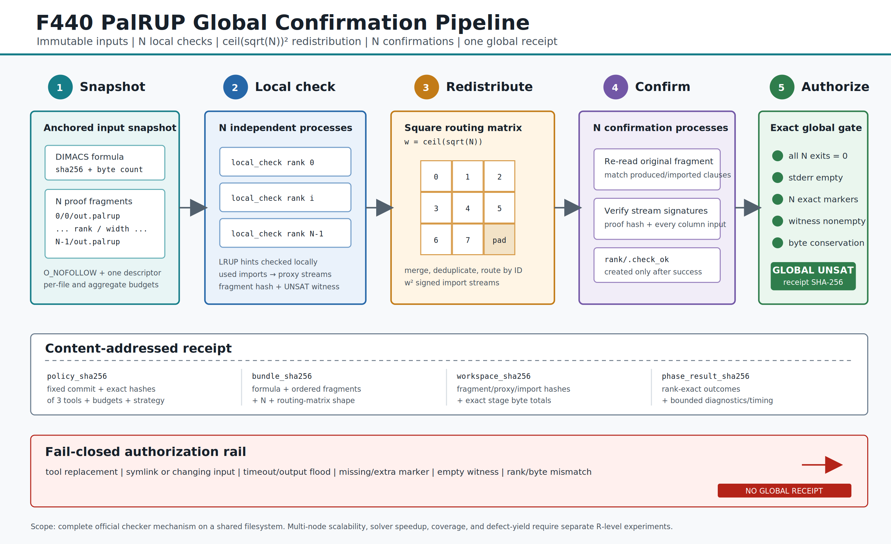

# F440：PalRUP 多 Worker 全局确认流水线与内容寻址回执

- 功能编号：F440
- 日期：2026-08-18
- 研究主题：原生并行证明检查、局部 LRUP 检查、证明通信重分发、全局确认、失败闭锁回执
- 当前等级：I/T/E-local
- 严格边界：已经在共享文件系统上完整驱动固定版本 PalRUP 官方三阶段 checker，并以精确 marker 集和非空 UNSAT witness 形成全局回执；当前 SymCC 求解器尚不原生产生 PalRUP 多片段，尚无多节点速度、覆盖率或缺陷发现收益结论



## 1. F439 之后仍缺少什么

F439 解决了两个互操作问题：项目内部 LRUP DAG 可以确定性展平为匹配的 ICNF/LIDRUP，并由固定外部
checker 复验；项目也能逐字节读写真正的 PalRUP `a/i/d` binary fragment。但“一个 fragment 可被官方
converter 解析”不等于“一组并行 fragment 已经证明全局 UNSAT”。完整 PalRUP 检查还需要：

1. 对每个 solver fragment 独立执行局部检查；
2. 把局部检查识别出的跨 worker 引用重分发到确认者；
3. 每个原始 fragment 重新读取自身证明及全部相关 import stream；
4. 精确确认全部 rank，并观察至少一个有效 UNSAT witness；
5. 把公式、片段、工具、策略、产物与阶段结果绑定为可复验的全局授权对象。

如果只检查子进程 exit code，丢失一个 `.check_ok`、提前遗留 marker、空 `.unsat_found` 或矩阵 padding
缺失都可能被错误解释为成功。F440 将官方三阶段机制提升为一个有界、失败闭锁、内容寻址的项目组件。

## 2. 前沿依据与实现取舍

| 一手工作 | 原始贡献 | F440 的吸收与差异 |
| --- | --- | --- |
| *A Natively Parallel Proof Framework for Clause-Sharing SAT Solving*, SAT 2026 | PalRUP 让产生证明的并行 solver workers 同时形成可并行检查的持久片段，避免先串行合并为单体 proof | 直接调用官方 `local_check / redistribute / confirm`，不重新实现其证明语义；在外层增加不可变输入快照、资源上限、精确 marker 集和内容寻址回执 |
| PalRUP-Check 官方实现 | 给出三可执行程序、二维重分发拓扑、worker marker 与 UNSAT marker 合同 | 固定 artifact commit 和三工具 bytes；以官方集成测试及 `pal.sh` 的 `w²` 通信矩阵为准；不调用会清理原 proof 的 launcher |
| *Real-time Proof Checking for Distributed Incremental SAT Solving*, TACAS 2026 | 将 solver 与 checker 解耦，并在分布式增量 SAT 中实时检查证明通信 | F440 保持 checker 与 SymCC 求解策略解耦；但它是完整 proof 产生后的 PalRUP pipeline，不把它描述成 ImpCheck 的实时流协议 |

主要一手来源：

- [PalRUP 论文，SAT 2026](https://drops.dagstuhl.de/entities/document/10.4230/LIPIcs.SAT.2026.17)
- [PalRUP-Check 官方仓库](https://github.com/rubenGoetz/PalRUP-Check)
- [ImpCheck 论文，TACAS 2026](https://satres.kikit.kit.edu/papers/2026-tacas-distrincproof.pdf)

固定 PalRUP-Check commit 为
`d9382fb4b0acf094034ee91e2ed0a22b1b479c1d`。论文中的 3072-core 结果属于原作者实验，不能作为
本项目测量值引用。

### 2.1 关于重分发任务数量的歧义

固定 commit 的 README 文字写成“`ceil(sqrt(n))` 个 redistribute processes”，但同一 commit 的实际执行
合同不同：`test/test_full_run.c` 把 `comm_size` 设为
`pow(calc_root_ceil(NUM_SOLVERS), 2)`，`scripts/pal/pal.sh` 也建立
`comm_size = root_ceil ** 2` 的方阵，并为 padding cells 产生 dummy import。F440 采用可运行源码和官方集成测试
共同给出的合同：

```text
w = ceil(sqrt(N))
local tasks        = N
redistribute tasks = w * w
confirm tasks      = N
```

例如官方 12-fragment fixture 使用 `w=4`，因此是 `12 + 16 + 12`，不是 `12 + 4 + 12`。这项取舍在
代码、图、测试、oracle 和回执字段中一致。

## 3. 严格执行次序

入口为 `PalrupGlobalChecker.verify(formula, proof_root, N)`。所有阶段必须按下列次序完成，任何一步失败都不
生成全局 receipt。

### 3.1 固定 checker 策略

构造 checker 时同时固定：

- 三个官方 executable 的 SHA-256 与字节数；
- PalRUP 源码 commit；
- `redist-strat=3` 与 binary fragment 模式；
- read/write/merge/queue buffers；
- 每任务 deadline 与最大本地并发数。

策略规范 JSON 的 SHA-256 为 `policy_sha256`。每次执行前重新读取原工具并核对 identity，实际运行的是把已
固定 bytes 写入私有临时目录的 executable snapshot，从而避免工具路径在检查与执行之间被替换。

### 3.2 建立输入快照

公式与每个 `out.palrup` 都只通过一个已打开 descriptor 流式复制：

```text
source formula -> formula/input.cnf
proof/<rank/w>/<rank>/out.palrup
               -> private proof snapshot with the same rank layout
```

读取使用 `O_NOFOLLOW`，只接受 regular file，并检查复制前后的 device、inode、mode、size、mtime 和 ctime。
公式必须非空。单个 fragment 可以为空，因为官方 fixture 中部分 solver 没有输出 proof directive；但每个
fragment、全部 fragment、公式和后续 stage artifacts 分别受独立字节上限约束。

源 proof 不会被官方工具直接修改。这样规避官方 launcher 文档明确提示的 aggressive cleanup，也确保一次
receipt 只对应一组稳定输入。

### 3.3 创建二维工作布局

令 `w=ceil(sqrt(N))`，创建 `w²` 个私有工作目录：

```text
working/<rank // w>/<rank>/
```

真实 solver rank 为 `0..N-1`；`N..w²-1` 是重分发矩阵 padding cells。矩阵上限和 solver 上限在创建任何
大规模任务前检查，防止错误参数无限扩张目录或进程队列。

### 3.4 阶段一：N 个 local check

每个 rank 调用固定快照 `palrup_local_check`，输入包括 formula snapshot、proof snapshot、working root、
`N/rank`、buffer sizes、strategy 3 和 binary mode。任务由有界 thread pool 发起；thread 只负责隔离外部
process 的等待，不承担证明计算。

每个 process 均满足：

- 不通过 shell，stdin 关闭，环境缩减为 `PATH` 和 `LC_ALL=C`；
- 新建 process group；timeout 后 `SIGTERM`，有界等待后升级 `SIGKILL`；
- stdout/stderr 同时非阻塞读取，各自最多 64 KiB，避免 pipe deadlock 和输出失控；
- 只接受 exit 0 且 stderr 为空；首个异常取消尚未开始的 futures。

阶段完成后，F440 不只相信退出码，而是要求每个真实 rank 都产生：

```text
proof-snapshot/.../out.palrup.hash   exactly 16 bytes
working/.../out.palrup_proxy         nonempty, regular, bounded
```

两类产物都记录 SHA-256、bytes 和 rank，并计入全局 stage-artifact budget。

### 3.5 阶段二：w² 个 redistribute

对方阵每个 cell 调用 `palrup_redistribute`。这一步汇聚、去重并按目标列重排 local checker 生成的 proxy
stream。padding cell 同样必须生成一个合法的非空 `out.palrup_import`；官方样例的空 padding import 是
24 bytes，而不是“文件不存在”。

每个 import 都以 `O_NOFOLLOW` 重读并哈希，`w²` 个 rank 必须连续、完整，全部 bytes 继续累计到统一预算。
这使回执能够证明矩阵 shape 与产物集合守恒，而不仅是记录一个总耗时。

### 3.6 阶段三：N 个 confirm

进入 confirm 前，工作目录中不允许存在任何 `.check_ok`，避免旧 marker 或错误的早期 marker 被当成当前
阶段结果。随后每个真实 rank 调用 `palrup_confirm`。官方 checker 会重新读取原 fragment/hash，并读取对应
矩阵列的 import streams，成功后创建该 rank 的 `.check_ok` 目录。

所有进程结束后执行两个全局条件：

1. `working` 下实际 `.check_ok` 集必须与 `N` 个期望绝对路径精确相等；缺失、额外、symlink 或普通文件均
   拒绝；
2. `working/.unsat_found` 必须是真实目录，至少含一个规范十进制 rank 子目录；rank 必须在 `[0,N)`，不可
   重复、越界、带前导零或含其他条目。

只有局部退出、阶段产物和两个全局条件全部满足，状态才是 `global-unsat-confirmed`。

### 3.7 生成内容寻址 receipt

receipt 分四个互相绑定的层次：

| 层 | 绑定内容 | 稳定性 |
| --- | --- | --- |
| `policy_sha256` | commit、三工具 bytes、strategy、buffers | 相同部署策略稳定 |
| `bundle_sha256` | formula、按 rank 排序的 fragments、`N/w/w²`、总输入 bytes | 相同证明输入稳定 |
| `workspace_sha256` | fragment hashes、proxies、imports、精确 stage bytes | 相同官方产物稳定 |
| `phase_result_sha256` | 每 rank stdout/stderr digest 与 elapsed time | 运行实例相关 |

最外层 `receipt_sha256` 绑定以上全部内容、精确 confirmed ranks 和排序后的 witness ranks。由于 elapsed time
是实测值，两个正确的独立运行可以有不同 `phase_result_sha256/receipt_sha256`；用于跨运行比较的稳定身份是
policy、bundle 和 workspace 三个 digest，不能错误要求整份 receipt byte-identical。

CLI 使用临时文件加 `os.replace` 原子发布可选 JSON 输出。`receipt_sha256` 是内容地址，不是数字签名，也
不是持久 CAS；需要做授权时，`validate_receipt` 默认要求原 formula/proof 并重跑整个官方 pipeline。

## 4. Receipt 的独立验证

`validate_receipt(..., recheck=True)` 首先进行纯结构验证：

- 顶层与三个嵌套 section 必须是精确字段集，不允许忽略未知字段；
- 每个嵌套 digest 和最外层 digest 都从 canonical JSON 重算；
- `w=ceil(sqrt(N))`、`matrix_tasks=w²`；
- formula、fragment、proxy、import 的数量、连续 rank、digest 和 bytes 合法；
- `total_fragment_bytes` 与 `total_stage_artifact_bytes` 分别精确守恒；
- 三阶段 task 数为 `N/w²/N`，所有 stderr digest 必须为空串 digest；
- confirmed ranks 必须恰为 `0..N-1`；witness 非空、唯一、有界并规范升序。

随后默认重新运行 `verify`，并比较 schema、protocol、status、scope、source、policy、tools、bundle、workspace、
confirmed ranks 和 witnesses。阶段耗时不参与跨运行相等性。调用者只有在已经处于其他独立可信复验链中时才
应显式使用 `recheck=False`。

## 5. 代码与操作入口

核心实现：

- `util/qfbv_palrup_pipeline.py`：三阶段驱动、输入快照、资源边界、marker 集、receipt 与 CLI；
- `test/test_qfbv_palrup_pipeline.py`：可控的三阶段假 checker 与故障注入；
- `benchmark/check_qfbv_palrup_global_oracles.py`：固定官方源码、工具和 12-fragment fixture 的非跳过 oracle；
- `benchmark/install_palrup_check_sat2026.sh`：固定 commit 构建与安装官方工具。

安装与运行示例：

```bash
bash benchmark/install_palrup_check_sat2026.sh

python3 util/qfbv_palrup_pipeline.py \
  --formula /data/problem.cnf \
  --proof-root /data/problem.palrup \
  --num-solvers 12 \
  --local-check "$HOME/.local/opt/palrup-check-sat2026/bin/palrup_local_check" \
  --redistribute "$HOME/.local/opt/palrup-check-sat2026/bin/palrup_redistribute" \
  --confirm "$HOME/.local/opt/palrup-check-sat2026/bin/palrup_confirm" \
  --local-check-sha256 5359913eb4b8430a766ce383e0da1cb69238aa9f1c36de15afc6b3a616c182ee \
  --redistribute-sha256 9005b1290069681b50d4fd4564239a1a799287b01d199162ba67c3147a2d4494 \
  --confirm-sha256 4a7501b3cde76d2e40cfe9e417275dd3f1e8f9d9b78f87e8575a755ac889cc72 \
  --max-parallel 4 \
  --output /data/problem.palrup-global-receipt.json
```

这是一项显式 CLI/库能力，尚未通过环境变量自动挂入 SymCC query service。原因是当前 SymCC solver
尚未生产原生 PalRUP proof root，提前把 checker 配置暴露成“在线默认功能”会制造无法满足的操作合同。

## 6. 测试与实测结果

### 6.1 专项故障矩阵

当前专项门禁为 `6 passed + 7 subtests`，覆盖：

- 3-worker / 4-cell 完整 pipeline、padding、receipt 结构和默认独立重跑；
- 源 proof 不被 `.hash` 或 launcher cleanup 污染；
- receipt 顶层未知字段、嵌套 proxy 缺失、stage byte 不守恒、witness 非规范顺序；
- 缺失一个 confirmation marker、缺失 UNSAT witness、额外 marker；
- formula symlink、空 formula、总 fragment 超预算、工具构造后替换；
- process 非零退出、exit 0 但 stderr 非空、timeout、stdout flood、非 16-byte fragment hash；
- private snapshot、连续 rank、精确任务数量及重分发矩阵 shape。

### 6.2 固定官方工具 oracle

`benchmark/check_qfbv_palrup_global_oracles.py` 不允许 silent skip。它核对安装目录旁的 commit 文件、三工具
bytes、源码 HEAD 和 fixture 相对固定 commit 的 clean 状态，然后运行 pipeline 并默认独立重跑一次。

| 项目 | 2026-08-18 实测结果 |
| --- | --- |
| fixture | 官方 `r3unsat_200` |
| source commit | `d9382fb4...b479c1d` |
| formula | 11,807 bytes；SHA `74c47853...34f8` |
| fragments | 12 个；合计 8,452,282 bytes |
| matrix | `w=4`；16 个 redistribute tasks |
| task conservation | 12 local + 16 redistribute + 12 confirm |
| confirmation | ranks `0..11` 全部确认 |
| UNSAT witness | `[3]` |
| stage artifacts | 12 hashes + 12 proxies + 16 imports；合计 8,644 bytes |
| stable bundle SHA | `907e2f07...fe2b` |
| stable workspace SHA | `f5e9c3e0...7b5a` |
| independent recheck | 通过 |

工具 SHA-256：

- `palrup_local_check`：`5359913eb4b8430a766ce383e0da1cb69238aa9f1c36de15afc6b3a616c182ee`
- `palrup_redistribute`：`9005b1290069681b50d4fd4564239a1a799287b01d199162ba67c3147a2d4494`
- `palrup_confirm`：`4a7501b3cde76d2e40cfe9e417275dd3f1e8f9d9b78f87e8575a755ac889cc72`

本机 oracle 一次“执行加完整独立重跑”约 0.24 秒，但样例很小、数据缓存和进程布局均为单机；该数值只用来
证明门禁可运行，不能外推为 checker throughput 或集群扩展性。

### 6.3 完整回归门禁

F440 还执行了完整 Python node-ID gate、LLVM 17/18 串行 lit、静态检查、图像验证和交付验证。LLVM
build tree 严格串行，避免共享 CPU/运行时资源导致并发伪失败。

| 门禁 | 结果 |
| --- | --- |
| canonical Python inventory | 1326 node IDs；SHA `2d439dbc...4e4ca` |
| 完整 Python gate | 1326 passed + 310 subtests；0 failed/skipped/xfail/xpass/deselected/collection error；missing/unexpected node IDs 均为 0 |
| LLVM 17 lit | 330 discovered；328 passed；2 expected unsupported；exit 0 |
| LLVM 18 lit | 330 discovered；329 passed；1 expected unsupported；exit 0 |
| 静态门禁 | `py_compile`、Ruff、installer `bash -n`、technology index、SVG/PNG、`git diff --check` 全部通过 |

完整原始输出、机器可读 gate、inventory digest 和汇总位于
[`F440 证据目录`](../evidence/f440-palrup-global-2026-08-18/)。两个 unsupported 是既有 LLVM 版本能力
差异，不是 F440 跳过；新增的 `test_qfbv_palrup_pipeline.py` 在两个 build tree 中均为 PASS。

## 7. 五轮 review 结论

### Round 1：官方合同与拓扑

对照论文、README、`test_full_run.c` 和 `pal.sh`。发现 README 对 redistribute 数量的文字简写与可运行代码
不一致；实现选择 `w²` 方阵，并用 12-fragment 官方 oracle 验证 16 个 import artifacts。

### Round 2：输入与工具不可变性

检查 formula/proof symlink、目录穿越、同文件描述符复制、复制中变化、单文件/总量配额和 executable
替换。官方工具只接触私有 snapshot；源 proof 在正向测试后不出现 `.hash`。

### Round 3：并行进程与失败收敛

检查 exit code、stderr、output cap、timeout、process-group 终止和 future queue。首个任务异常后取消尚未开始的
future；已运行任务仍在各自 deadline 内收敛，不遗留无界 checker。

### Round 4：全局授权与 receipt

检查过早、缺失、额外和非目录 `.check_ok`，空/非法/越界 witness，rank/task/byte conservation，嵌套字段
和 canonical digest。修复空 formula 可执行但 receipt 不可验证的问题，并强制 witness 升序。

### Round 5：证据与科研边界

检查图文、配置、测试、benchmark、索引和证据合同。明确区分三层结论：F439 fragment syntax
interoperability；F440 单机共享文件系统上的官方 global confirmation mechanism；未来多节点 R 级性能与
SymCC 原生 proof generation。三者不得混写。

## 8. 创新性、挑战性与下一边界

F440 不重新发明 PalRUP 的证明规则；工程与研究创新在于把一个研究原型的多进程 checker 变成可嵌入并行
符号执行实验的严格授权组件：

1. 把官方三阶段隐式目录协议显式化为 `N/w²/N` task-conservation contract；
2. 在不改动官方 checker 的前提下，用不可变快照、工具内容固定和聚合配额隔离实验输入；
3. 将分散 marker、proxy/import files 和输出结果收敛为可结构复验、默认可重执行的内容寻址 receipt；
4. 识别并通过官方代码/oracle 消解 README 与实际方阵拓扑之间的歧义；
5. 将稳定输入/工作空间 identities 与非稳定运行耗时分层，避免把每次不同的 receipt 误判为语义不一致。

仍未完成且不能计入 F440：

- SymCC/CaDiCaL workers 原生记录并发布完整 PalRUP fragments；
- PalRUP stage 跨节点 transport、durable checkpoint、节点丢失后的 shard 修复和 communicator 恢复；
- 8/32/128 worker、多节点、公开 QF_BV 数据集上的 checker scalability；
- 该机制对 fuzzing coverage、solver time、proof volume 或 defect yield 的 R 级对照实验；
- proof-prefix partitioning 的完整性、不重叠性与跨分区组合证书。

因此 F440 的准确结论是：**完整官方 PalRUP 检查机制已在项目中形成失败闭锁的库/CLI 和全局回执，并由
固定官方 12-fragment 样例复验；原生证明生成、故障恢复和规模化收益仍属于后续工作。**
